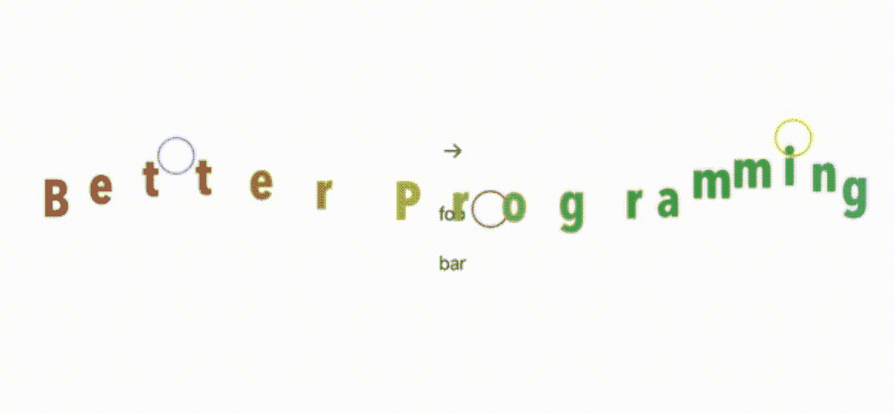
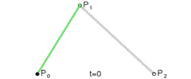
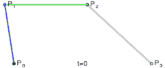
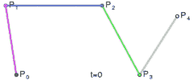
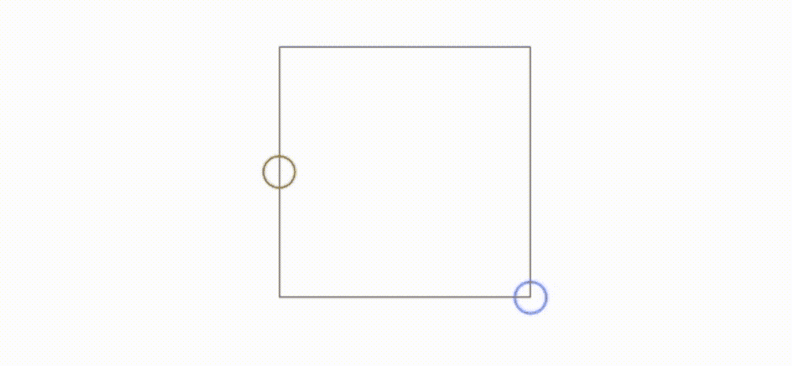
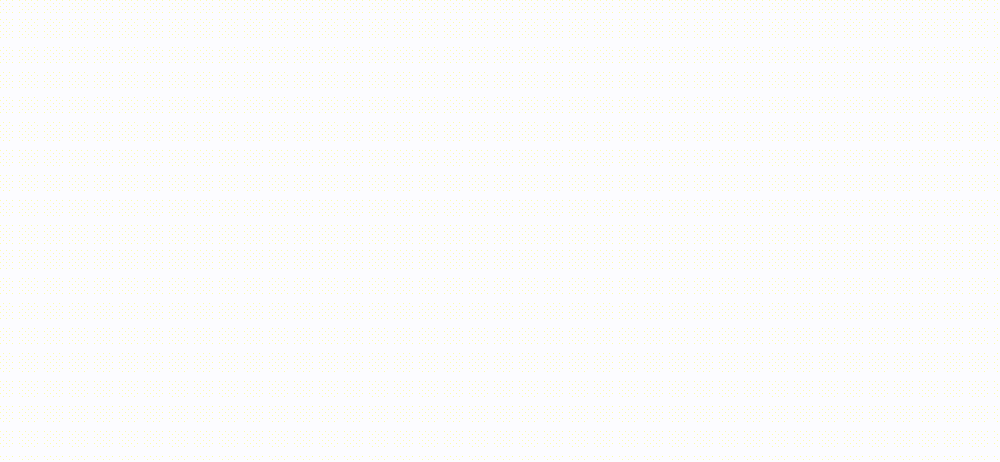

# 在 SwiftU 中使用 De Casteljau 算法/贝塞尔曲线

> 原文：<https://betterprogramming.pub/using-de-casteljaus-algorithm-bezier-curves-in-swiftui-3dcadd62635e>

## 苹果的贝塞尔曲线代码很好，但有时你需要深入挖掘



使用 foobar 控件在三条贝塞尔曲线上设置动画的文本框集合

前几天，我写了一篇关于使用贝塞尔曲线的文章，它的构造被嵌入到了 Swift 原语中。超级有用，效果真的很好。在那篇文章中，我顺便提到它背后的数学是令人难以置信的。我错了。数学很简单。这是令人难以置信的代码。让我们深入了解一下。

但是等等，就在我们跳进去之前，你为什么要下这个兔子洞？这里有三种可能的情况:

*   客户希望您在贝塞尔曲线上绘制一些文本。
*   你想在游戏中使用一组贝塞尔坐标。
*   你关心的是让应用程序运行得更快，为贝塞尔曲线计算更少的点是有意义的。

但是，如果你想做任何和/或所有这些，你会卡住，因为苹果原语不返回坐标。他们返回一条路。你需要深入挖掘。让我们试着做数学和代码。

正如我上次提到的，现在的风云人物是 De Casteljau，他写了算法来做数学家所说的两个值之间的线性插值。该算法计算绘制红线所需的坐标，如下所示:



二次曲线



三次曲线



两条三次曲线之间的线性插值

这是怎么回事？数学事实上非常简单，依赖于代码中显示的这个简单等式:

```
**func** mix(une:CGFloat, deux:CGFloat, t:Double) -> Double {
  return ((1.0 - t) * Double(une)) + (Double(deux) * t)
}
```

你可以在下面的动画 GIF 中看到这是如何工作的。简而言之，随着变量 *t* 的值增加，你会得到更多保存在 *deux* 中的值，而得到更少保存在 *une* 中的值。因此，它缓慢但稳定地在 *une* 和 *deux* 之间绘制了一条路径。*在这种情况下，Une* 是红色圆圈，而 *deux* 是蓝色圆圈。



两点从一点到另一点插值十次

当然，你会正确地认为这不是一条贝赛尔曲线。这是一条直线。不，要得到一条曲线，你至少需要引入三个点。使用三个点，我们得到贝塞尔曲线。一条看起来像这样的曲线:


三个点插值创建一个贝塞尔曲线

在上面的 GIF 中，我让三个点交换了我的曲线的起点、终点和控制者。看着它改变。它将以不同的颜色开始和结束三次。



移动贝塞尔曲线的控制点

我们可以移动控制点，重新计算曲线，并重新绘制它。该过程如上所述。注意:我故意选择不在这里直线移动蓝点。

但是让我们做一些更华丽的事情:


我沿着多条贝塞尔曲线制作了一些文字动画

事实上，我创建了比我需要的多得多的控制点。我用文本框替换了黄色圆圈，然后在其中添加了一些动画文本。当我这样做的时候，我首先移动了不同的起点和终点，然后是控制点，让我的文本沿着一条不枯燥的直线前进。

这就把我带到了文章的结尾。我希望你能像我写这篇文章一样喜欢阅读。

下面是浮动文本主要插图背后的代码。我在这里留下了一些注释代码，给你一个如何扩展它的提示。如果它看起来像一段很长的代码，不要被愚弄。其实不是。真正的代码就在最后——一些计算组合坐标的函数。

在我离开之前，如果你仍然不确定你理解了，那就看这个关于这个主题的精彩视频。

保持冷静，继续编码。