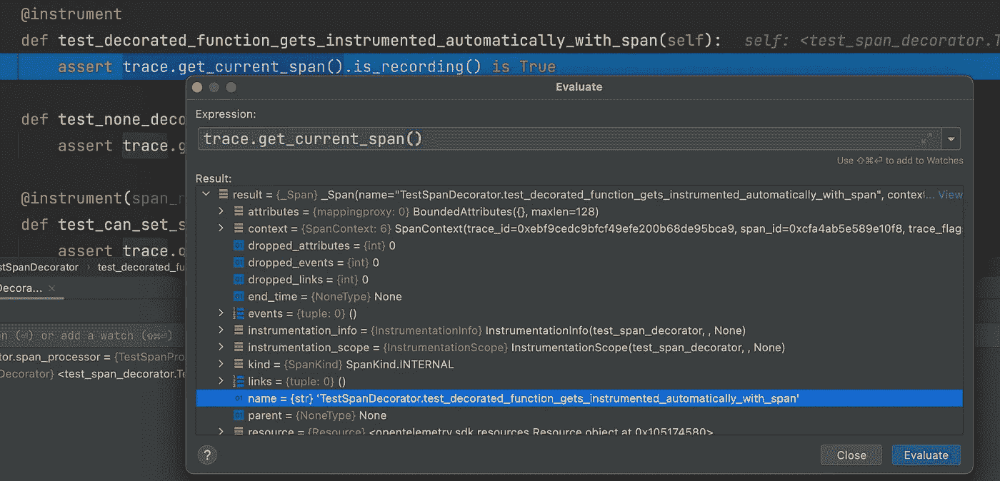

# 使用 Decorators 通过 OpenTelemetry Traces 检测 Python 代码

> 原文：<https://betterprogramming.pub/using-decorators-to-instrument-python-code-with-opentelemetry-traces-d7f1c7d6f632>

## Python decorators 可以帮助 OpenTelemetry 跟踪工具保持干燥


作者图片

上周，我写了一篇[帖子](/using-the-decorator-pattern-to-auto-instrument-net-classes-with-otel-tracing-781bf2be62ff)，主题是使用装饰设计模式来帮助删除一些设置跟踪所需的样板文件。我的示例代码使用了。NET，这需要一些繁重的工作，使用 DispatchProxy 类来拦截方法调用并注入跟踪逻辑。然而，Python 通过对函数装饰器的内置支持，使我们的生活变得更加轻松。

# 为什么要使用跟踪装饰器？

OpenTelemetry tracing 太棒了！它允许在代码中定义称为“跨度”的特定段，并在运行时跟踪它们的执行和依赖性。然而，为了使信息可用，在检测代码时确实需要大量的训练。基本上，对于每个类/模块/函数，您需要添加如下代码:

除了重复和在任何地方强制添加`tracer.start_as_current_span`调用的需要之外，为 spans 提出正确的命名约定，并确保它们具有惟一的名称和粒度级别，对于大型代码库来说是相当具有挑战性的。

如果不用上面的代码，我们能够编写如下代码，那就太好了:

以这种方式，整个类可以被自动检测，并且添加的 Span 属性已经被注入。命名可以通过约定(例如，函数名)来分配，如果需要，可以通过一种简单的方式来改变约定。

这篇文章的全部源代码可以在[这个库](https://github.com/digma-ai/opentelemetry-instrumentation-digma/blob/main/src/opentelemetry/instrumentation/digma/trace_decorator.py)上找到。它也可以作为一个包含装饰器实现的 [pypi 包](https://pypi.org/project/opentelemetry-instrumentation-digma/)获得，如果你想马上使用它的话。

# 使用 Python 装饰器实现基本的跟踪装饰器

Python decorators 真的很整洁。如果你正在寻找关于如何使用它们的更全面的文档，我推荐 [Geir Arne Hjelle](https://realpython.com/primer-on-python-decorators/#author) 的关于 Python Decorators 的帖子 [Primer，它很好地涵盖了这个主题。](https://realpython.com/primer-on-python-decorators/)

首先，我们将创建一个简单的装饰器，它可以被添加到一个函数中，以便自动检测它。这将消除添加跟踪样板代码的需要，并照顾到 span 的默认命名约定(我们将在后面概括)。Python 中的实现非常简单，包括返回用于执行修饰函数的包装函数。代码如下:

基本上，在这个阶段，我们所做的就是返回包装函数`wrap_with_span`,它将被解释器作为函数装饰器使用。我们使用了`functools.wraps()`装饰器(第 12 行),它确保包装器函数与原始函数具有相同的名称和元数据，使得装饰器对函数调用方透明。

`wrap_with_span`函数将自动创建和命名一个跨度，并设置其属性。默认情况下，我们基于函数名来命名 span，但是我们可以围绕它创建可扩展性。例如，这个静态类可以让开发人员用其他实现替换默认命名约定:

我们还提供了一个`span_name`参数，开发者可以根据需要使用它来设置一个定制的 span 名称。

# 测试代码

让我们添加一个测试来检查我们的新装饰器是否正常工作:

我们设置了 OTEL 以便跟踪操作生效，然后验证在应用了新装饰器的测试方法中，我们有一个活动的跟踪跨度。



成功！`TracingDecorator`的第一次迭代已经完成。

# 检测整个类

在函数到函数的基础上添加装饰器也可能变得有点乏味和重复。为了帮助解决这个问题，我们可以修改 decorator 来迭代类中的每个函数并修饰它，暂时忽略私有函数:

在上面的代码中，我们选择不为类创建一个新的单独的装饰器，而是重载我们用于函数的同一个装饰器。为此，我们添加了一个检查来测试传递的参数是函数还是类(第 14，19 行)，并相应地应用正确的逻辑。

对于类，我们迭代类函数并注入装饰器，返回不变的类对象。

对于函数，我们遵循与前面相同的逻辑来应用包装器。

有了这些代码，我们现在可以重写原始代码来利用新的装饰器:

# *几乎*工作

请注意，我们仍然有一个小问题。上例中的`validate`函数将应用两个装饰器。结果，将创建两个跨度而不是一个，这不是我们想要的行为。

为了处理这种情况，修饰器代码必须对函数是否已经被修饰有一些“记忆”。有几种方法可以做到这一点，在我们的实现中，我们选择将该信息保存在函数元数据中。因此，我们在修饰函数之前检查它是否已经被修饰过:

如果函数已经被修饰过，我们就原样返回它。

# 你还有什么要补充的？

您可以在 [Digma OpenTelemetry 资源库](https://github.com/digma-ai/opentelemetry-instrumentation-digma)中找到完整的源代码。让我看看这是否对你的项目有用！此外，如果有任何你觉得有用的功能，请随时联系或打开 GitHub 上的问题或 PR。

如果你对 OTEL 和可观察性感兴趣，我已经写了另一篇关于这个主题的文章，特别是关于如何在开发中利用 OTEL，你可以在这里找到。

```
**Want to Connect?**You can reach me, Roni Dover, on Twitter at @doppleware.Follow my open source project for continuous feedback at [https://github.com/digma-ai/digma](https://github.com/digma-ai/digma).
```