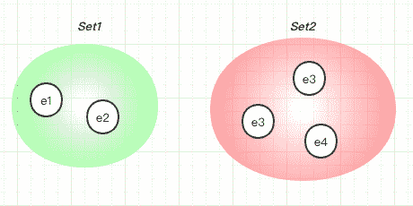
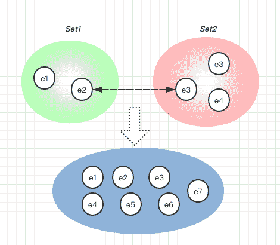
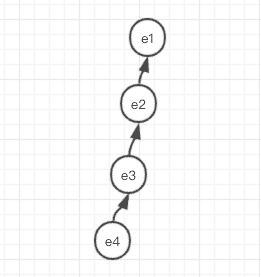
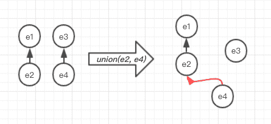
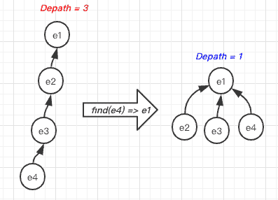
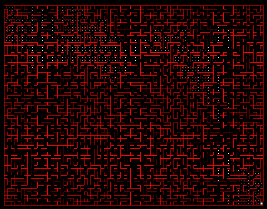

# 使用不相交集(Union-Find)构建迷宫生成器

> 原文：<https://betterprogramming.pub/using-disjoint-set-union-find-to-build-a-maze-generator-7462ea3b8632>

## 给我留下深刻印象的数据结构


奥马尔·索蒂洛·佛朗哥在 [Unsplash](https://unsplash.com/s/photos/maze?utm_source=unsplash&utm_medium=referral&utm_content=creditCopyText) 上拍摄的照片

很多年前开始学数据结构的时候，`disjoint-set`是给我印象比较深的一个，它是那么的素雅，有用。

在这篇文章中，我们将学习`disjoint-set`是如何工作的，然后我们用它实现一个迷宫生成器。我希望这能帮助初学者找到数据结构的乐趣。

# 不相交集(联合查找)数据结构

`Disjoint-set`是一种数据结构，它跟踪一组被分割成许多不相交(非重叠)子集的元素。根据定义，两个不相交的集合是其交集是空集的集合。



在上图中:e1、e2 在`Set1`，e3、e4、e5 在`Set2`。

不交化集合有两种运算，`union`和`find`，这就是不交化集合也可以用名称`union-find`来调用的原因:

```
make_set()    => create a disjoin-set
union(e1, e2) => link 'e1' and 'e2' to the same subset
find(e)       => return the subset's root for 'e'
```

如果我们联合两个不同集合中的任意两个元素，那么它们将被合并成一个更大的集合。

例如，如果 e2 和 e3 联合，这也意味着 e1 和 e5 在同一个集合中。



利用`find`的结果，我们可以测试两个元素是否属于同一个集合。如果`find(e1)`等于`find(e2)`，这意味着 e1 和 e2 在同一个集合中。

这是`disjoin-set`的一个有用的属性，特别是对于图算法，我们需要测试两个节点之间是否有连通性。

根据上面的规范和描述，您如何自己实现这个数据结构呢？你可以花几分钟自己尝试一下，这是学习数据结构和算法的好方法。

# 使用数组的简单实现

首先，我们需要找出在编程语言中使用哪种基本数据结构来存储数据。如果我们可以存储一个元素的父元素，我们就可以构造一个树状结构来保持元素之间的关系。

举个例子，如果我们完成了`union(e1, e2)`、`union(e2, e3)`、`union(e3, e4)`的操作，构造的树会是这样的(假设我们总是将第一个参数设置为父参数):



`find(e)`将以递归的方式实现，尝试自下而上的查找父节点，根据树。

```
#define MAX_SIZE 60
int parent[MAX_SIZE];  // the parent root for each node

void make_set() {
  for(int i=0; i < MAX_SIZE; ++i )
    parent[i] = i;
}

int find(int x) {
  // recursive find and path compression
  if(x != parent[x])
    return find(parent[x]);
  return parent[x];
}

void union_set(int e1, int e2) {
  if( x == y ) return;
  parent[e2] = e1; // e1 is always the parent
}
```

好了，我们已经用数组完成了第一版`union-find`！

# 1.路径压缩优化

让我们运行更多的测试用例来验证我们实现的正确性，如果我们运行`union(e1, e2)`、`union(e3, e4)`、`union(e2, e4)`操作会发生什么？



等等！这不是我们所期望的！根据上面的定义，我们期望 e1，e2，e3，e4 在同一个集合中。似乎我们在`union_set`的功能上有一个 bug。

是啊！我们要做的是联合两个集合，而不仅仅是两个元素的父关系。当我们`union(e2, e4)`的时候，需要找到 e2 和 e4 的根，用一个`union(e1, e3)`的运算来完成。


让我们修复第一个版本中的错误:

```
void union_set(int e1, int e2) {
  int root1 = find(e1);
  int root2 = find(e2);
  if( root1 == root2 ) return;
  parent[root2] = root1; // e1's root is always the parent
}
```

简单实现的时间复杂度是 O(N)。

# 2.按秩联合优化

让我们试着让它快点。在`find`的朴素递归函数中，如果我们在每次递归迭代中缓存结果，时间性能会好很多。这就是 [*缓存中解释的缓存技术:自下而上*](https://coderscat.com/caching-from-top-to-bottom) 。

```
int find(int x) {
  // recursive find with path compression
  if(x != parent[x])
    parent[x] = find(parent[x]);
  return parent[x];
}
```

在一个`find`的函数调用之后，我们可以使树变得更平(深度更短，这加快了对这些元素的未来操作):



在我们的第一个版本`union_set`中，我们总是将 e1 的根设置为 e2 的父级，多次 union 操作后会发生什么？

树的深度会不断增加。我们能为此做一些优化吗？一项名为“按级别联合”的策略将有助于解决这一问题。

如果我们使用另一个数组来记录秩(元素子树的深度)，那么我们总是试图将深度较大的元素设置为父元素。

```
int rank[MAX_SIZE];    // the depath rank, initialized with 0 in make_set

void union_set(int e1, int e2) {
  int x = find_set(e1);
  int y = find_set(e2);
  if( x == y ) return;

  // optimization with rank
  if(rank[x] > rank[y])
    parent[y] = x;
  else {
    parent[x] = y;
    if(rank[x] == rank[y]) ++rank[y];
  }
}
```

让我们举个例子来理解这一点:


用按秩并集的操作，当两个根的深度不相等时，我们可以保持树的深度，这样它就不会生长了！

还有一种策略叫做`union by size`，总是将元素较少的树附加到元素较多的树根上。

优化版本的时间分析涉及许多数学技巧。

我们简单得出结论，路径压缩并按秩联合，摊销时间复杂度仅为 O(α(n))，其中α(n)为[逆阿克曼函数](https://en.wikipedia.org/wiki/Ackermann_function#Inverse)，对于任何实际输入大小 *n* ，α(n)小于五。

真的是很好的时间表现！

# 随机迷宫生成

用新学到的数据结构完成一个小项目会对你的学习有很大帮助。

我看罗伯特·塞奇威克 的 [*算法的时候，有一个用`disjoin-set`生成随机迷宫的练习。*](https://www.amazon.com/Algorithms-4th-Robert-Sedgewick/dp/032157351X)

这是一个很棒的算法，简化后的代码如下所示:

```
void rand_maze {
  // begin with a rectangular maze of all closed cells
  // numrows = number of rows of cells;
  // numcols = number of columns of cells;
  start = cell at (0,0);
  goal  = cell at (numrows-1, numcols-1);
  numcells = numrows * numcols;
  Partition p(numcells); // p represents the maze components

  // goal is not reachable from start
  while (!p.Find(start, goal)) {
    edge = randomly select a wall;
    x = edge.x;
    y = edge.y;
    if(!p.Find(x,y)) {
      remove edge;
      // x and y now in same component
      p.Union(x,y);
    }
  }
}
```

我们用`disjoin-set`来测试`start`和`goal`是否连接，在地图中随机移除一条边，直到它们连接。

生成的迷宫如下所示，左上角有一个起始单元格，右下角有一个目标单元格:



# 参考

*   [维基百科不相交集数据结构](https://en.wikipedia.org/wiki/Disjoint-set_data_structure)
*   [罗伯特·塞奇威克的算法](https://www.amazon.com/Algorithms-4th-Robert-Sedgewick/dp/032157351X)