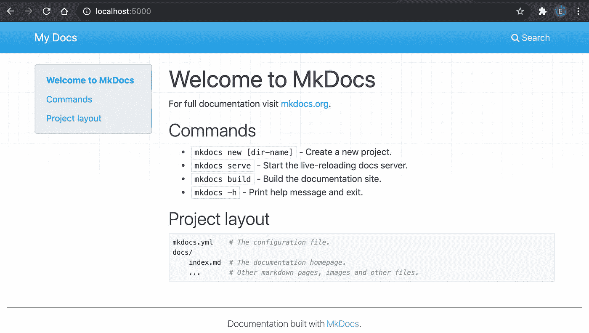

# 使用 Docker 作为试验 MkDocs 的平台

> 原文：<https://betterprogramming.pub/using-docker-as-playground-to-experiment-mkdocs-da13700799d6>

## 使用 Docker 保持机器清洁


帕斯卡尔·迈耶在 [Unsplash](https://unsplash.com?utm_source=medium&utm_medium=referral) 上拍摄的照片。

我最近了解到这个奇妙的项目文档工具叫做 [MkDocs](https://www.mkdocs.org/) ，它使用 Markdown 语言。

要试用它，您需要在您的机器上安装 Python、PIP 并下载 MkDocs。我试图避免用各种软件污染我的机器，只是为了试验一些东西，所以我试图在 Docker 中交互地做所有这些。

# 逐步指南

[文档](https://www.mkdocs.org/#installation)指出安装 MkDocs 需要 Python，所以我用一个`python:3`图像启动了一个 Docker 容器:

```
docker run -it --rm -p 5000:8000 python:3
```

*   `-it`是让它交互运行。
*   `-p 5000:8000`是将内部`8000`端口映射到我计划稍后使用的外部`5000`端口。
*   `--rm`是在我们退出时清除 Docker 容器。

完成上述操作后，您将看到 Python 的 RTE:

```
Python 3.8.5 (default, Jul 22 2020, 12:28:11)
[GCC 8.3.0] on linux
Type "help", "copyright", "credits" or "license" for more information.
>>>
```

接下来，你需要运行`pip`来安装 MkDocs。然而，`python:3`镜像启动了一个 Python RTE。它没有为我们提供一个非常友好的控制台来运行 Unix shell 命令。因此，需要使用`[os](https://docs.python.org/3/library/os.html)`库 API。

安装`os`:

```
import os
```

有了这个，要执行任何命令，都可以使用`os.system('my command')`。现在，您可以在 Docker 容器中使用下面的命令轻松安装 MkDocs:

```
os.system(‘pip install mkdocs’)
```

接下来，运行`mkdocs`来创建一个新项目:

```
os.system('mkdocs new my-project')
```

瞧，你可以在 Docker 中运行`mkdocs`。

现在让我们进入`my-project`。这一次，你不能使用`os.system('cd my-project')`，因为这是一个临时状态，之后它会回到原来的文件夹。为了改变文件夹，您需要使用`os`提供的 API:

```
os.chdir('my-project')
```

只是为了检查您是否在文件夹中，运行另一个`os` API，如下所示:

```
os.getcwd()
```

显示`'/my-project'`。太好了！你进入了文件夹。

接下来，使用下面的命令运行 MkDocs 默认项目:

```
os.system('mkdocs serve --dev-addr=0.0.0.0:8000')
```

现在您可以看到 MyDoc 正在运行:

```
[I 200723 13:48:49 server:334] Serving on [http://0.0.0.0:800](http://0.0.0.0:800)
INFO    -  Serving on [http://0.0.0.0:8000](http://0.0.0.0:8000)
[I 200723 13:48:49 handlers:62] Start watching changes
INFO    -  Start watching changes
[I 200723 13:48:49 handlers:64] Start detecting changes
INFO    -  Start detecting changes
```

只要用浏览器查一下`localhost:5000`就能看到它在运行！记住，我们先前设定的`-p 5000:8000`。



不错！若要退出服务，请按 Ctrl+c，若要退出 Docker 容器，请按 Ctrl+d。

# 带有 Dockerfile 文件的图像

上面的方法是交互式的。如果你不得不一次又一次地这样做，那么就创建一个 docker 文件来制作它的映像。这样会更有成效。

要像前面一样在 Dockerfile 文件中执行所有相同的步骤，只需编写以下代码:

```
FROM python:3
RUN pip install mkdocs
RUN mkdocs new my-project
EXPOSE 8000
WORKDIR /my-project
ENTRYPOINT ["mkdocs"]
CMD ["serve", "--dev-addr=0.0.0.0:8000"]
```

在 docker 文件所在的文件夹中，运行以下命令来构建映像:

*注意:您可以将* `*elye/my-mkdocs*` *替换为自己喜欢的图像名称。*

```
docker build -t elye/my-mkdocs ./
```

有了图像后，您可以运行它:

```
docker run -p 5000:8000 --rm elye/my-mkdocs
```

你们都完了。你可以在`localhost:5000`里浏览，会和你刚才互动的一样！

当你完成后，如果你愿意，你可以很容易地把你的图片上传到 Docker Hub。如果您决定删除该图像，只需使用以下命令:

```
docker image prune -a
```

键入`y`删除所有不再使用的图像。然后你的机器会像原来一样干净，不需要在你的机器上安装任何东西！