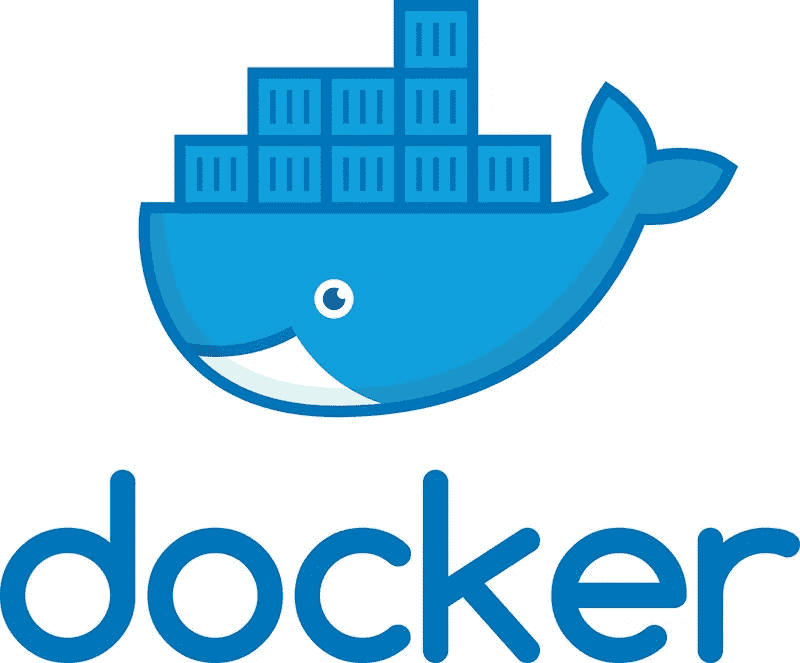
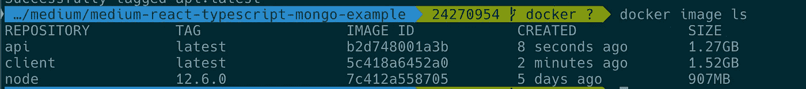
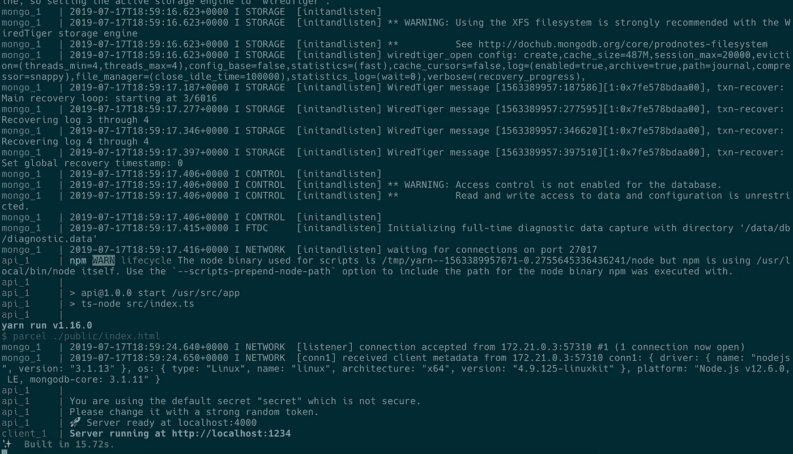
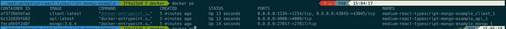

# 使用 Docker-Compose 连接 React/TypeScript/MongoDB 应用程序

> 原文：<https://betterprogramming.pub/using-docker-compose-to-hook-up-a-full-stack-application-react-node-typescript-mongodb-fa66b96369a1>

## 使用 Docker 简化您的开发体验

# 目标

在本文中，我将概述如何使用`docker-compose`在您的机器上建立一个本地开发环境，以编排一个技术堆栈的各个部分，该技术堆栈包括:

*   前端(客户端)
*   GraphQL API (API)
*   数据库

我们的目标是能够将应用程序的每个部分容器化，并使用一个简单的命令运行整个程序:`docker-compose up`。

我想指出的是`docker`和`docker-compose`的文档非常详细。我强烈建议您阅读 Docker 官方主页上的[入门指南](https://docs.docker.com/get-started/)。一旦您对基础知识感到满意，请回来继续学习，我会帮助您设置一个实用的基本全栈应用程序。

# 为什么要用 Docker？

你可能会问，“Docker 把它引入回购协议有什么好处？没有它，我也能创建和维护 web 应用程序！”

这个问题问得好！有许多简单的 web 应用程序只包含一个 web 应用程序或一个托管静态内容的服务器。然而，一旦你有了许多移动的部分和与你一起工作的队友，像 Docker 这样的工具可以使你的项目工作有一个一致的流程，不管你用的是谁的电脑。具体到我们的例子，它消除了在本地安装 MongoDB 之类的工作。

# 入门指南

[在本地克隆该存储库以开始使用](https://gitlab.com/msholty-fd/medium-react-typescript-mongo-example)。

**注意:**`master`分支是跟踪本文的理想选择。`docker`分支将添加必要的 Docker 相关文件，以便 Docker 按预期工作。

这个项目有为你编写的前端和 API，你可以自己启动它们。关于如何启动`client`和`api`的说明在`README.md`中。

有几个问题:

*   您需要在运行应用程序之前全局安装`mongodb`。Mongo 数据库可以有不同的版本，如果您在一台机器上维护多个项目，这会使事情变得很复杂。
*   您需要运行两个独立的命令来启动应用程序，如果您需要记住启动您的本地`mongodb`，那么还需要更多。
*   您将需要其他依赖项来确保应用程序正确运行。常见的有`node`、`yarn`、`npm`。是的，在没有 Docker 的情况下在您的机器上安装这些是完全合理的，但这些只是一些可能会略有变化的示例，从而使您的开发环境与另一个略有不同，从而导致意外问题。这些类型的依赖关系不是从`package.json`内部强制实施的。

# API 的 docker 文件

首先，让我们将 API 容器化。我们需要在`api`目录下创建一个名为`Dockerfile`的文件。记住，`Dockerfile`不会像`.txt`那样以扩展名结尾。

这是一个小文件，所以我们在这里讨论所有的部分。

首先，我们需要定义一个`FROM`，这样 Docker 就知道这个`Dockerfile`图像基于什么图像。这看起来很神奇，但是简单地定义我们的图像`FROM node:12.6.0`给了我们的图像大量现成的功能！

请记住，Docker 映像是一个虚拟化的环境，与普通的 Linux 计算机没有太大的不同，因此它有自己的文件系统，与我们的计算机分开。我们使用`WORKDIR`命令来定义 Docker 文件应该在哪里工作。与您自己的机器一样，您通常不会在您计算机的根目录中安装项目，所以让我们告诉 Docker 导航到`/usr/src/app`。

`COPY . .`会将 Docker 文件所在目录下的所有文件和文件夹复制到 Docker 映像中的工作目录下。

乍一看，`EXPOSE 4000`似乎公开了端口，因此您可以在容器外部访问它。然而，[根据 docker 文档](https://docs.docker.com/engine/reference/builder/#expose)，它只是为您和其他开发人员提供关于运行时应该公开哪个端口的文档。稍后将详细介绍这一点！

`RUN yarn`将简单地在我们的 Docker 容器中安装所有的依赖项，这样当你运行容器时，所有的依赖项都在那里。

`CMD ["yarn", "watch"]`将在这个容器中运行`yarn watch`命令。

# 客户的文档

我们前端项目的`Dockerfile`不会有太大的不同。

这里的主要区别是，我们声明应该公开端口 1234，因为这是默认端口，`parcel`用它来服务 web 应用程序。此外，应用程序通过命令`yarn start`启动。注意，我们在这里也使用了一个`node:12.6.0`图像。你可能会想，“也许有一个针对前端开发优化的 Docker 映像？可能是 React 或打字稿图像？”

虽然我不怀疑有，但要明白这根本没有必要。我们只需要有一个可用的节点环境，我们主要在前端应用程序上与之交互的所有其他工具都是通过`package.json`安装的。

# 建立我们的形象

一旦我们为每个应用程序定义了`Dockerfile`,我们就需要构建我们的映像，以便它们在本地可用。本节的最终结果是，当我们使用命令`docker images ls`时，我们将看到显示的适当图像。

构建映像非常简单。从项目根目录，运行命令`docker build -t client ./client`构建前端，运行`docker build -t api ./api`构建 GraphQL API。

一旦这些命令完成，您应该会看到命令`docker image ls`的一些输出，如下所示:

可以看到有一张`api`和`client`的图像，也有一张`node`的图像。这是因为我们的两个映像是基于那个映像的，Docker 需要在为另外两个映像构建映像之前准备好那个映像。

# 运行我们的应用

一旦成功构建了这些映像，从技术上讲，您可以使用`docker run`命令运行它们中的每一个，但是我们想采取下一步，使用`docker-compose`将这些容器编排在一起。此外，我们仍然缺少我们的数据库！

让我们在项目的根目录下创建一个`docker-compose.yml`:

在这个文件中，您将看到一些熟悉的配置。这里我们定义了三个服务，它们需要协同工作才能使我们的应用程序工作。`api`和`client`应该不会带来太大的惊喜——我们已经在本地构建了这些映像，上面的配置只是告诉`docker-compose`使用这些映像。

`mongo`的配置很有意思。我们在这个 repo 中没有一个`mongo`文件夹或项目，那么这是怎么回事呢？类似于当你安装一个包时在`npm`上有不同版本的依赖关系， [Docker 已经将每个版本的 mongodb 内置在一个映像中](https://hub.docker.com/_/mongo)供你下载和使用。

一旦添加了这个文件，就可以用命令`docker-compose up`运行应用程序。您应该会看到类似如下的输出:

# 几个音符

您可以使用命令`docker exec <image> <command>`在 Docker 容器中运行任意命令。要查找容器的名称，您可以键入`docker ps`，所有当前运行的 Docker 容器将会显示:

当引用容器时，可以使用`CONTAINER ID`或`NAMES`列。在我们的例子中，这个名字很长，因为我给回购协议起的名字很长。

试运行`docker exec <id for api> ping 0.0.0.0:27017`。这就像从`api`容器中运行`ping 0.0.0.0:27017`。注意它是如何找不到任何监听该端口的东西的！这是因为每个容器都是一个独立的映像，所以 mongo 当然不是从`api`服务运行的。如果您确实想按计划 ping mongo 容器，您可以运行`docker exec <id for api> ping mongo`。注意你如何得到成功的回应！