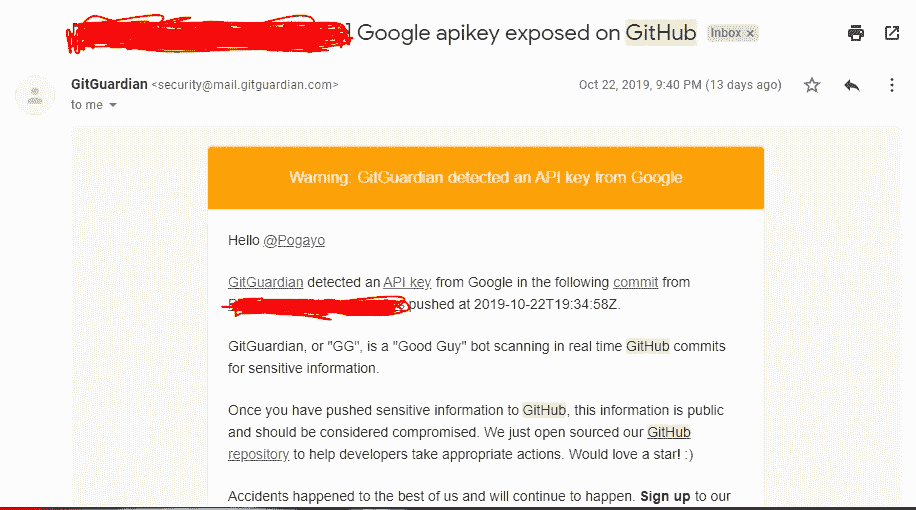

# 在 ReactJS 中使用环境变量

> 原文：<https://betterprogramming.pub/using-environment-variables-in-reactjs-9ad9c5322408>

## 为什么需要它们以及如何使用它们


丹尼尔·米尔利亚在 [Unsplash](https://unsplash.com/?utm_source=unsplash&utm_medium=referral&utm_content=creditCopyText) 上的照片

如果您正在使用 ReactJS 并正在访问某个 API 端点，您可能会遇到环境变量。在本教程中，我将带您了解如何使用环境变量。

假设:您熟悉 [Create React App](https://create-react-app.dev/d) ，并使用它来创建您的 React 应用程序。

# 为什么需要环境变量

您需要环境变量做两件事:

1.  存储敏感信息。像 API 密匙和密码这样的东西是高度敏感的，你不应该把它们推到版本控制中。在将变量添加到`.env`文件之后，将`.env`文件添加到`.gitignore`文件，以确保它们不会被暴露(我们将在后面讨论)。如果你正在使用 GitHub，它会告诉你是否不小心推送了敏感信息，但是你不应该依赖它。
2.  根据您的环境定制变量，例如它是在生产、开发还是暂存环境中，等等。



GitGuardian 在无意中暴露了一个 API 密钥后拯救了我

Create React App 支持自定义环境变量，无需安装任何其他包。

添加环境变量有两种方法:

1.  通过 shell(临时的，与 shell 会话持续的时间一样长，并根据操作系统类型而有所不同)。
2.  使用`.env`文件(这是我们将要使用的方法)。

# 如何使用？包封/包围（动词 envelop 的简写）

**第一步:**转到应用程序的根文件夹，创建一个名为`.env`的文本文件。您的工作目录将如下所示:

```
my-react-app/ 
 |-node-modules/
 |-src/
 |-public/
 **|-.env** |-gitignore
 |-package.json
 |-package.lock.json.
 |-README.md
```

**第二步:**创建您的自定义变量。Create React App(CRA)在每个自定义变量上强制使用前缀`REACT_APP`。请注意，没有前缀的变量在绑定过程中会被忽略。如果你想知道 CRA 是如何做到这一点的，请点击这里查看他们的文档。

```
REACT_APP_CLIENT_ID=jfjffffaddfeettgydgdffv
REACT_APP_KEY=aaddddawrfffvvvvssaa
```

**第三步:**将它们赋给变量，打印到屏幕上等等，但是它们在你的 Javascript 文件中是只读的。

```
console.log(process.env.REACT_APP_CLIENT_ID); console.log(process.env.REACT_APP_KEY);
```

**第四步:**有一个内置的环境变量叫做`NODE_ENV`。你可以从`process.env.NODE_ENV`进入。该变量根据您当前所处的模式而变化。运行`npm start`时，等于‘开发’，运行`npm test`时，等于‘测试’，运行`npm run build`时，等于‘生产’。这个变量很特殊，因为它可以用于根据您的模式访问不同的环境配置。例如，如果您的生产和开发有不同的数据库(通常是为了防止干扰)，您可以使用它来有条件地访问某些变量。您不能手动覆盖`NODE_ENV`的事实防止了开发人员意外地将开发构建部署到生产中。关于这个用例的更多信息可以在[这个很棒的教程中找到。](https://dev.to/jam3/managing-env-variables-for-provisional-builds-h37)

**第五步**:打开`.gitignore`文件。我喜欢把`.env`和其他环境变量放在`#misc`下面，如下所示。

```
# dependencies 
/node_modules # testing 
/coverage # production 
/build # misc 
.DS_Store 
.env    #<--------Put the custom env files here 
.env.local 
.env.development.local 
.env.test.local 
.env.production.local npm-debug.log* 
yarn-debug.log* 
yarn-error.log*
```

## 为什么即使遵循这些流程，它还是不起作用？

*   确保在每个变量上都使用了前缀`REACT_APP`
*   确认`.env`文件上的变量名与 js 文件上的变量名匹配。例如，`REACT_APP_KEY`在。环境与`process.env.REACT_APP_KEY`
*   如果开发服务器正在运行，停止它，然后使用 *npm start* it 重新运行。我真的很纠结这个(变量是*未定义*错误)。
*   每次更新。env 文件，您需要停止服务器并重新运行它，因为环境变量只在构建期间更新(变量是*未定义的*错误)。
*   从变量值中删除引号。

```
Wrong REACT_APP_KEY=”AHEHEHR”RightREACT_APP_KEY=AHEHEHR
```

***注意*** *:将敏感内容放在环境变量中并不能保证它们的安全。它们在构建过程中被注入到捆绑文件中，因此任何人都可以通过检查您的文件来查看它们。我发现它们最大的用途是在将我的代码推送到远程存储库之前隐藏信息。*

使用 Create React App 环境变量的官方文档可以在[这里](https://create-react-app.dev/docs/adding-custom-environment-variables/)找到。