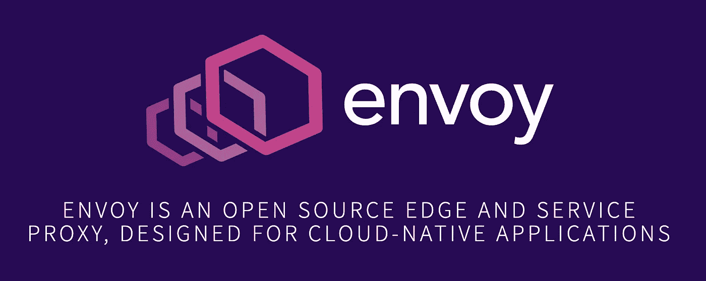
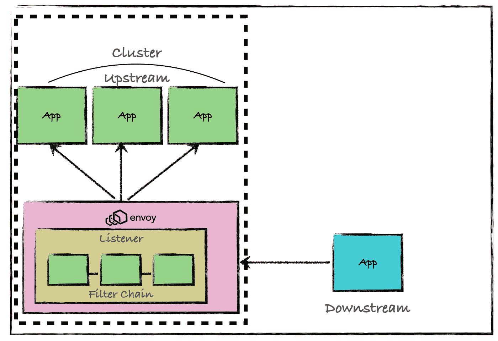
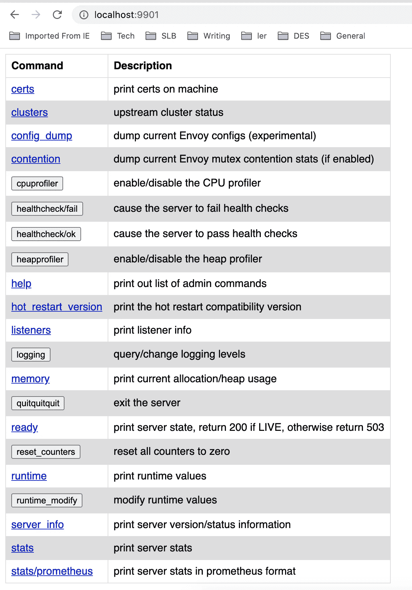

# 使用 Envoy 代理提高微服务的可靠性、安全性和可观察性

> 原文：<https://betterprogramming.pub/using-envoy-proxy-to-improve-reliability-security-and-observability-of-microservices-85032e08d3f4>

## 如何在您的堆栈中开始使用 Envoy



图片鸣谢:[https://www . envoy proxy . io](https://www.envoyproxy.io)

[Envoy](https://www.envoyproxy.io) 是 Lyft 创建的一个开源代理。随着世界朝着分布式微服务架构的方向发展，从业者在两个主要领域观察到运行操作的困难:

*   建立工作关系网
*   可观察性

Envoy 试图通过使网络对应用程序更加透明来解决这些问题。它还提供了一种更好地收集统计数据的方法，以便更容易地调试和跟踪问题。

今天，最常见的部署特使代理的方式是将应用程序作为一个边车。万一你不知道边车模式，那么你可以在[我以前的文章](https://medium.com/better-programming/modern-day-architecture-design-patterns-for-software-professionals-9056ee1ed977#4c49)中读到它。

在本文中，我将讨论如何通过 DIY 教程开始使用 Envoy 代理，以及如何使用 Envoy 的各种功能来提高应用程序的可靠性、安全性和可观察性。

# 特使介绍

特使是一个独立的过程。当远程客户端调用特使代理时，请求会通过各种特使模块。让我们试着去理解这些。



特使代理(图片由作者提供)

*   **下游—** 连接到特使的远程客户端
*   **监听器**—负责接受新连接和绑定 IP/端口的特使模块。
*   **过滤器** —负责处理请求的特使模块。一个请求可能需要通过一连串的过滤器。
*   **上游** —端点特使将请求转发给。在 sidecar 模型中，这是一个应用程序或一群应用程序/服务。

# 行动中的特使

[特使网站](https://www.envoyproxy.io/docs/envoy/latest/start/start)列出了各种 Docker 图片样本，自己试试。在本教程中，我试图将 Envoy 放在一个示例 REST API 前面。如果你不想在 Docker 容器中使用 Envoy，那么你可以简单地从[https://www.getenvoy.io/](https://www.getenvoy.io/)获得二进制文件。

我正在使用来自 Spring Boot 的现成服务，它将作为我的主要应用/微服务。

当您运行下面给出的命令时，您应该能够看到工作的 API。

```
java -jar -d complete/target/rest-service-0.0.1-SNAPSHOT.jar$curl http://localhost:8080/greeting{"id":2,"content":"Hello, World!"}
```

接下来，您需要编写如下所示的特使代理配置 YAML:

这种配置规定了以下事项:

*   它在端口 8585 上创建一个 HTTP 侦听器。
*   它创建了一个过滤器链，试图将任何请求与`/greeting`请求匹配，并将其转发给`greetingservice`集群。
*   在`greetingservice`集群中，有一个端点将请求重定向到`0.0.0.0:8080.`
*   在集群包含多个端点的情况下，`greetingservice`集群预计会使用`ROUND_ROBIN`技术对请求进行负载平衡。
*   它在端口 9901 上运行特使管理服务。

在这里，我使用 Get Envoy 版本 1.15.0 来做这个练习。以下命令将使用上面给出的配置启动特使代理。

```
$getenvoy run standard:1.15.0 -- --config-path simple.yaml
```

现在，当你点击`[http://localhost:8585/greeting](http://localhost:8585/greeting,)`时，你会看到 Envoy 开始充当你原来的问候服务的代理。

```
curl http://localhost:8585/greeting{"id":6,"content":"Hello, World!"}
```

您还应该能够访问`http://localhost:9901/`上的特使管理门户。



特使管理门户

所有管理服务也可以作为 API 使用。

如果您转到`http://localhost:9901/stats`，您应该能够看到关于这个代理服务的请求的大量信息。

例如，如果你想知道:

*   总连接数
*   销毁的连接总数
*   活动连接总数
*   为各种请求提供的 HTTP 响应
*   等等。

```
listener.0.0.0.0_8585.downstream_cx_active: 2
listener.0.0.0.0_8585.downstream_cx_destroy: 4
listener.0.0.0.0_8585.downstream_cx_total: 6
listener.0.0.0.0_8585.downstream_pre_cx_active: 0
listener.0.0.0.0_8585.downstream_pre_cx_timeout: 0
listener.0.0.0.0_8585.http.ingress.downstream_rq_1xx: 0
listener.0.0.0.0_8585.http.ingress.downstream_rq_2xx: 3
listener.0.0.0.0_8585.http.ingress.downstream_rq_3xx: 0
listener.0.0.0.0_8585.http.ingress.downstream_rq_4xx: 2
listener.0.0.0.0_8585.http.ingress.downstream_rq_5xx: 0
listener.0.0.0.0_8585.http.ingress.downstream_rq_completed: 5
listener.0.0.0.0_8585.no_filter_chain_match: 0
```

通过在同一台主机上将 Docker 作为一个容器运行，也可以获得相同的结果。

# 特使功能

现在您已经知道如何使用 Envoy 运行基本代理，让我们来看看一些关键特性:

*   贮藏
*   故障注入
*   外部授权
*   断路
*   统计、访问日志记录和跟踪
*   安全性

## 贮藏

像典型的反向代理一样，Envoy 允许缓存响应。如果您知道某些对象不经常更改，那么您可以使用此过滤器。

它允许您实现各种缓存技术，如下所示:

*   `no-cache` —在这种情况下，缓存将在处理请求之前向原始服务器发送验证请求。
*   `private` —在这种情况下，响应被标记为私有，它不应该存储在公共/共享缓存中。
*   `valid-for-time` —在这种情况下，在从原始服务器重新验证响应之前，响应会在缓存中保持新鲜一段时间。

通过实现缓存，您可以改善微服务的响应延迟。这确实需要用应用程序/业务逻辑进行硬编码。

## 故障注入

如果你听说过[混沌工程](https://medium.com/better-programming/why-every-software-developer-needs-to-learn-chaos-engineering-ef08992f4354)，你就会知道故障注入是测试微服务弹性的技术之一。

Envoy 的运行时允许注入延迟，中止具有指定用户响应的服务请求。这有助于在出现问题、故障或过载的情况下测试服务的能力。它可以被限制到一组特定的上游服务，而无需修改应用程序代码。

您可以创建一个虚拟文件系统(`/etc/config/v1`)，Envoy 可以使用它来动态挑选故障注入配置。以下是这种配置的一个示例:

Envoy stats 还使您能够给出关于注入的错误的细节，以便了解应用程序的行为。

```
http.ingress_http.fault.aborts_injected: 6
http.ingress_http.fault.active_faults: 0
http.ingress_http.fault.delays_injected: 0
http.ingress_http.fault.faults_overflow: 0
http.ingress_http.fault.response_rl_injected: 0
```

## 外部授权

您可以使用 Envoy 将请求授权委托给外部授权服务器。如果您使用 Envoy 作为辅助工具，这很容易帮助将应用程序业务逻辑从您使用的授权服务器中分离出来。

如果你熟悉开放策略代理，这里有一个[很好的例子](https://www.openpolicyagent.org/docs/latest/envoy-authorization/)，展示了如何使用这个特性。

## 断路

在我的上一篇文章中，我谈到了[断路器](https://medium.com/better-programming/modern-day-architecture-design-patterns-for-software-professionals-9056ee1ed977#4c75)模式，它可以用来自动识别服务降级或服务中断，并开始从代理本身返回响应，而不是耗尽原始服务资源。

目前，Envoy 支持基于以下参数的断路:

*   最大集群连接数
*   最大挂起请求数
*   最大请求数
*   最大重试次数
*   每个群集的最大连接池数量
*   等等。

如果达到任何阈值，那么特使打开电路。可以使用如下所示的统计数据监控电路开路:

```
cluster.local_service.circuit_breakers.default.cx_open: 0
cluster.local_service.circuit_breakers.default.cx_pool_open: 0
cluster.local_service.circuit_breakers.default.rq_open: 0
cluster.local_service.circuit_breakers.default.rq_pending_open: 0
cluster.local_service.circuit_breakers.default.rq_retry_open: 0
cluster.local_service.circuit_breakers.high.cx_open: 0
cluster.local_service.circuit_breakers.high.cx_pool_open: 0
cluster.local_service.circuit_breakers.high.rq_open: 0
cluster.local_service.circuit_breakers.high.rq_pending_open: 0
cluster.local_service.circuit_breakers.high.rq_retry_open: 0
```

## 统计、访问日志记录和跟踪

正如我前面提到的，Envoy 不断发布大量的统计数据，使网络变得易于理解。它发出三种类型的统计数据

*   上游统计
*   下游统计
*   服务器统计

有些过滤器，如 HTTP 连接管理器，支持可扩展的访问日志记录。您可以使用像 file 或 gRPC 访问日志接收器这样的接收器来捕获访问日志。

Envoy 支持本地和外部的跟踪提供者，如 Jaeger、LightStep、Zipkin 等。分布式跟踪对于分布式微服务架构师理解服务流、延迟、序列化等非常重要。

总的来说，这些特性提高了应用程序/服务的可观察性。

## 安全性

像许多其他代理一样，Envoy 可以用来提高应用程序的整体安全性。它支持如下各种过滤器:

*   [CORS 滤波](https://developer.mozilla.org/en-US/docs/Web/HTTP/CORS)
*   [CSRF 滤波](https://owasp.org/www-community/attacks/csrf)
*   [基于角色的访问控制(RBAC)](https://www.envoyproxy.io/docs/envoy/latest/api-v3/config/rbac/v3/rbac.proto)
*   [OAuth](https://www.envoyproxy.io/docs/envoy/latest/api-v3/extensions/filters/http/oauth2/v3alpha/oauth.proto.html)
*   等等。

# 结论

特使代理是一个很好的工具，正在被广泛采用。有很多基于 Envoy 的[开源和商业项目](https://www.envoyproxy.io/community)。有很多 Envoy 支持的很酷的过滤器，您可能想探索和使用。

有些人可能会说，我们可以使用一些现有的工具，甚至使用内置的语言框架来实现这一点，那么为什么要使用 Envoy 呢？这是一个公平的论点。我认为 Envoy 的最大用途是在运行遗留应用程序的企业中。通过将 Envoy 用作侧边代理或前端代理，您可以轻松地提高几乎任何(旧/新)应用程序的安全性、可靠性和可观察性，甚至无需接触应用程序代码。

```
Hey, if you enjoyed this story, check out [Medium Membership](https://deshpandetanmay.medium.com/membership)! Just $5/month!*Your membership fee directly supports me and other writers you read. You’ll also get full access to every story on Medium.*
```