# 正确使用 ESLint

> 原文：<https://betterprogramming.pub/using-eslint-right-4d18ef1e0d0b>


布鲁克·拉克在 [Unsplash](https://unsplash.com/s/photos/a%2B?utm_source=unsplash&utm_medium=referral&utm_content=creditCopyText) 拍摄的照片

当我们在一个项目上合作时，最好(几乎每次)使用一些通用的编码风格，这样其他开发人员就可以轻松阅读你的代码(这样他们就不会来找你了)。但是如何确保每个人都知道通用的编码风格呢？你如何确保每个人都遵循共同的编码风格？

第一个问题的答案是通过使用某种 linter，这是一个突出偏离通用编码风格指南的程序。对于 JavaScript 来说， [ESLint](https://eslint.org/) 是开发者事实上的选择。

第二个问题的答案是给 Git 添加一个预提交钩子，告诉 ESLint 在提交代码之前对代码进行分析。如果与风格指南有一些偏差，应该突出显示出来，防止开发人员提交代码。

我们将使用 [husky](https://www.npmjs.com/package/husky) 向我们的项目添加 git 挂钩——这是我下一篇文章的主题。我们还应该在 CI 管道中添加这一点，以防开发人员设法绕过 git 挂钩。

# 第 1 部分:向项目中添加 ESLint

我们将使用 [Express generator](https://expressjs.com/en/starter/generator.html) 来创建一个样本项目。

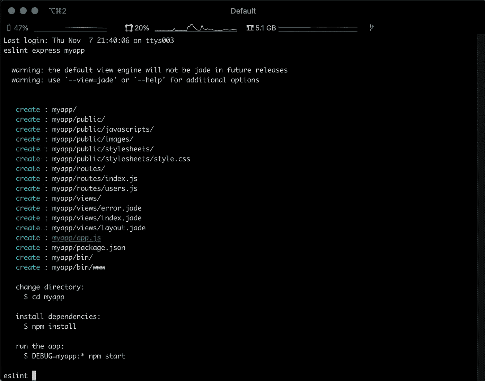

Express generator 创建了一个示例项目

让我们通过输入以下命令来运行它:

```
cd myapp
npm install
DEBUG=myapp:* npm start
```

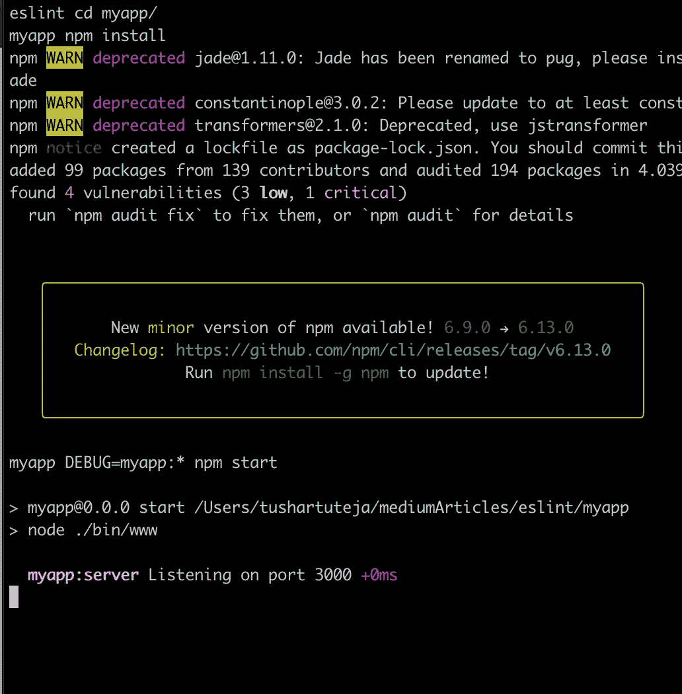

所以我们的项目开始运行了。现在我们需要添加 ESLint。

我们将通过使用以下命令来实现这一点:

```
npm install --save-dev eslint
```

我们不会在全球范围内安装 ESLint 这样做是错误的。我们将只把它作为一个开发依赖项来安装。

为了初始化配置，我们将运行:

```
 ./node_modules/.bin/eslint --init
```

它会问我们一系列问题。我已经附上了所有八个问题的截图。我已经根据需要在标题中给出了解释。

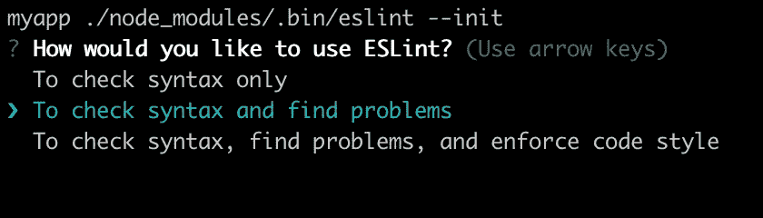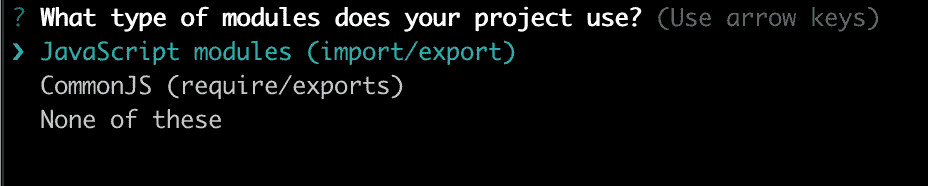

如果我们使用 CommonJS，那么我们需要使用 common JS 选项(ES5 或更低版本)

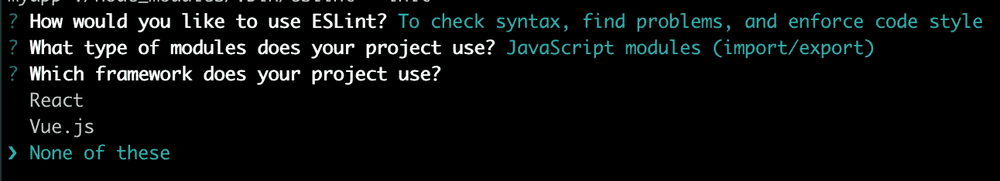

如果你在使用 React 或 Vue 的前端应用程序中使用它，那么选择正确的选项

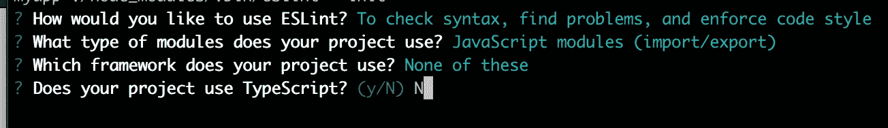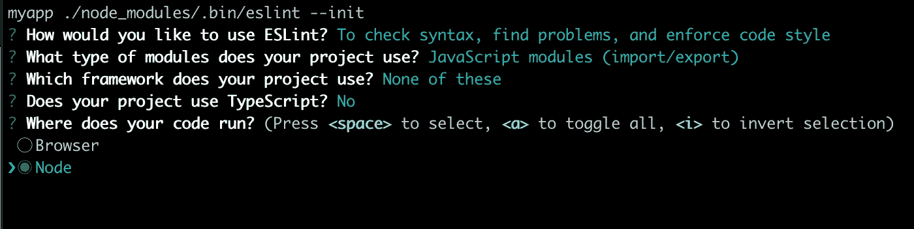

我们将在我们的后端使用这个应用程序。如果是前端应用，我们会选择浏览器。它允许在浏览器 DOM 中使用像窗口和文档对象这样的全局变量。

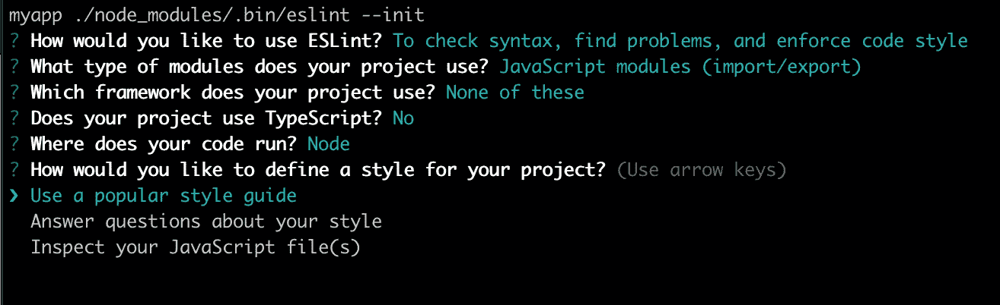

我们将使用现有的风格指南

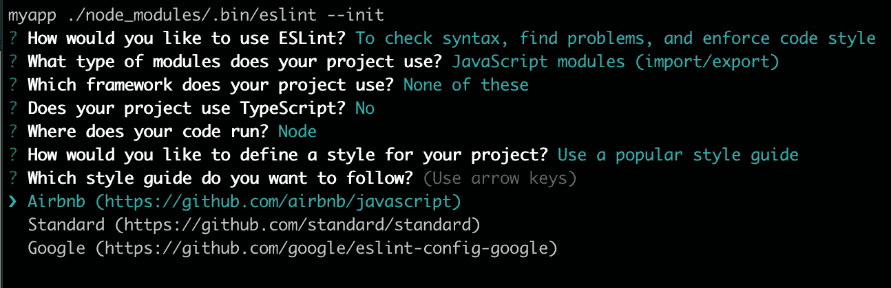

有很多选项可供选择——为了演示，我用的是 Airbnb 的指南

我个人关注 Airbnb 指南。这是一本有趣的读物。

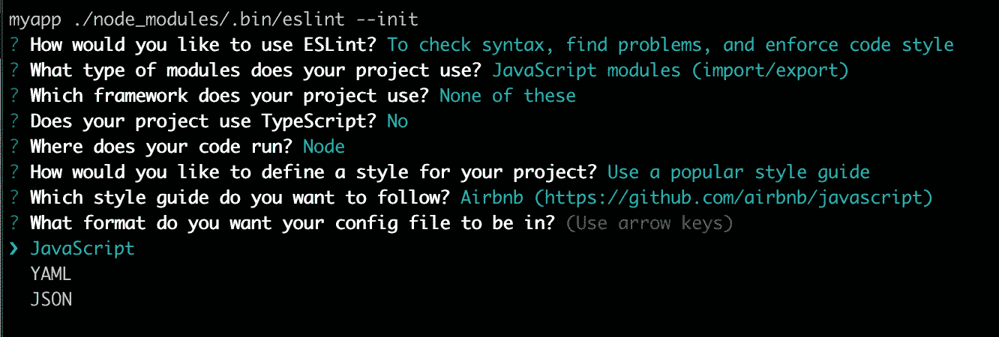

我们会选择 JSON

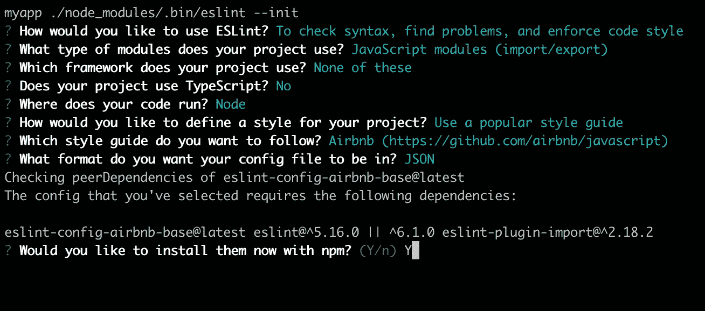

我们将安装所有的依赖项

这将在我们项目的根中创建`.eslintrc.json`。

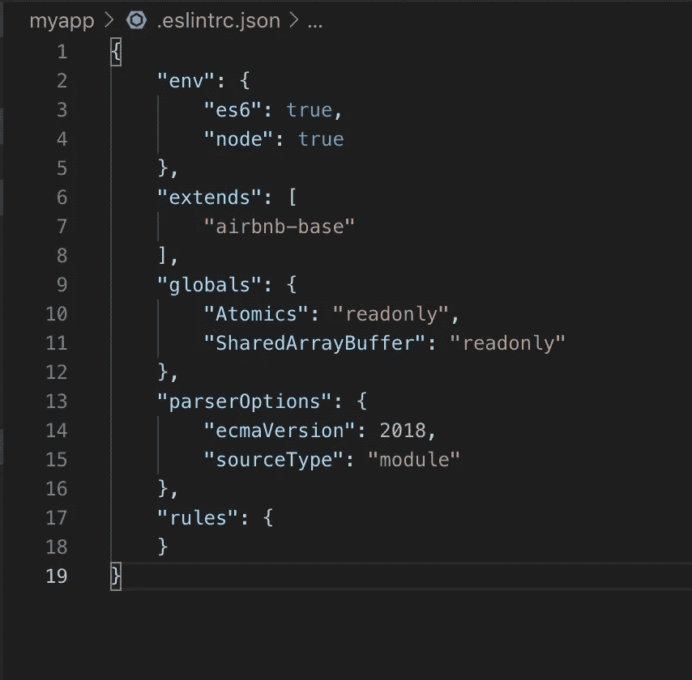

# 第 2 部分:使用 ESLint

我们可以通过运行以下命令来检查整个项目:

```
./node_modules/.bin/eslint . # . represent the current directory
```

注意`eslint`是一个可执行文件，我们将使用我们项目中包含的版本。所有可执行文件都位于。`node_modules`目录的 bin 目录。这让我们可以灵活地为不同的项目使用不同的 ESLint 版本，而不必在全球范围内安装它们。事实上，所有的可执行文件都应该这样使用——例如，`nodemon`，`pm2`等等。

它给出了下面的输出，带有过多的文件错误/警告，最后是一个总报告。

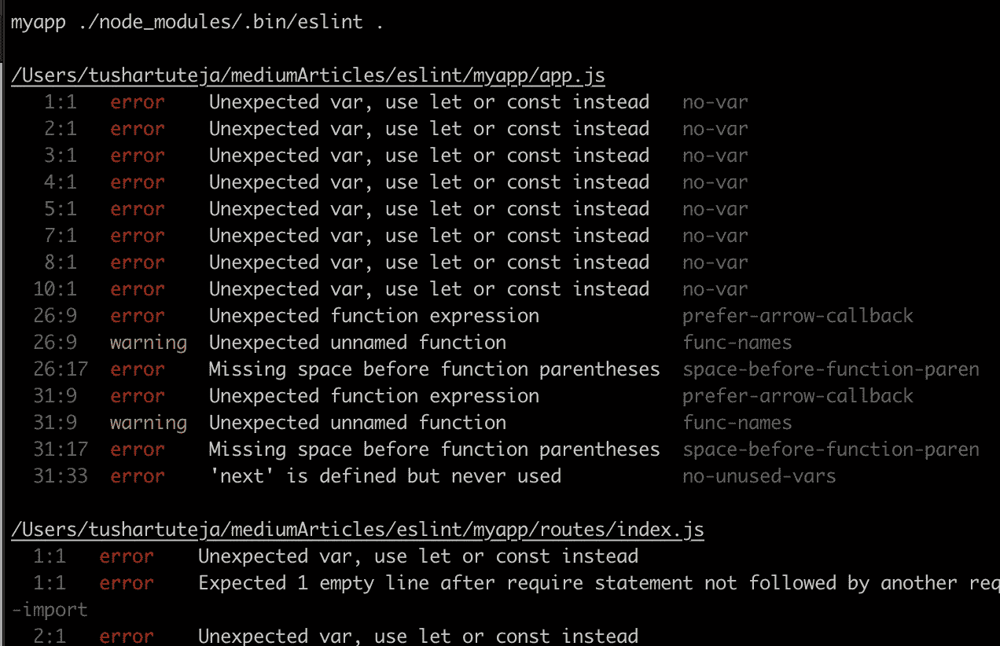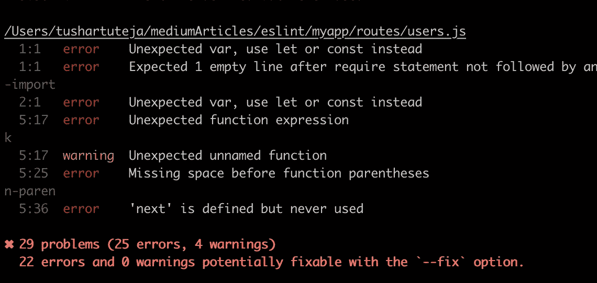

要在单个文件上运行 ESLint，我们使用:

```
./node_modules/.bin/eslint app.js
```

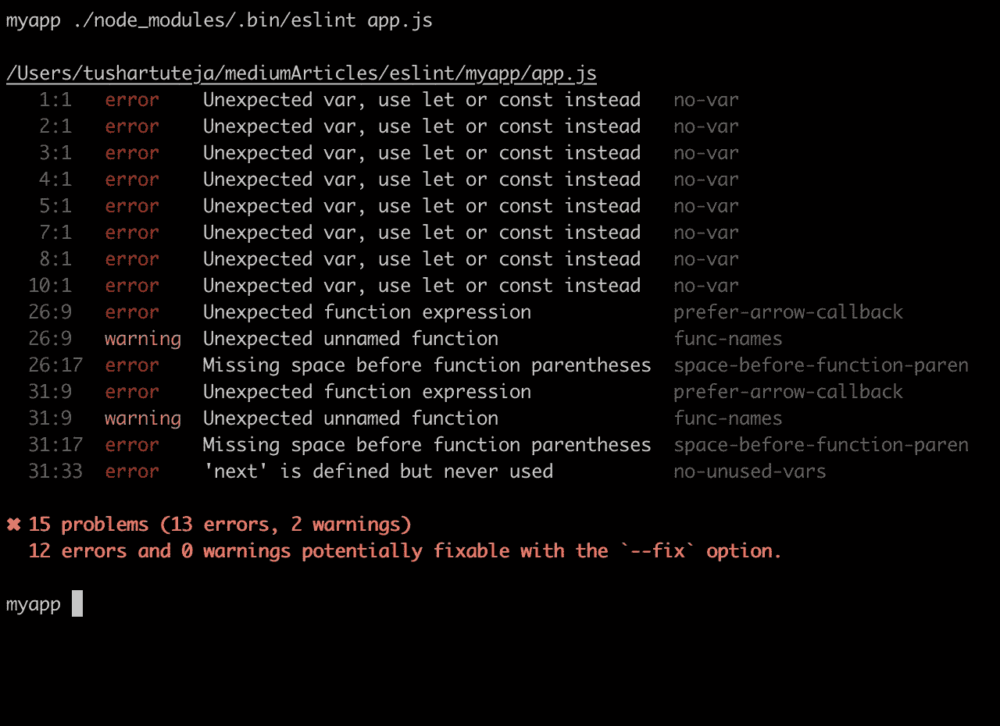

我们还可以添加另一个修复选项，这样 ESLint 就可以纠正它自己可以纠正的所有问题。

```
 ./node_modules/.bin/eslint app.js --fix
```

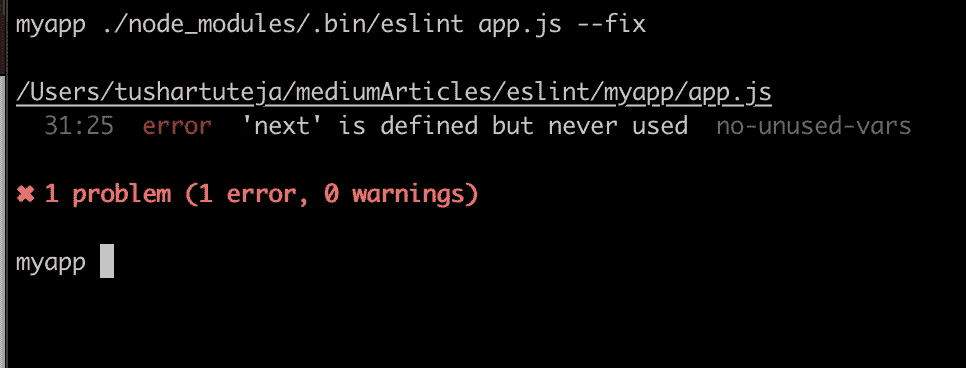

它修复了 14 个问题，现在只剩下一个未使用的变量。为了找出问题所在，我们搜索了规则`no-unused-vars`，因为人们需要时间来适应 Airbnb 的风格指南。

让我用一个`fix`命令在整个项目上运行 ESLint。

```
./node_modules/.bin/eslint . --fix
```

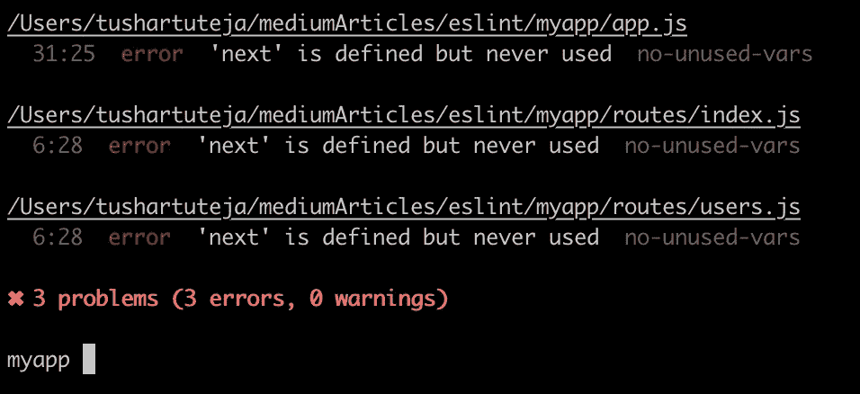

它为我修复了大部分错误。

# 第 3 部分:向 package.json 添加命令

一遍又一遍地键入整个命令非常困难。因此，我更喜欢在`package.json`的脚本中创建一个速记命令。

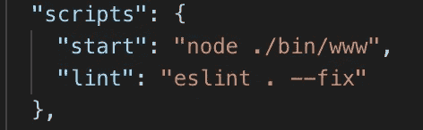

现在，如果我们必须运行 ESLint，我们可以简单地使用:

```
npm run lint
```

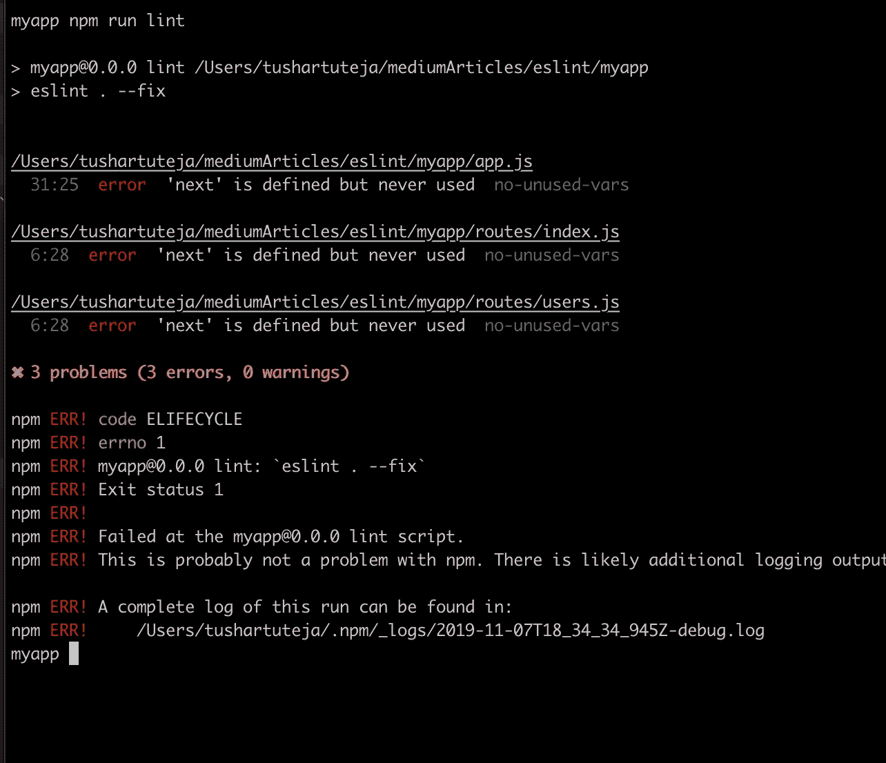

它最后给出了一些`npm ERR!`。那是因为 ESLint 抛出了一个非零的退出代码(你可以忽略它)。

这对于任何开发人员来说都非常容易记住和运行。

# 第 4 部分:覆盖规则

如果我们想关掉`no-unsed-vars rule`怎么办？我们将简单地在我们的`.eslintrc.json`文件中覆盖这个规则。

我们现在将看到 ESLint 没有抛出任何错误。

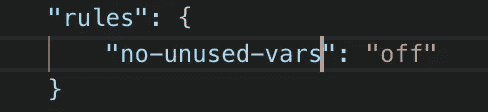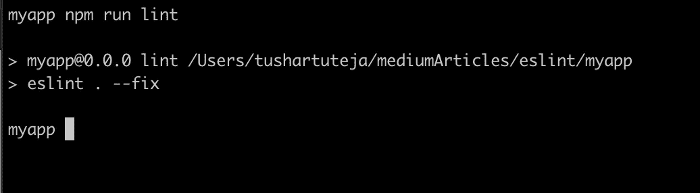

你可以谷歌，了解不同的规则不同的设置。一旦 ESLint 在您的项目中配置好并开始运行，您将会学到这一点。

# **第 5 部分:结论**

使用某种棉绒和导轨比不使用要好。将这一点添加到预提交挂钩中很重要。开发人员可以通过 git 挂钩——因此，在 CI 中拥有这一点也更重要。

我的下一篇文章将介绍使用 husky 的 git 挂钩。