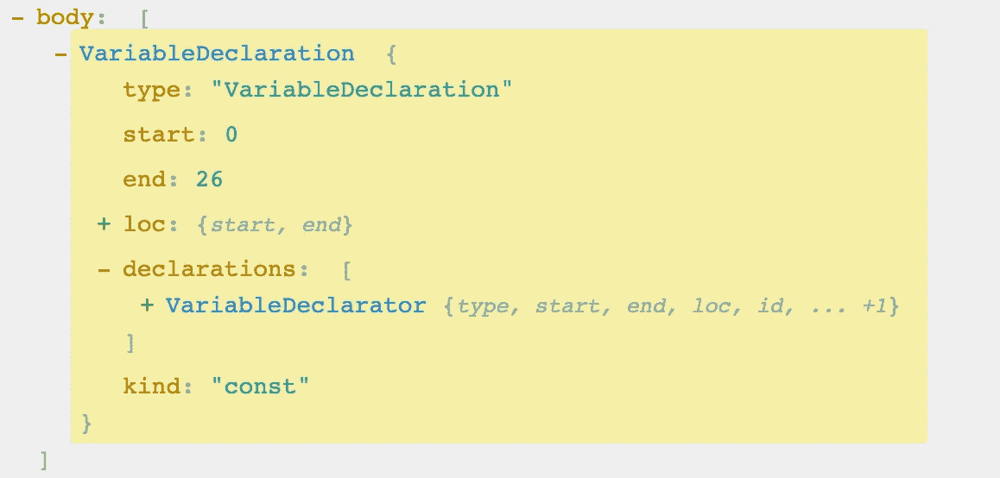
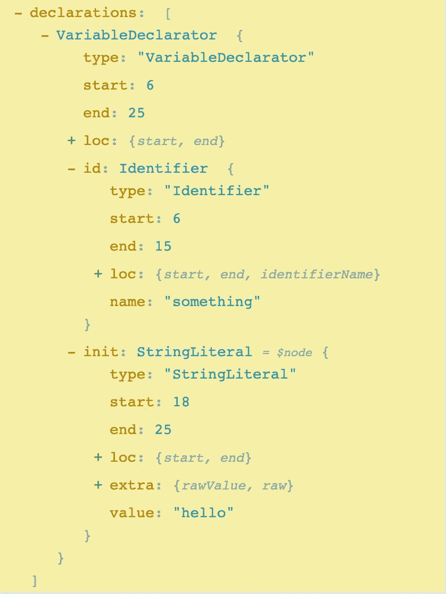
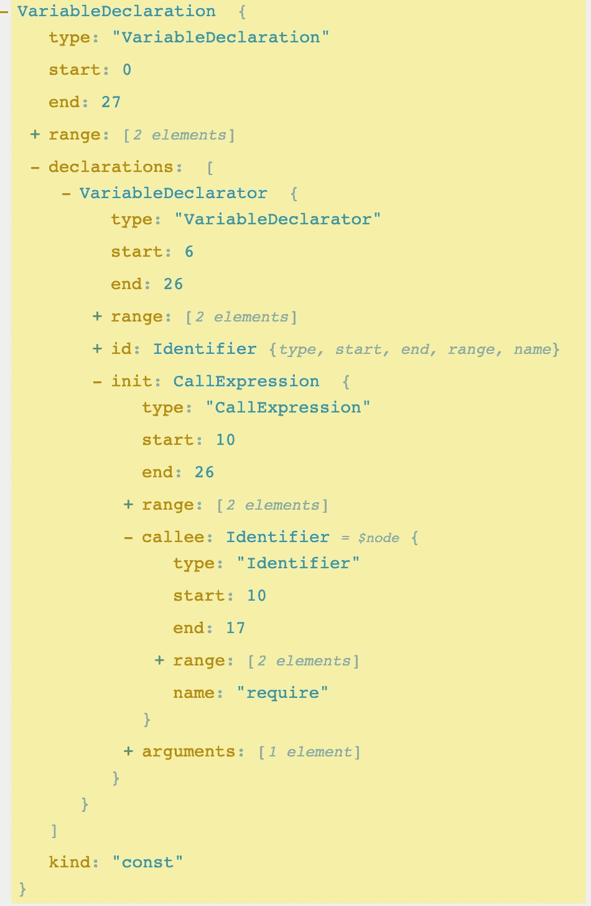
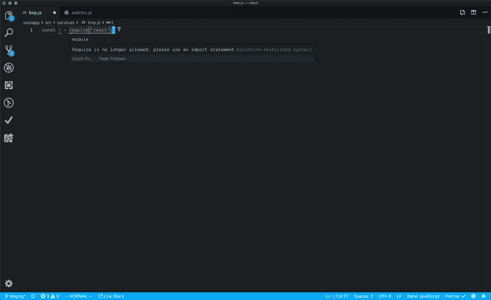

# 使用 ESLint 加速代码审查

> 原文：<https://betterprogramming.pub/using-eslint-to-speed-up-code-reviews-95c923c0d8a5>

## 建立限制规则来自动化我们的流程

查尔斯·🇵🇭在 [Unsplash](https://unsplash.com?utm_source=medium&utm_medium=referral) 上的照片

# 常见的代码审查场景

在我工作过的每个地方，最耗时的过程之一就是我们的代码审查。这是有道理的。研究一次又一次地表明，在代码审查过程中尽早发现 bug 是最便宜的途径。例如:

*   人们发现[非关键的 bug 在](https://kev.inburke.com/docs/shull_defects.pdf)发布后修复的费用是原来的两倍。
*   对于关键的 bug，成本要高得多，甚至可能比[贵 100 倍](https://kev.inburke.com/docs/shull_defects.pdf)。

因此，我们可以由此确定代码审查是至关重要的。除了直接为公司省钱之外，它们还是在团队成员之间分享知识、提高代码可读性、质疑一般架构和为给定特性所做决策的巨大机会。

那么，为什么我的历史中充满了看起来像这样的代码审查:

是的，他们都是我，显然是假的。但是我想我们在现实生活中都遇到过这些(甚至可能是过去的六个月)，我不想让任何人感到羞耻！然而，关键是，这些要么是林挺问题，要么是真正属于编码标准/风格指南的部分。

这并不是说保持一种特定的林挺风格或标准是错误的。随着您的团队越来越大，自动理解代码应该在哪里以及如何工作变得越来越有用。我个人认为风格上的差异往往被夸大了。举个例子，我不在乎你用什么函数风格，但是如果你的团队有一个编码标准，那么最好遵循它。但是这些关于代码评审的评论似乎指出了一个更大的问题。

# 可用的工具和解决方案

如果你不得不在代码评审中对它进行评论，那么看起来你的预提交过程中的某些东西是错误的。需要用这种信息填写评论是浪费时间，对评论者和被评论者都是如此。社区内已经开发了工具来尽可能多地自动化这一过程。两种流行的方法包括:

## 较美丽

在这一点上，我认为[更漂亮](https://github.com/prettier/prettier)基本上统治了代码格式化世界，没有理由不使用它。我很不确定是否要定制它，因为我认为这破坏了很多推理。但是，嘿，如果这意味着你会使用它，那么很好。

## 埃斯林特

对于大多数漂亮的代码格式之外的东西， [ESLint](https://eslint.org/) 才是王道。这两者配合得非常好，但是它们确实需要一点配置。ESLint 也是高度可定制的，开箱即可满足您的大部分需求。

现在你可能会说，“我已经安装了这些，我们仍然需要在实践中保持代码标准。”我的回答是，你并没有完全使用 ESLint。如果您的项目中有某种规则/编码标准，那么该规则应该在 ESLint 中。

活文档显然是更好的，如果我们可以在程序员工作时将我们的实践放在清晰的代码和我们的编辑器中，他们更有可能遵循制定的规则。更好的是，新开发人员不需要转向新的编码标准。如果他们想读任何具体的，他们都可以。但是在大多数情况下，它们可以正常运行，直到遇到错误。

# ESLint 和 AST 的

不要担心与 ESLint 合作。就像[巴别塔](https://babeljs.io/docs/en/)一样，在类似的基础上工作，实际上非常容易。这两个项目都致力于[抽象语法树(AST)](https://en.wikipedia.org/wiki/Abstract_syntax_tree)。这些听起来很复杂，但实际上非常非常简单。它们只是你的语法的树形结构。我们将在另一个时间更深入地研究 AST，但是这里有一个简单的例子和 AST 的可视化分解:

我强烈推荐把这个例子扔给 astexplorer.net。as explorer 是一个可视化的 ASTExplorer，具有各种各样的解析器，您可以通过一个可探索的 UI 进行编码并跟踪您的进度，使 AST 工作不那么令人生畏。在这个例子中，整行是一个`VariableDeclaration.` `VariableDeclaration`是一个对象(一棵树)，它保存那一行的值。一种是`const`，但也可能是`let,`或``var`。在我们的`VariableDeclaration`中是一个声明数组，因为这里可能有多个赋值。

在我们的例子中，我们有一个代表`something = 'hello'`的变量声明符`VariableDeclarator.`。请注意，如果您在浏览器中将鼠标悬停在它上面，您的代码将会突出显示。有很多关于`declaration,`的信息，但是我们感兴趣的是`id`和`init.`

`id`包含我们变量的`name`,`init`包含它的`value`。

很简单，对吧？有许多复杂的部分正在进行，但是对于我们实际使用 AST 的大部分，它就像我们刚刚做的演练一样简单。当我们谈论加速代码评审时，为什么我们要探索 AST？因为我们需要使用少量的 AST 来为 ESLint 构建一些我们自己的配置。

# 制定我们自己的规则

让我们以`require`不再被允许出现在代码库中为例。有两种方法，一种是构建我们自己的 ESLint 插件。这种方式要复杂得多，但是可以与整个社区共享。我强烈推荐检查一下其他插件，看看你需要的是否已经构建好了。插件是处理更复杂部分的好方法，并为这些问题提供可能的自动修复。

这篇博客将使用更简单明了的方法，我希望它能鼓励你或你团队中的其他开发人员快速添加你提出的标准。这种风格是使用 [ESLint 的](https://eslint.org/docs/rules/no-restricted-syntax) `[no-restricted-syntax](https://eslint.org/docs/rules/no-restricted-syntax)` [方法](https://eslint.org/docs/rules/no-restricted-syntax)。这意味着为您正在寻找的特定语法添加选择器，并在找到时给用户一条消息。该消息可能是警告，也可能是错误。

就像我们之前做的一样，我们将首先在一个浏览器中检查这个 AST。它将为我们提供 AST 的结构，并让我们锁定要寻找的案例。当你做这个部分时，让你使用`espree`解析器，因为它是 ESLint 使用的。对于内容，我使用了:

它给了我以下的 AST:

通过查看 AST，我们知道我们需要定位到有 callee.name 的`CallExpressions`。因此，为了限制 CJS `require`语法的使用，我们可以在我们的。eslintrc:

现在，当开发者试图使用`require,`时，他们会遇到以下错误:

# 结束语

通过在您的代码库中包含这些定制的 ESLint 规则，并在保存时自动套用格式，或者像 lint-staged 这样的预提交检查，我们可以确保代码库遵循相同的编码标准。当您使用这些 ESLint 规则时，我们可以做到这一点，而不会让我们的代码审查充斥着无论如何都应该自动化的信息。

除此之外，我的最后一个建议是，如果你想输入一些林挺关注的或者非常固执己见的选择，我会考虑一会儿。向最初的开发者提出你的风格可能是个好主意。但是我也会把它放在那个背景下，告诉他们你理解这是个人的选择。很多时候，我们可能对这些选择是个人的这一事实相当无知。作为讨论提出来是很好的，但是强迫某人使用高度主观的方法不应该是你的代码审查的目标。

# 参考资料和进一步阅读

 [## 更漂亮/更漂亮

### JSX JSON CSS SCSS Less HTML Vue Angular graph QL Markdown YAML 你的…

github.com](https://github.com/prettier/prettier)  [## 可插入的 JavaScript

### ESLint 是一个开源项目，最初由 Nicholas C. Zakas 于 2013 年 6 月创建。它的目标是提供一个…

eslint.org](http://eslint.org)  [## 巴别塔是什么？巴比伦式的城市

### Babel 是一个 JavaScript 编译器

babeljs.io](https://babeljs.io/docs/en/)  [## 抽象语法树

### 在计算机科学中，抽象语法树(AST)，或简称语法树，是抽象语法的树表示。

en.wikipedia.org](https://en.wikipedia.org/wiki/Abstract_syntax_tree)  [## AST 浏览器

### 在线 AST 浏览器。

astexplorer.net](https://astexplorer.net)  [## 无限制语法规则

### JavaScript 有很多语言特性，并不是每个人都喜欢它们。因此，一些项目选择…

eslint.org](https://eslint.org/docs/rules/no-restricted-syntax)