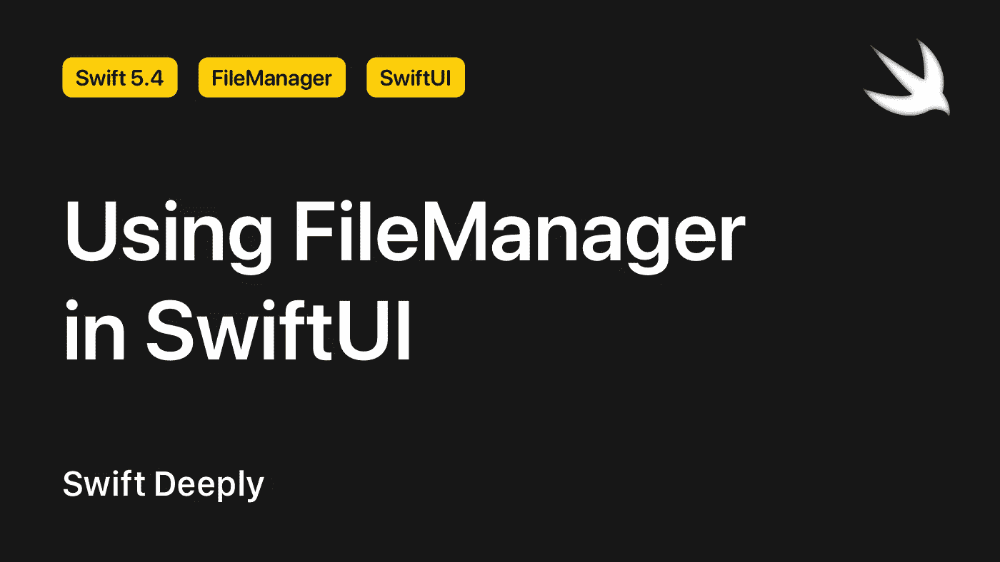
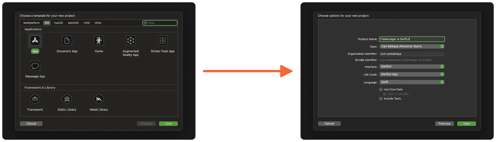
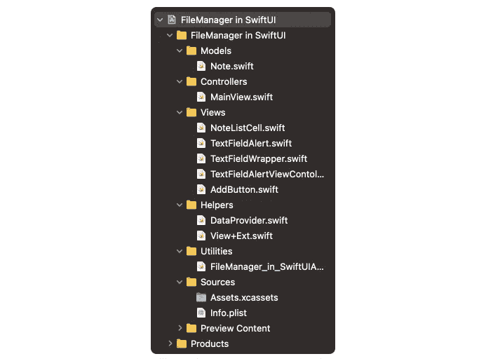

# 在 SwiftUI 中使用 FileManager

> 原文：<https://betterprogramming.pub/using-filemanager-in-swiftui-44bc0f33995e>

## 探索如何在 SwiftUI 中存储数据



作者照片。

*我之前写过一篇文章解释了什么是* `*FileManager*` *以及如何与 UIKit 一起使用。我建议在阅读今天的文章之前先阅读一下:*

[](/getting-started-with-the-filemanager-in-your-ios-app-acd81b171f7d) [## 开始使用 iOS 应用程序中的 FileManager

### 检查文件系统的内容，并对其进行更改

better 编程. pub](/getting-started-with-the-filemanager-in-your-ios-app-acd81b171f7d) 

在本文中，我们将了解什么是`FileManager`以及如何使用它。我们将学习如何在一个简单的 SwiftUI 项目中使用`FileManager`。先说什么是`FileManager`。

*注:您可以在 GitHub 上* [*下载本文的示例项目和来源*](https://github.com/Unobliging/FileManager-in-SwiftUI) *。*

# 什么是 FileManager？

`FileManager`使我们能够创建和编辑 JSON 或 plist 文件类型的数据，并在我们的应用中使用这些数据。

`FileManager`与核心数据非常相似，但 FileManager 比核心数据更容易理解。简而言之，虽然您可以用核心数据创建更复杂的数据结构，但是您可以用更快的方式在`FileManager`中创建更简单的数据结构。因此，`FileManager`非常适合小型独立应用程序。

# 如何在 SwiftUI 中使用 FileManager

为了在`FileManager`中存储和编辑数据，我们需要使用解码器和编码器。显然，所有的文件管理器基本上都使用解码器和编码器。

通常，我们直接从`Data`类型中存储`FileManager`中的值。`Data`类型可以被认为是最基本的数据类型，因为当您使用`Data`类型存储数据时，您直接存储的是该数据的`0`和`1`等效类型。你知道你电脑里的所有数据基本上都是由 0 和 1 组成的。

基本上我们可以用`FileManager`做两件事:解码和编码数据。例如，我们可以使用`PropertyListDecoder`解码一个定制的对象数组:

```
**let** decoder = PropertyListDecoder()
**let** data = **try** Data(contentsOf: dataSourceURL)
**let** decodedNotes = **try**! decoder.decode([Note].**self**, from: data)
```

类似地，我们可以使用`PropertyListEncoder`对象向自定义对象数组添加一个自定义对象:

```
**let** encoder = PropertyListEncoder()
**let** data = **try** encoder.encode(allNotes)
**try** data.write(to: dataSourceURL)
```

与 UIKit 不同，我们必须单独进行这些操作，因为 Swift 不允许我们在计算属性中使用属性包装器。我们将在开发示例项目时看到这一点。

# 在简单的 SwiftUI 项目中使用 FileManager

为了理解如何在 SwiftUI 中使用 FileManager，我们将创建一个类似于我在本文中创建的项目。SwiftUI 的工作方式与 UIKit 略有不同。这就是为什么我们需要在`FileManager`类中做一些改变。

## 创建 Xcode 项目

让我们创建一个新的 Xcode 项目。当然，我们项目的界面必须是 SwiftUI。



你可以给这个项目起任何你想要的名字。之后，剩下的唯一一件事就是开始做你的项目。

在开发项目时，我给你的建议是把你的文件分成文件夹。在做这个项目时，你可以像我一样使用文件夹:



# 构建数据模型

在本文中，我们将创建一个笔记应用程序。因此，我们的数据模型应该表示一个单一的 note 对象。这个模型有三个属性:`id`、`title`、`description`。

```
**struct** Note: Codable, Identifiable {

    // MARK: - Properties
    **var** id = UUID()
    **let** title: String
    **let** description: String
}
```

在这个数据模型中，我们使用了`Codable`和`Identifiable`协议。

> " Codable 是可编码和可解码协议的类型别名。当您将 Codable 用作类型或泛型约束时，它会匹配符合这两种协议的任何类型。— [苹果开发者](https://developer.apple.com/documentation/swift/codable)
> 
> 使用可识别协议为类或值类型提供稳定的标识概念。例如，您可以定义一个用户类型，其 id 属性在您的应用程序和应用程序的数据库存储中保持稳定。您可以使用 id 属性来标识特定用户，即使其他数据字段发生了变化，如用户名。— [苹果开发者](https://developer.apple.com/documentation/swift/identifiable)

# 准备 FileManager 类

现在我们的数据模型已经准备好了，我们可以开始创建我们的`FileManager`类了。为此，让我们创建一个新的 Swift 文件，调用`DataProvider`:

```
**class** DataProvider: ObservableObject {

}
```

如你所见，我们使用`ObservableObject`协议进行数据传输。

> "默认情况下，`ObservableObject`合成一个`objectWillChange`发布器，在其任何`@Published`属性更改之前发出更改后的值。"— [苹果开发者](https://developer.apple.com/documentation/combine/observableobject)

在我们的类中，`@Published`属性将是`Note`对象数组:

```
**class** DataProvider: ObservableObject {

    // MARK: - Properties
    @Published **var** allNotes = [Note]()
}
```

定义一个名为`shared`的值来调用自身外部的`DataProvider`类:

```
**class** DataProvider: ObservableObject {

    // MARK: - Properties
    **static** **let** shared = DataProvider()
    @Published **var** allNotes = [Note]()
}
```

为了用`FileManager`存储数据，我们需要一个 URL 对象。我们为此定义了一个属性:

正如我之前说过的，使用`@Published`属性包装器的值不能是计算属性。这就是为什么我们必须为 get 和 set 数据操作使用两个额外的方法。

首先，编写一个名为`getAllNotes`的方法来取回我们之前保存的`Note`数组。如果我们没有保存任何`Note`对象，该方法必须返回一个空数组。这一点非常重要。否则，我们的应用程序会崩溃。

我们将在`init`方法中使用`getAllNotes`方法。否则，`allNotes`元素将为空，我们的应用程序将崩溃。因此，在`init`方法中定义了`dataSourceURL`元素后，我们用`getAllNotes`来均衡`allNotes`元素:

你可能会问为什么它以这种方式把两个值等同起来。那是因为`allNotes`的开头有`_` 并且`getAllNotes`方法正在转换为`@Published`属性。

现在我们可以定义允许我们保存数据的方法。这个方法应该是私有的，因为我们希望这个方法在`DataProvider`类之外。

要创建一个新的`Note`对象，编写下面的方法。如您所见，在向`allNotes`插入一个新的`Note`对象后，我们调用`saveNotes`方法来保存更改:

```
**func** create(note: Note) {
    allNotes.insert(note, at: 0)
    saveNotes()
}
```

编写一个方法来替换先前定义的`Note`对象。类似地，在做出更改后，我们调用`saveNotes`方法:

```
**func** changeNote(note: Note, index: Int) {
    allNotes[index] = note
    saveNotes()
}
```

编写一个新方法来删除一个`Note`对象。要在 SwiftUI 中删除一个`List`对象中的元素，我们需要该元素的`offsets`信息。这就是为什么这个方法有一个`offsets`参数:

```
**func** delete(_ offsets: IndexSet) {
    allNotes.remove(atOffsets: offsets)
    saveNotes()
}
```

最后，编写一个名为`move`的方法来移动一个`List`单元格。我们将创建的`List`对象中的单元格的信息源将是`allNotes`数组。因此，当我们改变一个单元格的位置时，我们需要改变该单元格的`Note`对象的偏移量:

```
**func** move(source: IndexSet, destination: Int) {
    allNotes.move(fromOffsets: source, toOffset: destination)
    saveNotes()
}
```

用这种方法，我们完成了`DataProvider`类！

# 准备用户界面

为了访问`DataProvider`类中的属性和方法，让我们在主`View`对象中使用下面的`@ObservedObject`属性包装器定义一个元素:

这样，我们基本上可以构建我们的主 UI:

为了使代码更加可靠，用我们在`ForEach`对象中编写的对象创建一个自定义对象:

如您所见，我们的主`View`对象可读性更好:

目前，我们不能在应用程序中添加、编辑或删除新的`Note`对象。因此，当您现在运行项目时，应用程序中没有任何功能。让我们开始创建要与之交互的 UI 元素。

要创建 UI 元素，我们需要创建两个变量:`alertShowing`和`editMode`。`alertShowing`是一个`Bool`类型值，如果是`true`就可以出现`Alert`对象。`editMode`是一个`EditMode`类型值，如果设置为`.active`，`List`对象的单元格是可编辑和可删除的。

```
// MARK: - Properties
@ObservedObject **var** dataProvider: DataProvider
@State **private** **var** alertShowing = **false**
@State **private** **var** editMode: EditMode = .inactive
```

我们添加和编辑按钮的新对象将在`NavigationView`对象中。我们使用`navigationBarItems`修改器在`NavigationView`中放置按钮:

编辑`List`对象时激活添加按钮是不对的。这就是为什么我们将 add 按钮转换成一个名为`AddButton`的自定义对象，当`editMode`元素等于`.active`时，它就变成了一个`EmptyView`对象:

这样，`navigationBarItems`修改器也变得相当小:

```
.navigationBarItems(
    leading: EditButton(),
    trailing: AddButton(editMode: $editMode, alertShowing: $alertShowing)
)
```

通过在`List`对象的末尾编写`environment`修饰符，我们可以在点击`EditButton`时使`List`对象可编辑:

```
.listStyle(InsetListStyle())
.environment(\.editMode, $editMode)
```

最后，我们需要使用`onDelete`和`onMove`修饰符，以便列表对象中的单元格可以被删除和编辑。这里，我们使用之前在`perform`参数中编写的`move`和`delete`方法。

```
ForEach(dataProvider.allNotes) { note **in**
    NoteListCell(note: note)
}
.onDelete(perform: dataProvider.delete)
.onMove(perform: dataProvider.move)
```

目前，我们可以编辑和删除`List`对象单元格，但不能添加新的`Note`对象。这就是为什么我们的应用程序现在没有任何意义，因为没有附加`Note`对象。如果我们创建 UI 元素来添加新的`Note`对象，我们的应用就会变成我们想要的样子。

我们将使用一个`Alert`对象来添加一个新的`Note`对象。这对你来说似乎很容易，但是 SwiftUI 仍然没有包含`TextField`对象的`Alert`对象。因此，我们需要用`UIViewControllerRepresentable`创建自定义的`Alert`对象。

我们要做的第一件事是创建一个新的`UIViewController`，就像在 UIKit 中定义一个自定义的`UIAlertViewController`。为此，您可以创建一个名为`TextFieldAlertViewController`的 Swift 文件，并导入 SwiftUI 和 Combine 框架。

```
**import** SwiftUI
**import** Combine
```

之后，我们可以创建`TextFieldAlertViewController`类。我们下面写的代码将帮助我们创建`UIAlertController`对象:

创建一个名为`presentAlertController`的方法，并将该方法写入`viewDidAppear`:

作为我们将在主`View`对象中使用的自定义`Alert`对象，我们创建了一个名为`TextFieldAlert`的自定义 UI 对象:

我们使用`UIViewControllerRepresentable`协议在 SwiftUI 中使用定制 UIKit 元素。同样，我们将它与`TextAlert`对象一起使用:

然后，创建一个名为`TextFieldWrapper`的`View`元素来定义当`TextAlert`对象将会和不会显示在我们的主`View`对象中时需要做什么:

就像使用`alert`修改器一样，我们创建了一个名为`textAlert`的修改器，以便在我们的应用中将`TextAlert`对象用作`Alert`对象:

现在我们可以在应用程序中使用`TextAlert`对象，使用`textFieldAlert`修饰符:

我们的应用已经准备好了。现在我们可以测试它了！如您所见，SwiftUI 允许我们自动执行许多操作:


# 结论

虽然 SwiftUI 不支持很多东西，但是多亏了像`UIViewControllerRepresentable`这样的工具，我们几乎可以用 SwiftUI 做任何事情。这就是为什么我认为每个人都可以只用 SwiftUI 开发自己的独立应用程序。

我希望你喜欢阅读这篇文章。如果你有任何问题，请在评论区留言。

我的其他文章:

*   [使用 SwiftUI 构建跨平台应用](/building-cross-platform-apps-with-swiftui-3fea88cdb0ae)
*   [在 SwiftUI 中为数字构建一个文本字段](/build-a-textfield-for-numbers-in-swiftui-21030b58a41)
*   [如何在 SwiftUI 的新应用生命周期中使用 Firebase](/how-to-use-firebase-in-swiftuis-new-application-lifecycle-c77a8a306d63)