# 通过 Android 和架构组件使用 Firestore

> 原文：<https://betterprogramming.pub/using-firestore-with-android-and-architecture-components-cb3b5364027e>

## 将组件与我们的 Firestore 数据集成


Pathum Danthanarayana 在 [Unsplash](https://unsplash.com/s/photos/android?utm_source=unsplash&utm_medium=referral&utm_content=creditCopyText) 上拍摄的照片

Firebase Firestore 和 Android 架构组件似乎完美契合。然而，几乎没有关于如何将这些工具结合在一起的信息。

这引起了[阿什顿·琼斯](https://medium.com/@TJgrapes)的注意，作为回应，我写了一些文章解释如何整合它们。在本文中，我将解释如何将使用 Android 架构组件开发的 Android 应用程序与 Firebase Firestore 数据库集成。

如前所述，这是一个后续教程，但它可以遵循没有必要阅读以前的。但是如果你好奇的话，这里有:

[](https://medium.com/better-programming/create-an-app-that-uses-livedata-and-viewmodel-in-java-f8086ca94229) [## 在 Java 中创建一个使用 LiveData 和 ViewModel 的应用程序

### 使用 Android 架构组件

medium.com](https://medium.com/better-programming/create-an-app-that-uses-livedata-and-viewmodel-in-java-f8086ca94229) [](https://medium.com/better-programming/how-to-set-up-a-database-with-firebase-firestore-to-use-with-android-architecture-components-992ab5df8223) [## 如何使用 Firebase Firestore 设置数据库，以便与 Android 架构组件一起使用

### 为您的 Android 应用添加数据库功能

medium.com](https://medium.com/better-programming/how-to-set-up-a-database-with-firebase-firestore-to-use-with-android-architecture-components-992ab5df8223) 

# 我们开始吧

如果你想从这一点继续下去，请在我的网站上下载 Android 项目。

这个项目写在:

*   Android Studio 3.6.2
*   Java 语言(一种计算机语言，尤用于创建网站)
*   精简库:AndroidX

您将需要自己配置 Firebase Firestore 数据库，因为遗憾的是它不能作为附件提供— [如果您需要知道如何做，这里是](http://www.evanamargain.com/blog/android/firebase-firestore-for-android-architecture-components/)。一旦你满足了这些先决条件，你就可以开始本教程。

运行应用程序，您将看到一个简单的购物清单，这是一个非常常见的示例应用程序，具有基本的架构:

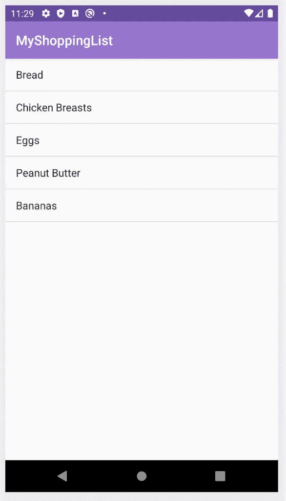

图一。应用程序的初始视图

# 从视图模型中分离实时数据

开发 Android 项目时，不断重构总是很重要的。正如鲍伯·马丁叔叔曾经提到的:

> *离开露营地时，一定要比你发现时干净。*
> 
> [*清理代码。罗伯特·马丁*](https://amzn.to/3amidAR)

您将从重构开始这个项目，以便它更好地适应 MVVM 架构。目前，starter 项目的结构如下所示:

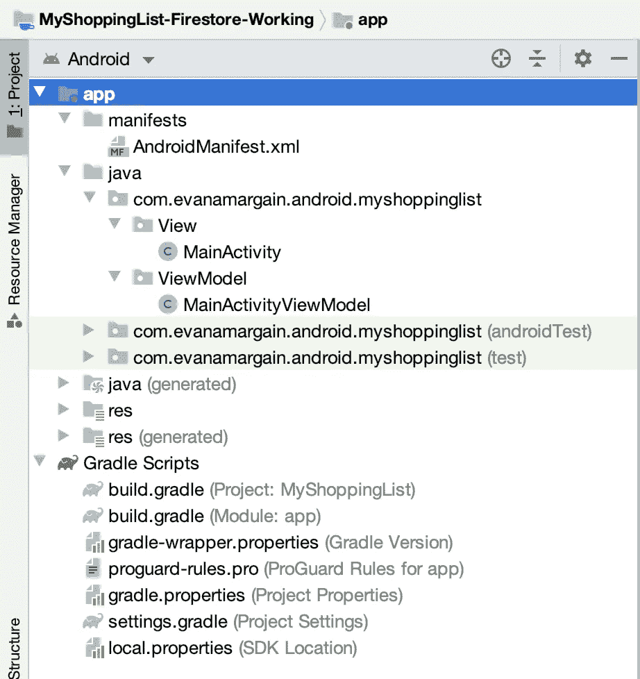

图二。开始应用程序结构

在这次重构中，您将向应用程序添加三个新包:

*   `LiveData`
*   `Model`
*   `Repository`

# 将 LiveData 与视图模型分离

理想情况下，架构中的每个组件都应该有自己的包，以便其他开发人员知道在哪里可以找到您的项目信息。

包命名的选择因项目和结构而异。在这种情况下，我们将为每个架构部分准备一个包。首先创建一个 LiveData 包，右键单击项目的主文件夹，如图 3 所示:

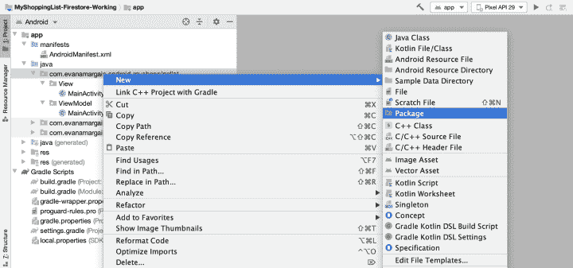

图 3。创建新的包菜单

将包命名为 LiveData，如下图所示。

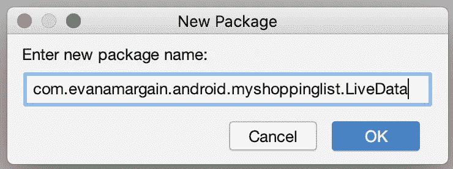

图 4。LiveData 包的名称

在这个新包中，创建一个名为`ShoppingListLiveData`的 Java 类。

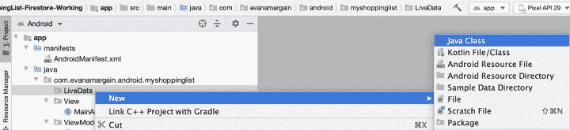

图 5。创建新的课程菜单

只需添加名称，保留所有默认选项。更改后，文件夹结构应该如图 6 所示。

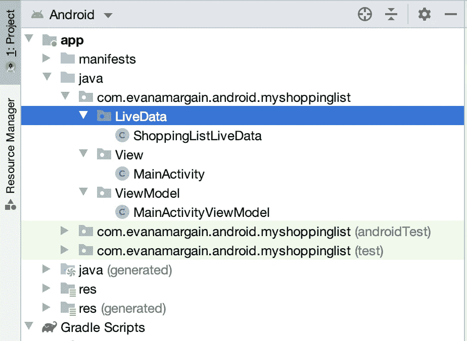

图 6。添加 LiveData 包和类后的项目结构

# 重命名主活动和视图模型

重构的另一个重要部分是给类起一个描述性的名字。通常，Android 为我们提供了一个默认的活动，它总是被命名为`MainActivity`。让我们重构一下`MainActivity`和`ViewModel`的名称，从这个通用的名称到一个更清晰的名称。右击文件，你会看到一个重构选项，然后点击第一个“重命名……”*(图 7)，注意不要点击那个叫“重命名文件……”，因为它会改变文件，但不会改变对它的所有引用。*

**

*图 7。重构菜单*

*单击此选项后，会出现一个对话框，要求您输入新名称，并为您提供各种选项(图 8)。保留所有默认选项，只需更改名称。*

*将`ViewModel`的名称改为`ShoppingListViewModel`，将`MainActivity`改为`ShoppingListMainActivity`。*

*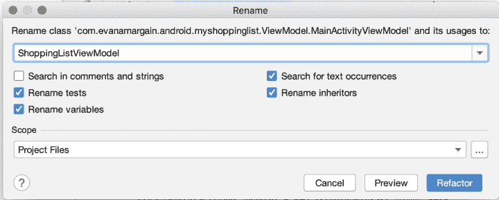*

*图 8。重命名视图模型*

*经过这些更改后，项目将如下所示:*

*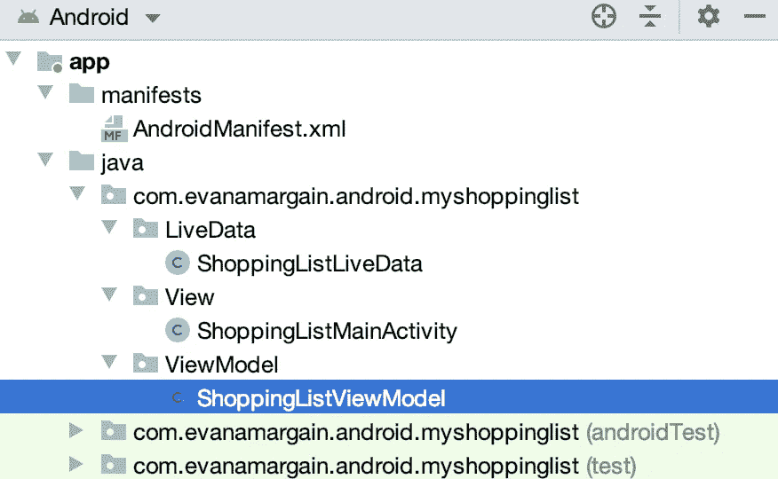*

*图 9。重构视图模型名称后的项目结构结果*

*太好了！项目现在看起来更干净，如果另一个开发者想修改你的应用程序，他们会知道每个文件的用途。*

# *为购物清单添加模型*

*使用 MVVM 和几乎任何其他架构时，另一个重要的部分是为你的对象创建模型类。创建一个模型包和一个`ShoppingItem`模型，遵循与`LiveData`相同的步骤。结果应该如图 10 所示:*

*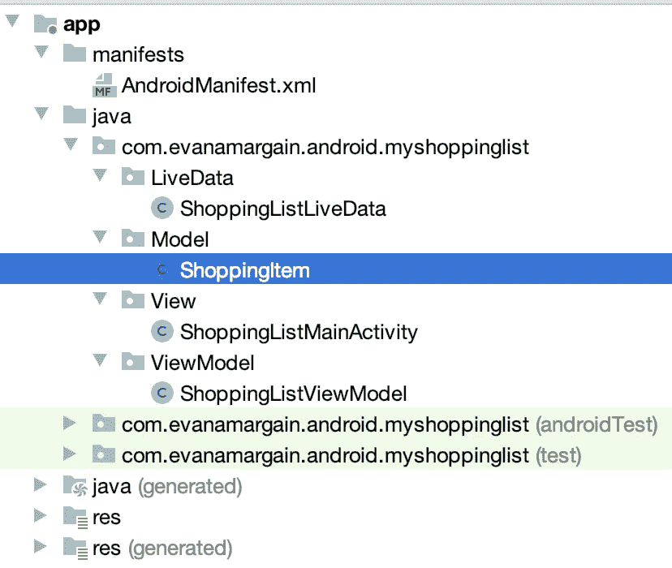*

*图 10。购物项目模型及其包装*

*这个模型只有一个属性——购物清单项目的名称。在类中添加下面的代码:`*private String name;*` *。**

*我们将利用 Android Studio 代码生成器为这个类创建 getter 和 setter。选择新添加的代码行，并右键单击它。点击菜单选项“生成”(图 11)，然后选择选项“Getter 和 Setter”*(图 12)。**

**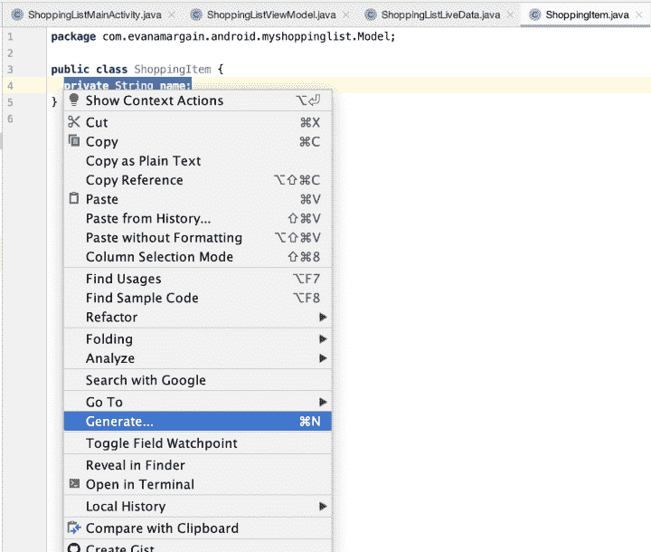**

**图 11。生成代码的菜单**

**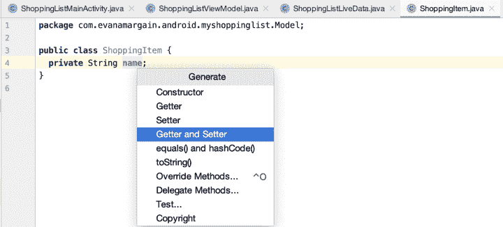**

**图 12。生成 getter 和 setter 的选项**

**将出现一个对话框提示您选择字段。如果你有不止一个变量，你可能不想为每个变量都生成 getters 和 setters。在这种情况下，您只有一个项目，因此请确保它被高亮显示，如图 13 所示，然后单击“确定”**

**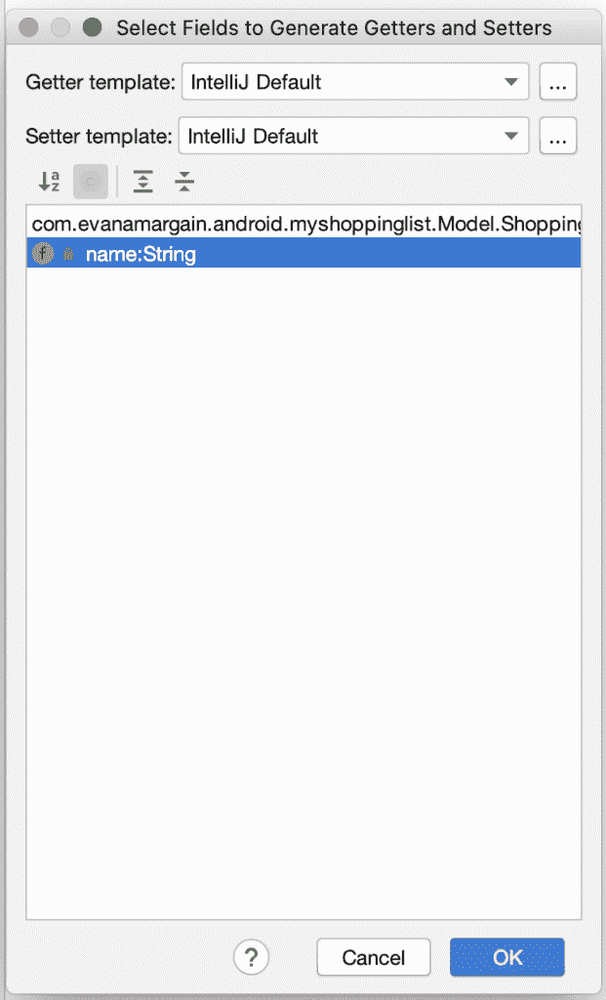**

**图 13。选择需要 getter 和 setter 的变量**

**更改后你应该有两个新方法，和`setName(String name)`。在这种情况下，方法是在属性之上生成的(图 14)。就我个人而言，为了让代码更整洁，我更喜欢将方法放在底部，所以如果你愿意，可以重新排列它们。**

**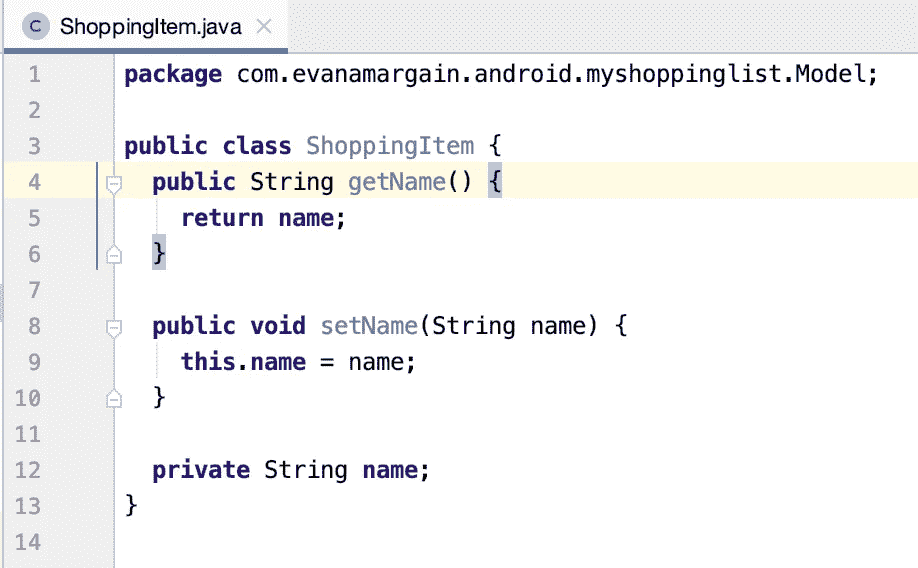**

**图 14。getter 和 setter 生成的结果**

# **创建存储库包和类**

**最后，我们创建一个存储库。这在 MVVM 建筑中并不常见。您将看到这部分代码有不同的命名——有些是指 Dao 和 dto，有些是指网络层。在这种情况下，我们将使用存储库来处理与后端的连接，即 Firebase Firestore。**

**使用与 LiveData 和 Model 相同的步骤，创建一个存储库包和类。您的结果将类似于图 15:**

**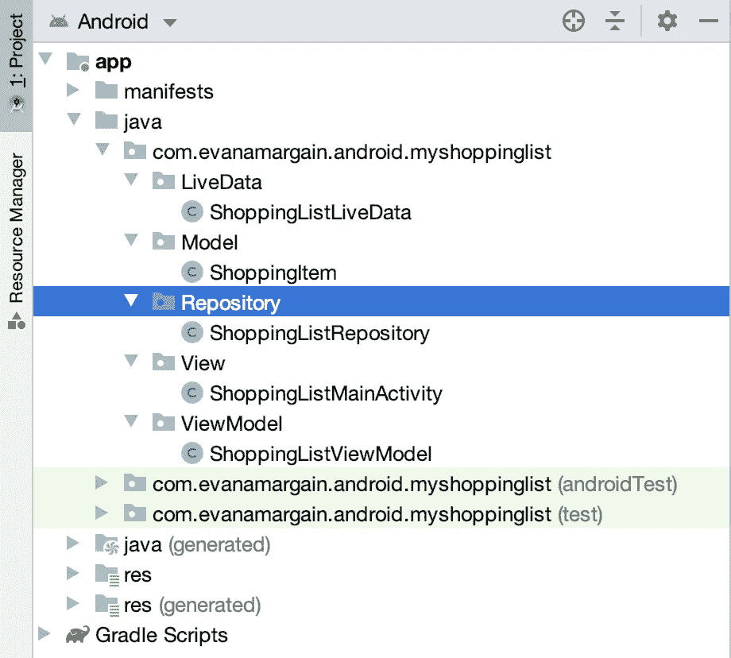**

**图 15。创建存储库包和类后的项目结构**

**如果你在这一点上运行应用程序，它应该工作，并仍然显示你在图 1 中看到的相同的屏幕。如果您有问题，请返回并确保您正确遵循了每一步。**

# **将 Firestore 与 Android 架构组件连接起来**

**最后，我们得到了本教程的要点。使用我们刚刚创建的结构，我们将能够连接到 Firestore，并在项目中拥有一个真正干净的架构。**

## **将存储库与 Firestore 连接**

**在您刚刚创建的`ShoppingListRepository`中，添加以下代码:**

```
**// 1 
private FirebaseFirestore firebaseFirestore = FirebaseFirestore.getInstance(); // 2 
public ShoppingListLiveData getFirestoreLiveData() { 
  // 3 
  DocumentReference documentReference = firebaseFirestore            
                                          .collection("MyGroceries") 
                                          .document("March26-2020"); 
  // 4 
  return new ShoppingListLiveData(); 
}**
```

**让我们来分解一下:**

**我们将创建一个 Firebase Firestore 的新实例，如果你将这个库正确地集成到项目中，它应该是可用的。如果你有困难，回顾一下[这篇](http://www.evanamargain.com/blog/android/firebase-firestore-for-android-architecture-components/)文章中的步骤。**

**`// 2`:您将创建一个`getFirestoreLiveData()`方法，正如它的名字所说，它将返回来自 Firestore 的 LiveData。这个方法将替代我们目前在`ViewModel`中硬编码的`loadShoppingList()`方法。**

**`// 3` : Firestore 和 LiveData 的神奇就发生在这里。您只需要提供您的收藏和文档名称，这将跟踪文档中的任何更改。**

**`// 4`:最后，我们创建一个新的`ShoppingListLiveData`实例，它稍后将接收这个文档引用。然而，我还没有添加这个，因为这会导致一个错误。**

**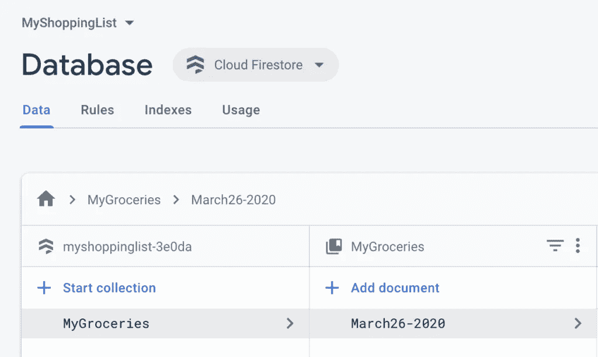**

**图 16。Firestore 数据库，包含代码中使用的集合和文档名称。**

**大多数情况下，当你添加新代码时，Android Studio 会在你复制和粘贴时提示你导入(图 17)。如果你明白了，就接受这些建议吧。**

**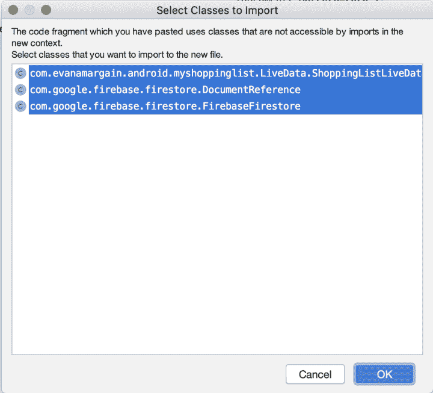**

**图 17。从 Android Studio 导入提示。**

**如果您正在键入代码，您可能得不到建议，因此以下是您可能需要的输入:**

```
**import com.evanamargain.android.myshoppinglist.LiveData.ShoppingListLiveData; 
import com.google.firebase.firestore.DocumentReference; 
import com.google.firebase.firestore.FirebaseFirestore;**
```

**如果您再次运行该应用程序，它应该仍然可以工作。确保它没有损坏，看起来仍然像图 1。**

## **将 LiveData 与包含 Firestore 参考的存储库连接起来**

**LiveData 允许我们扩展类，以便配置接收到的数据。这个例子非常简单，所以您只需添加为购物清单提供信息的逻辑。尽管如此，仔细看看代码结构，因为它在更大、更复杂的项目中可能是有用的。**

**你要做的第一件事就是扩展和实现`EventListener<DocumentSnapshot>`。您的类声明应该如下所示:**

```
**public class ShoppingListLiveData extends LiveData<List<ShoppingItem>> implements EventListener<DocumentSnapshot> { 
  ... 
}**
```

**你可能想知道为什么我们需要这两个类，所以让我们看看答案:**

*   **`LiveData<List<ShoppingItem>>`，指的是将在应用程序中观察到的项目类型，我们有一个购物项目列表，但我们希望该列表来自 FireStore，因此通过扩展它，您可以将默认实现修改为您自己的实现。**
*   **`EventListener<DocumentSnapshot>`允许应用程序观察 firebase 并查看特定文档是否发生变化。快照是数据的固定映像—当快照发生变化时，将触发`onEvent` 。**

**说到上面的`onEvent`方法——因为它是`EventListener<DocumentSnapshot>`的必需方法，Android Studio 会给你一个错误，要求你添加它。**

**首先，添加两个实例变量:**

```
**private List<ShoppingItem> shoppingListTemp = new ArrayList<>(); 
public MutableLiveData<List<ShoppingItem>> shoppingList = new MutableLiveData<>();**
```

**第一行是一个临时列表，您将使用它来添加项目。在你得到这个临时列表中的所有条目后，你将把它们都添加到`MutableLiveData`变量中，以通知视图并进行必要的更新。**

# **onEvent 方法**

**添加这两个变量后，您现在可以创建错误所需的 onEvent 方法，使用以下代码添加它:**

```
**// 1 
@Override public void onEvent(@Nullable DocumentSnapshot documentSnapshot, @Nullable FirebaseFirestoreException e) { 
  // 2 
  if(documentSnapshot != null && documentSnapshot.exists()) {     // 3 
    Map<String, Object> shoppingListItems = documentSnapshot.getData();     // 4 
    shoppingListTemp.clear();     // 5 
    for (Map.Entry<String, Object> entry : shoppingListItems.entrySet()) { 
      ShoppingItem itemToAdd = new ShoppingItem();   
      itemToAdd.setName(entry.getValue().toString()); 
      shoppingListTemp.add(itemToAdd); 
    }     // 6 
    shoppingList.setValue(shoppingListTemp);   } else {
    // 7 
    Log.d("TAG", "error"); 
  } 
}**
```

**这是一个很长的方法，所以让我们分解一下。**

**`// 1`:您正在覆盖所请求的方法，该方法将包含一个错误或者您指定的文档的快照(顺便说一下，是存储库中的那个)。**

**`// 2`:你正在检查你是否真的得到了快照。**

**`// 3`:文档快照一个映射，其中键是字段名称，在您的数据库中是`Item1`、`Item2`等。为了清楚起见，请看图 19。该值是一个对象，因为您的代码不知道它将接收哪种类型的值，尽管在这种情况下，所有值都应该是字符串。**

**`// 4`:清空临时列表以避免重复。有一些方法可以将 FireStore 数据库中的新数据添加到 LiveData 中，但这不在本教程中讨论。**

**`// 5`:遍历项目映射中的所有项目，并为每个项目创建一个`ShoppingItem`实例。您为对象设置名称，并将其添加到`TemporaryList`。**

**`// 6`:这一步是触发 LiveData 的关键。为了让应用程序知道 LiveData 发生了变化，您需要使用方法`setValue()`——您在那里设置了临时列表。如果你选择`setValue`每次你添加一个项目，你会刷新屏幕很多，这是没有必要的。这就是这个方法在循环外被调用的原因。**

**`// 7`:当然，在生产应用程序中，你会管理错误，也许会重试或者让用户知道。但是这是一个单独的主题——这里我们只记录错误。**

**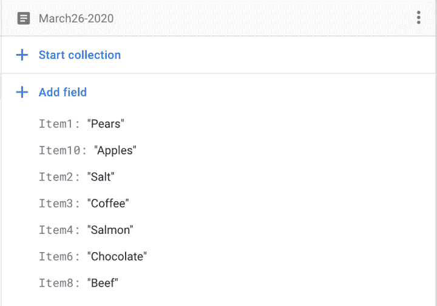**

**图 18。文档键值对**

**完成这些更改后，您的导入应该如下所示:**

```
**import android.util.Log; import com.evanamargain.android.myshoppinglist.Model.ShoppingItem; 
import com.google.firebase.firestore.DocumentSnapshot; 
import com.google.firebase.firestore.EventListener; 
import com.google.firebase.firestore.FirebaseFirestoreException; import java.util.ArrayList; 
import java.util.List; 
import java.util.Map; import androidx.annotation.Nullable; 
import androidx.lifecycle.LiveData; 
import androidx.lifecycle.MutableLiveData;**
```

**如果您在此时运行应用程序，它应该仍然像开始时一样工作(图 1)，因为您当前的代码仍然没有连接到`View`或`ViewModel`。验证它是否仍在工作。**

# **连接 LiveData 和存储库**

**现在我们有了两个部分，`ShoppingListLiveData`和`ShoppingListRepository`，我们必须将它们连接起来。请记住，您需要将存储库中的文档引用发送到 LiveData。**

**在`LiveData`类的顶部添加一个变量来存储文档引用:**

```
**private DocumentReference documentReference;**
```

**这将需要以下导入:**

```
**import com.google.firebase.firestore.DocumentReference;**
```

**然后向这个类中添加一个构造函数，您将在其中初始化它。**

```
**public ShoppingListLiveData(DocumentReference documentReference) { 
  this.documentReference = documentReference; 
}**
```

**现在您已经有了这个变量，并且它在`ShoppingListLiveData`的构造函数中，存储库中的最后一行代码将会报怨。只需通过将返回行更改为以下内容来添加您的文档引用:**

```
**return new ShoppingListLiveData(documentReference);**
```

**`ViewModel`也会为此请求一个参数，只需给它赋值 null，因为我们不会在那里初始化它。按如下方式更改该行:**

```
**ShoppingListLiveData liveData = null;**
```

# **测试**

**现在运行应用程序，它终于开始工作了！你会在手机上的应用程序中看到与你在 Firestore 数据库中看到的完全相同的信息。现在用 Firestore 中的数据玩一玩:**

1.  **添加新项目**
2.  **更改值**
3.  **删除项目**

**注意当你做所有这些改变时，应用程序是如何更新的，下面你可以看到一张图片，它是如何为我工作的。**

**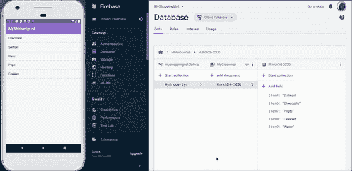**

**图 19。决赛成绩**

**搞定了。我们现在有一个应用程序，使用 Firestore 和 Android 架构组件。如果你想看看这个项目最终应该如何运作，你可以在我的网站上下载完成的项目。**

**下次见！**