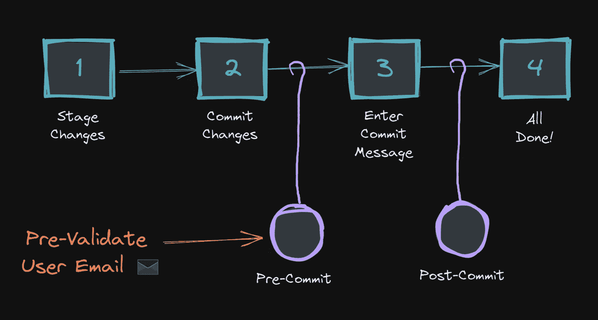

# 使用 Git 挂钩在每次提交前预先验证用户电子邮件

> 原文：<https://betterprogramming.pub/using-git-hooks-to-pre-validate-user-email-before-each-commit-dbd7b4e8170c>

## 并且避免来自公共/公司所有的 Git 存储库上的个人电子邮件地址的意外提交



您可以使用自定义的`pre-commit`钩子在每次提交之前预先验证用户的电子邮件(图片:作者)

当开发人员使用在同一台机器上配置的多个 git 概要文件为多个 git 存储库做贡献时，他们必须在 repo 级别正确设置本地 git 用户名和电子邮件。

```
**# Setup global Git settings (applicable for every repository by default)**
git config --global user.name "John Doe"
git config --global user.email  [johndoe@examplecompany.com](mailto:johndoe@examplecompany.com)
git config --list**# Override global Git settings (applicable for the current project repository only)**
cd ~/project/
git config user.name "John Doe"
git config user.email [johndoe@exampleproject.com](mailto:johndoe@exampleproject.com)
git config --list
```

不幸的是，有时开发人员在开始他们在新克隆/创建的 git 存储库上的工作之前忘记切换到正确的 git 配置文件，并最终使用他们的个人电子邮件地址提交公共/公司 git 存储库——反之亦然。

解决这个问题最简单的方法是在每次提交之前使用一个定制的 Git 钩子来预先验证用户的电子邮件，在本教程中，我们来了解一下如何做到这一点。

对于那些不熟悉 git 生态系统的人，建议在使用 git 挂钩之前理解它们是如何工作的(参见第 1 部分)。

如果您是 git pro，可以跳过第 1 部分，直接跳到第 2 部分。

# 第 1 部分:Git 挂钩如何工作(适用于初学者)

Git 挂钩是简单的脚本，根据 git 存储库的一组已知生命周期事件自动触发。

例如，您可以配置一个 git 挂钩来调用一些针对 git 提交生命周期的预定义作业(例如，pre-commit、prepare-commit-msg)。

## Git 挂钩的默认位置

如果您导航到任何本地 git repo 的`.git/hooks`目录，您可以找到如下的一组样例钩子。如果您删除了`.sample`部分，这些钩子将真正开始执行，或者您可以编辑它们并在这里添加您的自定义逻辑:

```
ashen@DevVM:/mnt/d/dev/sample-repo-git-hooks$ ll .git/hooks/
total 28
drwxrwxrwx 1 ashen ashen 4096 Aug 18 23:14 .
drwxrwxrwx 1 ashen ashen 4096 Aug 18 20:38 ..
-rwxrwxrwx 1 ashen ashen  478 Aug 18 20:07 applypatch-msg.sample
-rwxrwxrwx 1 ashen ashen  896 Aug 18 20:07 commit-msg.sample
-rwxrwxrwx 1 ashen ashen  189 Aug 18 20:07 post-update.sample
-rwxrwxrwx 1 ashen ashen  424 Aug 18 20:07 pre-applypatch.sample
-rwxrwxrwx 1 ashen ashen 1642 Aug 18 20:07 pre-commit.sample
-rwxrwxrwx 1 ashen ashen 1239 Aug 18 20:07 prepare-commit-msg.sample
-rwxrwxrwx 1 ashen ashen 1348 Aug 18 20:07 pre-push.sample
-rwxrwxrwx 1 ashen ashen 4898 Aug 18 20:07 pre-rebase.sample
-rwxrwxrwx 1 ashen ashen  544 Aug 18 20:07 pre-receive.sample
-rwxrwxrwx 1 ashen ashen 3610 Aug 18 20:07 update.sample
```

如果您想知道您的项目是如何收到这些示例脚本的，它们会与您的 git 安装捆绑在一起，并驻留在`/usr/share/git-core/templates/hooks/`位置。每当您创建一个新的 git 项目 repo ( `git init`)或者克隆一个现有的 repo(`git clone`)，这些示例脚本就会被复制到您项目的`.git/hooks`位置。

```
ashen@DevVM:~$ ll /usr/share/git-core/templates/hooks/
total 52
drwxr-xr-x 2 root root 4096 Mar 10 21:00 .
drwxr-xr-x 5 root root 4096 Mar 10 21:00 ..
-rwxr-xr-x 1 root root  478 Apr 20  2020 applypatch-msg.sample
-rwxr-xr-x 1 root root  896 Apr 20  2020 commit-msg.sample
-rwxr-xr-x 1 root root  189 Apr 20  2020 post-update.sample
-rwxr-xr-x 1 root root  424 Apr 20  2020 pre-applypatch.sample
-rwxr-xr-x 1 root root 1642 Apr 20  2020 pre-commit.sample
-rwxr-xr-x 1 root root 1239 Apr 20  2020 prepare-commit-msg.sample
-rwxr-xr-x 1 root root 1348 Apr 20  2020 pre-push.sample
-rwxr-xr-x 1 root root 4898 Apr 20  2020 pre-rebase.sample
-rwxr-xr-x 1 root root  544 Apr 20  2020 pre-receive.sample
-rwxr-xr-x 1 root root 3610 Apr 20  2020 update.sample
```

## 我们能集中存储 git 挂钩并与团队共享吗？

Git 挂钩意味着驻留和运行在机器上(即，它们私有地驻留在客户机/服务器机器上)。这意味着默认情况下，它不会被添加到 git 历史记录中，也不会被推送到任何中央 git 存储库中——所以您不能自动与您的同事共享这些脚本。

如果您想与您的同行共享这些 git 挂钩，那么您有两个变通办法:

**1。发布项目报告并本地配置**:将 git 挂钩存储在一个新的项目文件夹中(比如说`.githooks/`或`hooks/`)，将它们提交到 git 历史中，并在您的本地环境中运行`git config --local core.hooksPath hooks/`。之后，让您的同事获得一个新的拉/克隆，并在他们的本地环境中运行相同的命令。注意这里的`--local`标志:这意味着这个配置将只应用于您的本地项目回购级别，对您本地机器中的其他存储库没有影响。

```
ashen@DevVM:/mnt/d/dev/sample-repo-git-hooks$ git config --local core.hooksPath hooks/ashen@DevVM:/mnt/d/dev/sample-repo-git-hooks$ cat .git/config 
[core]
        repositoryformatversion = 0
        filemode = false
        bare = false
        logallrefupdates = true
        ignorecase = true
        hookspath = hooks/
[remote "origin"]
        url = git@bitbucket.org:ashen/sample-repo-git-hooks.git
        fetch = +refs/heads/*:refs/remotes/origin/*
[branch "master"]
        remote = origin
        merge = refs/heads/master
```

**2。附带一个通用回购协议并进行全局配置:**将 git 挂钩添加到一个单独的通用回购协议中，在所有环境中克隆它，并通过`git config --global core.hooksPath ~/common-tools/hooks/`进行全局应用。这种方法可能对公司环境有用，因为您可以通过一次性设置来实施所有策略。

```
ashen@DevVM:~$ git config --global core.hooksPath ~/common-tools/hooks/ashen@DevVM:~$ cat ~/.gitconfig
[user]
        name = Thilina Ashen Gamage
        email = ashen@personalemail.com
[http]
        postBuffer = 500M
        maxRequestBuffer = 100M
[core]
        compression = 0
        hooksPath = ~/common-tools/hooks/
```

或者，你也可以把事情混在一起，尝试你自己的策略。

> **注意**:如果你有一个旧的 git 版本(< 2.9)，那么`core.hooksPath`方法可能不适合你。在这种情况下，您可以尝试一个简单的符号链接(symlink ),将您的 git 钩子目录链接到项目的`.git/hooks`位置。

```
# symlink approachroot="$(pwd)"
ln -s "$root/hooks" "$root/.git/hooks"
```

要探索 git 挂钩的更多可能性，您也可以阅读下面的文章。

*   git Hooks(Atlassian):[https://www.atlassian.com/git/tutorials/git-hooks](https://www.atlassian.com/git/tutorials/git-hooks)
*   定制 Git — Git 钩子(git-scm 书籍):[https://git-scm.com/book/en/v2/Customizing-Git-Git-Hooks](https://git-scm.com/book/en/v2/Customizing-Git-Git-Hooks)
*   定制 Git—Git-Enforced 策略示例(git-scm 图书):[https://Git-SCM . com/book/en/v2/Customizing-Git-An-Example-Git-Enforced-Policy](https://git-scm.com/book/en/v2/Customizing-Git-An-Example-Git-Enforced-Policy)

> 理论够了…给我看看代码！

# 第 2 部分:预先验证用户电子邮件的步骤

现在让我们回到我们的主题——如何在提交前预先验证用户电子邮件。根据您的需求，您可以尝试以下两种方法:

## **示例 1:拒绝公司域外 git 用户电子邮件的预提交挂钩(适用于本地配置)**

这里，我们将在项目回购中使用一个定制的`pre-commit`钩子。

现在，如果你在这个项目上使用你的个人电子邮件，你会得到下面的错误:

```
ashen@DevVM:/mnt/d/dev/sample-repo-git-hooks$ git config --local core.hooksPath hooks/ashen@DevVM:/mnt/d/dev/sample-repo-git-hooks$ git config user.email ashen@personalemail.comashen@DevVM:/mnt/d/dev/sample-repo-git-hooks$ git add change_log.txt && git commit -m "Update change_log"[ERROR] Invalid email: ashen@personalemail.com => Please configure the company email and retry.
Steps:
   cd /mnt/d/dev/sample-repo-git-hooks
   git config user.email "<user>@yourcompany.com"
```

## **示例 2:基于回购名称模式和电子邮件域阻止 git 用户电子邮件的预提交挂钩(适用于全局配置)**

让我们假设您想在一个单独的回购中维护自定义挂钩，并在全局范围内应用它们。你可以定义一个普通的`pre-commit`钩子如下:

让我们试试它是否有效。

```
ashen@DevVM:~$ git config --global core.hooksPath ~/common-tools/hooks/ashen@DevVM:/mnt/d/dev/company2-services$ git config user.email ashen@personalemail.comashen@DevVM:/mnt/d/dev/company2-services$ git add change_log.txt && git commit -m "Update change_log"[ERROR] Invalid email: ashen@personalemail.com => Please configure the company email and retry.
Steps:
   cd /mnt/d/dev/company2-services
   git config user.email "<user>@company2.cloud"
```

希望你从上面两个例子中得到启发。基于你的需求，自由地发挥你的创造力，编写你的定制钩子。

# 松开 git 挂钩

如果您想撤消这些挂钩，可以使用下面的命令:

```
# Unset local/project level git hooks settings
git config --local --unset core.hooksPath# Unset global level git hooks settings
git config --global --unset core.hooksPath# Verify changes
git config --list
```

# 结论

Git 挂钩是为 git 存储库设置策略和自动化某些事情的一种很酷的方式。除了上面例子中提到的 shell/bash 脚本，您甚至可以包含用您的环境支持的其他脚本支持语言编写的代码(比如 Python 或 JavaScript)。

*敬请关注下一期编程提示。在那之前，祝你黑客生涯愉快！*