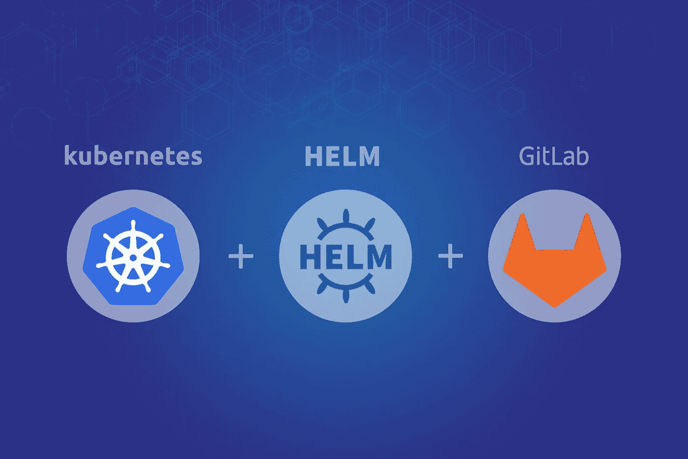
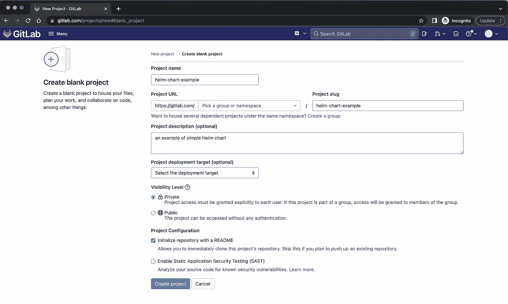
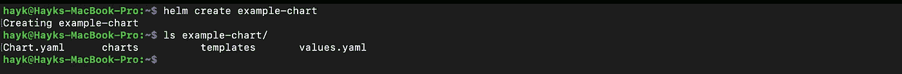
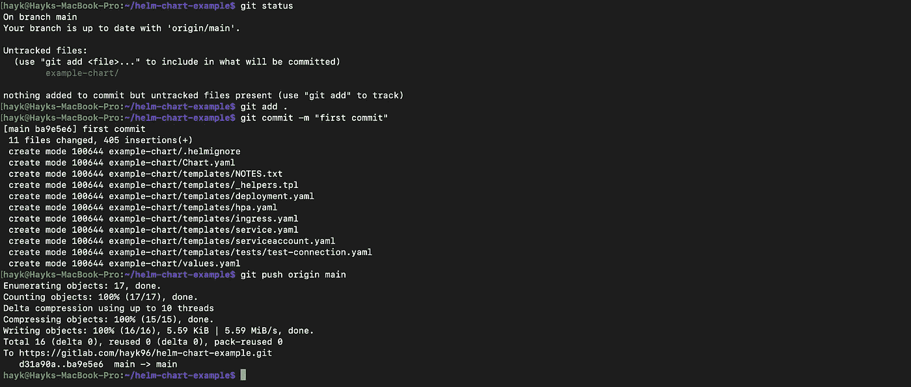
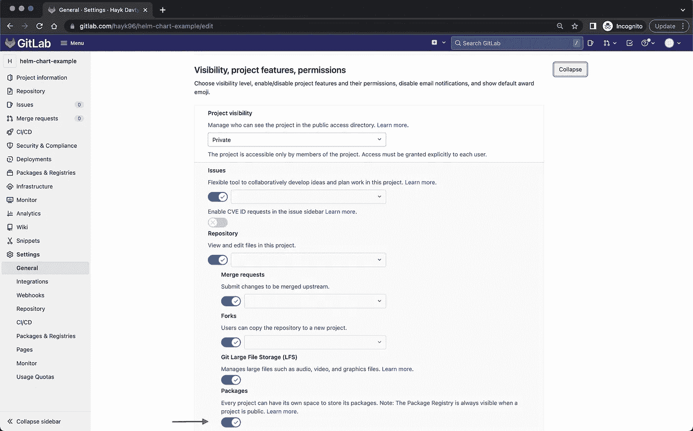
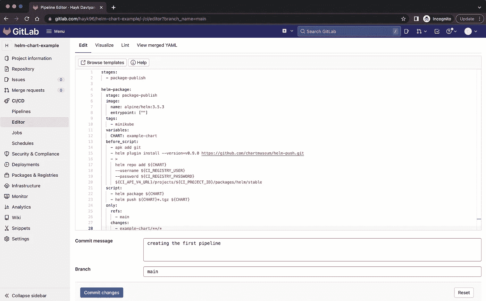
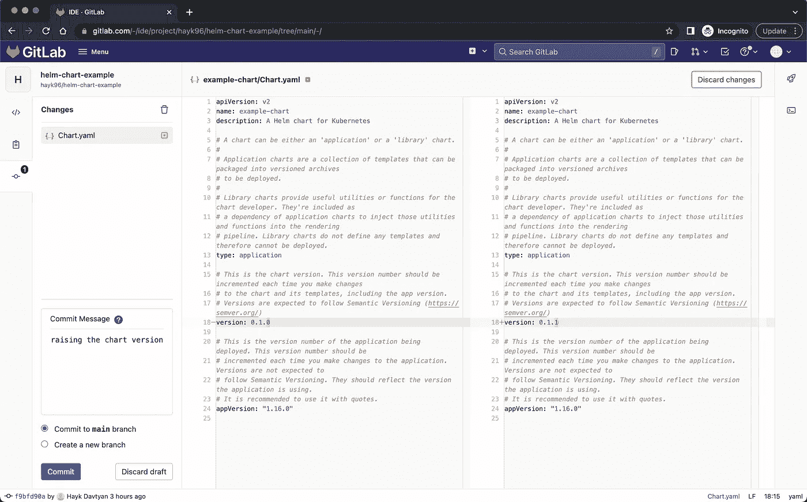
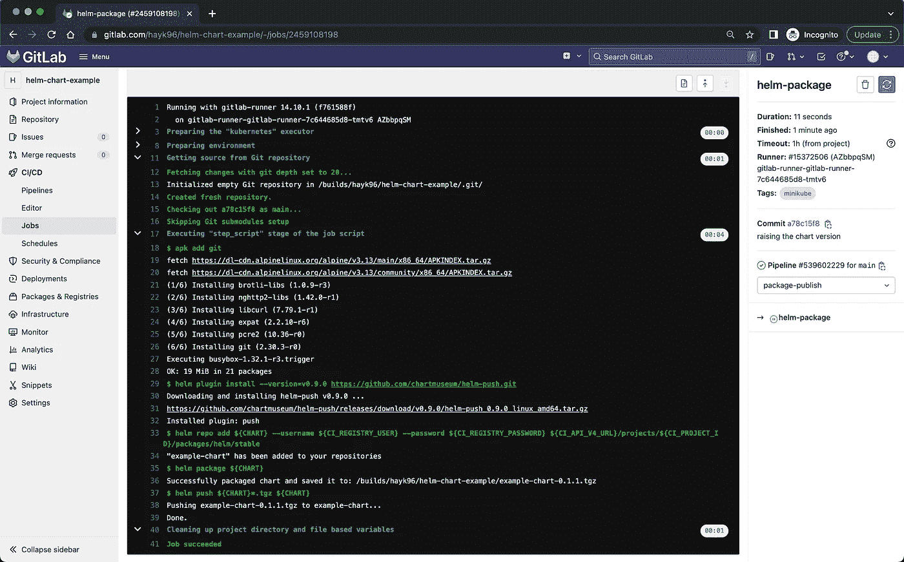
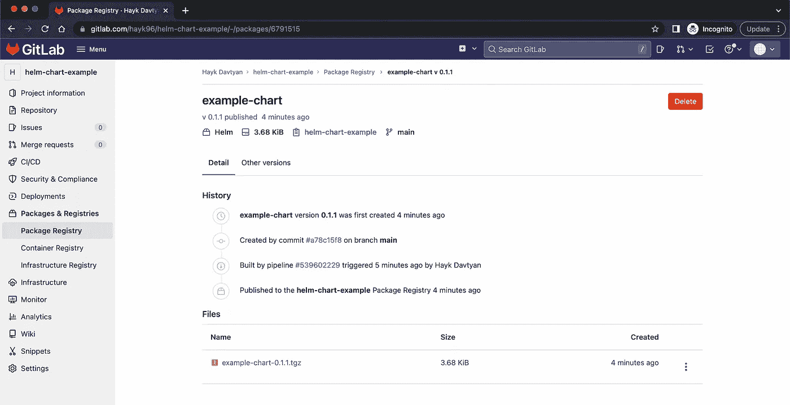

# 使用 GitLab 作为舵图注册表

> 原文：<https://betterprogramming.pub/using-gitlab-as-helm-chart-registry-ab4d4ef42833>

## 编码、构建和部署！



图片来自 miro.medium.com

从 GitLab [14.1](https://about.gitlab.com/releases/2021/07/22/gitlab-14-1-released/) 开始，包注册表允许用户构建、发布、安装和共享舵图。

# 什么是舵图？

[Helm](https://helm.sh/) 使用一种叫做图表的打包格式。图表是描述一组相关 Kubernetes 资源的文件集合。一个图表可以用来部署简单的东西，比如 memcached pod，或者复杂的东西，比如带有 HTTP 服务器、数据库、缓存等的完整 web 应用程序堆栈。

## **创建简单的舵图**

在这个故事中，我们将创建一个舵图，将其推送到 GitLab 项目中，打包，并发布到 GitLab 包注册表中。

首先，我们需要在 GitLab 上创建一个项目，在那里我们将存储图表的模板。



创建私有项目

当我们在 GitLab 上创建项目时，让我们通过执行以下命令在本地计算机上创建一个简单的舵图:

```
$ helm create example-chart
```

*确保你的电脑上已经安装了 Helm。否则，该命令不会执行。*

`helm create`创建一个图表目录以及图表中使用的公共文件和目录。



创建简单的舵图

`ls`命令的输出显示已经创建了必要的文件，我们只需要将它们推送到 GitLab 上的`helm-chart-example`项目。



将文件推送到 GitLab

一旦文件被成功推送，我们需要将目录打包成一个舵图，存储在包注册表中。此时可以通过你电脑上的`helm package`命令实现，也可以用 GitLab 提供的 CI 管道实现。我建议用 GitLab CI 打包并推送你的舵图，而不是通过你电脑上的命令行。

## **在 GitLab 上创建 CI 管道**

在创建管道之前，请确保在项目的“设置”→“常规”→“可见性”、“项目功能”、“权限”选项卡中启用了“包”按钮，如下所示:



GitLab 上的项目设置

最有趣的部分在这里！现在，我们将在 GitLab 上创建一个管道，用于打包和发布我们的舵图。从项目的 CI/CD→编辑器部分很容易做到。如果你不熟悉 GitLab CI/CD，你可以在这里查看入门指南。

管道看起来会像这样:



在 GitLab 上创建管道

这里显示了管道的代码。让我们一行一行地去理解它。

。gitlab-ci.yml

在文件的顶部，我们定义了名为`package-publish`的阶段名，我们将在`helm-package`作业中使用它。`tags`关键字负责 [gitlab-runners](https://docs.gitlab.com/runner/) 。因为我在我的 minikube 环境中使用了一个自托管的 gitlab-runner，所以我将在这个项目中使用该 runner 的相应标记。

**请注意，您应该在管道中使用其他标记。*

正如你所注意到的，有一个`CHART`变量，它的值与我们创建的舵图表名称相同。该变量只是为了方便起见，以避免在代码中多次使用同一个名称。

在`before_script`部分，我们安装了一些依赖项，比如 git 和 helm-push 插件。下一个重要部分是通过`helm repo add`命令与注册中心进行认证，该命令将在 gitlab-runner 的 shell 中添加 Helm 存储库。`CI_REGISTRY_USER`、`CI_REGISTRY_PASSWORD`、`CI_API_V4_URL`和`CI_PROJECT_ID`变量是 GitLab 的 CI/CD 特定变量。

*   `CI_REGISTRY_USER` —将容器/图表推送到项目的 GitLab 容器/包注册表的用户名。仅当项目启用了容器/包注册表时才可用。
*   `CI_REGISTRY_PASSWORD` —将容器/舵图推送到项目的 GitLab 容器/包注册表的密码。仅当项目启用了容器/包注册表时才可用。
*   `CI_API_V4_URL`—git lab API v4 根 URL。
*   `CI_PROJECT_ID` —当前项目的 ID。这个 ID 在 GitLab 实例的所有项目中是唯一的。

你可以在这里找到关于 GitLab CI/CD 预定义变量的更多信息。

我们在脚本部分只做两个动作:打包和推送。这两个动作将通过舵手的适当命令来完成。`helm package`命令将图表打包成版本化图表存档文件，而`helm push`命令将图表上传到注册表。

最后一部分是关于 GitLab 作业何时触发。`only.refs`关键字意味着在任何提交到主分支的情况下都会创建作业。`only.changes`关键字表示当示例图表目录中的文件发生任何变化时，作业将被创建并自动运行。

既然我们已经讨论了所有的细节，是时候运行我们的管道了。为了触发管道，我们只需要更改 example-chart 目录中的任何文件。



提升图表版本

成功提交更改后，我们可以跳转到 CI/CD 选项卡，查看作业的状态。



触发的工作头盔包

最后，让我们来看看舵图，它已经被推送到 0.1.1 版本下的包注册表中。



示例-存储在 GitLab 包注册表中的图表

# **结论**

现在你知道如何使用 GitLab 包注册表作为一个舵图表注册表；它允许您存储、发布和使用 Kubernetes 清单旁边的图表。

快乐驾驶！

感谢阅读。我希望这个故事是有帮助的。如果你有兴趣，可以看看[我的其他媒体文章](https://hayk96.medium.com/)。