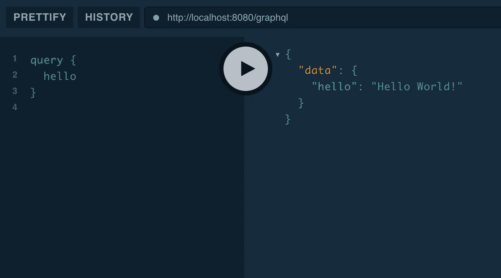
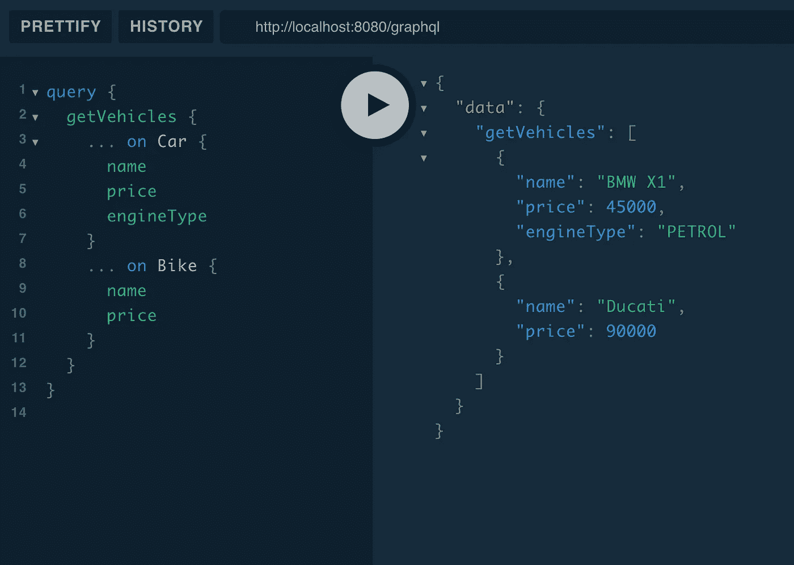

# 通过 Spring Boot 使用 GraphQL:接口和联合

> 原文：<https://betterprogramming.pub/using-graphql-with-spring-boot-interfaces-and-unions-a76f62d62867>

## GraphQL 的接口和联合提供了一种在查询中处理多种字段类型的好方法

带有 Spring Boot 的 GraphQL 插图

# 首先

我将从概念的解释开始，然后我们将与 Spring Boot 和科特林一起研究它的实现。

考虑下面的数据类和接口。

现在我们要写一个 GraphQL 模式，它模拟相同的接口和类。我们将有一个获取`Profile`的查询，它将根据客户端在单个查询中的需求给出一个 `User`或`Company`。

在我们的 GraphQL 模式中，当使用接口时，我们将添加以下内容。

我们也可以用`Union`代替`Interface`。

## 我们应该使用哪一个？

它可以根据使用案例和您的最终目标而变化。以下几点可用于最终确定选项。

*   将共享字段分组到接口中并不总是有利的——这取决于用例
*   当类型在使用方式上有基本的共性时，接口是很好的选择
*   联合有利于记录和迫使客户理解不同的类型应该如何处理

# 与 Spring Boot 一起实施

## 1.设置

如果你知道如何用 GraphQL 建立一个 Spring Boot 项目，你可以跳到第三部分。此外，代码可以在[这里](https://github.com/maniish-jaiin/graphql-interfaces-unions)找到。

否则，转到[https://start.spring.io/](https://start.spring.io/)。

选择一个`Gradle`项目，将语言设置为`Kotlin`。

对于最低限度的实现，您不必选择任何依赖项。

下载 ZIP 文件，并在您喜欢的 IDE 中打开它。

跳到`build.gradle.kts`，并添加:

这些是您开始使用第一个端点所需的 GraphQL 库。

## 2.第一个端点

在`resources`目录中创建一个名为`schema.graphqls`的文件。

添加以下几行:

然后创建一个`resolver`类，当客户端触发查询时，该类实际上可以做一些事情。

就是这样。

使用`./gradlew bootRun`运行服务器。

进入浏览器，打开`http://localhost:8080/playground`。 [Playground](https://www.apollographql.com/docs/apollo-server/testing/graphql-playground/) 是用作 GraphQL APIs 客户端的开发工具之一。

这将是您触发查询时的输出。

操场上的质疑和回应

就是这样。

## 3.接口实现

让我们从改变模式开始。在您的`schema.graphqls`文件中，添加以下代码。

现在添加一些 Kotlin 类和接口来匹配模式实体。

在这个映射之后，我们可以开始创建当`getIVehicles`查询被触发时获取`IVehicle`数据的服务。

你需要创建`Resolver`和`Service`。

就是这样。

您已经成功地创建了一个端点，它可以用同一个查询获取汽车和自行车数据。多酷啊。

您可以运行这个查询来获取数据。

操场上的问答

等一下！我忘了一些东西。

在这真正起作用之前，你还需要做一件事。

您需要将这些接口类型添加到 GraphQL 的模式解析器字典中。

方法是添加以下代码。

这是必须的，因为库中有一个问题，这些类型的自动发现不能工作，除非你明确地把它。

你可以在这里找到问题。

就是这样。

# 结论

我没有在这里添加`Union`的实现，因为它与接口的实现非常相似。不要担心:如果你感兴趣，你可以在这里找到实现。

我很高兴你坚持到了最后。这意味着您对实现 GraphQL 感兴趣。下面是另一篇[文章](https://levelup.gitconnected.com/6-months-of-using-graphql-faa0fb68b4af)，分享我使用 GraphQL 六个月的经验。