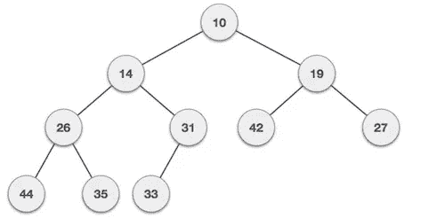
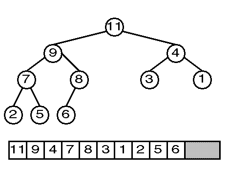

# 在 Go 中使用堆来提高代码性能

> 原文：<https://betterprogramming.pub/using-heaps-to-speed-up-code-performance-in-go-b17ab07d2d5f>

## 快速示例引导介绍


照片由[大卫·坎特利](https://unsplash.com/@cant89?utm_source=medium&utm_medium=referral)在 [Unsplash](https://unsplash.com?utm_source=medium&utm_medium=referral) 上拍摄

二进制堆是一种特殊的基于树的数据结构，在某些情况下被证明是有用的，比如使用一组数字中的最低/最高值进行重复计算。在本文中，我们将通过一个(我希望)易于理解的例子来更深入地了解堆。



最小二进制堆示例。每个节点的值应该低于其子节点的值。

# 背景故事

我经常尝试解决一些编程练习，以保持我的编程技能，并学习可以添加到我的开发人员工具包中的新东西。几周前，我发现[这个有趣的挑战](https://www.hackerrank.com/challenges/jesse-and-cookies/problem)是在 HackerRank 平台上提出的。这个问题，简单地描述没有隐喻，可以陈述如下:

> 给定一个由`*N*`个整数组成的集合和一个整数`*K*`，计算直到集合中的每个整数都≥ K 需要执行的迭代次数，在每次迭代中，集合由于应用以下运算而收缩:取两个最低的整数，计算它们的替换为`*minInteger + 2*secondMinInteger*`。如果条件永远不能满足，那么结果应该是`*-1*`。

我尝试了第一种定制方法，它似乎工作正常，但是由于性能问题而失败了。通常，该平台提出的测试用例不仅检查您的代码是否适用于特定的输入集，还确保它在提供大量输入时满足特定的执行时间限制。我的解决方案对所有的情况都是正确的，但是花了很长时间来完成其中的一些。

我在我的解决方案中尝试了一些自定义优化，得到了一个可接受的最终版本，但也不起作用。放弃后，我去了评论区，发现大多数 dev 都建议使用堆数据结构。我采用了堆方法并进行了尝试，100%成功地通过了所有的测试用例。不满足于此，我研究了为什么基于堆的方法如此优越。

在整篇文章中，我将分享我的方法和基于堆的方法，比较它们以突出性能差异，并展示一些我自己做的帮助我理解堆的力量的实验。

# 第一种方法:没有堆的定制解决方案

在这里，我分享了我第一个不使用堆的解决方案。我写的算法差不多是这样的:

1.  按升序对所有整数进行排序
2.  取出最低和第二低的整数，计算新的整数
3.  在集合中找到最适合插入新整数的位置(记住它已经排序了)，然后插入
4.  从 2 到 3 重复，直到集合中的第一个整数≥ *K* (这意味着所有项目都满足这个条件，因为它总是被排序)

我在 Go 编程语言中的实现如下:

没有堆的定制解决方案方法

# 使用最小堆是更好的解决方案

首先，如果您不熟悉术语堆或二进制堆，这里的[是一个简单的资源，您可以在同一个页面上查看所有内容。现在，通过使用堆，算法变得更加简单:](https://www.geeksforgeeks.org/heap-data-structure/)

1.  初始化堆
2.  从堆中取出最低和第二低的整数，然后将新的整数压入堆中
3.  重复步骤 2，直到最小整数≥ *K*

同样，这是我为此编写的 Go 代码:

基于堆的问题解决方案

这段代码使用了`pro_heap.MinHeap`数据类型，这是 Go 中的一个`heap.Interface`实现，定义如下:

围棋堆。Go 的堆包函数所需的接口实现

# 算法比较:时间复杂度和执行结果

为了检查为什么基于堆的解决方案似乎比我的快得多，我做了一些性能实验来比较两者。

## 实验时间！

首先，我生成了一堆样本(这里是整数集合)，作为每个算法的输入。我尝试了不同的`N`值(这里是整数集合的大小)，包括 1k、10k、100k 和 1M，但是使用了相同的`K`值 700。属于集合的每个整数都是在(0，1000)范围内随机生成的数字。

创建示例后，我对每个版本的解决方案运行了五次，并记录了它的总执行时间。以下是我得到的结果:

算法执行时间比较

如您所见，集合越大，我们的执行时间就越长，两种解决方案之间的执行时间差就越大。但是是什么造成了如此显著的差异呢？

# 基于堆的方法:低级分析

我在上面分享的片段显示了两种方法的时间复杂度计算，在每一行相关的代码上都使用了 big-O 符号。因此，您可以看到我的定制解决方案的时间复杂度为 O(n)，而基于堆的解决方案的时间复杂度为 O(n)。

更何况 O(n)的时间复杂度大多由堆初始化指令决定:`heap.Init(h)`。O(n)来自堆包文档，但我很确定在幕后，它是一个完全优化的函数，很难达到 O(n)行为。此外，查看实验样本，每个整数都在(0，1000)范围内，所以当`N ≥ 1000`时，我们将有重复的值。

当然，Go 在其堆函数中实现了某些优化，以高效地处理重复值的集合，正如它在`sort.Slice`函数中通过 [pdqsort](https://itnext.io/gos-new-sorting-algorithm-pdqsort-822053d7801b) 策略所做的那样。

如果忽略`heap.Init(h)`语句，我们看到基于堆的算法的时间复杂度变成 O(log n)，比 O(n)快很多。这与堆如何工作以及如何使用普通数组实现它们有很大关系。让我们来看看下图:



因为有一个公式可以很容易地确定每个节点的父节点、左子节点和右子节点，所以堆可以在一个数组中表示，而不需要链表或指针。

假设我们需要检索集合中最高的整数，我们知道在 0 索引中是一个直接访问操作。现在，假设我们需要将数字 12 添加到这个最大堆中。我们将开始向 8 追加一个孩子。然后我们会把 8 和 12，9 和 12，最后是 11 和 12 对调。我们只需要三次比较和切换操作就可以添加新的条目。如果我们根据要在数组中遍历的索引来查看这些操作，我们会得到这样的结果:

```
-> Added new item in index 10 (added number 12 as child of 8)
-> Compare and switch with index 4 (switch 8 with 12)
-> Compare and switch with index 1(switch 9 with 12)
-> Compare and switch with index 0(switch 11 with 12)
```

我们从索引 1 到索引 4 跳过了两个索引，从索引 4 到索引 10，我们跳过了五个索引。这就是堆的神奇之处:由于跳过索引进行比较和切换，遍历集合的速度总是快得多。此外，集合越大，要遍历的索引之间的间隔就越大。

# 最后的想法

毫无疑问，对于需要遍历集合的最高或最低值的特定场景，堆非常方便。然而，它们可能不适合许多其他人。始终要特别注意您的环境和需求，并问问自己，使用基于堆的方法是否更好。

Go 的堆实现看起来更快，性能更好，但是对于其他技术和提供者来说可能不是这样。仔细浏览该库的文档，并做一些概念验证来评估它们的性能。

希望本文不仅让您对堆及其常见的用例场景有了一个很好的了解。我希望它也鼓励你学习和研究编程中存在的不同的数据结构，这些数据结构是为解决类似这样的特定问题而设计的。

数组和集合是好的，但是了解高级数据结构和它们的用法可以帮助你在工作中有所作为，并且肯定会改进你公司的产品。

目前就这些。非常感谢您的阅读。

保持联系，进行更多类似的实验！