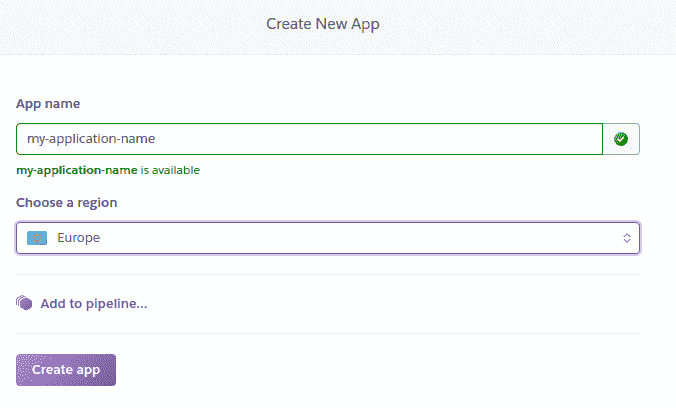
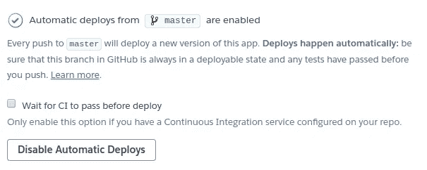

# 使用 Heroku 部署 Angular 应用程序

> 原文：<https://betterprogramming.pub/using-heroku-to-deploy-an-angular-app-5be838ef1de7>

## 使部署变得顺畅和容易


伊恩·施耐德在 [Unsplash](https://unsplash.com?utm_source=medium&utm_medium=referral) 上拍摄的照片

一个好的程序员有时喜欢牺牲几个晚上的空闲时间来熟悉他们从未接触过的技术。它经常在那里停止，因为他们有一个忙碌的工作，孩子，或一个有趣的爱好。他们不想再花一个晚上来部署他们的应用程序，因为他们可以散散步或喝一品脱啤酒。但是，向外界展示你的作品是非常重要的。

查德·福勒的书《激情程序员[强调了这一点。这本书把我们带回到这个哲学问题上:“如果一个苹果从树上掉到森林里，而没有人能感知它，那么这个苹果掉了吗？”答案似乎只有一个逻辑答案:“是的，当然！”但是苹果有没有掉下来并不重要；对外界没有影响。如果一个程序员不能向外界展示他们的新体验，他们可能会以不同的方式度过晚上——没有人会醒着躺着。正是通过与世界分享这种经验，才创造了“价值”。](https://www.amazon.com/Passionate-Programmer-Remarkable-Development-Pragmatic-ebook/dp/B00AYQNR5U)

所以我们来到了这里。我是一名 26 岁的程序员，我想创建一个有棱角的网站，用最新的框架向外界展示它们。本文将向您展示如何使用 Heroku 部署 Angular 应用程序。这不是教你有角度的教程。本教程将向您展示以下内容:

*   创建角度应用程序
*   在 Heroku 上自动部署
*   如何部署 Angular app

# 创建角度应用程序

您可以使用 Angular CLI 通过执行以下命令来生成新项目:

```
**ng new** <my-application-name>
```

为了确保一切顺利，请执行以下操作:

```
**cd** helloworld
**ng serve**
```

不得不提的是，我也是 GitLab 的忠实粉丝，可惜目前还没有和 Heroku 的整合。然而，GitHub 在某些方面正在赶上 GitLab(例如，通过使私有库免费)。

您的应用程序就在那里，并且在本地工作。我们把这个推给 GitHub 吧。在 GitHub 上创建一个新的存储库，并打开您的终端。禁用以下行:

```
**git remote add origin** <github_repository_url>
**git add** .
**git commit -m** “Creation of the new application <my-application-name>”
**git push -u origin master**
```

我不是直推大师分支的粉丝，但这只是一个教程。如果您想正确地这样做，请确保创建一个分支并合并。恭喜你！你设法把你的代码推送到 GitHub。

# GitHub 自动部署

为了实现自动部署，我们首先需要创建一个 Heroku 帐户。完成后，我们可以添加一个新的应用程序。按下新建按钮。给应用起个名字 *<我的应用名字>* ，选择一个地区，按创建 app。



在“部署”菜单的“部署方法”下，选择 GitHub。使用存储库搜索字段将您的存储库连接到正确的存储库。此外，启用自动部署。这样，主分支将自动部署。您应该会看到类似下面的内容:



自动部署 Heroku

还没有部署任何东西，因为自从我们打开自动部署后，还没有推送任何东西。在手动部署下，单击一次部署分支。这将触发第一次部署。

# 如何部署 Angular App？

在 package.json 中的“scripts”下，添加一个后期构建脚本。

```
"heroku-postbuild": "ng build --aot --prod"
```

还要在依赖项中添加 angular/compiler、angular/compiler-cli、angular/cli、typescript 和 express。您最终的 package.json 可能看起来有点像我的:

```
{
  "name": "website",
  "version": "0.0.0",
  "license": "MIT",
  "scripts": {
    "ng": "ng",
    "start": "node server.js",
    "build": "ng build",
    "test": "ng test",
    "lint": "ng lint",
    "e2e": "ng e2e",
    "heroku-postbuild": "ng build --aot -prod"
  },
  "private": true,
  "dependencies": {
    "@angular/animations": "^8.2.0",
    "@angular/common": "^8.2.0",
    "@angular/compiler": "^8.2.0",
    "@angular/compiler-cli": "8.2.0",
    "@angular/cli": "8.2.0",
    "@angular/core": "^8.2.0",
    "@angular/forms": "^8.2.0",
    "@angular/platform-browser": "^8.2.0",
    "@angular/platform-browser-dynamic": "^8.2.0",
    "@angular/router": "^8.2.0",
    "core-js": "^2.6.9",
    "express": "^4.17.1",
    "rxjs": "^6.5.2",
    "typescript": "~3.5.3",
    "zone.js": "~0.9.1"
  },
  "devDependencies": {
    "@angular/language-service": "8.2.0",
    "@types/jasmine": "~2.8.8",
    "@types/jasminewd2": "~2.0.3",
    "@types/node": "~8.9.4",
    "codelyzer": "~4.5.0",
    "jasmine-core": "~2.99.1",
    "jasmine-spec-reporter": "~4.2.1",
    "karma": "~4.0.0",
    "karma-chrome-launcher": "~2.2.0",
    "karma-coverage-istanbul-reporter": "~2.0.1",
    "karma-jasmine": "~1.1.2",
    "karma-jasmine-html-reporter": "^0.2.2",
    "protractor": "~5.4.0",
    "ts-node": "~7.0.0",
    "tslint": "~5.11.0"
  },
  "engines": {
    "node": "10.15.3",
    "npm": "6.9.0"
  }
}
```

这告诉 Heroku 如何构建应用程序。这将触发构建，创建一个包含所有 HTML 和 JavaScript 代码的静态 dist 文件夹。我们唯一能做的就是提供一种启动应用程序的方法。我们需要一个服务器来启动应用程序。我们为此使用节点。将下面一行添加到“脚本:”

```
"start": "node server.js",
```

您还需要添加节点和 NPM 引擎，以便节点可以启动应用程序。要获得当前的正确版本，您需要执行以下命令 node -v 和 npm -v。

```
“engines”: { 
  “node”: “10.15.3”,
  “npm”: “6.9.0”
},
```

最后，我们还需要一个节点服务器。为此，我们首先需要安装 Express:

```
npm install express path –save
```

然后添加一个具有类似内容的 server.js 文件，并用您的名称替换该应用程序名称:

```
// Install express server 
const express = require('express');
const path = require('path');
const app = express();// Serve only the static files form the dist directoryapp.use(express.static(__dirname + '/dist/website'));
app.get('/*', function(req, res) {
  res.sendFile(path.join(__dirname + '/dist/website/index.html'));
});// Start the app by listening on the default Heroku portapp.listen(process.env.PORT || 8080);
```

让我们把这些变化推给 GitHub。

```
git add .
git commit -m “Updates to make application go live”
git push
```

现在让我来指导你。你的代码会被推送到 GitHub。Heroku 监听这些更改，并在将新代码推送到存储库后立即检索它。它安装应用程序，构建应用程序，并执行安装后脚本。Node Express 服务器启动并显示您的应用程序。不久之后，您的应用程序将在一个静态 URL 上可用，比如 https://dj-website.herokuapp.com 的，您的应用程序将变得可用。就这样，我们开始直播了！我们可以断定，最终，苹果已经落下。

最后几个额外的提示:

*   为爱好版付费可以让你的网站脱离睡眠模式。
*   通过定期咨询网站，你也可以让你的网站保持睡眠模式(直到你用完所谓的 dyno 小时)。
*   Heroku 还支持 Spring Boot 和许多其他技术。你应该试一试——它对我来说是现成的。