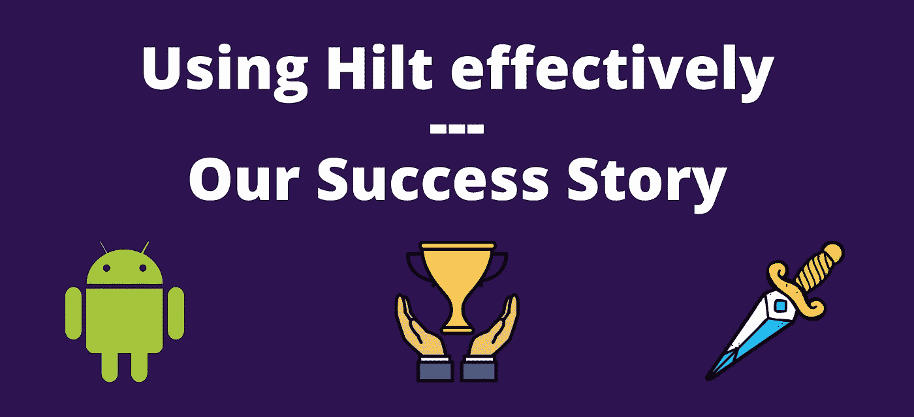
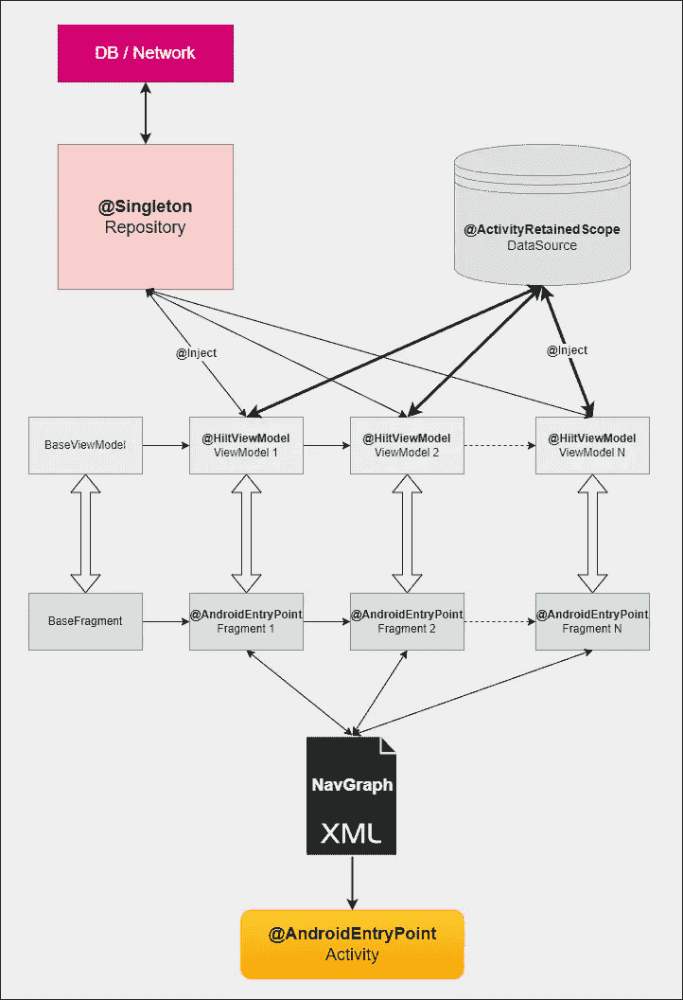

# 如何使用 Hilt 在 Android 中建立一个稳固的架构

> 原文：<https://betterprogramming.pub/using-hilt-at-its-full-potential-our-success-story-be4445ef799d>

## 充分发挥 Hilt 框架的潜力——我们的成功故事！

想要构建一个完整的端到端特性流，具有适当的状态管理，同时还能经受住配置更改，当然，还要赶走所有的错误？下面是 Hilt 如何帮助我们创建最适合这个用例的架构…

# **出了什么问题？**

几个月前，当我们最初开发一个全新的特性时，我们使用了单一活动+导航图，以及仅仅一个`ViewModel`来控制整个流程。

这背后的思想过程是为数据和数据处理提供一个中心位置，但是我们没有预见到端到端流程日益增长的复杂性！

结果，这种单片架构导致数据和逻辑处理被集中到一个大`ViewModel`中，单个文件中有超过 2k+行代码！

代码库很快变成了一个非常稳定的版本，导致了大量的 bug，大量的生产问题，以及在配置更改中的大混乱！让这种流动变得更好的想法在我们的脑海里徘徊了很长时间…

几个月过去了，一个需求来增强这个特性，来覆盖更多的用例以及所有可能的流程。该功能只能大幅扩展。我们决定抓住这个机会，重构我们的代码，使它更易于维护，错误更少，并且在所有配置更改的情况下也是一个真正的幸存者！

# 我们做了什么？

我们分析了 Android 开发的最新趋势，这个场景中的几个设计模式，想出了自己的 mods，在依赖注入框架 **Hilt** 的帮助下，形成一个新的合适的架构。

下图显示了我们遵循的总体架构:

# 使用的组件？

1.  视图绑定
2.  依赖注入的句柄
3.  导航图+单一活动原则
4.  `ViewModels`针对幸存配置+逻辑处理
5.  数据 I/O 操作的存储库模式(机房+改造)
6.  Hilt 提供了一个活动范围的数据容器实例
7.  用于异步任务的 Kotlin 协程
8.  输入表单验证的 Kotlin 流程

# 优点？

1.  将整体架构分解成更容易单独管理和维护的小部分
2.  拥有独立的数据供应商(`Repository`)、数据持有者(数据源)和数据处理器(`ViewModel`)有助于实现更清晰的代码，因为它有效地遵循了关注点分离范式
3.  直接从`ViewModels`控制导航，使导航状态更容易管理，同时保持高测试性
4.  从视图模型中的一个公共点控制进度指示器、Toast 消息、资源和一些常规交互，使状态管理和测试更容易
5.  与 Kotlin 协同程序+流 API 的完全互操作性，产生干净、简洁且完全可测试的异步代码，错误更少
6.  逻辑处理+状态管理从`ViewModels`开始发生，因此幸存的配置更改是一件轻而易举的事情！
7.  [附加]使用数据绑定和这个架构将进一步减少一些来自片段和活动的代码行
8.  [附加]完全支持 Jetpack Compose，因为只需将布局更改为 Composables，就可以保留底层架构

# 给我看看代码

整个架构的基本组件是`BaseViewModel`、`BaseFragment`和`DataSource`类，它们几乎控制了整个架构！

`BaseViewModel`的代码如下:

`BaseViewModel`这里控制整个流程中使用的几乎所有常规活动，包括片段到片段的导航(使用默认的导航参数，因此导航图 XML 不那么混乱)，显示/隐藏进度对话框(加载器)，显示相关的祝酒词，等等。

`ViewModels`可以继承这个`BaseViewModel`来直接使用所有的功能！

`BaseFragment`的代码是:

功能中所有片段的基类，由导航图连接。它特别支持`ViewBinding`和我们心爱的`BaseViewModel`，同时观察`BaseViewModel`发出的常见实况数据。

由于使用了`ViewBinding`,视图的创建和销毁可以很容易地在这个片段中通用化，所以子片段不必去管它！(它也可以在没有`ViewBinding`的情况下使用，在这种情况下，构造函数需要一点调整)

请注意，这个基础片段包含了一个抽象实例`BaseViewModel`，每个片段都可以自己决定提供什么！(所以，如果一些片段仍然想要共享 ViewModel，这是可能的)

`DataSource`的代码:

我们特性的核心，数据容器类，或者说数据源(灵感来自于 clean architecture)是一个特殊的由 Hilt 提供的类，它保存了整个流程中收集的数据和状态变量！

这个班的特长是`@ActivityRetainedScope`注解！这意味着，所有注入了依赖关系的成员，只要他们生活在同一个活动实例中，就会收到相同的依赖关系实例。

这本来可以通过创建一个`Singleton`类来实现，但是通过在流完全终止后清除不需要的状态，Hilt 进一步帮助减少了内存的使用！

这样，在相同的流在其他地方被重用的情况下，可以避免状态损坏。hilt 还有助于在配置变化时提供相同的实例，因此状态总是以稳定的方式存储。

# **示例用法**

这里有一个`FragmentTwo` 的用例，继承自`BaseFragment`，在`setupUI()`方法中完成所有的 UI 处理，同时在单独的专用方法`setupVM()`中负责`ViewModel`活动。

注意，视图的创建和处理不是由单个片段处理的，而是由`BaseFragment`本身管理的！如此少的代码，关注点被适当地分离。

还有一点，既然我们允许片段自己管理`ViewModel`实例的创建，我们可以直接使用`by` `viewModels()`扩展来实现这个目的！如果某个片段仍想与其他片段共享`ViewModel`，也可以根据需要使用`by navGraphViewModels()`或`by activityViewModels()`函数。

下面给出的是与我们的`FragmentTwo`结合使用的`ViewModelTwo`:

`ViewModelTwo`协助我们的`FragmentTwo`应对配置变更，并处理和验证来自配置变更的事件/数据！

当在编辑文本中输入一个值时，它被传递到 ViewModel 上进行存储和验证，并且向片段公开一个流，片段用于进一步控制状态，例如继续按钮的启用或编辑文本的错误可见性。

单击该按钮，输入的值被存储在我们的数据存储中，这是在 Hilt 的帮助下注入的，相同的值可以被下一个出现的流入使用，因为数据源实例对于任何注入的组件都是相同的。

最后，根据输入的值，视图模型将负责导航。从单元测试的角度来看，所有这些代码都是完全可测试的，从而导致更高的代码覆盖率和更少的错误！

你可以查看完整的代码库，这是一个使用我构建的架构的完整的应用程序:[https://github.com/dkexception/architecture-with-hilt](https://github.com/dkexception/architecture-with-hilt)

# 摘要

将 Hilt 有效地与其他 Android 组件结合使用，帮助我们及时开发高质量的特性。

开发优秀应用程序的秘诀是遵循一些核心原则和标准指南。这种架构解决了许多与 Android 应用程序相关的常见问题，非常适合基于流程的特性开发。

你觉得这个建筑怎么样？你想进一步改进它吗？有什么你担心的吗？请在评论中让我知道！

特别感谢 [Rahul](https://medium.com/u/717811cd866a?source=post_page-----be4445ef799d--------------------------------) 提出数据源的想法，并在整个流程开发中始终支持它！