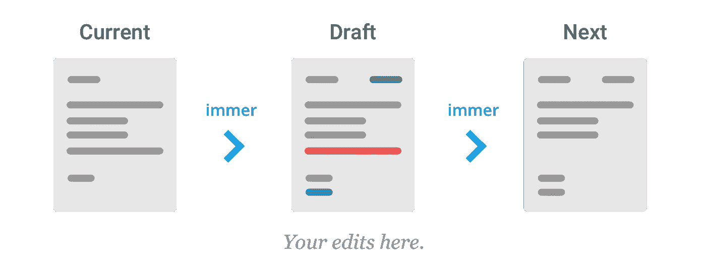
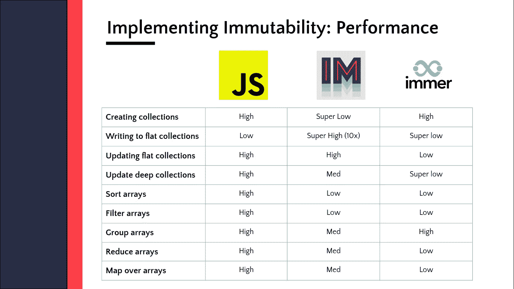

# 利用 Immer 优化 Redux 减速器

> 原文：<https://betterprogramming.pub/using-immer-to-optimise-redux-reducer-3590bd2f5223>

## 了解 immer 如何在我的组织中帮助我们优化 redux reducer 文件代码


克拉克·蒂布斯在 [Unsplash](https://unsplash.com?utm_source=medium&utm_medium=referral) 上拍摄的照片

我们将在本帖中讨论以下主题:

*   immer 简介
*   我们代码库和实现中的 immer 用例
*   我们应该如何以及何时使用 immer
*   immer 的优势

# **Immer 简介**

Immer 是一个很小的包，允许你以更方便的方式使用`immutable`状态。Immer 可以用在任何我们想要实现不变性的环境中。例如与反应状态、反应或还原还原器或配置管理相结合。
单词`immutable`的意思是不随时间变化或者不能改变。Javascript 对象本质上是`mutable`，但是使用 immer 我们可以实现`immutability`。让我们通过一个例子来理解这一点

在上面的例子中，我们使用了一个由 immer 公开的`produce`方法。产生的语法是:

```
produce(baseState, recipe: (draftState) => void): nextState
```

`produce`接受一个基本状态，以及一个可用于在传入的`draft`上执行所有期望的突变的配方。

关于 Immer 有趣的事情是`baseState`将保持不变，但是`nextState`将反映对`draftState`的所有更改。因此，我们有了一个全新的状态，即`nextState`，并且`baseState`对此没有任何依赖性。

# **Immer 在我们的代码库和实现中的用例**

我们正在使用 immer `produce`方法来优化 reducer 文件代码。让我们用一个代码片段来检查一下没有 immer 是什么问题:

因此，这里我们有一个名为`UPDATE_STREETNO_VISIBILITY`的缩减器，用于更新`streetno`的可见性。问题出在`showStreetNo`上，它深深地嵌套在响应对象中，这里是`result`。为了检索这个值，我们必须多次使用 spread 操作符——这看起来不太好。

在 JavaScript 中，对象是可变的——直接在引用上更新状态对象的属性不会改变整个对象。

因此，通常建议总是从 reducer 返回一个新的状态对象。

我们可以使用 immer 实现不变性，这也有助于优化代码。

让我们来看看代码片段:

让我们实现`withProduce`方法:

正如我们所见，我们有一个`withProduce`方法，当用`draftState`分派一个动作时，它调用`reducer`。
produce 函数接收一个参数，即`draft`，它是您传入的当前状态的代理。您对草稿所做的任何修改都将被记录下来并用于制作`nextState`。在此过程中，`currentState` 将保持不变。

我们已经优化了`UPDATE_STREETNO_VISIBILITY` reducer 中的代码，因为不需要创建新的状态对象，也不需要维护 spread 操作符的引用。

只需用点运算符访问状态并更新值。
Immer produce 完成所有工作，如维护参考和更新值。



immer 的工作

# **我们应该如何以及何时使用 Immer**

当我们在一个 reducer 文件中有复杂的状态并且不容易处理时，应该使用 Immer。

Immer 能够使用 React 挂钩。Immer 使用一个名为`use-immer`的附加库来实现这个功能。

这给我提供了像 useImmer 和 useImmerReducer 这样的钩子。您可以在这里找到它:

[](https://github.com/immerjs/use-immer) [## GitHub - immerjs/use-immer:使用 immer 驱动带有 React 钩子的状态

### 一个钩子使用 immer 作为一个反应钩子来操作状态。npm 安装 immer use-immer use immer(initial state)非常…

github.com](https://github.com/immerjs/use-immer) 

你可以在这里查看更多关于 immer hooks 的例子

# **Immer 的好处**

*   样板缩减。噪音更少，代码更简洁。
*   小:3kb 压缩
*   深度更新轻而易举
*   遵循不可变的数据范式，同时使用普通的 JavaScript 对象、数组、集合和映射。无需学习新的 API 或“突变模式”!
*   与 ImmutableJS 等其他库相比，immer 的性能更高



图片来自[乔希](https://joshsoftware.files.wordpress.com/2021/05/fe1b0-10ta3kozemivnf5hhme7wpq.png)

# **参考文献**

*   【https://immerjs.github.io/immer/】
*   [https://medium . com/hacker noon/introducing-immer-immut ability-the-easy-way-9d 73 D8 f 71 CB 3](https://medium.com/hackernoon/introducing-immer-immutability-the-easy-way-9d73d8f71cb3)