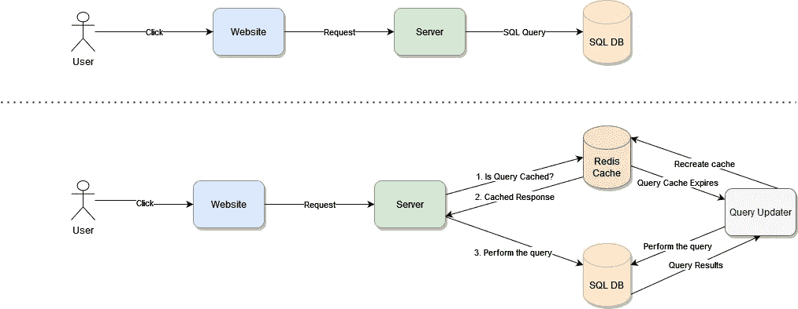

# 在 Windows 中使用内存数据库— SQL 查询缓存

> 原文：<https://betterprogramming.pub/using-in-memory-databases-in-windows-sql-query-caching-3887060268a4>

## 查询缓存听起来像是一个简单的用例，但它并不简单，尤其是如果您在 Windows 上进行查询缓存


塔达斯·萨尔在 [Unsplash](https://unsplash.com/s/photos/windows?utm_source=unsplash&utm_medium=referral&utm_content=creditCopyText) 上拍摄的照片

说到 web 性能，缓存是所有改进活动的基础。保留已经计算过的信息以避免再次计算，这是解决大多数性能问题的一种简单而又非常有效的方法。
对于 web 应用程序来说，最简单、最直观的解决方案是缓存整个服务器的响应，这样每当用户发出相同的请求时，服务器就已经计算好了所有的内容。

对于动态信息很少的简单页面来说，这是可行的。但是考虑一个有多个小部件的仪表板，每个小部件都相互独立，你如何确保对于每个请求，所有这些小部件的相同信息仍然有效？

你不能。

# SQL 查询缓存

问题的解决方案不是停止缓存，而是缓存正确的数据。对于完全由动态数据组成的网页，单个缓存没有什么意义，但是，保存单个结果并并行缓存它们可能是您需要的解决方案。

第一种解决方案会导致每次这些小部件发生变化时，您都必须使缓存无效，这可能会导致缓存总是无效，从而使其变得无用。第二个选项可以缓存变化较小的窗口小部件，同时，更新那些经常变化的窗口小部件。

## Redis 的查询缓存

缓存需要的第一件事是拥有快速 I/O，考虑到它需要避免变成性能瓶颈，而不是帮助解决您看到的实际问题。

好的缓存的第二个方面是它能够在数据不再有效时立即使其失效。这可能很难通过代码实现。这意味着您必须知道每个不同的数据集何时不再有效，并且每次查询它时，您的逻辑都需要检查它是否仍然有效。

但 Redis 可以解决所有这些问题，并提供许多其他开箱即用的额外功能。这就是为什么 Redis 是整个行业使用的主要缓存解决方案之一。

*   **Redis 快**。Redis 是一种内存存储，能够在平均不到 10 毫秒的时间内处理读写操作。这是因为不需要处理磁盘 I/O(这往往会增加很大的延迟)。
*   **Redis 可以自动使缓存失效**。Redis 自己的 TTL 特性允许您在所有缓存记录上设置一个可重置的过期日期。这意味着，只要您需要它，或者只要您不断更新它，缓存将是可访问的，如果它有一段时间没有更新，或者可能使用得不够频繁，内存将被释放，您的缓存将不得不重新创建。
*   **当缓存不再有效时，Redis 可以通知您**。扩展了传统缓存的需求，您可以在由于缺少更新而需要删除缓存之前对其进行被动更新。



看上面的图表，顶部显示了一个普通用户使用的标准 web 应用程序。一次单击产生一个请求，该请求转化为一个 SQL 查询。对于这个例子，这只是一个查询，但是考虑一下这怎么可能是两个甚至十个查询。
下一节显示的是同一个用户处理一个已经在后台实现了查询缓存的应用程序。是的，体系结构更复杂，如果仔细想想，流程非常简单:

1.  对于我们需要执行的每个查询，首先检查它是否已经被缓存。
2.  如果是，使用那些结果。
3.  如果不是，那么查询数据库。

按照这种逻辑，如果我们执行第 3 步，我们可能会将结果存储在缓存中。
如果缓存存在，但它突然过期，我们可以选择被动更新它，而不必等待用户下一次触发查询(通过使用与专用于此目的的并行进程混合的键空间通知)。

因此，Redis 是满足您缓存需求的完美解决方案，而且由于它支持多种数据类型，在其中存储结果非常容易。
如果你有简单的结果需要缓存(比如单个记录),你可以将它们作为一个字符串存储在 Redis 的一个键中。
然而，如果您有更复杂的记录，您可以利用 Redis 散列在其中存储复杂的数据结构。

## 如何在 Redis 中缓存 SQL 查询结果？

当决定在 Redis 上缓存查询结果的策略时，您必须考虑两个主要细节:

正确命名你的钥匙。因为它们将在一个巨大的内存哈希表中充当缓存数据的 ID。这意味着您必须始终避免命名冲突。一种可能的选择是对实际的查询字符串执行散列操作。如果每次查询都是自动生成的，那么无论客户端发送查询，您的哈希代码都有可能为同一个查询提供正确的值。如果字符串可以变化，您可能希望解析它并基于解析的数据生成散列。如果`WHERE`子句中的参数顺序不同，那么一旦提取出来，您可以按照您认为合适的方式重新排列它们。

例如，以下查询:

生成一个 MD5 散列如下:`b88b231e77449e3cd97f71b07695b8dd`
然后你可以创建一个名为`query-cache:b88b231e77449e3cd97f71b07695b8dd`的密钥，并用它来存储你的数据。
例如，结果可以存储在这个具有 24 小时 TTL 的键中。这意味着，如果您不做任何其他事情，这个缓存将在 24 小时内过期，一旦过期，您可以决定是自己自动填充它，还是在下次需要查询时让逻辑缓存它。
事实上，您也可以在每次向表中添加新用户时从不同的进程更新缓存。通过更新现有的密钥，TTL 被重置，因此您可以继续使用它，而不用担心数据过时。

**#2 你将如何存储数据**
足够简单的记录可以序列化并作为字符串存储在你的缓存键中。毕竟，这些信息在 Redis 中既不会被使用，也不会被查询。因此，存储格式并不真正相关，相反，这里的主要好处是您能够比通常使用 SQL 查询更快地获得结果。
然后字符串可以被解析并转换成您的代码需要的任何数据类型。

将序列化的数据保存到 Redis 中的一个键中，并将 TTL 设置为 24 小时，就像下面这样简单:

```
SET query-cache:b88b231e77449e3cd97f71b07695b8dd 'a:1:{s:7:"results";a:2:{i:0;a:3:{s:4:"name";s:15:"Fernando Doglio";s:9:"birthdate";s:10:"2014-10-24";s:7:"address";s:13:"Madrid, Spain";}i:1;a:3:{s:4:"name";s:8:"John Doe";s:9:"birthdate";s:10:"2020-10-24";s:7:"address";s:13:"New York, USA";}}}' EX 86400
```

# 架构中的数据库查询缓存

在现有架构中实现这种缓存解决方案的方法是将数据库访问抽象到一个单独的层中。
这可以采用单个类、一个模块甚至一个完整微服务的形式。重点是避免直接从业务逻辑中使用数据库驱动程序。这样，您可以为每个查询添加代码，以便:

1.  捕获查询并为其计算 MD5 散列。
2.  查询 Redis 以查找现有缓存。
3.  如果匹配，使用这些结果，解析它们并返回到您的逻辑中。
4.  如果不匹配，直接查询数据库，用 24 小时 TTL 缓存结果，然后将记录返回到您的逻辑。

这就是用 Redis 实现 SQL 查询缓存解决方案的全部内容。

# 在 Windows 中实现 SQL 查询缓存

虽然 Redis 是可靠和高性能缓存解决方案的完美解决方案，但让它在 Windows 上正常工作可能具有挑战性。这就是为什么 [Memurai](https://www.memurai.com/) 作为一个兼容 Redis 的 Windows 原生解决方案是完美的选择。它和原来的一样可靠，性能也一样好(在某些情况下甚至更快)。

有了 [Memurai](https://www.memurai.com/) 你就可以构建你的解决方案了，因为它与 Redis API 完全兼容，任何编程语言上已经支持它的任何库都将完美地完成这项任务。