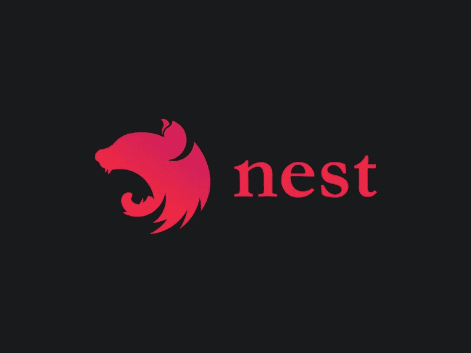

# 通过 NestJS 使用内存数据库

> 原文：<https://betterprogramming.pub/using-in-memory-db-with-nestjs-803a91a8eb11>

## 在这篇文章中，我们将看到如何使用`in-memory-db`来执行 CRUD 操作



NestJS 标志

让我们看看为什么我们应该以及如何使用内存数据库，你可以在 GitHub 上访问源代码[。](https://github.com/nestjs-addons/in-memory-db)

# 为什么

下面是两个可能需要内存数据库的场景。

*   POC(概念验证):当你需要为一个即将到来的项目创建一个快速的 POC，并且你想用 [NestJS](https://nestjs.com/) 创建一个 API，以便与 UI 集成。
*   模拟:您需要编写测试用例，并且想要模拟数据库操作。这是使用内存数据库的完美用例。

# **如何**

按照下面的步骤创建一个带有内存数据库的 API。

*   运行下面的命令来创建一个 NestJS 项目。

```
nest new in-memory-demo
```

*   一旦应用程序准备就绪，运行下面的命令来安装`in-memory-db`支持。

```
nest add @nestjs-addons/in-memory-db
```

*   我们将创建一个具有 CRUD 操作的`ProductController`,因此我们将为其添加一个模块和控制器。

```
nest generate module product
nest generate controller product
```

*   接下来，我们需要一个实体。在`product`文件夹中创建一个新文件夹`entities`。
*   创建一个新文件`product.entity.ts`并添加下面的代码。

产品.实体. ts

*   在上面的代码中，`InMemoryDBEntity`向任何扩展该接口的接口添加了一个`id`属性。
*   接下来，我们需要向控制器和模块添加一些代码。有两种方法可以执行 CRUD 操作，通过提供自己的实现或使用内置的`InMemoryDBEntityAsyncController`或`InMemoryDBEntityController`。

我们将看到这两种方法，让我们看看如何实现我们自己的方法。

*   打开`app.controller.ts`并添加下面的代码，这个文件已经存在。

应用程序控制器. ts

您可以在上面的代码中看到，我们添加了下面的代码来提供`Post`方法。

```
@Post()
AddProduct(@Body() product: ProductEntity): ProductEntity {
    return this.productService.create(product);
}
```

*   `ProductService`由`InMemoryDBService`实例化而来。它附带了许多执行 CRUD 操作的内置方法，无需编写一行代码。该服务包含两种类型的方法，`sync`和`async`，它们返回一个`observable`。
*   在上面的代码中，需要下面突出显示的代码来创建一个服务实例，该实例接受实体`ProductEntity`并提供所有方法。

```
constructor(private readonly appService: AppService,                           **private productService: InMemoryDBService<ProductEntity>**) {}
```

我们将要实施的方法是:

*   `getAll()`:检索所有记录。
*   `create()`:插入新记录。使用`createMany`插入多条记录。
*   `update()`:更新请求体中提供的`id`的记录。
*   `delete()`:删除提供的`id`的记录。
*   `query()`:从增加的记录中查询数据。

下面是完整的代码:

应用程序模块

现在，在大多数情况下，你只是想提供 CRUD 操作，如果我们一直添加相同的代码，这将导致代码重复，软件包会记住这一点。

它有`InMemoryDBEntityAsyncController`或`InMemoryDBEntityController`来实现同样的功能。

*   要使用上面的接口实现 CRUD 操作，只需添加下面几行代码。

产品.控制器. ts

默认情况下，`InMemoryDBEntityAsyncController`提供了以下方法的实现。

*   `create`
*   `update`
*   `updateMany`
*   `delete`
*   `deleteMany`
*   `get`
*   `getMany`

# 对于功能模块

如果您有不同的功能模块，您需要使用`forFeature`方法注册`InMemoryDBModule`。下面的代码举例说明了如何在`ProductModule`中使用它。

产品.模块. ts

您也可以使用`InMemoryDBService`的特定功能实例。您需要在构造函数中使用下面的代码。

```
constructor(@InjectInMemoryDBService('product') private productService: InMemoryDBService<ProductEntity>)
```

## 播种试验数据

对于测试，您可能需要创建一些虚拟数据，我们不希望您手动创建所有记录，这是您可以使用`seed`方法创建虚拟数据的地方。

*   使用下面的命令创建一个新的模块、控制器和实体。

```
nest generate module employee
nest generate controller employee
```

*   接下来，在 employee 文件夹中添加一个新的`entities`文件夹，添加一个新的文件`employee.ts`并添加下面的代码。

员工. ts

*   接下来，为员工模块注册`InMemoryDBModule`，在`employee.module.ts`中添加以下代码

雇员.模块. ts

*   最后一步是使用`seed`方法创建 10 个虚拟记录。

员工.控制者. ts

接下来，通过访问[http://localhost:3000/employee/seed](http://localhost:3000/employee/seed)来触发 seed 方法，这将创建 10 条记录。

你可以更新计数，在下面的方法中创建更多的记录。

```
this.employeeService.seed(recordFactory, **10**);
```

您可以使用`postman`来测试 API。在下一篇文章中，我们将看到如何添加 swagger 功能来创建用于测试的测试页面。

您可以在以下位置参考本演示的代码:

[](https://github.com/santoshyadav198613/nest-in-memory-demo) [## santoshyadav 198613/内存嵌套演示

### 一个渐进式 Node.js 框架，用于构建高效且可伸缩的服务器端应用程序，其灵感主要来自…

github.com](https://github.com/santoshyadav198613/nest-in-memory-demo) 

# 结论

`in-memory-db`在其他框架中广泛使用，如。Net、Java 和 Angular 来创建 POC 或创建模拟后端。

这个包为 NestJS 生态系统带来了相同的功能，并且您可以轻松地将它与现有的 NestJS 项目相结合来创建 POC。

感谢[韦斯·格里姆斯](https://medium.com/u/9af1d23366c8?source=post_page-----803a91a8eb11--------------------------------)和团队创造了这个包。