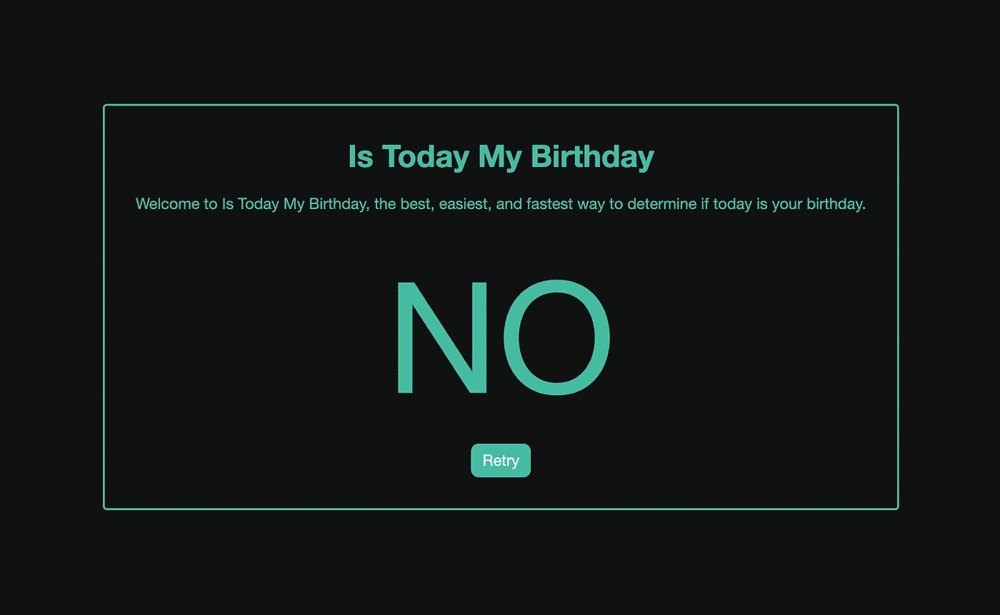
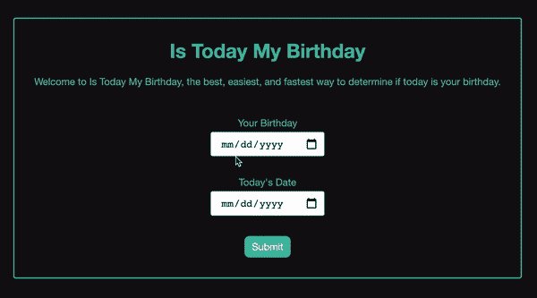
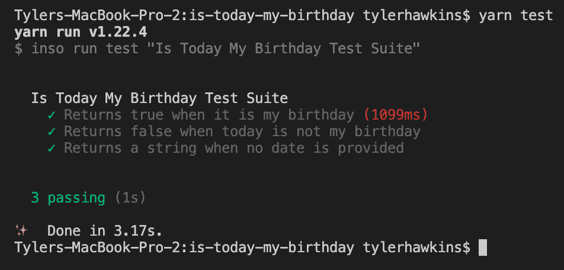
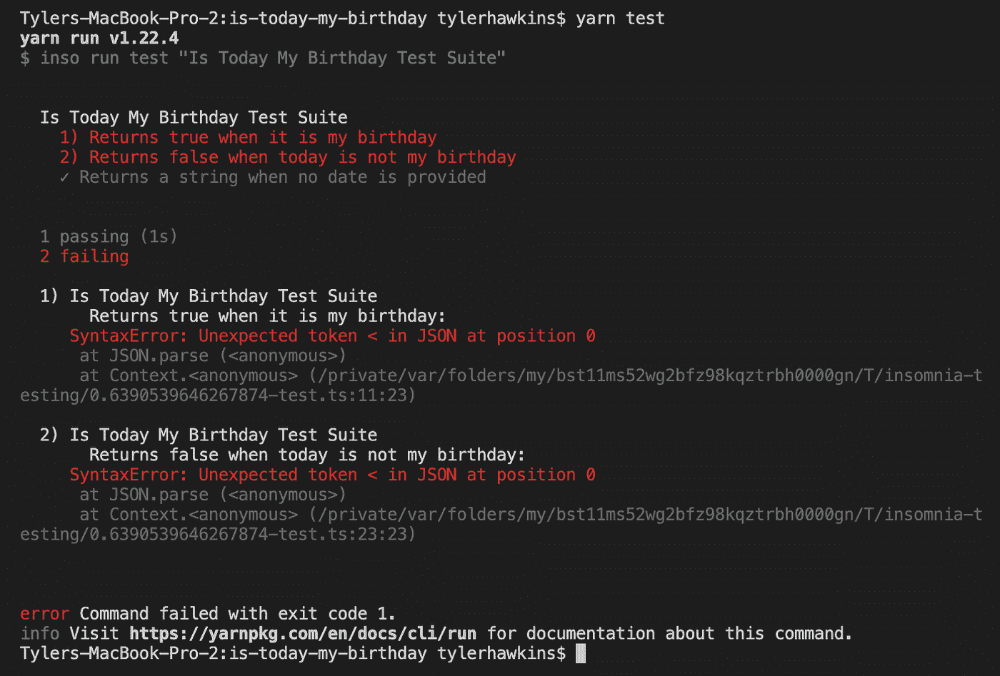

# 利用失眠来升级依赖性——充满信心

> 原文：<https://betterprogramming.pub/using-insomnia-to-upgrade-dependencies-with-confidence-68a10b10b576>

## 所以你不必在最后一刻匆忙行事

演示应用程序:“今天是我的生日吗？”

始终保持您的依赖关系是最新的。如果你不升级，你就会错过错误修复、安全补丁和新特性。如果您使用的软件包版本很快不再受支持，您甚至可能面临“生命终结”的最后期限。

如果升级依赖关系这么重要，为什么很多开发者不去做？他们可能不知道如何升级，或者他们可能不了解升级的好处，或者他们可能觉得没有时间。或者，他们可能害怕。

为什么开发人员会害怕升级他们的依赖关系？因为他们觉得可能会打碎东西。为什么他们害怕打碎东西？因为他们没有好的测试。

当您有一个好的测试套件在您的代码库上运行时，您可以放心地升级您的依赖项。

在本文中，我们将讨论语义版本控制、升级依赖关系时遇到的问题，以及如何放心地升级依赖关系。我们还将使用一个小应用程序来演示一个好的测试套件如何帮助您在部署应用程序之前捕捉到依赖项升级带来的重大变化。

# 语义版本控制

让我们简单谈谈语义版本化及其工作原理。JavaScript 包通常遵循语义版本控制，语义版本控制是一组三个数字，代表包的主要版本、次要版本和补丁版本。因此，如果一个包的版本设置为 2.4.1，那么它就是主版本 2、次版本 4 和补丁版本 1。

补丁版本通常包括错误修复和安全补丁。次要版本可以包含新功能。但是补丁版本和次要版本都不应该破坏或改变软件包的现有 API。主要版本可能会有突破性的变化，通常是通过删除 API 方法或对代码的底层架构进行重大修改。

# 升级依赖关系时遇到的问题

如果软件包开发人员正确遵循语义版本控制，这些软件包的消费者通常可以安全地升级应用程序中的次要版本和补丁版本，因为根据定义，这些版本中不允许出现重大更改。然而，一些包维护者可能没有很好地遵循这个标准，或者可能在没有意识到的情况下意外地发布了突破性的更改，所以你永远无法确定。但是一般来说，对依赖项的补丁和次要版本的升级应该会很顺利。

您需要更加小心的是主要版本。当将一个包从一个主要版本升级到下一个版本时，最好查阅一下变更日志或发行说明，看看有什么变化。

有时候，一个主要版本中的突破性变化不会影响到你，就像如果你没有使用一个现在已经被移除的 API 方法。其他时候，这些更改是相关的，您需要遵循迁移指南来了解为了正确使用新的主要版本需要做哪些更改。对于大规模的突破性变更，有时开发人员会好心地为您提供一个 codemod，一个为您执行大部分或所有变更的脚本。

好消息是，升级依赖项，甚至是主要版本，并不需要成为一种可怕的经历。

# 满怀信心地升级依赖关系

当您升级您的依赖项时，一个具有高代码覆盖率的测试套件将使您受益匪浅。如果你的代码被测试很好地覆盖，那么测试应该给你信心，你的应用在升级后仍然可以正常工作。如果所有的测试都通过了，你应该对升级顺利进行充满信心。如果任何测试失败，你知道你的应用程序的哪些领域需要关注。

如果你还没有测试你的应用程序，现在就开始写吧！一组好的测试大有帮助——不仅仅是在升级依赖项时，在重构现有代码、编写新功能和修复错误时也是如此。

即使有一个好的测试套件，在升级依赖项后进行少量的手动测试也是一个好主意，只是作为一个附加的安全措施。毕竟，在你的测试覆盖中可能会有缺口或者你没有考虑到的边缘情况。

如果您在手动测试过程中确实发现了测试套件中的差距，您应该为您所发现的问题编写一个快速测试，然后去修复这个问题。这样你就有了一个自动化的测试来确保你发现的特定错误不会在将来再次发生。

# 演示时间

现在让我们考虑一个小的演示应用程序，它将帮助这些抽象的想法变得更加具体。这里我们有一个非常有用的应用程序，[今天是我的生日](https://github.com/thawkin3/is-today-my-birthday)。这个应用程序是确定今天是否是你生日的最好、最简单、最快的方法。只需输入你的出生日期和今天的日期，应用程序就会告诉你今天实际上是不是你的生日。

演示应用程序:“今天是我的生日吗？”

好吧，我开玩笑的。但是，我们需要一个简单的应用程序进行演示，所以我们在这里。

这个应用程序是用 Node.js 和 Express 后端以及一个简单的 HTML、CSS 和普通 JavaScript 前端构建的。我使用了 [date-fns](https://date-fns.org/) 包来处理日期，并使用[失眠症](https://docs.insomnia.rest/)编写了 API 测试。我能够使用 [Inso CLI](https://docs.insomnia.rest/inso-cli/introduction) 从命令行运行 API 测试，我甚至已经用 [GitHub Actions](https://resources.github.com/devops/tools/automation/actions/) 将它们集成到一个持续集成管道中。我知道，很奇特。你可以在 GitHub 上查看这个应用的所有代码。

确定今天是否是您的生日的代码的相关部分复制如下:

我们编写的三个测试的输出如下所示:

三项失眠测试都通过了

因此，让我们考虑一下，当升级我们的应用程序使用的版本`date-fns`时，我们可能会做些什么。我特意从 1.30.1 版开始，这样我们以后就可以升级到 2.28.0 版。从 v1 到 v2 是一个具有突破性变化的重大版本，我们希望确保我们的应用程序在升级后仍能正常工作。如果我们的应用在升级后崩溃，人们怎么知道今天是不是他们的生日？

我们首先将`package.json`文件中的`date-fns`版本从 v1.30.1 更改为 v2.28.0。然后，我们将运行`yarn install`来安装新版本。

之后，我们可以运行我们的测试，看看事情看起来如何:

升级 date-fns 软件包后，两个测试失败

哦不——我们有一些失败！我们的三个测试中有两个失败了，看起来我们的 API 有一个错误的 JSON 响应。虽然处理失败的测试并不有趣，但我们的测试已经证明在将`date-fns`从 v1 升级到 v2 时检测问题是有用的。

如果我们进一步调查，我们会从`date-fns`中发现以下错误:`“RangeError: Use `dd` instead of `DD` (in `MM-DD`) for formatting days of the month.”`

回头看看我们的代码，我们确实使用了`MM-DD`作为日期格式。查阅 date-fns2 . 0 . 0 版本的[变更日志，我们可以看到一个突破性的变化是，在一起格式化月份和日期时，大写`DD`已经被小写`dd`所取代。感谢有用的提示，改变日志！](https://date-fns.org/v2.28.0/docs/Change-Log#2.0.0-2019-08-20)

现在，我们可以在代码中进行简单的更改，如下所示:

然后，我们将再次运行我们的测试套件，瞧，三个测试都再次通过了。秩序已恢复，我们已成功升级应用中的一个依赖项。

# 结论

升级依赖关系很重要。保持最新意味着您拥有最新的错误修复、安全补丁和功能。通过定期频繁地更新您的依赖项(可能每月一次或每季度一次)，您可以避免在最后一刻需要升级生命周期结束的软件包的恐慌。

请记住，测试有助于您自信地升级。那么，你还在等什么？现在就去写一些测试，升级你的应用程序的依赖项吧！