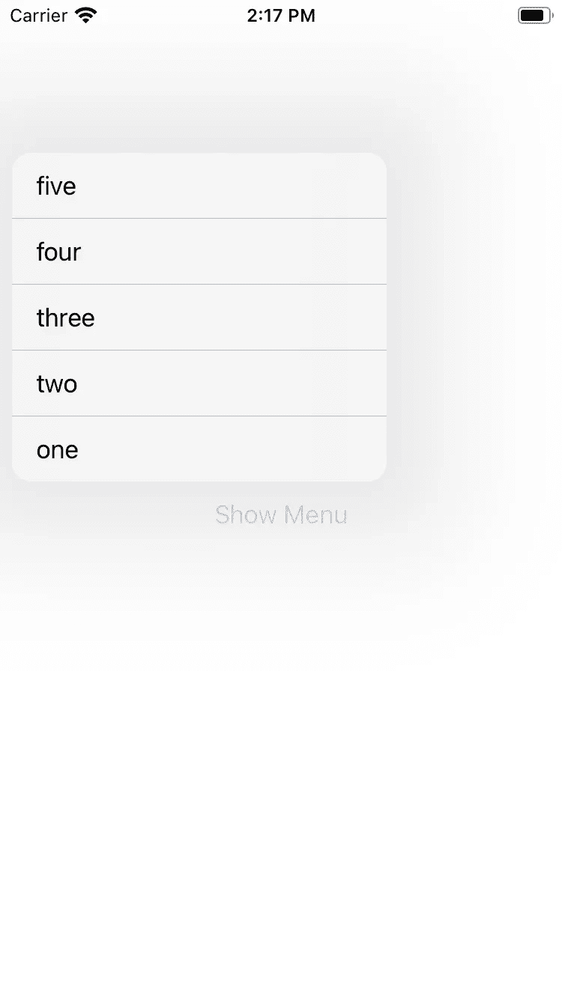
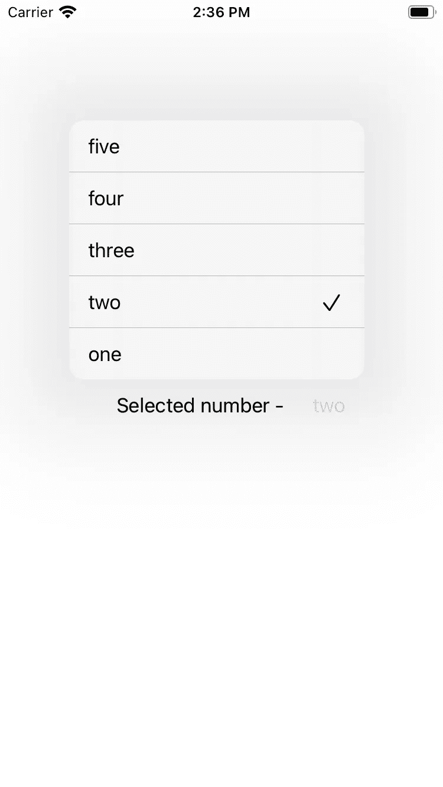
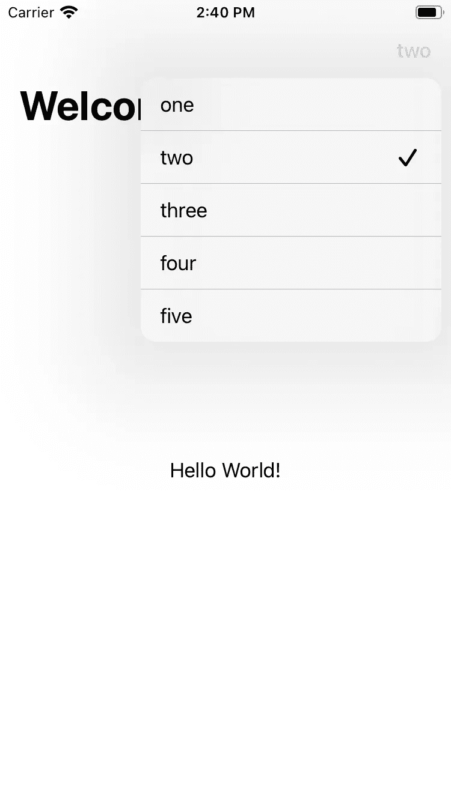

# 在 SwiftUI 中将 iOS 14 的菜单用作选取器

> 原文：<https://betterprogramming.pub/using-ios-14s-menu-as-a-picker-in-swiftui-b036c772037>

## 与苹果的全新采摘者合作

令人垂涎的菜单让我们开始！[日出照片](https://unsplash.com/@sunrisephotography?utm_source=medium&utm_medium=referral)拍摄于 [Unsplash](https://unsplash.com/?utm_source=medium&utm_medium=referral) 。

在 iOS 13 之前，在线挑选者的选择有限。我们可以内联显示轮子，但是在表格视图、列表和表单中看起来不太好。另一个选择是使用导航栈。但是如果我们不想使用导航栈，处理选择器可能会很痛苦。

除了 iOS 直接支持的那两个选项，很多应用都试图通过在键盘区域显示滚轮来解决这个问题。一些应用程序甚至决定使用动作表，在我看来这是一个糟糕的设计选择。

iOS 14 会帮助我们解决这个问题吗？如果我们看一下 [PickerStyle](https://developer.apple.com/documentation/swiftui/pickerstyle) 的文档，iOS 14 没有更新。我们还能去哪里看？

我在看 WWDC 20 的带有 iOS 菜单和 Pickers session 的[设计，其中提到了使用菜单进行选择。](https://developer.apple.com/videos/play/wwdc2020/10205/)

下面是 Xcode 中简单菜单的外观:

下面是它在 iPhone 上的应用:

iOS 14 示例菜单截图

这可以解决内嵌选择器的问题，但是我在文档中没有找到关于如何使用它进行选择的帮助[。](https://developer.apple.com/documentation/swiftui/menu)

以下是我将菜单用作选取器的尝试:

我们可以传入一组值，这些值可以映射到一个`View`和一个引用当前所选索引的整数。

使用`Menu`的核心工作发生在第 30-53 行之间。当要显示菜单时，我们循环遍历数组并显示其各自索引的视图。在所选索引的视图附近，我们添加了一个复选标记。

初始化器接受一个可选字符串，就像古老的`Picker`一样。如果您想在所选值附近显示一个名称，这将很有帮助。

我们的定制菜单选择器正在运行

在大多数情况下，这可以很好地工作，因为我们的旧拾取器没有帮助。最重要的是，我们甚至可以在导航栏中这样做，效果是一样的。

现在，我们可以在需要内联选项从值列表中进行选择的任何地方使用这个新的`MenuPicker`。完整代码可以在 [GitHub](https://gist.github.com/imthath-m/469cee5dde579d7892e4233811f7b17c) 上看到。

编码快乐！