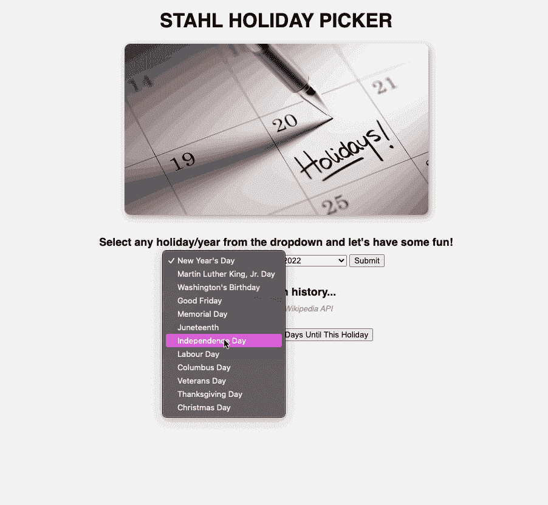

# 使用 JavaScript 通过 API 获取数据

> 原文：<https://betterprogramming.pub/using-javascript-to-fetch-data-with-apis-fe7a64065822>

## 一个简单易懂的真实项目的 API 初学者指南


标题图像；今天的主题:用 API 获取请求

## 议程

*   API 简介
*   提取请求简介
*   利用该功能的项目概述:一个单页应用程序，它为任何美国假日生成一个日期，并获取历史中该日期的一个事实。

## 什么是 API？

如果你是一名 web 开发人员，知道如何使用 API 是数据处理的一项重要技能。 **API** 代表应用编程接口。它允许两台计算机相互连接并传输数据。它们还使得将没有存储在本地的数据放入应用程序变得非常容易。

例如，如果你正在建立一个网站，你想获取天气信息或最新的股票价格，你可以选择如何处理。你可以将所有的数据下载到你自己的服务器上，并让你的网站连接到这些服务器上，这就要求你的服务器上有足够的空间来处理这些数据，而且你还需要不断地更新这些数据。另一种选择是找到一家拥有这些数据的公司或数据库，并拥有 API 功能，允许您将数据拉入或提取到应用程序中。

使用 API 有几个注意事项需要注意:

*   它们并不总是免费的，所以在某些情况下，你需要付费会员才能访问这些 API。您的会员资格可能允许您每天/每周/每月/每年获取一定数量的数据，因此您必须在扩建之前确认这一点。
*   从另一个远程服务器提取数据可能比从您自己的服务器提取数据需要更长的时间。考虑到这种延迟，你应该考虑网页的加载方式，这样你仍然可以填充大部分功能(一般用户只需等待 3 秒钟就可以加载页面，然后继续)

API 是一个很有内涵的话题，但是我们将展示它们如何在基础层面上工作。我开发了一个简单的[单页应用程序，利用两个免费的 API 来提取历史/未来假期的数据](https://github.com/Andrewstahl/phase-1-final-project)。

让我们开始吧！

# 项目设置

我建立的项目将允许用户选择一个美国假日和一年，并为该假日和一个有趣的事实产生一天。

为此，我使用了两个免费的 API， [Nager。日期](https://date.nager.at)和[维基百科](https://api.wikimedia.org/wiki/API_reference/Feed/On_this_day)。还有一个按钮，允许用户查看离我们到达那个假期还有多少天(假设是在未来)。

在我们深入研究代码之前，我已经包含了页面功能的快速视图:



显示项目功能的 Gif

# 从 API 获取

我需要以几种不同的方式为我的网站获取数据:

*   当页面加载时，我需要使用 Nager API 来填充假日的下拉列表(这比硬编码日期要好，因为我将总是有一个最新的假日列表，而不是随着时间的推移而变得停滞不前)
*   在用户提交了假期和年份之后，我需要使用 Nager API 来获取该假期的适当日期。
*   在该日期被填充后，该网站将使用 Wikipedia API 自动获取数据，以提取历史上这一天的有趣事实。

为了开始构建代码，我需要设计不同的函数来实现它。我还需要在网页的元素上添加事件监听器，这样应用程序就知道何时获取数据。

## ***先取***

一次关注一个，让我们先看看`fetchHolidays`函数需要什么。下面是我们将逐行分解的代码:

我省略了部分代码，因为我希望这篇博客主要关注获取 API 数据。关于其余代码的更多信息，可以访问我的项目的 [Github 资源库。](https://github.com/Andrewstahl/phase-1-final-project)

现在让我们开始分解它:

```
fetch(“https://date.nager.at/api/v2/publicholidays/2022/US")
```

当与 API 通信时，可以使用“获取”请求。您可以看到，我正在请求获取 2022 年美国假期的数据(您可以更改年份和国家代码来获取其他假期)。

当你这样做时，你正在调用 API，你将得到的不是那些参数的数据，而是一个最终返回数据的`promise`。

这个返回值很重要，因为它将决定您应该如何为这个请求编写其余的代码。

```
.then(function(response) {
    if (response.status !== 200) {
      console.warn("Looks like we didn't get a good request. Request 
      Code: " + response.status);

      return
    }
    return response.json();
  })
```

让我们一行一行地来看。

首先，你可以看到我们从使用`.then`开始，它跟随`fetch`请求并告诉计算机，“获取数据，`then` 当你收到对该数据的响应时，运行下一位代码。”

`.then`语句的唯一输入是一个函数。在本例中，我运行一个函数来检查获取请求的响应。

不同类型的响应有不同的代码，但我们感兴趣的唯一一个是 200 响应，这意味着它是成功的(有关 HTTP 响应代码的更多详细信息，请访问 HTTP 响应状态代码的 [MDN Web 文档](https://developer.mozilla.org/en-US/docs/Web/HTTP/Status))。

如果我们没有得到 200，这意味着 fetch 请求没有完全达到或返回我们想要的结果，所以我们只需在控制台中用“return”语句在取消函数时显示此警告。

如果我们得到 200 响应状态代码，我们就成功了！请记住，从服务器返回的响应不是可用的格式，所以我们需要使用方便的`.json()`函数以 JSON 格式返回响应(我们可以使用这种格式)。

```
.then(data => data.ForEach(holiday => {
    //Extra code to grab the holiday select dropdown and add each 
    //holiday to that select dropdown
  };
```

最后，我们将菊花链连接另一个`.then`,因为在收到上一个`.then`的 JSON 格式的响应后，我们终于可以处理这些数据了。

我使用箭头函数作为输入，而不是常规的`function()`符号。您可以为这些`.then`输入使用常规符号、箭头符号或回调函数(稍后将详细介绍回调函数，因为它们对我们代码的效率至关重要)。

对于这个函数，我从前面的`.then`语句中获取数据，该语句将为这个 API 返回一个类似数组的对象，我将遍历这个数组来查找每个假日。

我不会在这里发布剩余的代码，因为这与获取请求没有关系，但是你可以在我的项目的 [Github 库中查看。](https://github.com/Andrewstahl/phase-1-final-project)

## ***第二次取***

现在，我们将通过第二个获取请求来提取所选假期/年份的适当日期

您可以看到，它看起来与我们发出的第一个获取请求极其相似，只是略有不同:

*   我们没有在第一次读取时使用当前年份，而是使用用户在下拉列表中选择的年份
*   第二个`.then`语句后的函数以不同的方式操作数据

## ***抽象前两个获取请求***

那么我们如何遵循 DRY 方法并保持我们的代码完整无缺呢？回调函数来了！这是一种我们可以将一个函数作为另一个函数的参数传递的方法。根据 W3 学校:

> 回调是作为参数传递给另一个函数的函数…这种技术允许一个函数调用另一个函数…

我们可以将`fetch`请求作为一个独立的函数。一旦它返回数据，我们就可以调用其他函数来介入并做他们需要做的事情。取数需要知道我们取数的年份，以及数据运行后需要调用的回调函数。

让我们用这个新的抽象来看看上面的代码是如何工作的:

## ***第三取***

我们要做的第三个也是最后一个获取是在维基百科上抓取历史上那一天的有趣事实。我们可以进一步抽象它，将其包含在我们的另一个`fetchData`函数中，但是我将把它分开。

该函数将在应用程序获取所选假日的日期后立即触发。

我们需要知道月份和日期来填充 API URL。下面是这段代码的快速分解:

*   `fetch`从 Wikipedia API 获取数据，并返回一个承诺，为该数据提供响应。
*   第一个`.then`包含一个快速箭头函数，它获取从前面代码返回的响应，并返回该响应的 JSON 版本。
*   第二个`.then`获取数据，发现数组中有多少元素(这表示维基百科当天存储了多少事实)，然后从列表中随机选择一个事实进行显示。

这个 fetch 布局比前几个简单得多，这也是这篇博客的目的。有几种不同的方式来编写它，但它们应该遵循相同的结构来产生预期的结果。

# 包扎

这就把我们带到了这节课的结尾！那个项目还有很多代码，如果你感兴趣，你应该看看！其中一些内容比这篇博文所能描述的要复杂，但是我们的目标是让读者很好地理解如何向一个(或者多个)API 发出获取请求，这样您就可以创建易于使用的、无服务器的应用程序。

下次见，编码快乐！

# 资源

在我构建这个项目时，这里有一些很好的资源帮助了我:

*   [开放 API 列表(不需要认证)](https://mixedanalytics.com/blog/list-actually-free-open-no-auth-needed-apis/)(如果你想自己做一些研究和构建一个应用)
*   [纳格尔。API 日期](https://date.nager.at)
*   [维基百科 API](https://api.wikimedia.org/wiki/API_reference/Feed/On_this_day)
*   [这个项目的 YouTube 快速演练](https://youtu.be/7PzUS3bsAXg)
*   [该项目的 Github 库](https://github.com/Andrewstahl/phase-1-final-project)
*   [HTTP 响应状态代码的 MDN Web 文档](https://developer.mozilla.org/en-US/docs/Web/HTTP/Status)