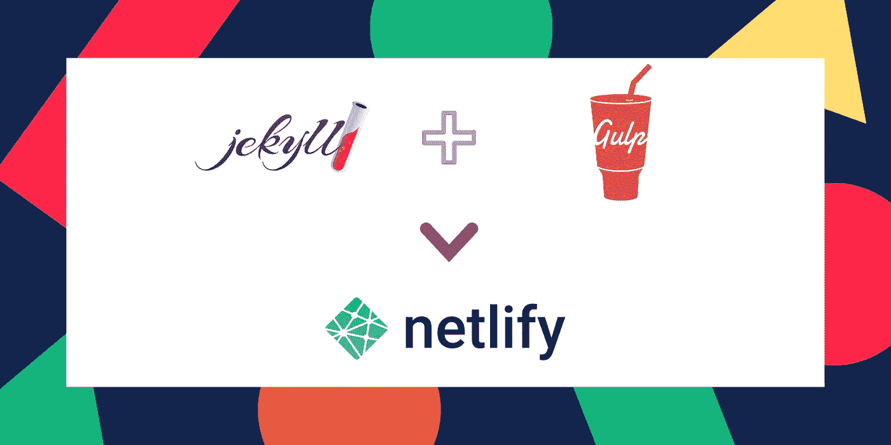
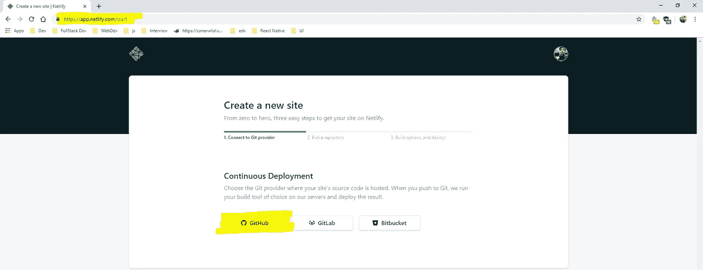
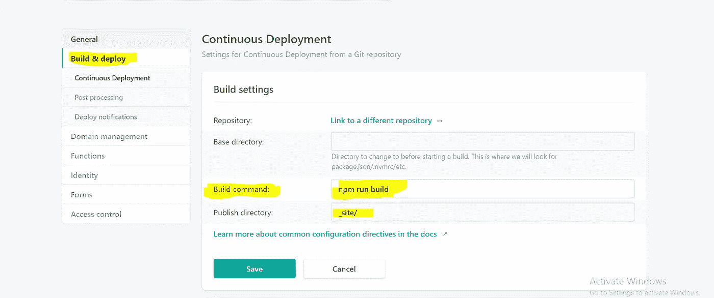

# 使用 Netlify 通过 Gulp 优化 Jekyll 资产

> 原文：<https://betterprogramming.pub/using-jekyll-with-gulp-and-netlify-dbe5e1bfec62>

## 使用 Netlify 的持续部署功能来发布我们的网站

这篇文章是为那些希望用 Netlify 建立一个 ekyll + Gulp 工作流的人准备的，以利用 Netlify 与 GitHub 的无缝集成及其连续部署(CD)特性。

人们总是可以用 Jekyll 建立一个 Gulp 工作流，然后在 Netlify 上手动部署它——有许多文章可以帮助您解决这个问题——但是手动部署会绕过 CD，这可以说是 Netlify 的最佳特性，允许通过快速的 git 推送来触发部署。

我们在这里想要实现的是运行一个完全优化的 Jekyll 博客——所有的图片都被缩小，样式表被捆绑。Gulp 应该负责所有的优化，但是写一篇简单的博客文章不应该是一件麻烦的任务，你必须每次都运行`jekyll build`和`gulp build`——更不用说本地安装所有 Gulp 模块的麻烦了。它应该像执行一个简单的 git 推送一样简单。

因此，我们可以利用 Netlify 的 CD 特性来为我们处理网站的构建、优化和部署。

# 我们开始吧

设置存储库

1.  为项目建立一个新的 [Github 回购](https://github.com/chiragpaliwal/jekyllBlog)，并将回购与 Netlify 关联。
2.  在根目录中创建一个 [gulpfile.js](https://github.com/chiragpaliwal/jekyllBlog/blob/master/gulpfile.js) ，在这里我们将定义我们的 Gulp 任务。
3.  在根目录下做一个`npm init -y`或者创建一个 [package.json](https://github.com/chiragpaliwal/jekyllBlog/blob/master/package.json) 文件。

`"build": jekyll build && gulp build`

这里需要注意的一件事是名为`build`的 npm 脚本——作为部署过程的一部分，我们将使用它在 Netlify 上构建我们的网站。(两个任务之间的双&符号是为了确保任务按顺序运行。)

要运行的两个主要任务是:

*   `jekyll build`(在`_site`目录中构建 Jekyll 站点)
*   `gulp build`(运行大口魔法)

现在，转到 Netlify 和已部署站点的站点设置。

转到 Build & deploy 选项卡，编辑 Build 命令，并使用我们前面定义的 npm 运行脚本。

这应该能行。现在，每当我们执行一个`git push`，它应该会触发 Netlify 上的一个新部署，负责构建我们的网站以及执行 Gulp 任务。

我希望那有帮助。感谢阅读！