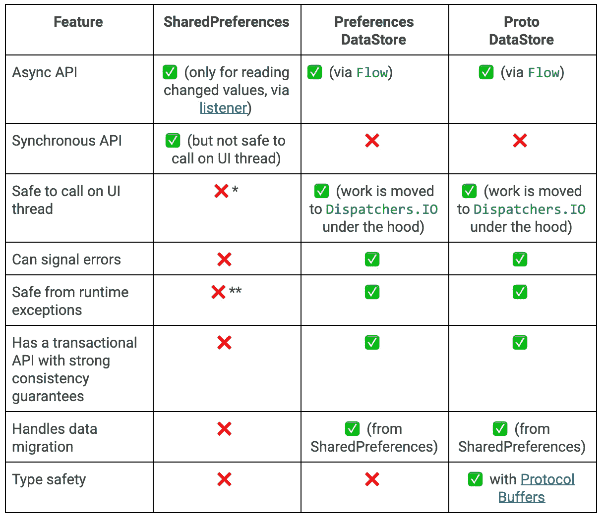

# 如何使用 Jetpack 首选项数据存储

> 原文：<https://betterprogramming.pub/using-jetpack-preferences-datastore-more-effectively-414e1126cff7>

## SharedPreferences 的替换在这里

[Pexels.com](https://www.pexels.com/photo/black-server-racks-on-a-room-325229/)

## **什么是 Jetpack 数据存储？**

> 根据 Android 开发文档，Jetpack DataStore 是一种数据存储解决方案，允许您使用[协议缓冲区](https://developers.google.com/protocol-buffers)存储键值对或类型化对象。DataStore 使用 Kotlin 协同例程和流来异步、一致和事务性地存储数据。

DataStore 是 Jetpack 家族的一个库，它提供了一种简单数据存储解决方案的新技术。它允许我们在键值对中存储数据，就像 SharedPrefernces 或在类型化对象中一样。它构建在协程和流程之上，异步存储数据。

## SharedPreferences 与 DataStore

图片来源:[安卓开发者博客](https://android-developers.googleblog.com/2020/09/prefer-storing-data-with-jetpack.html)

在本文中，我们将了解首选项数据存储。

## 什么是首选项数据存储？

它像 SharedPreferences 一样以键值对的形式存储数据。如果您过去已经使用过 SharedPreferences，那么您会对 Preferences 数据存储有更好的了解。

## **整合**

要使用数据存储，您需要将库集成到应用程序级的`build.gradle`文件中。

现在稳定了。你可以在你的项目中毫无压力地使用它😁。

## 是时候写一些代码了

我个人最喜欢 Kotlin 的特点是它的扩展功能。我们可以扩展任何我们想扩展的功能。对于首选项数据存储，我扩展了`Context`类，从保存数据到检索数据。

对于`DataStore`，我们需要创建一个 helper utils 文件，为此，您只需要使用代码片段。它包含所有类型值。每个项目的现成代码。

DataStoreHelper.kt

一旦你完成了上面的步骤，现在你需要在`ViewModel`类中调用这些函数。当向数据存储器写入任何数据时，它是`suspend`函数，需要从`coroutine`调用。

在理解数据存储的示例中，我们将存储`String`类型的数据，并检索相同的数据类型。

MainViewModel.kt

为了将字符串数据保存到数据存储中，您只需要将`saveNameUser(name:String)`函数调用到您的活动/片段中。

为了检索数据，我们需要观察活动/片段中的`getUserName` LiveData 变量。一旦数据发生变化，UI 就会通过使用 LiveData 立即更新。

现在，每当我们更新数据存储的值时，它每次都会观察，文本视图也会相应地更新。

# 结论

仅此而已！希望你学到了一些东西。如有疑问，只管评论！我很乐意解决你的问题。我希望你从当前项目到所有新项目都使用`DataStore`而不是`SharedPrefernces`。

谢谢，干杯！