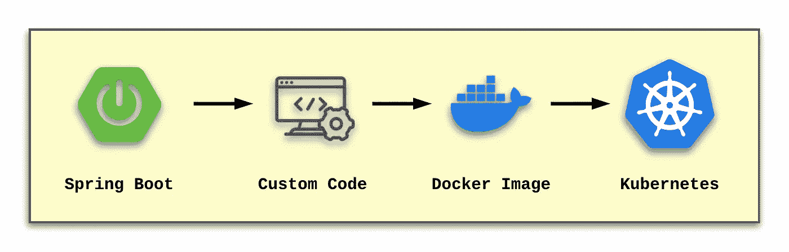
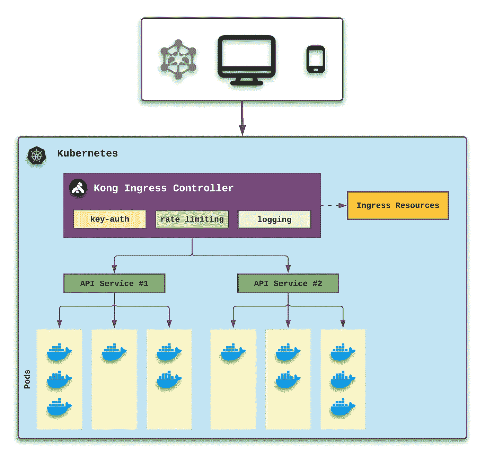

# 通过 Spring Boot 服务使用 Kong 入口控制器

> 原文：<https://betterprogramming.pub/using-kong-ingress-controller-with-spring-boot-services-b779b40ac7ff>

## Kong Ingress Controller 允许用户在现有的 Kubernetes 实现中包含 Kong Gateway 的功能，而无需太多的努力。

自 2003 年以来，我一直使用 IntelliJ 作为我开发应用程序和服务的主要工具。十九年前，我对使用 IDE 所需的少量内存和 1.x 版本中包含的重构能力印象深刻。

用 Java 开发不需要我使用 IntelliJ IDEA 产品。我当前项目中的其他开发人员使用 Eclipse 或 VS 代码，但是这些工具不是必需的。当您可以用一个简单的文本编辑器和终端会话编写组件、服务和应用程序时，您最终会得到相同的编译后的 Java 代码。

那么，为什么我每年都要把钱花在 IntelliJ 上呢？因为 IntelliJ IDEA 旨在让开发人员的工作变得更容易——这相当于我的工作效率更高。例如，右键单击一个类，我可以在几秒钟内选择重新定位这个类。当 IntelliJ 找到机会删除重复代码时，它会创建新的共享代码，并正确更新依赖于集中式方法的位置。IntelliJ 也是代码审查期间验证的一个极好的来源。

虽然这个例子看起来有点简单，但我想知道为什么更多的软件工程师在构建他们的服务时不采用类似的方法。

# Spring Boot 服务和 Kubernetes

让我们假设你的特性团队已经标准化了对 API 服务的 [Spring Boot](https://en.wikipedia.org/wiki/Spring_Framework#Spring_Boot) 的使用。由于您团队的辛勤工作和详细设计，您的 API 被公众消费者认为是成功的。您的组织决定使用 [Kubernetes](https://konghq.com/learning-center/kubernetes/what-is-kubernetes/?utm_source=guest&utm_medium=devspotlight&utm_campaign=community) 提供这些服务。

对于您的团队开发的每个 Spring Boot 服务，这是高级生命周期的样子:

初始化 Spring Boot 服务，并添加自定义代码。该服务被封装成一个 Docker 映像，最终部署到 Kubernetes 中。

通过使用 Kubernetes，我们获得了以下优势:

*   一组 Spring Boot 码头集装箱被放入一个“容器”中作为一个单独的应用程序。这使得每个 Spring Boot 服务都能够专注于最终 API 的给定方面。
*   可以对一个或多个 pod 进行分组，以形成最终的 API 服务，该服务可以针对可发现性、可观察性、水平伸缩和负载平衡进行配置。
*   利用滚动更新和金丝雀部署来实现稳定的消费者体验。

如果您有兴趣将 Kubernetes 与 Spring Boot 结合使用，请查看以下 URL:

Spring Boot·库伯内特

基于这些流行 API 的成功，让我们想象一下，行政领导想要将服务货币化，以从最活跃的消费者那里获得收入。免费层仍然可用，但是将引入对 API 使用的限制。

虽然团队可以在 Spring Boot 级别实现一些定制逻辑，但这没有意义。我们需要的是一种集中的方式来处理这种新的需求。

# 孔入口控制员来救援了

去年，作为我的一个客户的长期解决方案的一部分，我开始熟悉[孔](https://konghq.com/?utm_source=guest&utm_medium=devspotlight&utm_campaign=community)产品套件。我上面描述的场景反映了我在过去五年中遇到的情况:集中公共组件是成功实现微服务的关键。

如果你想更多地了解孔，可以看看我去年五月发表的文章:

[我是如何和孔一起停止编写重复的服务组件的](https://medium.com/nerd-for-tech/how-i-stopped-coding-repetitive-service-components-with-kong-1308be4000e3)

对于上面提到的用例，我们可以在 API 网关级别处理以下组件:

*   应用程序注册(密钥授权)
*   限速
*   集中记录

由于 Kong Gateway 是开源的，并且是 2021 年 Gartner 全生命周期 API 管理幻方图中的“领导者”,因此 Kong Gateway 是处理这些常见组件的安全方式。了解到 Kong 还提供了一个用于 Kubernetes 的入口控制器，进一步验证了产品决策。

在这个 GitHub 页面上，您可以找到开始使用 Kong Ingress Controller (KIC)所需的一切:

【Kubernetes 的孔入口控制器

下图显示了这两种服务所需的设计:

针对 API 服务#1 或#2 的请求到达 Kubernetes。Kong 入口控制器拦截请求并验证所提供的 API 密钥。基于该信息，控制器确定做出请求的消费者是否已经超过其请求限制。

如果没有超过速率限制，则请求被转发到适当的服务。但是，如果超过了速率限制，那么将返回 429(太多请求)HTTP 响应。在所有情况下，可以轻松地配置日志模块来跟踪所有传入的请求，包括 API 消费者提供的所有元数据。

# 这个设计的价值

当我们后退一步，看看由此产生的架构和设计时，我们很快就会看到好处:

*   Spring Boot 服务是真正的微服务，每个服务都专注于 API 的一个方面。
*   Docker 允许 Spring Boot 服务是独立的，并且可以在开发生命周期的任何时候分发。
*   Kubernetes 提供了将这些目的驱动的 Docker 图像分组到 Pods 中的能力，这些 Pods 充当单个应用程序。在我们的示例中，这些 pod 然后被分组为 API 服务。
*   共享组件—如应用程序注册、速率限制和日志记录—存在于 Kong Gateway 的一个集中位置。
*   Kong Ingress 控制器成为 Kong Gateway 和 Kubernetes 之间的中间件层，以利用所有共享组件。

作为这种模型的结果，从事 Spring Boot 服务的特性团队开发人员只需要关注他们的产品所有者所提供的工作来改进或扩展服务。这些开发人员不需要担心 API 键、速率限制或其他地方管理的任何其他共享组件。

支持 Kubernetes 实现的 DevOps 工程师也不必设计任何定制的设计方面来处理那些共享组件。这是因为 Kong Gateway 是为满足这些需求而构建的，并且通过 Kong Ingress 控制器工作良好。

# 结论

自 2021 年以来，我一直试图按照以下使命宣言生活，我觉得这可以适用于任何 IT 专业人士:

> *“将您的时间集中在提供扩展您知识产权价值的特性/功能上。将框架、产品和服务用于其他一切。”*
> 
> *——j·维斯特*

在这篇文章的开始，我谈到了与文本编辑器和终端会话相比，我更喜欢 IntelliJ IDEA。事实上，核心原因与我的个人使命直接相关。创意产品让我专注于正确的事情；同时，它处理与编写原始源代码相关的重复性任务。

类似地，Spring、Docker、Kubernetes 和 Kong 都提供了解决方案和框架来实现相同的使命。上面提到的每一个方面都可以追溯到给定项目的单一真相来源。因此，整个应用环境中没有重复的服务或功能。

> *如果你发现自己第二次执行同样的过程，那肯定是时候考虑重构你的设计了。*

如果您的服务层属于我在这里讨论的类似模式，并且您没有使用 Kong Gateway 或 Kong Ingress Controller，那么当您准备完善您的服务设计时，它们当然应该在您的产品清单上。

祝你今天过得愉快！