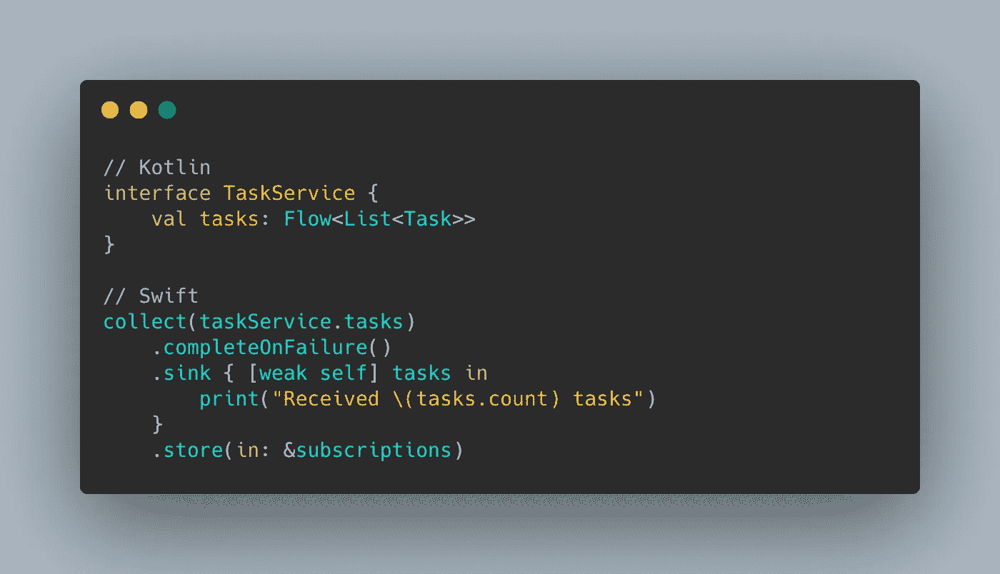

# 在 Swift 中使用 Kotlin 流

> 原文：<https://betterprogramming.pub/using-kotlin-flow-in-swift-3e7b53f559b6>

## *使用来自 Kotlin 多平台的异步流作为 Swift 中的组合发布器*



作者照片。

我的团队最近开始使用 Kotlin Multiplatform Mobile 为我们的移动应用程序开发组件，在 Android 上使用 Jetpack Compose，在 iOS 上使用 SwiftUI。

如果您已经熟悉 Kotlin，您可能知道 Kotlin 中协程的概念，它极大地简化了线程和异步编程。Kotlin 中协程的关键组件之一是`Flow<T>`类型，它是 Kotlin 中所有异步流实现的接口。虽然`Flow<T>`在 Android(以及一般的 JVM 目标)中很容易使用，但是在 Objective-C/Swift 中表示接口带来了`protocols`的局限性，包括缺少泛型类型参数。

在探索 Android 和 iOS 之间代码共享的限制时，我们面临的挑战是必须在 Swift 中使用这些来自 Kotlin 的异步流，同时又不影响 Android 的易用性。在研究问题解决方案的过程中，我们经历了几个选项，我将在本文中介绍它们。

*TL；DR:通过为返回* `*Flow<T>*` *的方法引入重载来适应 Swift 中的使用，这调用回调，同时在 Swift 中可取消的专用协程范围中收集异步流。*

# 第一轮:AnyFlow <t>类</t>

当使用 Kotlin 多平台将 iOS 作为目标时，接口的泛型类型参数*在转换中丢失，而类*的泛型类型参数*被保留(因为这些参数可以很容易地被转换为对象**C/Swift)，所以我们的第一个想法是创建一个名为`AnyFlow<T>`的`Flow<T>`的实现。我们采用了 Swift 中常见的协议擦除模式的命名方案(如 Combine 中的`AnyPublisher<Output, Failure>`):***

**虽然这允许我们在 Swift 中使用时保留一定程度的通用类型参数，但这并不完美，因为以有意义的方式使用类型为`Flow<T>`的值最终需要调用一个挂起的函数(如`suspend collect(collector: FlowCollector<T>)`)或将协程作用域传递给一个函数。在这两种情况下，都需要一个协程范围，这在 Swift 中是不容易实现的。虽然我们可以通过引入额外的 Kotlin 代码在 Swift 中创建和管理协程范围，但我们宁愿不这样做。**

**为了解决这个问题，我们在`AnyFlow<T>`类中引入了`collect`函数的非挂起实现:**

**具有基于回调的收集功能的 AnyFlow**

**在寻找这个问题的解决方案时，这个解决方案是你经常会偶然发现的。它有时被称为 CFlow 或 ClassFlow。**

**您会注意到返回类型是`Cancellable`，看起来像这样:**

**通过使用回调来发出元素和完成/失败，我们可以在 Kotlin 中保留所有的协程用法，使得从 Swift 使用该方法变得简单，在 Swift 中它将具有以下签名:**

```
func collect(onEach: @escaping (T) -> Void, onCompletion: @escaping (KotlinThrowable?) -> Void) -> Cancellable
```

**这可以包装在一个`Publisher`中，该 T3 订阅 Swift 中的`AnyFlow<T>`类的实例。**

**然而，虽然 Kotlin Multiplatform 在 Swift(和其他原语)中将 Kotlin 类型如`Int`转换为`In32`，但它不会对泛型类型参数这样做(除了少数常见类型——参见[与 Swift/Objective-C 的互操作性](https://kotlinlang.org/docs/native-objc-interop.html)),这意味着 Kotlin 返回的`AnyFlow<Int>`中的方法或属性被有效地转换为 Swift 的`AnyFlow<NSNumber?>`。您会注意到不仅类型参数不是`Int32`，而且可空性在转换中也丢失了，使得每个泛型类型参数都是可空的。现在我不知道你怎么想，但是我和我的团队更喜欢我们的可空性和类型被正确地翻译，以及拥有让*感觉*本地的数据类型，所以我们坚持……**

# **第 2 轮:流包装函数**

**虽然 Kotlin 多平台在泛型参数中保留类型信息的能力仍然有限，但对于作为参数传递的函数，它可以正确地保留类型信息。这导致我们对所有的`Flow<T>`返回函数采用一种模式，本质上是复制每个返回异步流的方法签名——我们称之为流包装函数的函数。**

**假设我们有一个返回`Task`对象流的方法:**

**具有流和流包装器功能的 TaskService**

**正如您所看到的，有一个任务属性返回一个`Flow<T>`(在我们的 Android 应用程序中使用它是微不足道的)，同时有一个重载作为接口上的默认方法实现，使用类似于我们之前添加到`AnyFlow<T>`的`collect`方法的扩展方法收集属性流:**

**基于回调的流程收款扩展功能**

**为了完成这个模式，我们在 Swift 代码中引入了一些函数，将这些函数作为 Combine `Publishers`:**

**函数来收集 Swift 中的流包装函数([Flow+publisher . Swift 的完整源代码](https://gist.github.com/Nillerr/dc437c02485da661b4f285cee01069a1))**

**它们可用于将流包装函数*引用*转换为`Publisher`:**

**在 Swift 中收集流包装函数的示例([source](https://gist.github.com/Nillerr/1a1669da5aef0463877e3f06b51a3c3a)for completeOnFailure())**

**采用这种模式保留了所有的类型信息，虽然涉及到一些样板文件，但我们希望将其保持在绝对最小的程度。**

**我们可能会考虑引入一个 Kotlin 编译器插件，以便在将来的编译时自动生成这些包装器，但现在，我们决定使用 Android Studio 中的几个[实时模板](https://gist.github.com/Nillerr/920f10a35da225cca7a04c06fcf73a44)。**

**请务必通过标题中的链接查看完整的相关源代码。**

# **结论**

**虽然复制方法签名*感觉不对*，但它*感觉*比没有将类型信息正确翻译到 Swift 的选择要好，这就是为什么它是我们团队最终选定的方法。Android 不使用基于回调的方法，就像 Swift 不使用基于`Flow<T>`的方法一样，但是我们通过遵循这种模式来确保实现的一致性，并支持 Swift 的干净互操作。**

**虽然`suspend`函数确实翻译了类型信息，但是它们失去了可空性和取消运行`suspend`函数的协程作用域的能力，导致我们采用相同的模式来挂起函数。我将在下一篇文章中讨论这个问题。**

**请继续关注未来的文章，我将继续介绍我们在现实世界的应用程序开发中使用 Kotlin 多平台 Mobile 的旅程，包括我们探索过但最终暂时搁置的一些想法。**

***注意:本文引用的所有代码和 GitHub gists 都是在 MIT 许可下发布的。***

**如果您对更多的 Kotlin 多平台感兴趣，请随意查看我的另一篇关于模仿 Kotlin/Native 和 Kotlin 多平台中的依赖关系的文章:**

*   **[认识 mock ative——一个在 Kotlin 中模仿依赖关系的框架](/introducing-mockative-mocking-for-kotlin-native-kotlin-multiplatform-31f5b076257b)**