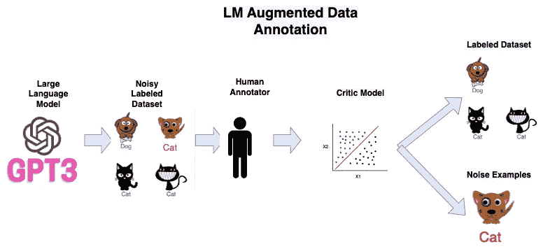
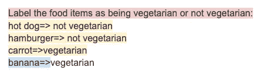
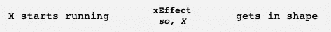
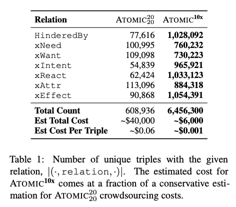
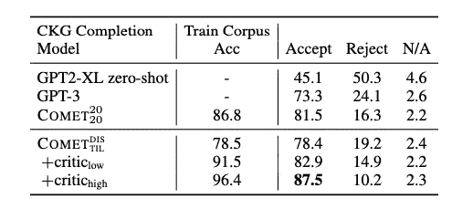

# 使用大型语言模型进行数据标注

> 原文：<https://betterprogramming.pub/using-large-language-models-for-data-labeling-1357f2880a38>

## 让人工智能为你标注数据


马特·布里内在 [Unsplash](https://unsplash.com?utm_source=medium&utm_medium=referral) 上拍摄的照片

TL；DR——我们可以利用 GPT3 等大型语言模型的文本生成能力来生成用于监督学习的标记数据。我们可以使用提示来做到这一点，在提示中，我们给 LM 一个任务描述、一些例子和一个生成标签的新例子。由此产生的数据，一般来说，将是嘈杂的，质量低于人类的标签。然而，数据收集的速度和在循环中使用人的能力使这成为为难以标记的任务收集大量标记数据的有效方法。

# 自然语言处理中的数据标注

在这一点上，很好理解的是，标记数据的质量和数量是机器学习项目成功的唯一最佳预测器。在工业界，有没有这些数据往往决定了一个项目是被批准还是被搁置。

然而，在许多情况下收集可能非常昂贵和耗时。医疗保健或招聘等专业领域的标注可能需要专家来协助标注。这可能会增加注释的成本，并减少潜在注释者的数量。

此外，有些任务不太适合人工注释。例如，生成摘要是众所周知的困难，因为它不仅吞吐量低(因为每个示例都需要阅读、理解和编写一个可能很长的文档)，而且注释者的意见也很不一致(其中重要的摘要可能因人而异)。

## 语言模型增强数据标注

ML 文献中的一个增长趋势是使用大型语言模型作为传统注释管道的替代或补充。这允许模型为注释管道中最劳动密集型的部分做繁重的工作。



LM 增强数据注记的工作方式如下:

1.  使用提示从语言模型生成嘈杂标签数据集
2.  人类注释者要么接受要么拒绝样本
3.  学习一个 critic 模型，根据注释者的决定过滤生成的例子
4.  critic 模型应用于生成的数据集，以过滤有噪声的示例

## 快速噪音标签>慢速清洁标签

在行业中担任 ML 工程师时，快速完成有效的 POC 往往比找到最佳方法更重要。工程时间通常是公司最重要的资源之一，允许我们自己被封锁是不可接受的，即使是像数据这样重要的东西。在这里，我们将看到，虽然生成的数据并不总是更好，但它的生成速度明显更快，成本也更低，这有助于回答每个项目经理在 ML 项目之前都会遇到的关键问题:这是否可行？


上市速度>准确性

在这次审查中，我将:

*   简要介绍如何使用语言模型生成数据
*   看一个使用端到端标签管道的案例研究
*   展示了一个引导书名分类数据集的工作示例

# 从语言模型生成数据

## 大型语言模型

在过去的几年中，语言模型在规模和性能上呈指数级增长。就模型的大小、训练数据量和用于创建它们的训练时间量而言，诸如 GPT-3 的当代语言模型要大几个数量级。这些模型已经变得非常强大，并显示出在没有数据的情况下为新任务生成文本的非凡能力。

## 基于提示的生成

我们可以通过构造称为提示的文本模板来为未标记的数据生成标签，当我们允许语言模型继续运行时，这将很可能生成标签。提示通常包含三个部分:

*   对我们要执行的任务的描述
*   正在执行的任务的示例(也称为情境演示)
*   一个我们想要标记的新例子



红色—任务的描述。黄色—正在执行的任务的示例(也称为情境演示)。蓝色—我们希望模型为其生成的新示例

上面的例子是来自 [openai playground](https://beta.openai.com/playground) 的工作示例，展示了我们如何使用语言模型将食物标记为素食或不素食。

# 符号知识蒸馏——人在回路与数据质量的案例研究

[象征性的知识蒸馏:从一般语言模型到常识模型](https://arxiv.org/pdf/2110.07178.pdf)。EditSign paper 将这一思想应用于为常识推理任务生成数据。 [Yannic Kilcher](https://www.youtube.com/watch?v=kP-dXK9JEhY&t=2377s&ab_channel=YannicKilcher) 对这篇论文的技术细节进行了非常详细的描述，我强烈建议观看这篇论文，但我将在这里对重要的发现进行简要概述。

## 常识推理任务

任务是生成常识推理三元组。它们采用主语、谓语和结果的形式，如下所示:



## 生成的数据集

作者使用 GPT3 使用上一节描述的方法生成数据集。它们可以生成一个大得多的数据集，比人工标注大 10 倍，而成本只有人工标注的 15%。



## 数据生成质量

如果都是垃圾，我们有多少数据并不重要。作者进行了一项荟萃分析，评估由人工注释和 GPT3 产生的数据的质量。自然，数据的质量要低得多，如接受率一栏所示。然而，当我们应用 critic 过滤模型时，我们看到数据集的质量提高并超过了人类数据集。


## 对下游性能的影响

这个过程产生了比人工注释质量更高、成本更低的更多数据，但是对下游模型有什么影响呢？作者表明，简单地通过增加数据集，相同的模型可以实现性能的显著跃升。



# 示例—图书流派预测

让我们看看如何使用这种方法来预测给定书名的书的类型。我们将使用来自[书籍类型预测](https://www.kaggle.com/datasets/athu1105/book-genre-prediction?resource=download) Kaggle 数据集的数据，该数据集包含 4657 本带有标题、摘要和类型的书籍。Openai 的 API 按令牌收费，所以我将把探索限制在书名上，但同样的方法也适用于更长的上下文。

## **装载数据**

首先，我们加载从 kaggle 下载的数据，并设置从 https://beta.openai.com/[复制的 openai API 密钥](https://beta.openai.com/)

```
import pandas as pd
import os
import openai
from tqdm.auto import tqdmopenai.api_key = os.getenv("OPENAI_API_KEY")books = pd.read_csv("./data.csv")
```

## **情境演示**

我们从每种类型中抽取一个样本(总共 11 个)作为模型的演示。

```
# Sample 1 labeled example of each class to serve as the seed for our generator model
few_shot_example_idx = []
for genre in books["genre"].value_counts().index:
    few_shot_example_idx.append(books[books["genre"] == genre].sample(1).index[0])
books.loc[few_shot_example_idx]
```

## 即时设计

我写了一个提示，给出每种类型的随机上下文演示和问题的简要描述。我还在下面添加了我们想要生成的书名:

```
# Create a template for the prompt with the examples
prompt_template = f"Classify the given book title as thriller, fantasy, science, history, horror, crime, romance, psychology, sports or travel:\n"
for idx in few_shot_example_idx:
    prompt_template += f'{books["title"].loc[idx]}=> {books["genre"].loc[idx]}\n'Classify the given book title as thriller, fantasy, science, history, horror, crime, romance, psychology, sports or travel:
Deception Point=> thriller
Hounded=> fantasy
The Star Fraction=> science
Laura Blundy=> history
The Vampire Lestat=> horror
At Bertram's Hotel=> crime
City of Lost Souls=> romance
The Subtle Art of Not Giving a F*ck: A Counterintuitive Approach to Living a Good Life=> psychology
Long Shot=> sports
The Old Ways: A Journey on Foot=> travel
Drowned Wednesday=>
```

## **生成数据**

我们调用 openai 为每个例子生成标签。注意:我建议在处理整个数据集之前，先进行小规模的测试来验证提示。从这 11 个示例的种子中生成其余的注释大约需要 10 分钟。

```
for i in tqdm(range(books.shape[0])):

    prompt = prompt_template + books.iloc[i]["title"] + "=>"response = openai.Completion.create(
      model="text-ada-001",
      prompt=prompt,
      temperature=0,
      max_tokens=60,
      top_p=1.0,
      frequency_penalty=0.5,
      presence_penalty=0.0
    )

    books["gpt3_annotations"].iloc[i] = response.to_dict()["choices"][0]["text"].strip()
```

## 特征表示

我使用流行的[句子转换器](https://www.sbert.net/)库来表示标题，该库为每个标题构建嵌入，以便在下游逻辑回归模型中使用(为了简单起见)。

```
from sklearn.model_selection import train_test_split
from sklearn import preprocessing
from sentence_transformers import SentenceTransformer

le = preprocessing.LabelEncoder()
true_labels = le.fit_transform(books["genre"])
noisy_labels = le.transform(books["gpt3_annotations"])

model = SentenceTransformer('all-MiniLM-L6-v2')
embeddings = model.encode(books["title"])
embeddings_train, embeddings_test, y_true_train, y_true_test, y_noisy_train, y_noisy_test = train_test_split(embeddings, true_labels, noisy_labels, test_size=0.2, random_state=42)
```

## 批评家模型

批评家模型学习接受或拒绝基于人类注释生成的例子。这里我们用 100 个例子来说明。请注意，这可以通过以下方式非常有效地学习:

1.  通过将标注任务变成二进制标记任务，它使得标注任务对人类来说更容易
2.  它允许更高效的样本学习，因为我们不需要覆盖整个标签空间。

```
import numpy as np
from sklearn.linear_model import LogisticRegression# Simulate a human critic accepting or rejecting the label critic_examples = np.random.randint(embeddings_train.shape[0], size=100)# Train model to learn from these critic examplescritic_features = embeddings_train[critic_examples]
critic_labels = (y_noisy_train == y_true_train)[critic_examples]critic_model = LogisticRegression()critic_model.fit(critic_features , critic_labels)# Score examples in the dataset and remove those that score in the lowest 30% for acceptancecritic_scores = critic_model.predict_proba(embeddings_train)[:,1]filtered_training_input = embeddings_train[critic_scores > np.percentile(critic_scores, 30)]
filtered_training_label = y_noisy_train[critic_scores > np.percentile(critic_scores, 30)]
```

## 模型比较

我针对每个数据集(手动标记的小型种子数据集、没有 critic 的嘈杂标签、critic 过滤的数据和完全标记的数据集)训练简单的逻辑回归模型，并比较结果的准确性。我还报告了每个数据集所需的几个人工注释。

虽然我们的表现肯定比完全监督差，但考虑到它只能访问 11 个人类标记的示例，该模型的性能还是相当不错的。我认为这种差距可以进一步缩小，只要花更多的精力调整提示符和使用更昂贵的引擎。

```
+----------------------------+----------+
|           Data             | Accuracy |
+----------------------------+----------+
| Only Labeled Examples (11) |    0.117 |
| Noisy Examples (11)      |    0.177 |
| Critic Filtered (111)     |    0.185 || True Labels (3725)     |    0.251 |
+----------------------------+----------+
```

# 结论

从金钱和工程时间的角度来看，传统的人工注释可能是昂贵的。一种新的人在回路语言模型增强数据注释范例旨在使用 GPT3s 巨大的生成能力来减轻人类的负担。这项技术在以下任务中非常有用:

*   需要专业注释者(医疗保健)
*   注释是劳动密集型的(抽象概括)
*   上市时间很重要(对 MVP 来说，更快>更准确)

通过将人作为评审者而不是实际的注释者包含在注释过程中，我们仍然可以控制生成的数据的质量，并在内部注释者意见不一致的领域中获得更高质量的数据。