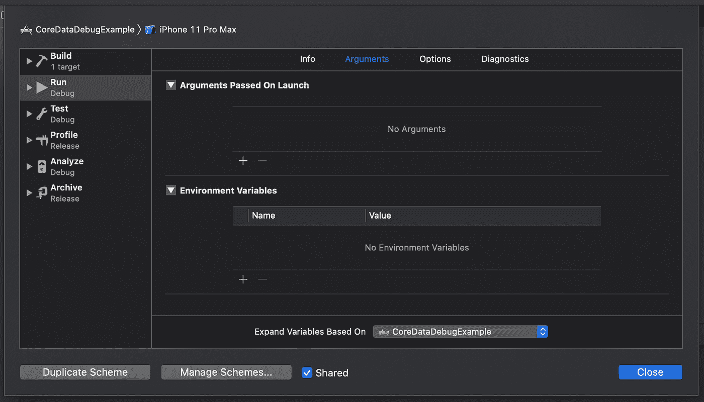
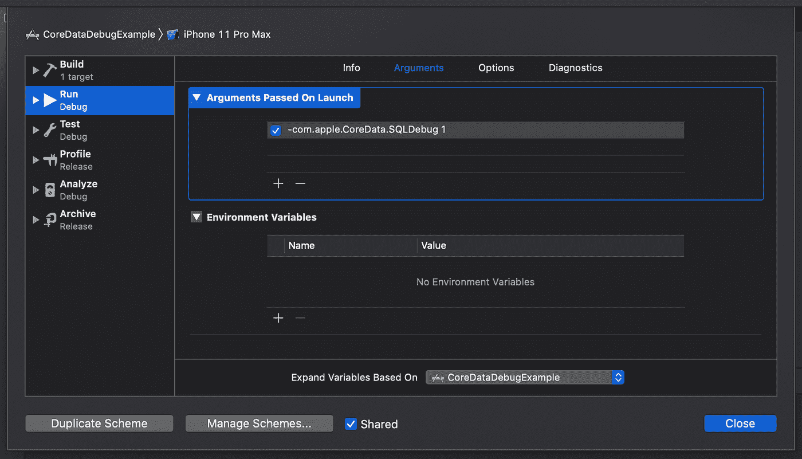

# 使用启动参数简化核心数据调试

> 原文：<https://betterprogramming.pub/using-launch-arguments-for-easier-core-data-debugging-d1b835b6e5b3>

## 我几乎每天都会用到的核心数据调试参数概述


SpaceX 在 [Unsplash](https://unsplash.com/) 上拍摄的

如果你在应用程序中使用核心数据，你可能会意识到你的设置变得越大越复杂，就越难调试。在这一点上，您可能开始对核心数据及其黑箱实现感到沮丧。你可能会认为你只需要相信核心数据会为你的应用做最理想的事情。

此外，您可能有一个包含多个托管对象上下文的设置，每个上下文都被限制在自己的线程中。当你的应用程序崩溃时，你会认为它与核心数据有某种关系，但你不确定如何调试它。尤其是因为你的应用只是偶尔崩溃，而不是一直崩溃。

在这篇文章中，我想向您展示一些与核心数据相关的启动参数，它们将帮助您调试和验证与核心数据相关的代码。让我们从使用启动参数开始，看看核心数据在幕后做了什么。接下来，我们将了解如何检测核心数据中的大多数线程问题。

# 了解核心数据在幕后的作用

有时，当您使用核心数据时，您希望打开底层的 SQLite 文件，以查看您的数据是否真正按照预期存储。或者，您可能想要检查数据库结构。为此，您需要知道核心数据存储 SQLite 文件的位置。当你在模拟器上运行时，这尤其具有挑战性。因为说实话，我们不知道我们的模拟器的 UUID 是什么，而且我们肯定不希望每次需要找到我们的 SQLite 文件时都必须找出它的位置。

幸运的是，您可以使用一个启动参数来获取核心数据，以便将一些信息记录到控制台。要添加启动参数，使用 Xcode 顶部的菜单进入*产品- >方案- >编辑方案… (cmd + > )* 。选择*运行*配置，并转到*参数*选项卡，如下图所示:



要获取核心数据以将信息记录到控制台，请单击*启动参数*下的+按钮，并添加以下参数:

```
-com.apple.CoreData.SQLDebug 1
```

结果应该是这样的:



如果在设置此启动参数后运行 Core Data 应用程序，Core Data 将开始记录基本信息，如支持 SQLite 文件的存储位置和执行的查询。

您可以将日志级别一直增加到第四级。在这一点上，核心数据将记录你可能想知道的关于引擎盖下正在发生的事情和更多的一切。例如，这可能有助于您注意到核心数据正在执行大量 SQLite 查询来获取对象关系。基于这一发现，您可以通过设置获取请求的`relationshipKeyPathsForPrefetching`属性来决定某些获取请求应该自动获取某些关系。

出于好奇，下面的列表描述了不同的核心数据 SQLDebug 日志级别:

1.  SQL 语句及其执行时间
2.  语句中绑定的值
3.  已提取托管对象 id
4.  SQLite 解释语句

这四个日志级别为您提供了大量信息，可用于改进您的应用程序。当然，某些日志级别(比如四级)的有用性完全取决于您对 SQLite 的了解。但是，即使您不精通 SQLite，我也建议您有时查看一下所有的日志级别。他们可以产生一些有趣的输出。

# 检测核心数据中的线程问题

核心数据可能遇到的最大挫折之一是线程问题导致的随机崩溃。您应该只在创建托管对象的线程上使用托管对象上下文和托管对象，违反这条规则可能会使您的应用程序崩溃。但是，通常你的应用不会崩溃，一切都很好。但时不时会出现随机崩溃。您可以看出它与核心数据相关，但是您可能不确定错误到底来自哪里。

幸运的是，Core Data 团队已经想到了一种方法来帮助您摆脱这些崩溃。在 Xcode 中，可以添加`-com.apple.CoreData.ConcurrencyDebug 1` Launch 参数，以一种额外严格的模式运行核心数据。每当核心数据遇到线程违规，你的应用就会立刻崩溃，Xcode 会指出违规发生的确切行。

我可以推荐每个人在开发中使用这个启动参数，因为它将帮助您尽早发现线程问题。这也迫使你立即修复它们，而不是在你的应用程序已经发布到应用程序商店时得到一些令人讨厌的惊喜。

# 概括起来

虽然您不能用调试标志消除所有的错误和性能问题，但它确实有助于您使用一些工具来使您的问题更加明显。无论是违反 Core Data 的线程规则导致应用崩溃，还是深入了解 Core Data 在幕后执行的不同 SQLite 查询，了解代码在幕后的行为总是有好处的。

我希望这些调试标志将帮助您节省大量时间，就像它们为我做的一样。