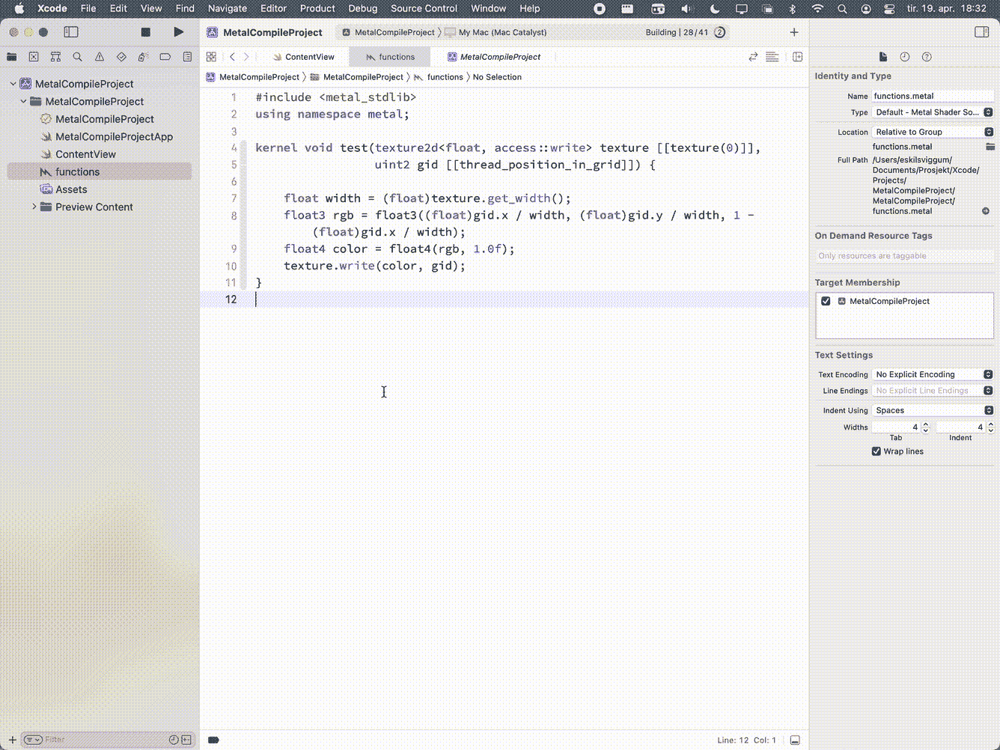
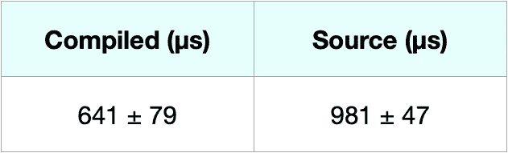

# 在 Swift Playgrounds 4 中使用金属

> 原文：<https://betterprogramming.pub/using-metal-in-swift-playgrounds-4-e100122d276a>

## *让金属在雨燕游乐场像鸟儿一样歌唱的两种变通方法*


生病:苹果公司。

Swift Playgrounds 4 是一个巨大的更新，将 SwiftUI 中的完整应用程序开发带到了 iPad 上，并使应用程序更快、更好地使用。虽然 Playgrounds 很适合原型开发和移动工作，但它缺少一些高级开发功能，如 Metal。

本文将展示在 Swift Playgrounds 4 中为应用程序项目和游戏场所制作 Metal 的两种方法。

# 在 Xcode 中编译金属库

一种选择是在 Xcode 中编译 Metal 源代码，并将编译后的库复制到 Playgrounds。

这在处理 Metal 源代码时保留了代码完成和语法突出显示，并且执行速度更快。然而，这种方法可能相当麻烦，并且只能在一个平台上工作(相同的编译库不能在 iOS 和 macOS 上工作)。

该过程如下:

1.  在 Xcode 中打开一个新的 iOS 项目
2.  创建一个新的`.metal`文件并编写你的着色器
3.  为您的平台构建项目
4.  按产品>在 Finder 中显示构建文件夹，并导航至`Products/Debug-[platform]`。例如，为 Mac Catalyst 生产路径`Products/Debug-maccatalyst`。
5.  右键点击你的应用并选择`Show Package Contents`，然后复制文件`default.metallib`(可能位于资源文件夹中)
6.  然后在雨燕游乐场。如果你有一个应用程序:将文件粘贴到应用程序的 *Resources* 文件夹中(或者将文件拖到 playgrounds-app 中)。如果您有一个游戏场:将文件粘贴到游戏场的`Edits/UserResources` 中(或选择带有文件文字的文件)
7.  使用`device.makeDefaultLibrary()!`编写代码来执行你的 metal 功能，就像在普通应用程序中一样



在 Xcode 中编译 Metal-source 并复制编译后的库。位于<build-folder>/产品/调试- <platform>。</platform></build-folder>

## **优势**

*   保留代码完成和语法突出显示
*   执行速度更快(如果您真的需要优化)

## **限制**

*   笨重的
*   只能在编译平台上运行。

# 将金属源作为资源储存

另一种方法是将 Metal-source 明文存储为资源，并在设备上编译。

这里的好处是，你可以在操场上编辑着色器，操场将跨平台工作。如果您在 Xcode(或语言设置为 c++的不同编辑器)中打开着色器，您将获得语法高亮显示。

方法是这样的:

1.  创建一个新的文本文件，并编写您的着色器。注意，你可以用`.metal`结束文件，但是这在 playgrounds 应用程序中不起作用——应用程序将无法编译。
2.  如果你有一个应用程序:将文件粘贴到应用程序的`Resources`文件夹中(或者将文件拖到 playgrounds-app 中)。如果你有一个游戏场:将文件粘贴到你的游戏场的`Edits/UserResources` (或者选择一个带有文件文字的文件)
3.  使用`try device.makeLibrary(source: String, options: MTLCompileOptions?)`编写代码来执行你的金属功能，就像在普通应用程序中一样

```
let file = #fileLiteral(resourceName: "<Name of your metal-source>")

let libraryData = try! Data(contentsOf: file)
let libraryStr = String(data: libraryData, encoding: .utf8)!
let library = try device.makeLibrary(source: libraryStr, options: nil)
```

## **强项**

*   源可以在 Swift Playgrounds 编辑
*   适用于任何平台

## **限制**

*   没有语法突出显示，也没有代码完成
*   执行速度稍慢

用 Xcode 编译这个库会稍微加快执行速度。我做了一个测试来比较在 Swift Playgrounds 中使用上述两种方法加载一个金属库所需的时间。该测试是在 M1 Mac 电脑上的 Swift Playgrounds 4.0 中进行的，使用金属着色器计算 11 行代码。结果的数量级为微秒(即小于毫秒)，但表明在 Xcode 中编译会更快地加载库。



使用两种方法比较 playground 在 M1 Mac 上加载金属库的时间。

这是在 Swift 游乐场制造金属制品的两种方法。如果已经有一个完成的 Metal 库，在 Xcode 中编译 Metal-library 可能是首选，而如果需要在操场上开发期间编辑源代码，则将 Metal-source 存储为资源是首选。