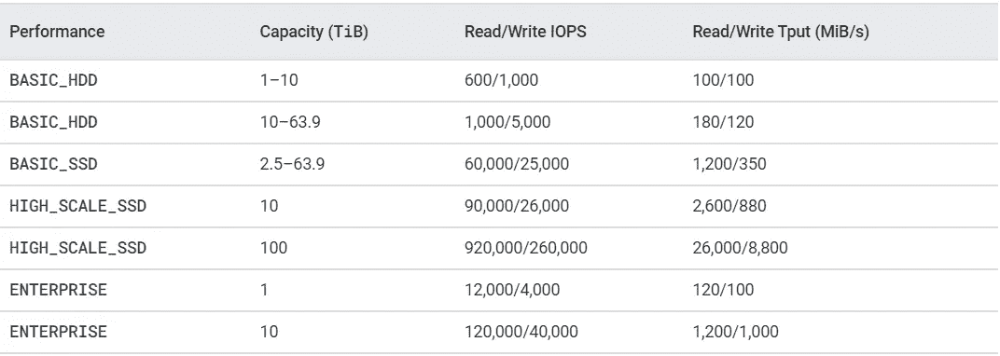
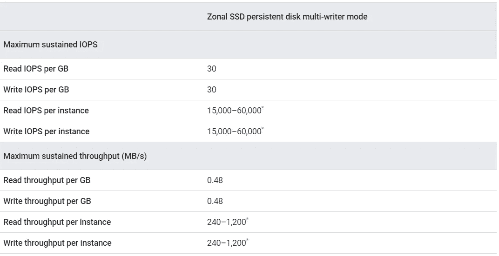
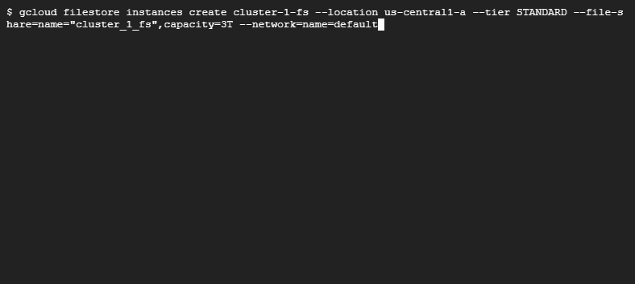
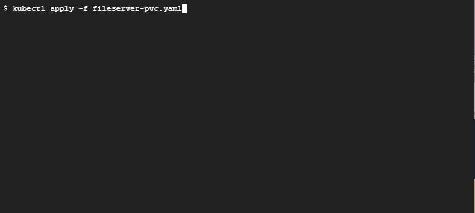
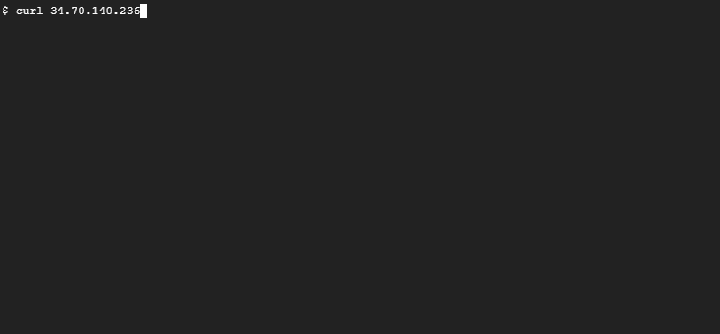

# 在读写多模式下跨 pod 使用 NFS 永久卷

> 原文：<https://betterprogramming.pub/using-nfs-persistent-volumes-across-pods-in-readwritemany-mode-357a41eed6c9>

## 将 Google Filestore 作为 NFS 共享安装到多个 pod


[亨利&公司](https://unsplash.com/@hngstrm?utm_source=medium&utm_medium=referral)在 [Unsplash](https://unsplash.com?utm_source=medium&utm_medium=referral) 上拍摄的照片

网络文件共享或 NFS 是通过网络提供的块存储。在它的帮助下，您可以跨多个主机装载相同的存储资源。它是在各种系统间存储和共享信息的绝佳选择。当您希望应用程序的多个实例在高可用性模式下工作时，它通常会有所帮助。

从性能角度来看，传统上，NFS 比基于 SAN 的永久磁盘要慢。然而，有了云中可用的托管服务，这个缺点就基本上被掩盖了。例如，以 GCP 的文件存储为例，它为不同类别的文件共享提供了以下 IOPs:



图片来自[谷歌云](https://cloud.google.com/filestore/docs/performance)

如果我们看一下持久性磁盘，您会看到:



图片来自[谷歌云](https://cloud.google.com/compute/docs/disks/performance)

如果您查看这两个表，您会发现在这两种情况下 IOPs 和吞吐量是相当的，因此，如果您选择托管 NFS 产品，您不会损失太多。

现在，开始动手练习。我们将创建一个新的 Google Filestore 文件共享，并使用一个`PersistentVolume`资源来访问它。然后我们将声称`PersistentVolume`使用了`PersistentVolumeClaim`资源。然后，我们将在一个`Deployment`中使用`PersistentVolumeClaim`，在这里我们将运行一个 Flask 应用程序的三个实例作为`Pods`。每个`Pod`将报告主机名和对特定应用程序的整体访问次数。所有三个`Pods`将从文件共享中的同一个文件读取和写入。那么，现在，事不宜迟，让我们看看先决条件。

# 先决条件

在练习中，我们将使用 Google Kubernetes 引擎(GKE)集群和 Google Filestore 文件共享。因此，你自然需要一个 GCP 账户。好消息是，如果你还没有注册，你可以注册三个月的 GCP 免费试用。

您还需要分叉[这个](https://github.com/bharatmicrosystems/k8s-nas-pvc-gcp-fs)存储库，克隆它，并`cd`到其中进行练习。现在，让我们继续下一步创建 GKE 群集。

# 创建 GKE 集群

要创建 GKE 集群，请使用以下命令:

```
$ gcloud container clusters create cluster-1 --zone us-central1-a
```


这需要几分钟的时间，您应该已经启动并运行了 GKE 集群。接下来，我们需要创建一个文件存储实例。

# 创建文件存储实例

我们将创建一个具有`3TB`容量的`STANDARD`层文件存储实例，因为这只是一个演示。您可以使用适合您的使用情形和性能要求的层。

要创建文件存储，请使用以下命令:

```
$ gcloud filestore instances create cluster-1-fs --location us-central1-a --tier STANDARD --file-share=name="cluster_1_fs",capacity=3T --network=name=default
```



如我们所见，文件存储已创建。现在，让我们开始创建 Kubernetes 资源。

# 创建 Kubernetes 资源

我们首先必须创建一个指向我们创建的文件共享的`PersistentVolume`，并创建一个`PersistentVolumeClaim`来声明它。

## 创建持久卷和声明

在此之前，我们需要文件共享中的一些细节。让我们使用以下命令来列出它:

```
$ gcloud filestore instances list
```


然后我们可以在`PersistentVolume`规范中使用这些细节。我们还需要声明`PersistentVolume`使用了我们将要使用的`PersistentVolumeClaim`资源。结合这两者，我们有以下清单:

在`PersistentVolume` `spec`部分，我们已经定义了:

*   `3TB`中的一个`capacity`。这是我们在创建 Filestore 实例时指定的大小。
*   `accessModes`段有`ReadWriteMany`，表示多个`Pods`可以从这个`PersistentVolume`同时读写。
*   在`nfs`部分中，我们有包含文件共享名的`path`和应该包含文件存储的`IP_ADDRESS`。用它替换`<YOUR_NAS_ENDPOINT>`占位符。

`PersistentVolumeClaim` `spec`部分定义如下:

*   `accessModes`设置为`ReadWriteMany`
*   `storageClassName`设置为`""`。我们不想使用`default`T3，而是想声明一个自定义`PersistentVolume`。
*   `volumeName`设置为`fileserver-pv`。这将`PersistentVolumeClaim`映射到我们定义的`PersistentVolume`。
*   我们还在这里请求一个资源`3TB`。

现在，让我们继续使用以下命令应用清单:

```
$ kubectl apply -f fileserver-pvc.yaml
```



正如我们所见，`PersistentVolume`是可用的，并且绑定到了`PersistentVolumeClaim`。因此，我们现在可以开始部署应用程序了。

# 部署应用程序

该应用程序是一个简单的 Python Flask 应用程序，它返回访问计数。以下是`app.py`文件:

正如我们从代码中看到的，它试图从文件`/data/count`中读取最新的访问计数，将数字递增`1`，并返回该值，同时将更新后的值写入文件。为了确保多个实例不会同时修改文件，write 函数中有一个锁定、修改和解锁模式。

现在，这个应用程序已经构建好了，可以在 DockerHub 上使用。因此，我们将使用以下清单来部署它:

清单由一个`Deployment`和一个`Service`资源组成。`Deployment`资源运行我们应用程序的三个副本，它们都使用`fileserver-pvc` `PersistentVolumeClaim`。这意味着所有的副本可以同时从同一个文件系统中读取和写入。

`Service`资源只是在负载均衡器的端口`80`上公开应用程序。因此，我们应该能够使用负载平衡器 IP 地址从外部访问服务。

现在，让我们继续使用以下命令应用清单:

```
$ kubectl apply -f app-deployment.yam
```


现在，`Pods`正在运行，`Service`有一个外部 IP，我们可以开始测试了。

# 测试部署

我们将使用`curl`访问服务的外部 IP，我们应该会看到负载在三个`Pods`之间大致均衡。我们还应该看到访问计数器随着每次点击而增加，而不管点击的`Pod`是什么。

让我们使用下面的命令来点击`Service`:

```
$ curl <External_Service_IP>
```



正如我们所见，当我们点击端点十次时，每次点击计数都会增加一，同时我们还可以观察到响应来自不同的`Pods`。这意味着所有三个`Pods`都是指文件共享中相同的事实来源。这就是`ReadWriteMany`模式 PVC 为您带来的效果。

# 结论

使用 Google Filestore 这样的托管服务作为`ReadWriteMany` PVC 的 NFS，是一个非常高性能的选择，尤其是当您需要在您的环境中进行 HA 配置而又不使您的应用程序设计复杂化的时候。

感谢阅读！我希望你喜欢这篇文章！