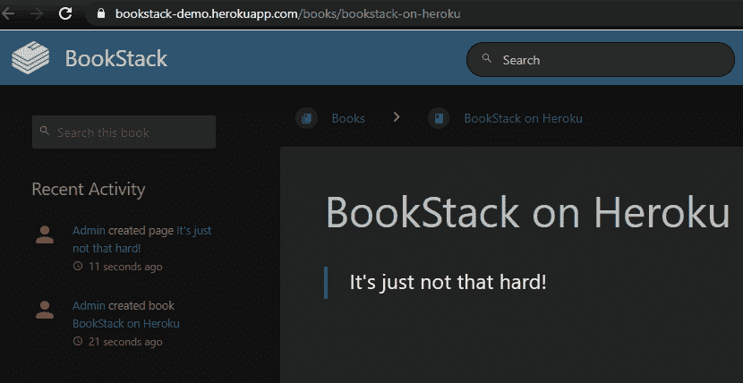
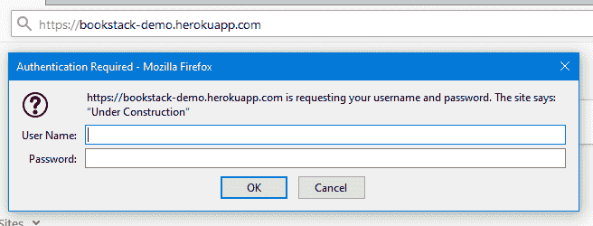
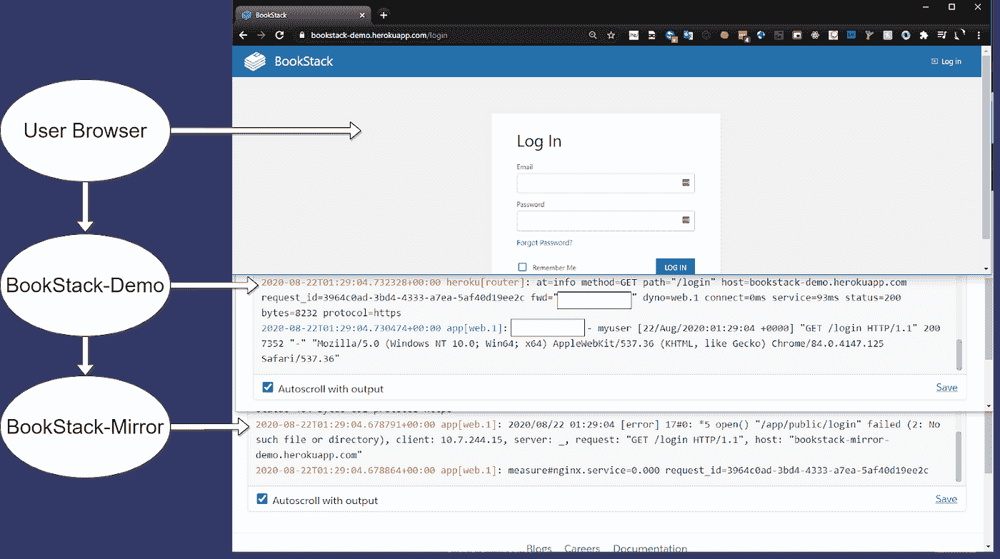

# 使用 nginx 定制对托管应用的控制

> 原文：<https://betterprogramming.pub/using-nginx-to-customize-control-of-your-hosted-app-a51ead874f22>

## 深入了解 nginx 和 Heroku


马特·里姆斯在 [Unsplash](https://unsplash.com?utm_source=medium&utm_medium=referral) 上的照片

开源应用程序的多样性既是自由和开源软件([【FOSS】](https://en.wikipedia.org/wiki/Free_and_open-source_software))运动中最大的福音，也是采用的最大障碍。您并不总是拥有您正在使用的应用程序，它通常带有软件作者有意或无意强加的某些观点和限制。

反向代理是重新控制这些产品的实现细节的一种方法。通过将数据过滤到支持第 7 层(或应用程序级)的处理器中，您可以操纵、加密和解密、重定向以及控制发往您的服务的数据如何流动和运行。

# nginx 是什么，为什么需要它？

控制这些数据的一个很好的例子是 nginx。nginx 是一款开源 web 服务器，在负载平衡和流量代理方面处于世界领先地位。它附带了大量的插件和功能，可以使用一个轻量级且易于理解的包来定制应用程序的行为。

根据 [Netcraft](https://news.netcraft.com/archives/category/web-server-survey/) 和 [W3Techs 的数据，](https://w3techs.com/technologies/overview/web_server) nginx 为大约 31%-36%的活跃网站提供服务，与 Apache 并驾齐驱，成为世界上最受欢迎的网络服务器。这意味着它不仅备受尊重、值得信赖、对大部分生产系统来说足够高的性能，而且几乎可以与任何体系结构兼容，它还拥有支持该项目的工程师和开发人员的忠实追随者。这些是考虑应用程序寿命、可移植性和托管位置的关键因素。

# Heroku 和 nginx

让我们看一个可能需要 nginx 的情况。在我们的例子中，您已经创建了一个应用程序，并将其部署在平台即服务(PaaS)上——在我们的例子中，是 [Heroku](https://www.heroku.com) 。有了 PaaS，您的生活变得更加轻松，因为已经为您做出了关于基础架构、监控和可支持性的决策，保证了您有一个干净的环境来轻松运行您的应用程序。然而，要获得 PaaS 的这些好处，您的应用程序必须符合供应商的约束。

当您自己编写定制代码时，这不是问题:只需添加基础设施所需的挂钩，您就可以开始比赛了。然而，当您需要使用不适合这种基础设施的第三方服务或产品时，比如我们下面的示例 BookStack，设计这种集成的唯一方法可能是使用 nginx 这样的中间层流量操纵器。

因此，让我们看看在 Heroku 中使用 nginx 定制应用程序行为的三种方式。

1.  在容器运行时动态分配服务器端口
2.  向应用程序添加基本身份验证
3.  镜像流量以测试应用程序更改，而不会影响您的生产服务

# 中间层动态端口绑定

首先，让我们看看动态端口绑定。为了向 Heroku 的 web dynos 提供流量，您需要访问一个名为`PORT`的环境变量。此变量会随着每次部署而变化，并且不会在应用程序启动前公布。对于任何无法绑定到这种动态端口的服务，这都是一个明显的障碍。

Heroku 确实提供了可以自动部署和配置这样一个中间层的构建包，但是动态变量的解决方案可能并不总是这么简单。有时候，我们可能需要在没有供应商帮助的情况下解决这个或类似的问题。因此，让我们看看如何使用 BookStack 手动构建一个解决方案，将静态配置的应用程序转换为动态配置的应用程序。

[BookStack](https://www.bookstackapp.com/) 是一个自称是固执己见的维基系统，建立在 Laravel 上，带有 MySQL 后端。BookStack 已经从应用程序部署人员手中拿走了几个设计考虑因素，以简化其整体支持架构，并防止 wiki 页面的兔子洞在最需要的时候永远找不到。

为了做好准备，我们需要从 BookStack 和 nginx 的官方文档中收集一些片段，将 docker 文件和一些基本的搭建文件放在一起。你可以在这里看到整个项目:[https://github.com/Tokugero/bookstack-demo.](https://github.com/Tokugero/bookstack-demo)

让我们看看 docker 文件:

## Dockerfile 文件

```
FROM debian:stable-slim
ENV PORT="80"
ENV APP_URL="http://localhost/"
ADD https://github.com/BookStackApp/BookStack/archive/release.zip /bookstack/
ADD https://getcomposer.org/installer /root/composer-setup.php
RUN apt-get update && \
  apt-get install -y \
  unzip \
  php-cli \
  php-mbstring \
  php7.3-curl \
  php7.3-dom \
  php7.3-gd \
  php7.3-mysql \
  php7.3-tidy \
  php7.3-xml \
  php-fpm \
  nginx && \
  apt-get clean && \
  rm -rf /var/lib/apt/lists/*
RUN unzip /bookstack/release.zip -d / && \
  rm /bookstack/release.zip && \
  php /root/composer-setup.php --install-dir=/usr/local/bin --    filename=composer && \
  mkdir -p /var/lib/nginx && \
  touch /run/nginx.pid && \
  touch /var/log/php7.3-fpm.log
COPY config/bookstack.env /BookStack-release/.env
COPY config/nginx.conf /etc/nginx/nginx.conf
COPY scripts/run.sh /BookStack-release/run.sh
COPY config/nginx.htpasswd /BookStack-release/.htpasswd
RUN cd /BookStack-release && \
  composer install --no-dev && \
  chown -R www-data:www-data /BookStack-release/ && \
  chown -R www-data:www-data /etc/nginx/ && \
  chown -R www-data:www-data /var/lib/nginx/ && \
  chown -R www-data:www-data /etc/php/7.3/fpm/ && \
  chown www-data:www-data /run/nginx.pid && \
  chown www-data:www-data /var/log/php7.3-fpm.log && \
  chmod 600 .htpasswd
USER www-data
WORKDIR /BookStack-release/
ENTRYPOINT ["./run.sh"]
```

## 脚本/run.sh

```
#!/bin/bash
sed -i -e 's/$PORT/'"$PORT"'/g' /etc/nginx/nginx.conf
sed -i -e 's,APPURL,'${APP_URL}',g' /BookStack-release/.env
sed -i -e 's,listen = /run/php/php7.3-fpm.sock,listen = 127.0.0.1:9000,g' /etc/php/7.3/fpm/pool.d/www.conf
sed -i -e 's,pid = /run/php/php7.3-fpm.pid,pid = php7.3-fpm.pid,g' /etc/php/7.3/fpm/php-fpm.conf
cd /BookStack-release/ && \
   echo yes | php artisan key:generate && \
   echo yes | php artisan migrate
php-fpm7.3 & \
   nginx -g 'daemon off;'
```

## config/nginx.conf

```
worker_processes  4;
error_log  /dev/stderr;
user www-data;
include /etc/nginx/modules/*.conf;
events {
  worker_connections  4096;  ## Default: 1024
}http {
  include    /etc/nginx/fastcgi.conf;
  include    /etc/nginx/mime.types;
  index    index.html index.htm index.php;
  default_type application/octet-stream;
  access_log   /dev/stdout;
  sendfile     on;
  tcp_nopush   on;
  server {
    #This is updated via sed in ./scripts/run.sh at runtimelisten           $PORT;
    server_name  _;
    root         /BookStack-release/public;
    client_max_body_size 0;
    location / {
      index index.php;
      try_files $uri $uri/ /index.php?$query_string;
    }
    location ~ \.php$ {
      fastcgi_split_path_info ^(.+?\.php)(/.*)$;
      if (!-f $document_root$fastcgi_script_name) {
        return 404;
      }
      # Mitigate https://httpoxy.org/ vulnerabilities
      fastcgi_param HTTP_PROXY "";
      fastcgi_pass 127.0.0.1:9000;
      fastcgi_index index.php;
      # include the fastcgi_param setting
      include fastcgi_params;
      # SCRIPT_FILENAME parameter is used for PHP FPM determining
      #  the script name. If it is not set in fastcgi_params file,
      # i.e. /etc/nginx/fastcgi_params or in the parent contexts,
      # please comment off following line:
      fastcgi_param  SCRIPT_FILENAME   $document_root$fastcgi_script_name;
    }
  }
}
```

## `config/bookstack.env`

```
APP_KEY=replaceme
APP_URL=APPURL
```

现在这看起来很多，但是让我们分解一些组成核心功能的更重要的部分。

docker 文件有许多行主要用于安装应用程序本身。这些可以在官方的 BookStack 文档中找到，用于手动安装他们的服务和一些额外的包。目标是让环境适合他们的应用。为了使服务更加动态，包括了三条特定的线路:

```
...
ENV PORT="80"
ENV APP_URL="[http://localhost/](http://localhost/)"
...ENTRYPOINT ["./run.sh"]
```

这将设置一个默认的环境变量，并调用一个任意的 shell 脚本，在运行时用环境值替换 nginx 配置文件值。有了它，我们可以随心所欲地定制这个应用程序。我们现在可以在本地实例化服务，而不是硬编码变量来运行该服务:

```
docker run -it -d -e APP_URL=http://localhost:9876 -e PORT=8080 -p 9876:8080 bookstack-demo
```

请注意，我们现在可以在运行时声明端口，而无需对应用程序本身进行任何特殊配置——这是在 Heroku 的 web dynos 上公开服务的核心要求。为了传递这些变量，我们简单地利用`sed`在运行时用硬编码的值替换环境变量。

```
sed -i -e 's/$PORT/'"$PORT"'/g' /etc/nginx/nginx.conf;
sed -i -e 's,APPURL,'${APP_URL}',g' /BookStack-release/.env;
```

在启动容器主命令的`run.sh`脚本中，我们可以使用流编辑器/sed 替换 nginx 配置文件以及应用程序专用环境文件中的预定义变量。当我们在 nginx 初始化之前这样做时，我们保证应用程序是从 Heroku 定义的端口启动的，在容器被激活之后。

以及最后一个部署命令:

```
heroku container:push web -a bookstack-demo && heroku container:release web -a bookstack-demo
```



# 简单基本认证

如果没有特殊的插件，有些功能在我们新的基础设施环境中是不可用的。但是，也许我们需要一个简单的密码，以防止在项目构建的初始阶段任意请求访问我们的门户。nginx 自动包含了一大套功能，其中之一是基于每个服务器或每个位置的基本认证。这使得我们可以用密码保护我们的自由/开源软件应用程序，而不需要 Heroku 或 BookStack 做任何工作。

前面所有的调查工作都结束了，我们可以简单地在我们的项目中添加几行代码来强制对我们的应用程序进行基本的身份验证。通过使用`[auth_basic module](http://nginx.org/en/docs/http/ngx_http_auth_basic_module.html)`和 Apache 的`[htpasswd](https://httpd.apache.org/docs/2.4/programs/htpasswd.html)`工具，我们可以添加:

## config/nginx.conf

```
...location / {
  auth_basic"Under Construction";
  auth_basic_user_file /BookStack-release/.htpasswd;
  index index.php;
  try_files $uri $uri/ /index.php?$query_string;
}...
```

记得生成密码并将其包含在 Dockerfile 文件中:

```
bookstack-demo$ htpasswd config/nginx.htpasswd myuser
New password: mypass
Re-type new password: mypass
Updating password for user myuser
```

## Dockerfile 文件

```
...
COPY config/nginx.htpasswd /BookStack-release/.htpasswd
...
RUN cd /BookStack-release && \
...
chmod 600 .htpasswd
...
```

以下是我们现在尝试访问该应用程序时看到的内容:



# 高级交通阴影

我们的最后一个例子是一个特殊的 nginx 模块，[将](http://nginx.org/en/docs/http/ngx_http_mirror_module.html)流量镜像到您选择的任何位置(不影响原始请求的目的地)。这是一个测试代码重构、布局变化和其他真实生产流量变更的优秀工具。

## config/nginx.conf

```
server {
  mirror /mirror;
  mirror_request_body on;
  ...
  location = /mirror {
    resolver 1.1.1.1 valid=30s;
    internal;
    proxy_pass [https://bookstack-mirror-demo.herokuapp.com$request_uri;](https://bookstack-mirror-demo.herokuapp.com$request_uri;)
  }
...
```



# Heroku 本地工具

我们之前提到过 Heroku 的 nginx [buildpack](https://github.com/heroku/heroku-buildpack-nginx) 。它可以自动执行部分端口管理功能，让我们在没有 nginx 专门管理的功能的情况下立即投入运行。我们的例子直接与这种方法进行比较，但是本地工具允许在文档资源之间更少的来回切换。

为了生成我们的镜像站点，我们将利用 Heroku 的本地 buildpack 向任意项目添加 nginx 功能，而不需要上面示例中的所有自定义 dockerization。

只需生成一个新的存储库:

`mkdir bookstack-mirror-demo; cd bookstack-mirror-demo; git init;`

添加模板文件:

## config/nginx.conf.erb

```
daemon off;
# Heroku dynos have at least 4 cores.
worker_processes <%= ENV['NGINX_WORKERS'] || 4 %>;
events {
  use epoll;
  accept_mutex on;
  worker_connections <%= ENV['NGINX_WORKER_CONNECTIONS'] || 1024 %>;
}
http {
  gzip on;
  gzip_comp_level 2;
  gzip_min_length 512;
  server_tokens off;
  log_format l2met 'measure#nginx.service=$request_time   request_id=$http_x_request_id';
  access_log <%= ENV['NGINX_ACCESS_LOG_PATH'] ||   'logs/nginx/access.log' %> l2met;
  error_log <%= ENV['NGINX_ERROR_LOG_PATH'] || 'logs/nginx/error.log' %>;
  include mime.types;
  default_type application/octet-stream;
  sendfile on;
  # Must read the body in 5 seconds.
  client_body_timeout <%= ENV['NGINX_CLIENT_BODY_TIMEOUT'] || 5 %>;
  server {
    listen <%= ENV["PORT"] %>;
    server_name _;
    keepalive_timeout 5;
    client_max_body_size <%= ENV['NGINX_CLIENT_MAX_BODY_SIZE'] || 1 %>M;
    root /app/public; # path to your app
  }
}
```

## Procfile

`web: bin/start-nginx-solo`

将您的文件添加到 Heroku Git:

```
heroku git:remote -a bookstack-mirror-demo
git add *; git commit -am “Initial commit”
heroku buildpacks:add https://github.com/heroku/heroku-buildpack-nginx -a bookstack-mirror-demo
git push heroku master
```

您现在可以开始镜像您的流量和克隆您的服务！

# 结论

免费开源软件是任何定制应用程序套件的优秀构建模块。不管它在使用方式上的固有限制，它都可以被定制为在您的环境范围内工作。

希望您现在对如何将应用程序从它所在的任何框架中抽象出来，以及如何使用像 nginx 这样的中间层的巨大灵活性来增强您的应用程序有所了解。