# 使用 Nodemailer 从 Node.js 服务器发送电子邮件

> 原文：<https://betterprogramming.pub/using-nodemailer-to-send-emails-from-your-node-js-server-d726f73d0439>

## 加速您的网上邮寄过程


照片由 [Rinck 内容工作室](https://unsplash.com/@rinckad?utm_source=medium&utm_medium=referral)在 [Unsplash](https://unsplash.com?utm_source=medium&utm_medium=referral) 上拍摄。

在我们开始解释如何使用 [Nodemailer](https://nodemailer.com/about/) 之前，最好先了解一下它是什么，以及为什么要使用它。Nodemailer 是一个 Node.js 模块，允许您轻松地从服务器发送电子邮件。无论你是想和你的用户交流，还是想在出现问题时通知你自己，其中一个选择就是通过电子邮件。

有许多文章解释了如何以基本形式使用 Nodemailer，但本文不是其中之一。在这里，我将展示使用 Nodemailer 和 Gmail 从 Node.js 后端发送电子邮件的最常见实践。

# 入门指南

首先，我们需要使用 Express 设置 Node.js 样板文件。要确保安装了节点和 npm，您可以运行以下命令:

```
node -v
npm -v
```

如果这两个命令都显示了一个版本，那么就可以使用了。否则，安装缺少的部分。

为您的项目创建一个目录。我们将使用`nodemailerProject`:

```
mkdir nodemailerProject
```

进入新创建的目录并运行:

```
npm init
```

这将用一个`package.json`文件初始化我们的项目。

接下来，我们需要使用以下命令安装 Express:

```
npm install express
```

根据您指向哪个文件作为入口点(默认为`index.js`)，打开它并粘贴以下代码:

索引. js

以上是使用 Express 启动一个简单服务器所需的内容。通过运行以下命令，您可以看到它工作正常:

```
node index.js
```

# 节点邮件程序

使用以下命令安装 Nodemailer:

```
npm install nodemailer
```

Nodemailer 的 API 非常简单，需要我们做以下事情:

1.  创建一个`Transporter` 对象。
2.  创建一个`MailOptions` 对象。
3.  使用`Transporter.sendMail`方法。

为了创建一个`transporter`对象，我们执行以下操作:

*注意:除了用户密钥和通行密钥(这是您自己的 Gmail 帐户凭证)之外，其他三个密钥需要在设置 OAuth 后检索。*

正如我们在本文开头所述，我们将使用 Gmail 来满足我们的邮件发送需求。正如你可能已经猜到的，Gmail 对于用户帐户发送的邮件有很高的安全性。有许多方法可以克服这一障碍(有些方法比其他方法更好)，我们将选择一种需要我们在谷歌云平台上建立一个项目的方法。我们需要这样做，以便获得由 Gmail 启用的 OAuth 安全性的凭证。

如果你想了解更多关于使用 Gmail 和 Nodemailer 的复杂性，请看文档。

接下来的步骤将需要一些配置而不是编码，所以做好准备。


[丹尼尔·麦卡洛](https://unsplash.com/@d_mccullough?utm_source=medium&utm_medium=referral)在 [Unsplash](https://unsplash.com?utm_source=medium&utm_medium=referral) 上拍照。

# 谷歌云平台配置

如果你没有[谷歌云平台](https://console.cloud.google.com/home)账号，一定要做一个。完成设置后，单击左上角的下拉菜单创建一个新项目:


选择“新项目”选项:

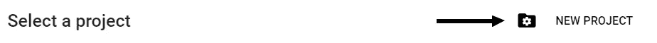

在下一个窗口中，我们必须为我们的项目命名。选择您喜欢的，但是我们将继续使用我们的 NodemailerProject 名称。对于位置属性，您可以将其保留为“无组织”

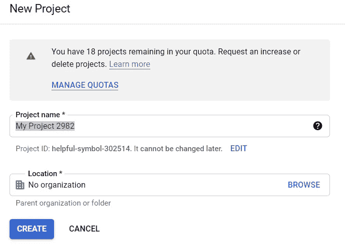

项目设置可能需要几秒钟，但之后，您将能够看到以下屏幕:

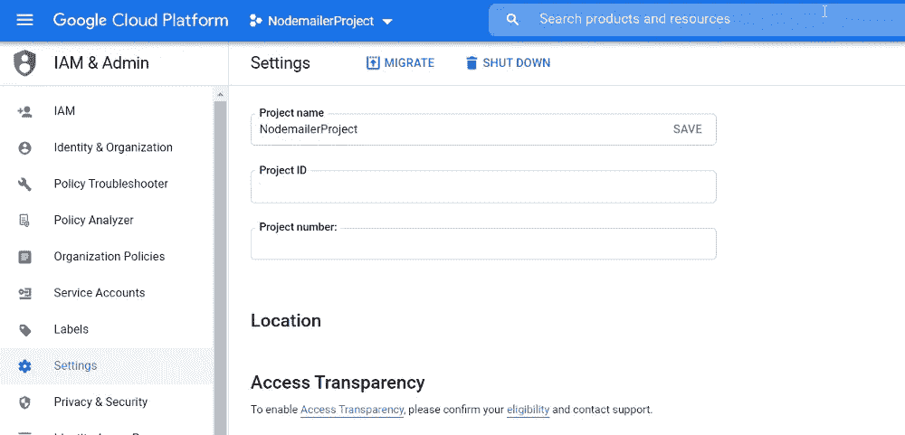

节点邮件程序项目

通过单击左上角的三条虚线打开导航菜单，并选择“APIs & Services”:

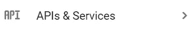

为了能够使用 Nodemailer 和 Gmail，我们必须使用 OAuth2。如果您不熟悉 OAuth，它是一种身份验证协议。我不会在这里讨论细节，因为没有必要，但如果你想了解更多，请访问 [OAuth 2.0](https://oauth.net/2/) 。

首先，我们必须配置 OAuth 同意屏幕:

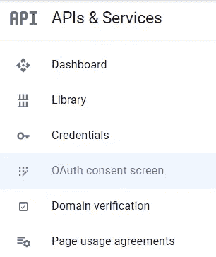

如果您不是 G-Suite 成员，唯一可用的选项将是“用户类型”的“外部”:


单击“创建”后，下一个屏幕要求我们填写应用程序的信息(我们的服务器):

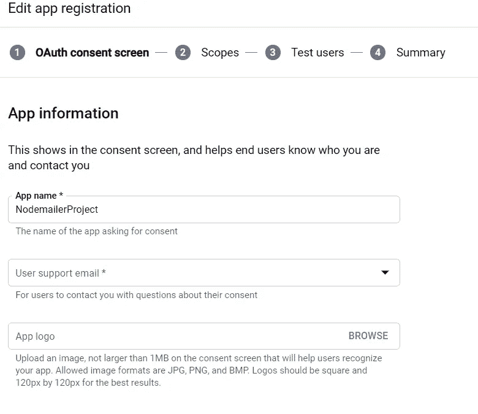

在“用户支持电子邮件”字段和“开发者联系信息”字段中填写您的电子邮件。单击“保存并继续”会将我们带到此配置的“范围”阶段。跳过这个阶段，因为它与我们无关，直接进入“测试用户”阶段。

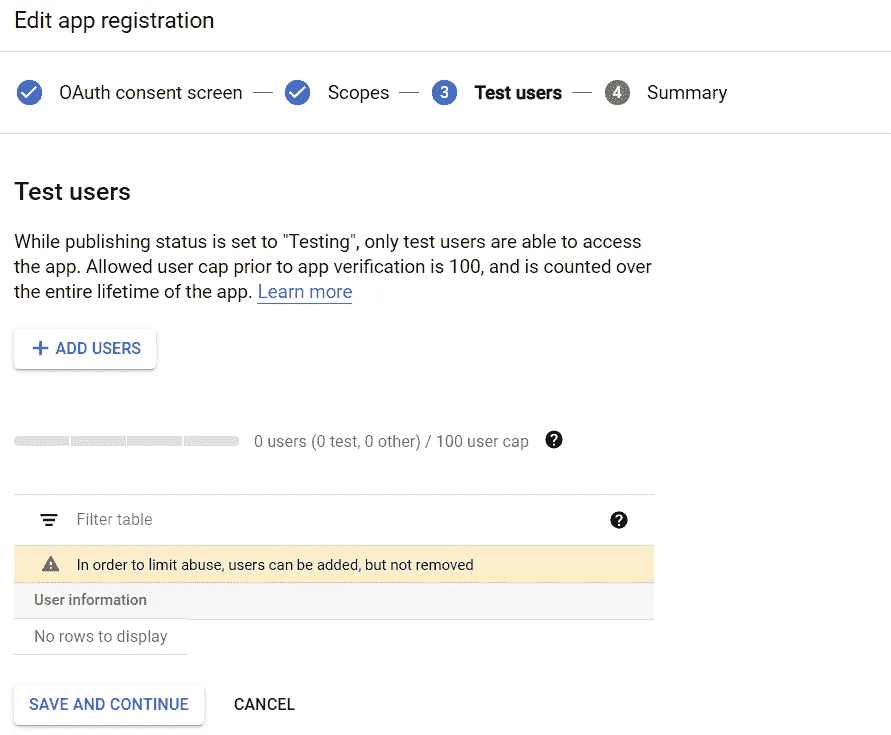

在这里，将您自己添加为用户，然后单击“保存并继续”

# OAuth 设置

在此阶段，我们将创建 OAuth 凭据以用于 Nodemailer。转到 OAuth 同意屏幕上方的凭证选项卡。单击带有文本“创建凭证”的加号，并选择 OAuth 客户端 ID。

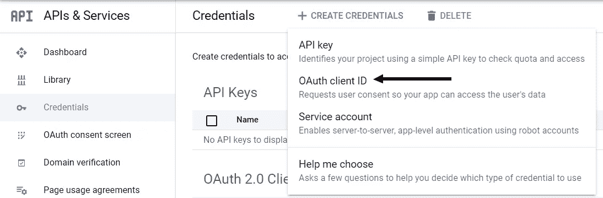

在“应用程序类型”下拉菜单中，选择“Web 应用程序”:

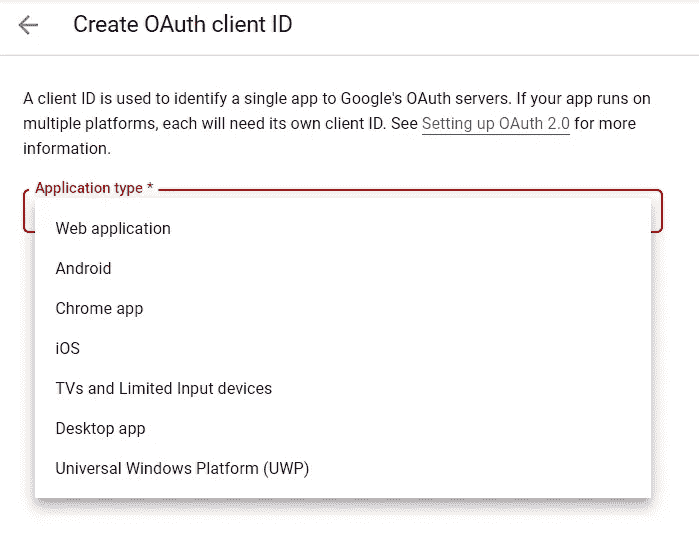

在“授权重定向 URIs”部分，确保添加了 [OAuth2 Playground](https://developers.google.com/oauthplayground/) ，因为我们将使用它来获取本文开头提到的密钥之一。

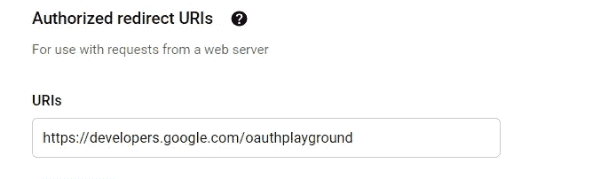

点击“创建”后，您将看到您的客户端 ID 和客户端密码。把这些留给自己，永远不要以任何方式、形状或形式暴露出来。


[动力赖](https://unsplash.com/@welipower?utm_source=medium&utm_medium=referral)在 [Unsplash](https://unsplash.com?utm_source=medium&utm_medium=referral) 上拍照。

# OAuth 刷新令牌

为了获得我们将在 Nodemailer 的`transporter`对象中使用的刷新令牌，我们需要前往 OAuth2 游乐场。我们在前期批准了这个 URI 用于这个特定的目的。

1.单击右侧的齿轮图标(这是 OAuth2 配置),并选中复选框以使用您自己的 OAuth2 凭据:

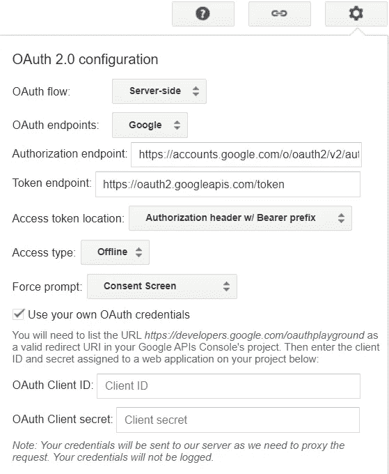

2.看向网站的左侧，你会看到一个服务列表。向下滚动，直到看到 Gmail API v1:

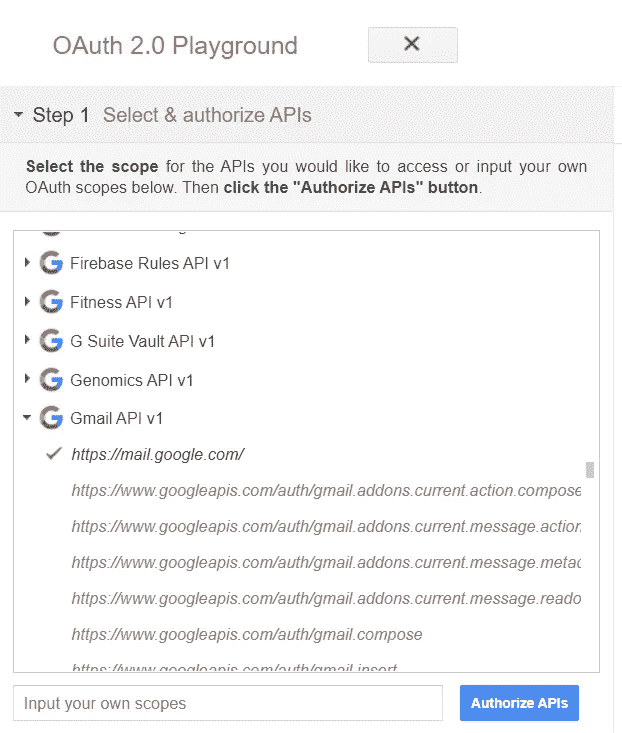

3.单击“授权 API”

4.您将看到一个屏幕，用于登录您的任何 Gmail 帐户。选择您列为测试用户的用户。

5.下一个屏幕会让你知道 Google 仍然没有验证这个应用程序，但是这是可以的，因为我们还没有提交它进行验证。点击“继续”

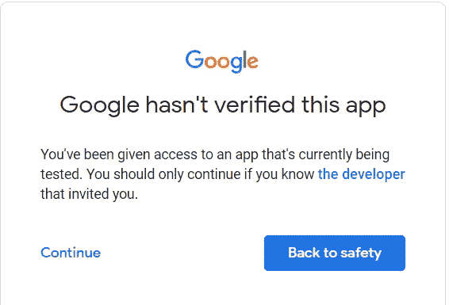

6.在下一个屏幕中，您将被要求授予您的项目与您的 Gmail 帐户交互的权限。这样做。

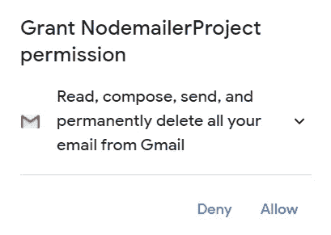

7.完成后，您将被重定向回 OAuth 游乐场，您会注意到左侧菜单中有一个授权代码。单击标有“用授权码兑换令牌”的蓝色按钮

8.现在将填充刷新令牌和访问令牌的字段

# 回到服务器

完成所有这些配置后，我们可以返回到我们的应用程序，并将所有数据输入到`transporter`创建中。为了让你的所有凭证保密，你可以使用 [dotenv 包](https://www.npmjs.com/package/dotenv)。不要忘记将您将要创建的`.env`文件添加到`.gitignore`中。

所以，现在我们有了这个:

接下来，我们将创建`mailOptions`对象，它保存了将电子邮件发送到哪里以及使用什么数据的详细信息。

> ✋将上述配置更改为您的电子邮件设置

这个对象可以有更多的字段，甚至可以有多个接收者，但是我们不会在这里深入讨论。

最后，我们将使用`sendMail`方法:

运行您的应用程序，您将看到您的收件箱被一封新邮件填充。

# 结论

本文的灵感来自我创建的一个使用 Nodemailer 的项目。请查看以下内容:

[](https://github.com/TomerPacific/ProjectChecker) [## to mer Pacific/项目检查器

### 检查我的所有其他项目状态的项目 Permalink 未能加载最新提交信息。一个项目…

github.com](https://github.com/TomerPacific/ProjectChecker)