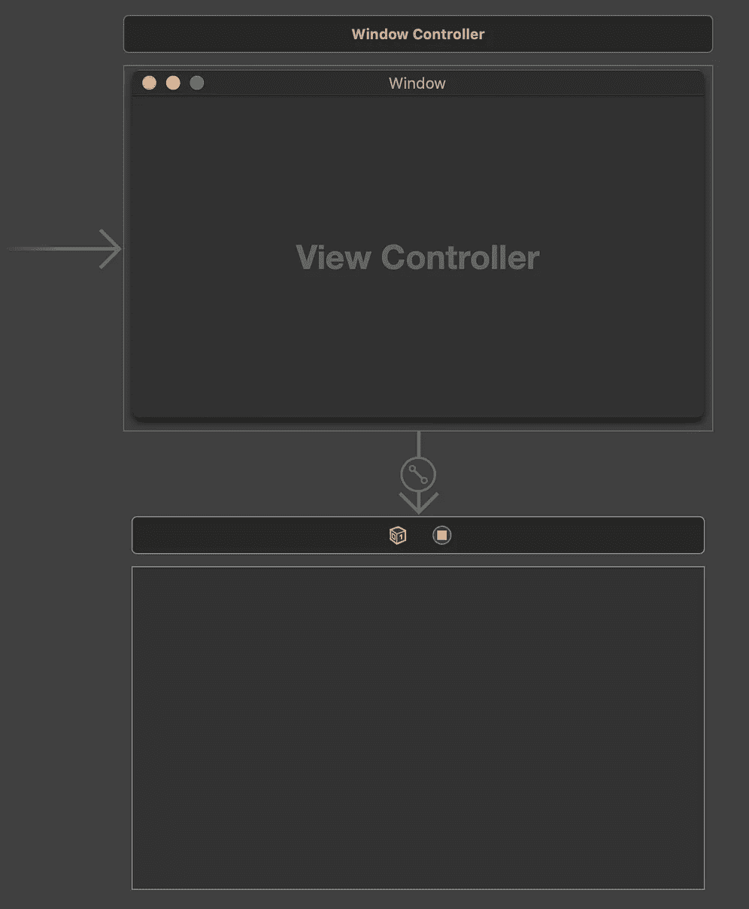
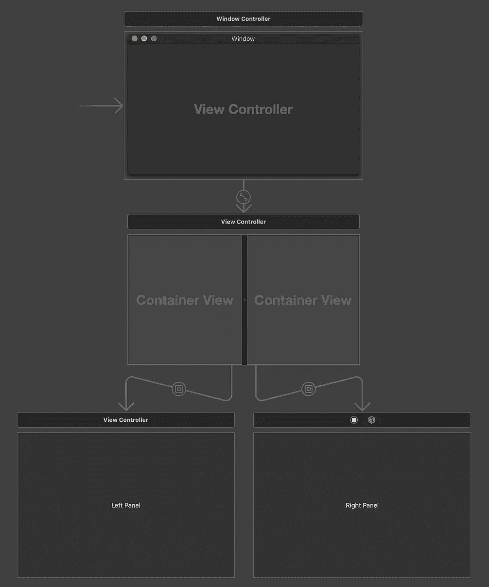
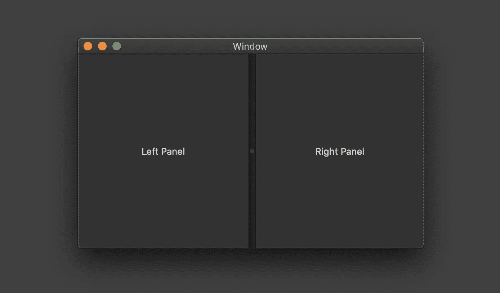
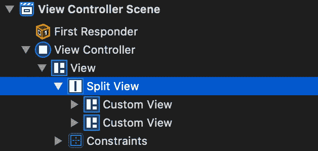
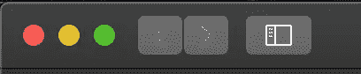
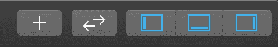
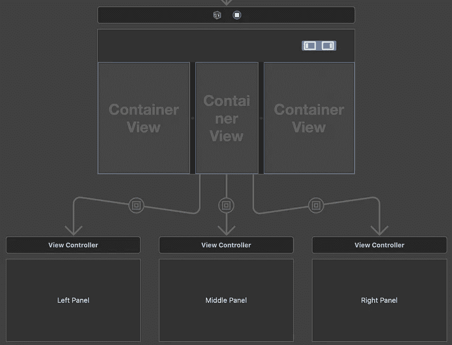
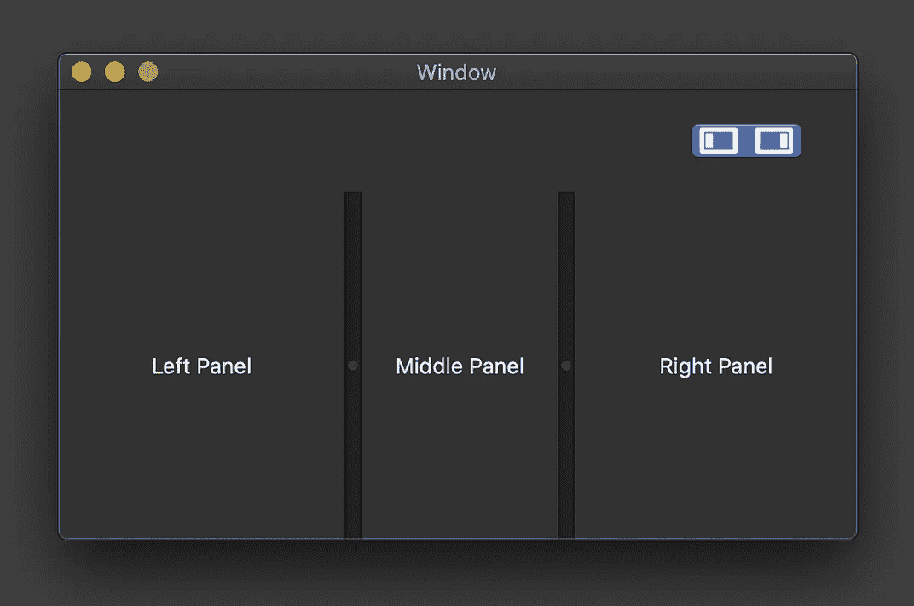
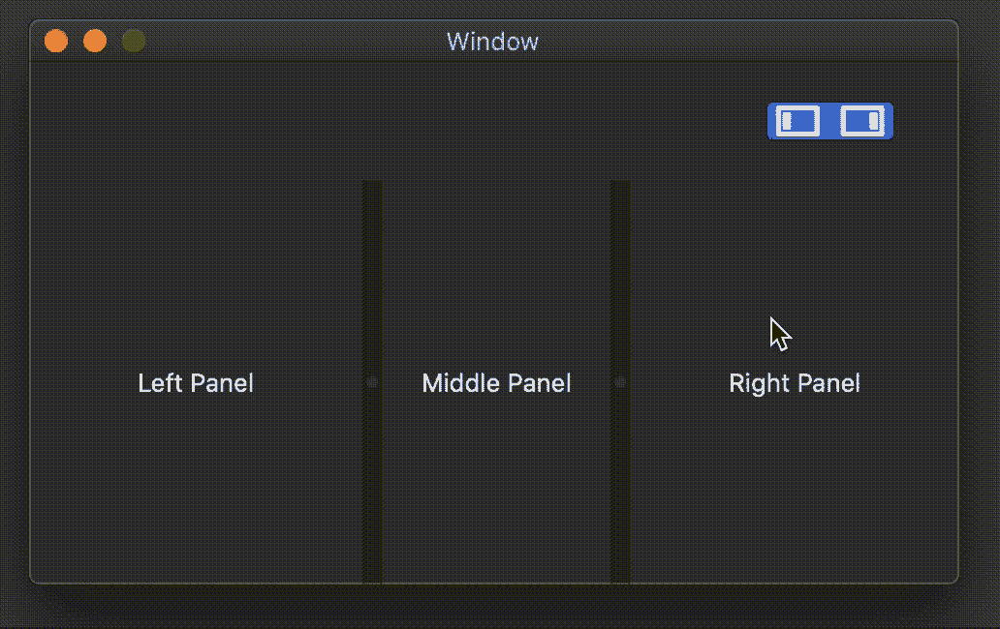
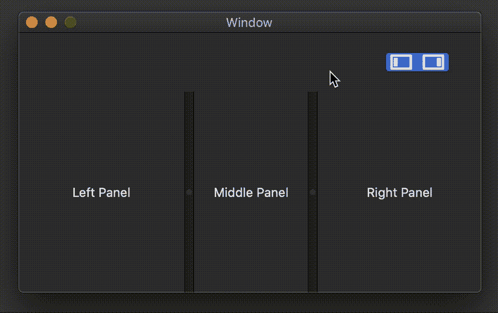

# 如何在 macOS 应用程序中使用 NSSplitView

> 原文：<https://betterprogramming.pub/using-nssplitview-in-an-macos-app-bbe2438bfe3e>

## 拆分视图以获得更多功能

由[彼得罗·德·格兰迪](https://unsplash.com/@peter_mc_greats?utm_source=unsplash&utm_medium=referral&utm_content=creditCopyText)在 [Unsplash](https://unsplash.com/s/photos/half?utm_source=unsplash&utm_medium=referral&utm_content=creditCopyText) 上拍摄的照片

许多 macOS 应用程序(如 Safari、Finder、Mail 和 Xcode)使用拆分视图将其内容分成单独的区域。这允许用户自己决定如何调整应用程序的不同部分。

作为一个 iOS 背景的人，我很惊讶关于 macOS 开发的参考资料、文章和文档如此之少；因此，我决定写下我关于如何使用`NSSplitView`的实验。

在本教程中，我们将首先通过故事板添加一个分割视图，并看看如何添加更多的面板。接下来，我们将探索如何重新创建 Xcode 的分段控制，以编程方式显示和隐藏这些区域。为了改善折叠面板和展开面板之间的过渡，我们将添加一个动画。最后，我们将了解如何检测用户何时手动调整面板大小，以及如何在分段控件中反映这一更新。

# 添加 NSSplitView

让我们从添加一个`NSSplitView`到我们的故事板开始。正如你在下面的左图中看到的，当开始一个新项目时，你会在你的故事板中看到一个窗口控制器和一个视图控制器。要添加拆分视图，只需在库中搜索它(可通过 Xcode 右上角的+按钮或按 Shift+Cmd+L 访问)并将其拖到现有的视图控制器上。

在添加了一些约束以将其放置在前一个视图控制器中之后，您可以通过直接添加子视图来开始创建拆分视图的每个面板，但是为每个面板添加容器视图是一种更好的方法。

这样，拆分视图的每个部分都有自己单独的视图控制器，这将减少初始视图控制器的责任和代码量。

再次在库中搜索容器视图，并将它们作为子视图添加到拆分视图中。你可以在下图的右边看到最终的设置。我还在面板上添加了带有文本“Left Panel”和“Right Panel”的标签，这样它们就可以显示一些内容。

左图:Main.storyboard 文件的初始设置。右图:具有拆分视图和容器视图的布局。

这是这个应用现在的样子:

应用程序的当前用户界面

# 添加更多面板

默认情况下，`NSSplitView`会有两个面板。例如，如果您仔细查看检查器中的配置选项，您将不会发现像添加一个`NSSegmentControl`那样的选项。那么如果你想拥有两个以上的面板，你该怎么做呢？

查看视图层次结构，我们可以看到我们的分割视图包含两个定制视图。我们可以简单地从库中获取另一个文件(+ button 或 Shift+Cmd+L ),并将其拖动到我们的拆分视图中。这将添加一个新的区域，我们可以像上面的两个区域一样设置它。

带有两个面板的拆分视图的视图层次结构。要添加另一个视图，您需要添加一个新的自定义视图。

# 以编程方式显示或隐藏面板

现在我们有三个面板来保存应用程序的内容，让我们看看如何以编程方式显示或隐藏这些区域。

当然，用户可以拖动分隔线来调整大小，但许多应用程序也有专门的按钮来这样做。例如，Safari 在左上角有一个按钮来显示或隐藏边栏，Xcode 提供了一个由三段组成的分段控制来更改导航器、调试区域和检查器的可见性。此外，如果用户通过拖动分隔线关闭或打开面板，每个段都会更新。

许多应用程序使用按钮来显示或隐藏拆分视图的面板。左:Safari，右:Xcode。

让我们尝试重新创建 Xcode 的面板控制段。为此，我们需要向视图控制器添加一个分段控件。我还重新创建了 Xcode 使用的图标，让它看起来更好看。我们希望第一个片段控制左边的面板，右边的片段控制右边的面板，这样中间的部分总是可见的。为了允许分段上的多重选择，我们需要设置它的模式来选择任何*、*，因为在开始时所有面板都应该是可见的，我们还需要设置两个分段都被选择。这两种设置都可以通过选择分段控制并打开其属性检查器来完成。

下面是故事板和应用程序现在的样子:

让我们看看如何处理分段控件上的事件:

使用分段控件折叠或展开拆分视图的面板

`// 1` —首先，我们需要添加一个`IBAction`来处理用户点击片段的情况。这个动作为我们提供了发送者作为参数。

`// 2` —我们可以切换该段的`selectedSegment`属性，了解哪个段被点击了。根据这些信息，我们将更改左侧或右侧面板的可见性。我们还需要知道该片段是被选中还是未被选中。在第一种情况下，我们希望显示相应的面板—否则，我们希望隐藏它。

`// 3` —如果第一段被点击，我们想改变左面板的可见性。如果应该显示，我们设置 100 点作为新的宽度，并调用分割视图的方法`setPosition(_:ofDividerAt:)`。这会将索引 0 处的分隔线移动到距离视图左边界 100 点的位置。否则，如果左侧面板应该折叠，我们将设置新的位置为 0，从而隐藏面板。最后，我们需要调用`splitView.layoutSubtreeIfNeeded()`来更新拆分视图的布局。

`// 4` —就像我们对左侧面板所做的那样，我们需要在索引 1 处为分隔线设置一个新位置。但是因为它是视图右侧的面板，如果面板应该展开，这一次我们将把新位置设置为`view.frame.width — 100`，如果面板应该折叠，则设置为`view.frame.width`。

现在你可以运行应用程序，点击分段控件，你应该能够看到面板折叠和展开——酷！

# 制作展开和折叠的动画

我们可以使用动画来使过渡更加平滑:

向分割视图添加动画

`// 1` —为此，我们需要修改`changeLeftPanelVisibility(visible:)`和`changeRightPanelVisibility(visible:)`的主体。我们没有更新分隔线的位置，而是调用一个小的辅助方法，在动画中做同样的事情。

`// 2` —这个新方法将获得分隔线的新位置和索引以进行更新。

`// 3` —我们可以通过调用`runAnimationGroup`来使用动画，并使用给定的动画上下文来配置动画—在本例中，动画将花费 0.75 秒。最后，在闭包内部，我们还需要更新拆分视图。

这张 GIF 展示了它的实际效果:

活动中的动画

# 检测面板尺寸的手动改变

使用 Xcode 时，我们可以看到，当用户拖动分隔线并关闭导航器、检查器或调试区域时，段会更新。接下来，我们将看看如何重现这种行为。

`// 1` —持有分割视图的视图控制器需要执行协议`NSSplitViewDeletate`，以便在分割线位置更新时得到通知。

`// 2` —我们还需要分段控制和分割视图的出口。

`// 3` —在`viewDidLoad`中，我们可以告诉分割视图该视图控制器将是它的代理。

`// 4`—`NSSplitViewDelegate`中的方法之一是`splitViewDidResizeSubviews(_:)`。每当移动分隔线时都会调用它。

`// 5` —该方法接收一个`Notification`作为其参数。这个通知有一个属性`userInfo`，它是一个字典，包含键`NSSplitViewDividerIndex`的移动分隔线的索引。

`// 6` —我们需要两位信息来更新分段控件:要更新的分段的索引和它是否应该被选中或取消选中。我们可以通过检查拖动分割线的索引来获得第一条信息。要获得选择状态，我们需要检查面板现在的宽度是否为 0 磅。如果是这种情况，应该取消选择相应的段—否则，需要选择它。

`// 7` —最后，我们可以为分段控制设置正确的状态。

根据拆分视图面板的可见性更新分段控件。

# 结论

`NSSplitView`是应用程序中使用的强大视图。在本教程中，您看到了如何在您的应用程序中使用它来显示多个相邻的区域，以及如何像 Xcode 一样以编程方式展开或折叠面板。

如果你想了解更多关于 macOS 中视图控制器的信息，你可以阅读[这篇文章](https://www.raywenderlich.com/704-macos-view-controllers-tutorial)。它不是专门关于`NSSplitView`的，但是它解释了如何使用容器视图，一个`NSViewController`的生命周期是什么样子，以及如何使用`NSStoryboardSegue`。

感谢阅读！

# **资源**

 [## NSSplitView

### 声明分割视图管理分割视图控制器的分隔线和方向

developer.apple.com](https://developer.apple.com/documentation/appkit/nssplitview)  [## macOS 视图控制器教程

### 在这个 macOS 视图控制器教程中，你会发现普通视图中包含了广泛的功能…

www.raywenderlich.com](https://www.raywenderlich.com/704-macos-view-controllers-tutorial)