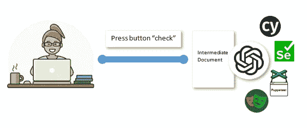
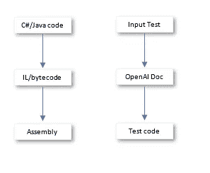
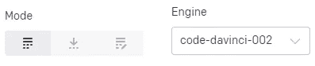
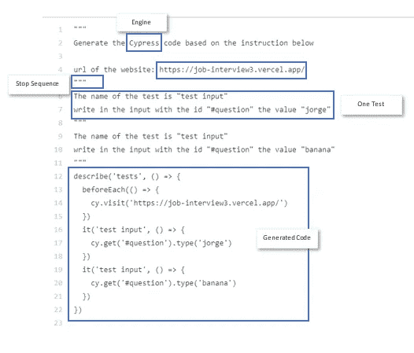
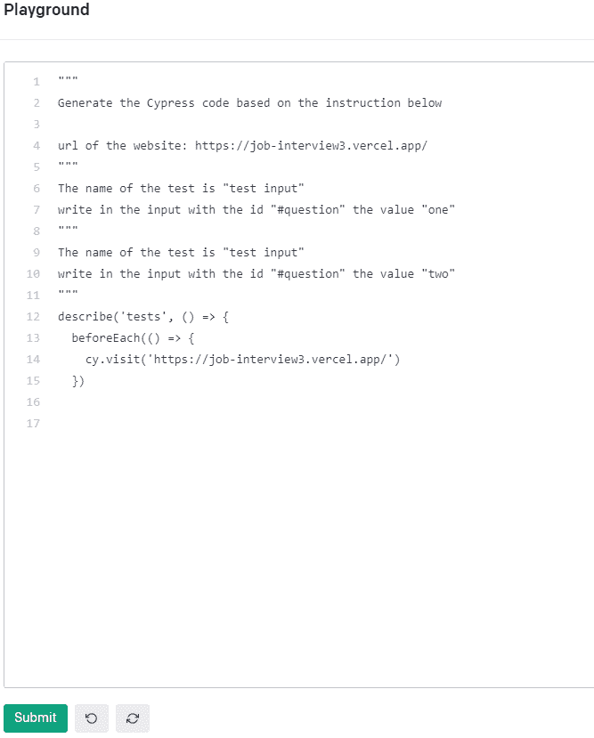
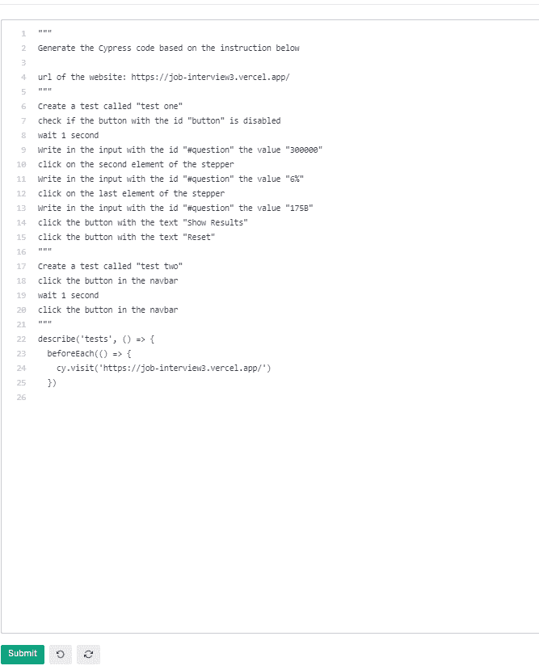
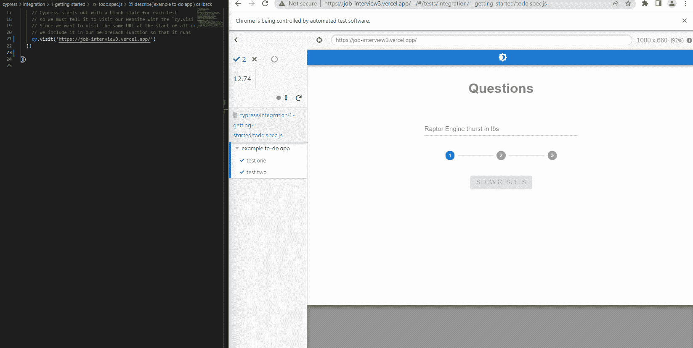

# 如何使用 OpenAI Codex 进行端到端测试

> 原文：<https://betterprogramming.pub/using-openai-codex-for-end-to-end-testing-automating-the-automated-52e1207ed74>

## 自动化自动化

本周，我在计划和选择我应该为某个项目使用哪种类型的端到端测试工具，尽管我的大脑一直在尖叫。但是关于 OpenAI 尖叫总是更高，利用每一种情况尖叫。你可能会得出结论，这里的问题是:

"我们能建立一个不可知的工具，将测试行为转换成多种框架吗？"

让我们看看！

# 测试工具

在我看来，这些用于端到端测试的工具没有最好的市场份额划分，但据我所见，有一些工具备受关注:

*   Selenium:占据了很大一部分市场份额，但它并不是最好的工具。它是第一个出现的，因此仍然在第一位。在这种情况下，大多数人会谈论 selenium webdriver，因为该产品是前面提到的另一个扩展的准系统。
*   cypress:一个新版本，使用起来更加友好，构建在 Node 之上，带来了一些工具和社区。与 Selenium 相比有一些性能限制，但通常这不是重点。CI/CD 管道通常非常便宜，速度不是游戏的名字，所以我不会担心。
*   木偶师:这是一个对测试和网络废弃有用的模块，也很容易使用。没有 cypress 的测试基础设施，但不是主要的焦点。
*   一个微软的工具，和这个街区的新成员。非常类似于 cypress，但是你没有被困在生态系统中，这很好，因为 Cypress 给了你一些好的工具和一些随之而来的限制。

市场上还有其他工具，但对于某种供应商锁，这不是重点。

# OpenAI 生成测试

正如我刚才提到的，市场提供了两种选择:面向代码的测试(开发人员友好的)或面向用户的测试(没有代码)。第一种倾向于开源，或者在如何运行方面给予自由。需要由开发人员来完成。第二个是受到生态系统的限制，对后台发生的事情一无所知，但是一个没有任何编码知识的经理也可以自己完成整个测试，这对更多的企业级公司来说是有意义的。这些选项都不能让你鱼和熊掌兼得，比如使用一个低代码工具生成代码，然后在其他地方使用它。OpenAI 可以解决这个问题，甚至可以投射出一个潜在的产品。

首先，让我们明确我们对图像的要求:

现代语言编译 vs OpenAI 转换逻辑

左边的这张图片包含了对现代语言工作方式的过度简化，或者说。NET/Java 工作。这些语言被转换成看起来像伪汇编的中间语言(IL/字节码),只有当代码在安装了适当框架的特定机器上运行时，才会被转换成汇编。

这里的想法是一样的。我们不希望每次都静态生成测试，但我们希望有一个简单的界面(例如点击界面)，然后用于为 OpenAI 创建我们的文本。然后，这个文档将运行，以在 cypress 或任何其他选项中创建测试。

# OpenAI 模板

完成模式和最新的达芬奇引擎

本周发布的新更新发布了达芬奇的新版本，以及新功能，但我们现在将坚持完成。

OpenAI Codex 文档

这是文档的结构，非常简单明了。告诉引擎做什么的短语，后跟要测试的 URL。然后，每个测试都被一个停止序列分开，并包含一个简单的短语来解释客户想要做什么。在我们的想法中，这个消息将在用户点击一个按钮后生成(使用一个假想的界面)。毕竟，测试已经写好了，然后我们就可以生成代码了。

带有一些完成帮助的文档

完成测试的第一部分非常有帮助。使 x100 的工作和性能更好。

# 让我们更好地测试

我最近做了一个模板来测试一些将来会用到的东西。这里是和[部署好了](https://job-interview3.vercel.app/)随时可以玩。让我们设计两个测试:

*   每道题都要写的一个测试，跨过每道题，然后明确内容。此外，请确保在输入为空时禁用该按钮。
*   改变主题的测试

上述测试生成的结果

正如你所看到的，这工作得非常好，但是如果这是生产就绪，你将需要一个非常复杂的决策树来覆盖所有的短语，否则，你的代码将是不可读的。

请注意，每行文本都是一行代码，以对 AI 有意义的方式编写。有时我会提到组件的 id，以及它包含的文本。但是最好的是步进器，我把它解释为一个数组，他得到了，否则，他会做一个直接访问的代码，那会很难看。

让我们看看结果:

奔跑的柏树

工作很好，看起来很干净。对于 Jest 或任何其他单元测试工具，都可以这样做。我还将`xUnit`测试转换成了玩笑，并且工作得完美无缺！

# 结论

OpenAI 正在成为我直到 GTP-4 发布后才想到的东西。第一个版本有点软，基本上是你微调的包装。它看起来越来越有意识，纠正错误，甚至做你想做的事情，没有太多的尝试和错误。

这篇文章是一个关于可能的创业的预告片，因为商业模式是有意义的，一旦世界变得更好，我会正确地掌握这样做的技能。