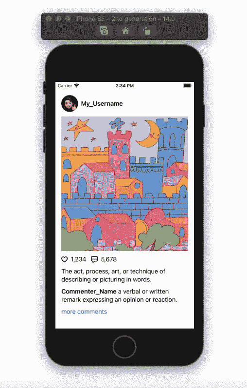

# 在 SwiftUI 中加载数据时使用占位符

> 原文：<https://betterprogramming.pub/using-placeholders-while-loading-data-in-swiftui-ef6e4b8782bb>

## 如何使用修订修饰符

占位符。已修订()。作者照片。

在本教程中，我们将构建一个类似 Instagram 的用户界面来演示修订修改器的功能。为了简单起见，UI 将包括一个帖子和一个评论。

# 评论

首先，我们需要为注释的数据创建一个结构。您可能需要为每个评论的个人资料图片添加一个变量。对于本教程，我们只存储用户名及其注释。

创建一个内部有水平堆栈的视图，并添加两个连接的`Text()`视图。使用`.infinity`确保文本与屏幕宽度对齐。我们将对接下来要添加的大多数 UI 元素做同样的事情。

# 邮件

为帖子的数据创建一个结构。加入你在下面找到的变量。最后一个变量将是我们在上面创建的`CommentData`类型。对于一个更实际的方法，你需要一个数组来存储前几个注释，以减少加载时间，而不仅仅是顶部的注释。

为文章创建一个结构视图。在主体变量中添加一个`PostData`类型的变量和一个`VStack`。在堆栈中，我们将有三个部分:在帖子的顶部，帖子本身，和帖子下面。

在第一部分中，添加一个`Image()`并将我们在`postData`变量中的轮廓图像传递给它。使用`.clipShape()`修改器，给它一个`Circle()`形状，让我们的侧面照片变成圆形。对于用户名，插入`Text()`并将存储在`postData`变量中的用户名传递给它。

对于第二部分，为帖子照片插入一个`Image()`，并限制其最大高度。在这里使用`.scaledToFit()`修改器。我们不希望图像从任何一面被切掉，不像侧面照片。

在帖子下面，我们希望有点赞数和评论数。在`Image()`中添加一个心形的图片，在`Text()`中添加喜欢的数量。接下来，对注释进行同样的操作。添加描述注释的图像，然后添加注释的数量。对于图像，您可以使用 Apple 提供的 SF 符号，如下所示:

对于最后一部分，我们将有职位描述和`CommentView`。我们在上面创建的`PostData`结构中有一个变量存储我们的顶部注释。我们可以这样把它传给`CommentView`:

# 内容视图

为了演示我们所做的工作，我们将创建一个`PostData`变量。填写所有参数。尽量不要给出单行的描述和注释，因为这会影响占位符的外观。在这篇文章中，我使用了一张由[sparklin _ pink _ 柠檬水](https://www.instagram.com/sparklin_pink_lemonade/)制作的图片。由于使用了`scaledToFit`修改器，您选择的图像将会影响占位符的尺寸。占位符的颜色将是您为 UI 元素选择的前景色。

在车身内部，增加一个`ScrollView`，两个`PostViews`用隔板隔开。将`.redacted(reason: .placeholder)`修改器添加到第二个`PostView`，然后运行应用程序查看结果。

感谢阅读！