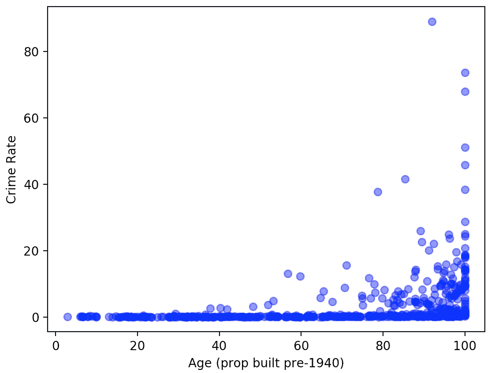
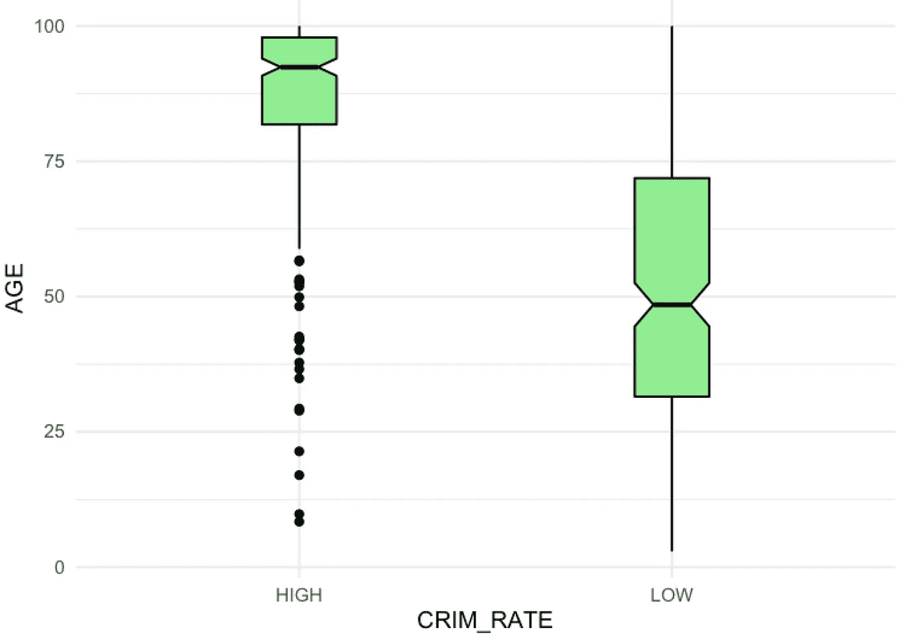

# 在 Julia 中使用 Python 和 R

> 原文：<https://betterprogramming.pub/using-python-and-r-with-julia-b7019a3d1420>

## Julia 的 PyCall 和 RCall 包的快速介绍

在 [Unsplash](https://unsplash.com/@meeuwesen?utm_source=unsplash&utm_medium=referral&utm_content=creditCopyText) 上由 [M.S. Meeuwesen](https://unsplash.com/@meeuwesen?utm_source=unsplash&utm_medium=referral&utm_content=creditCopyText) 拍摄的照片。

太好了！因此，您正在冒险进入充满希望的 Julia 世界，但仍然希望访问您熟悉的朋友 Python 和 R。虽然 Julia 的好处最好通过纯粹在 Julia 中操作来实现，但知道有几种方法可以在出发时将您的 Python 或 R 技能集成到您的工作流程中是令人放心的。

Python 和 R 都可以通过使用 [PyCall](https://github.com/JuliaPy/PyCall.jl) 或 [RCall](https://juliainterop.github.io/RCall.jl/stable/gettingstarted/) 包在 Julia 中调用。查看这些包的最简单的方法是利用它们各自的方法将 Python 或 R 的字符串转换成 Julia 可访问的操作和函数。对于熟悉 Python 的人来说，这类似于对单行/单表达式代码使用`[eval](https://www.programiz.com/python-programming/methods/built-in/eval)` 或对多行/多表达式代码使用`[exec](https://www.programiz.com/python-programming/methods/built-in/exec)`。

# PyCall 你好世界

从 Python 开始，我们将通过在朱莉娅·REPL 中运行以下命令来看看 PyCall:

PyCall 示例

您会注意到输出是 Julia 类型的(在本例中是`String`)。

# RCall Hello World

下面是使用 RCall 的相同演示:

RCall 示例

以`RObjects`的形式调用输出，使用`[rcopy](https://juliainterop.github.io/RCall.jl/v0.7.2/internal.html#RCall.rcopy-Tuple{RCall.RObject})`方法可以很容易地转换成 Julia 类型:

使用 rcopy 进行类型转换

可以用简单的语法将 Julia 中声明的变量直接传递到 Python 或 R 代码中。例如:

# 加载本地 Python 模块

互操作性的一个实际用例是利用您开发的任何定制 Python 实用程序，并在 Julia 中应用它们。为了进行一个非常简单的演示，让我们创建一个存储我们的`hello_world`函数的 Python 模块，然后使用 PyCall 从 Julia 调用它。

首先，在下面创建一个名为`mymodule`的示例模块。从终端运行:

Python 模块创建示例

然后你可以从你的朱莉娅·REPL 中导入并调用`mymodule.hello_world` 。有几种方法可以做到这一点。第一个类似于我们上面所做的:

第 3 行暂时将本地 Python 模块添加到 Julia 可见的 Python 导入路径中。

第二种可能更适用的方法是使用 PyCall 的`pyimport`函数直接导入 Python 模块:

# 加载 Python 和 R 包

也可以使用外部 Python 和 R 包。以下代码加载 scikit-learn Boston housing 数据集，并在朱莉娅·REPL 酒店内使用 matplotlib 生成可视化效果:

如果你喜欢用 R 的 [ggplot2](https://ggplot2.tidyverse.org/) 包绘图，你可以使用 RCall 的`@rlibrary` 宏:

# 结论

仅此而已。PyCall 和 RCall 支持与 Julia 的互操作性的功能比这里演示的要广泛得多。很高兴看到这些促进语言兼容性和降低准入门槛的努力。

随着 Julia 的包生态系统继续增长，可能很少需要从外部语言调用工具，但它仍然是入门时的一块方便的垫脚石。

查看下面链接的 PyCall 和 RCall 的文档，进行更深入的研究。

感谢阅读！

# **资源**

 [## Julia 编程语言

### 丰富的科学计算生态系统 Julia 从一开始就被设计为非常擅长数字和科学计算…

julialang.org](https://julialang.org/)  [## JuliaPy/PyCall.jl

### 这个包提供了从 Julia 语言直接调用 Python 并与之完全互操作的能力。你可以…

github.com](https://github.com/JuliaPy/PyCall.jl)  [## 入门 RCall.jl

### RCall 包是通过 julia >使用 RCall 加载的，这将在后台初始化 R 进程。RCall 提供…

Julian terop . github . io](https://juliainterop.github.io/RCall.jl/stable/gettingstarted/)