# 在 Xcode 中使用 Python

> 原文：<https://betterprogramming.pub/using-python-in-xcode-aa30f6fbc8cd>

## 了解如何通过 8 个步骤将 Python 引入 Xcode

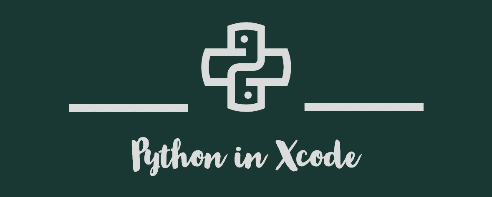

你是 Xcode 粉丝吗？而且你想学 Python 编程？
发现在 Xcode 中运行 Python 代码有困难？从而迫使您使用其他一些随机的 Python 支持 ide？

我们这里有治疗方法！在开始之前，我们将快速浏览一份清单，以确保所有先决条件都已就绪。

# **检查表**

1.  你的 Mac 上已经安装了最新的 Python 版本
    如果没有，你可以从[这里](https://www.python.org/downloads/)下载。或者，你可以使用 brew 在终端
    `brew install python`运行这个命令来安装 Python(我推荐！)
2.  您的 Mac 上安装了最新版本的 Xcode。如果没有，你可以从这里下载[https://developer.apple.com/xcode/](https://developer.apple.com/xcode/)

好的。如果清单被标记下来，我们可以很快开始执行。

# 1.**Python 在哪里？**

因为您已经在 Mac 上安装了 Python，所以您可以通过运行一个简单的终端命令来找到 Python 在 Mac 上的路径。在您的终端中运行以下命令:

```
where python3
```

如果您已经通过 brew 安装了 python，那么除了常规的`/usr/bin/python3`路径之外，您还将获得一个 homebrew 路径。

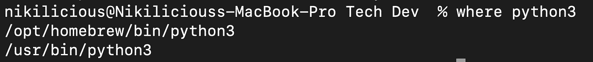

在终端中运行 where 命令的输出

一旦完成，我们将把 Python3 链接到`/opt/homebrew/bin`文件夹。为此，我们将在终端中运行以下命令:

```
cd /opt/homebrew/bin
ln python3 NVPython3
```

对于示例，我使用`NVPython`，但是您可以在这里使用任何名称。

# 2.**创造一个**

听起来不可思议，对吧？

我们将创建一个外部构建系统 Xcode 项目
做如下操作:
**文件⃗⃗→新建→项目⃗⃗→其他→外部构建系统**

参考如何创建`External Build System`的截图


选择 Xcode 项目类型

在下一个提示屏幕的“产品名称”部分中，设置项目的名称。在本示例中，我们将使用`NVPython,`,您可以使用自己选择的任何名称。

在构建工具部分，我们将设置我们在第一步中得到的路径(记住`where`的输出)。我们将在这里使用自制路径。

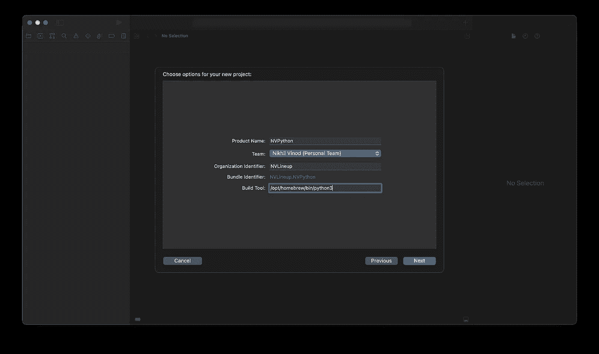

选择项目信息

现在你可以看到你的项目的信息屏幕，它将类似于下面的截图。

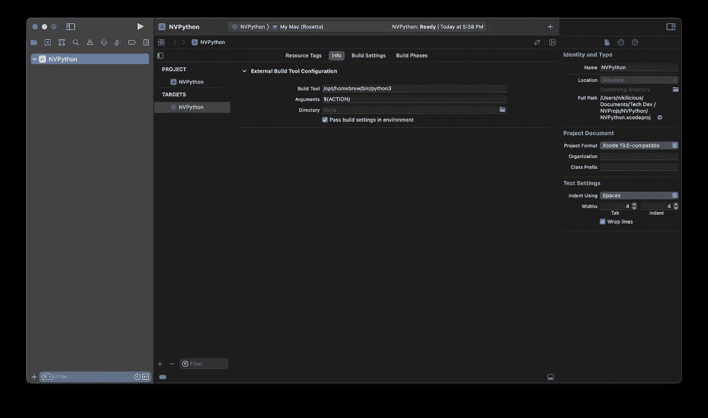

新创建项目的信息

# 3.让我们做那条蟒蛇吧！

这里我们将创建我们的 python 文件，我们将用它来编写我们的 Python 程序。

要创建一个 python 文件，请执行以下操作:
**文件⃗⃗→新建→文件⃗⃗→ macOS →清空→点击选择**

在下面的提示中，您必须给出将要创建的 python 文件的名称。在这里，您需要做的惟一不同的事情是使用`.py`添加一个扩展名，以便将文件呈现或读取为 python 文件。因此你的文件名看起来有点像这个例子:`NVPython.py`

参考如何在 Xcode 中创建 python 文件的截图:

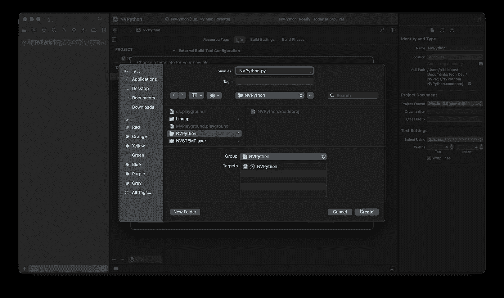

Python 文件创建

# 4.**方案编辑**

如果你是一个经验丰富的 Xcode 用户，你可能也知道“运行”将是默认选择的方案。点击这里的目标。在我们的情况下，它将是`NVPython`。


单击 NVPython 或目标

一旦你点击目标，你会看到一个类似下面截图的下拉列表。


点击`Edit Scheme…`。它将提示一个编辑方案屏幕，信息作为默认选择部分。

点击`Executable`下拉菜单并选择。`Other`。

这将打开一个 finder 来选择一个可执行文件。还记得我们做的第一步吗？使用`where`。我们有一条自制的道路，对吗？
按下`CMD + SHIFT + G`并输入您在第一步中获得的路径。

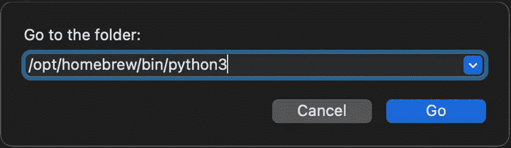

进入路径

点击`Go,`后，您可以看到一个包含文件的文件夹。搜索在第一步中创建的 python3 链接文件。
在这种情况下，将会是`NVPython3.`

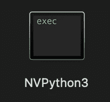

链接的 Python3 文件

选择主文件。

# 5.**添加启动参数**

在信息部分旁边，您也可以看到`Arguments`部分。点击那个。在`Arguments Passed On Launch,`中，点击`+`按钮，输入 python 文件名。`<FILE_NAME>.py`在我们的例子中，它将是`NVPython.py,`，然后按 enters 保存它。

累吗？只需做一些设置，然后我们将开始运行我们的第一个 Xcode Python 程序。

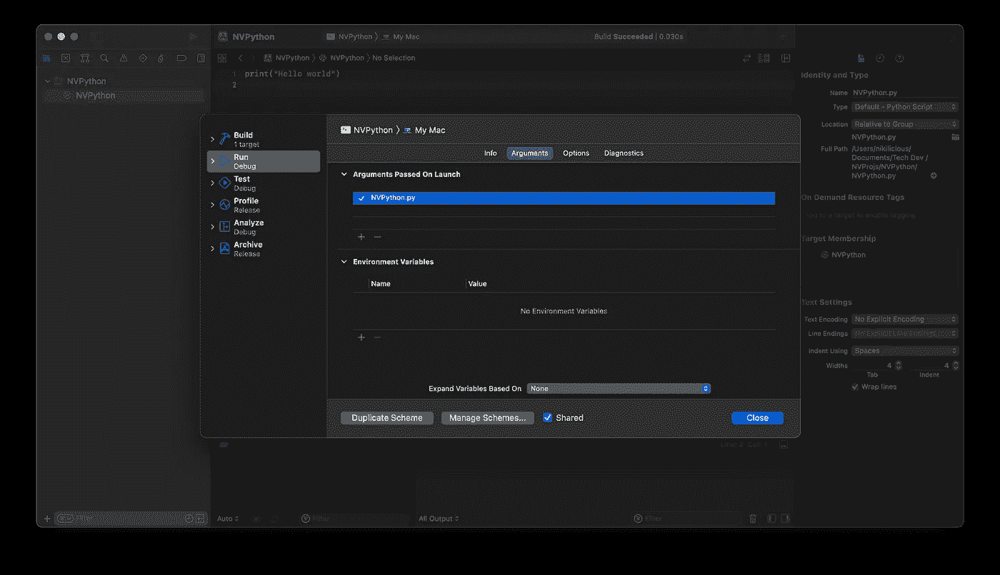

# 6.**设置工作目录**

在 Arguments 选项卡旁边，您可以看到一个`Options`选项卡。点击那个。并检查`Working Directory:` 使用自定义工作目录。
并将路径设置为项目路径。

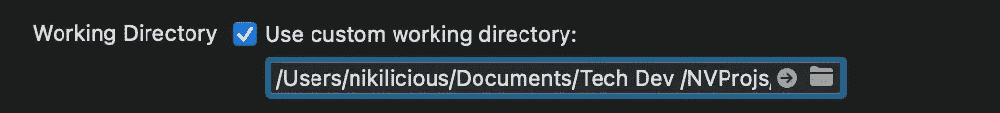

# 7.**调试可执行文件**

我们不希望 Xcode 调试 Python 可执行文件。所以我们将告诉 Xcode 不要通过取消选中 Info 标签中的`Debug Executable`选项来调试可执行文件。

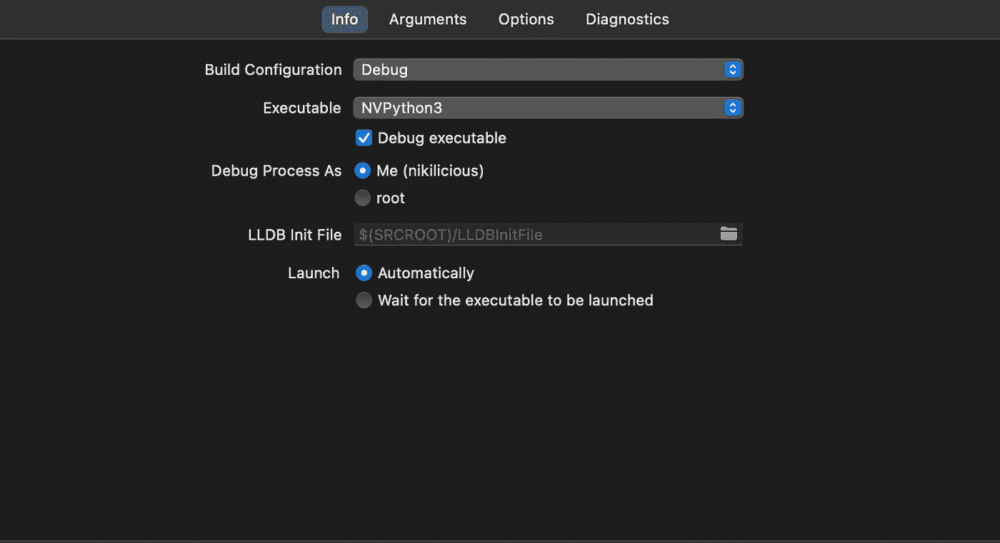

# 8.**测试时间**

我们将在 Xcode 中运行我们的第一个 python 程序。嗯，我们会编写什么程序呢？你们喜欢这篇文章吗？你觉得自己是摇滚明星吗？

然后我们将编写一个摇滚明星程序。

通过 Xcode 打开您的 python 文件，让我们编写一些 Python 代码:

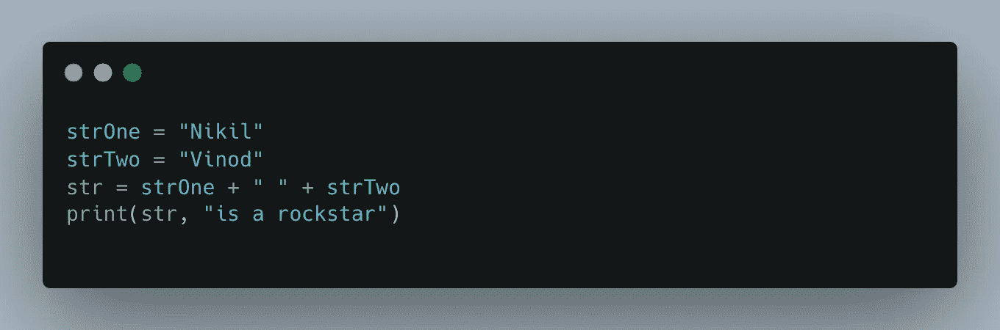

写完 python 代码了吗？如果你在 M1 Mac 上运行 Xcode，不要选择 Rosetta 选项。相反，请始终使用“我的 Mac”选项。

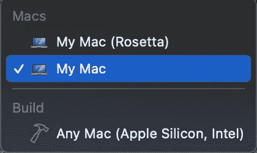

我们跑吧！单击 Run 并查看输出！

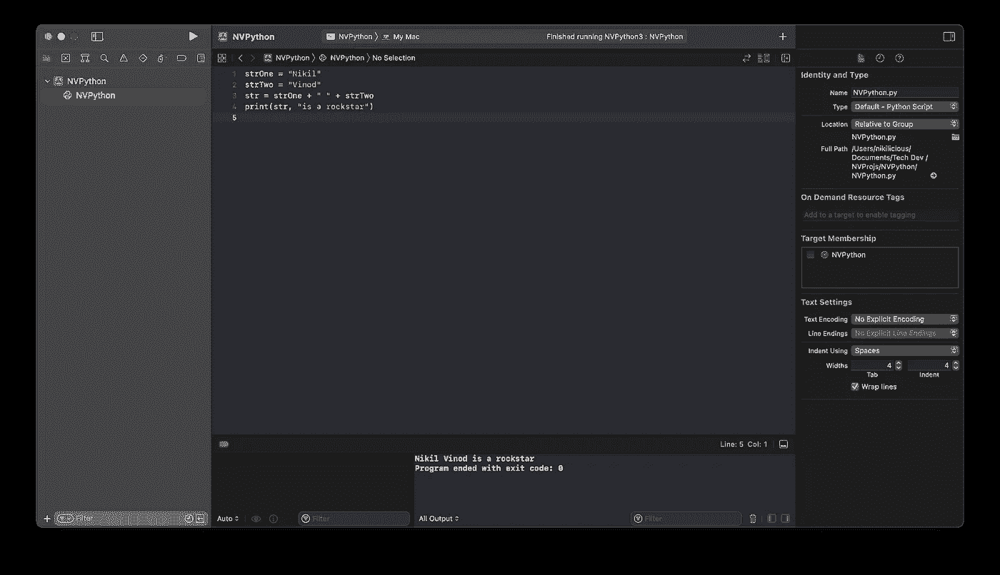

这里是最终的 GitHub 库:[https://github.com/Nikilicious09/NVPython/tree/main](https://github.com/Nikilicious09/NVPython/tree/main)

我希望我已经帮助找到了无法在 Xcode 中运行 Python 的解决方法。感谢 reading❤️.

[](https://www.buymeacoffee.com/nikhilvinod)