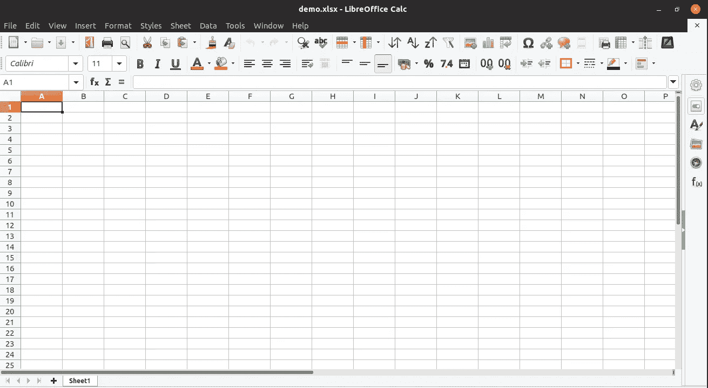
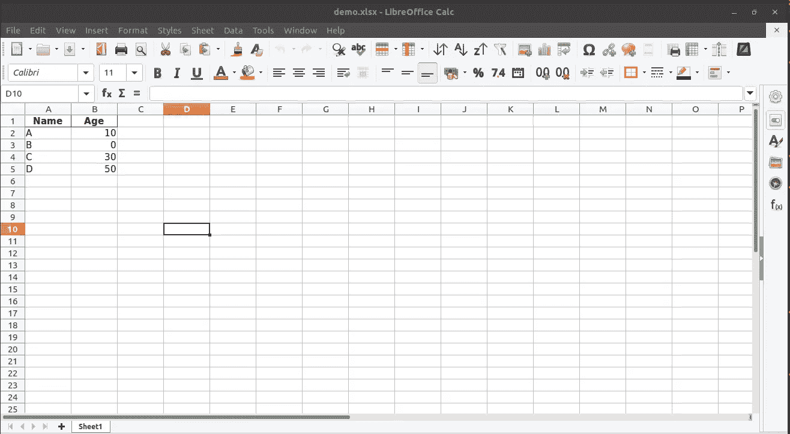
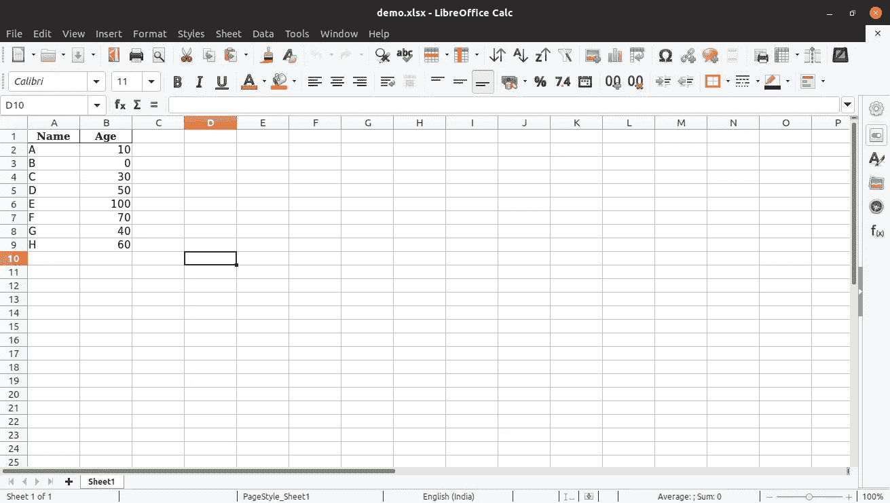
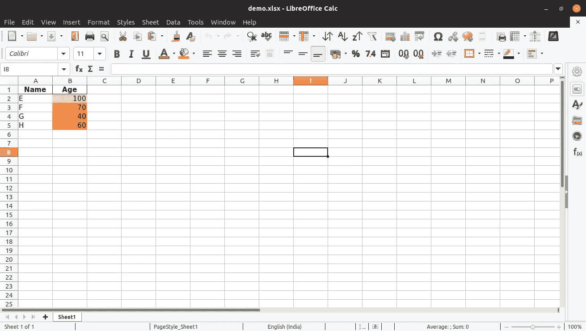
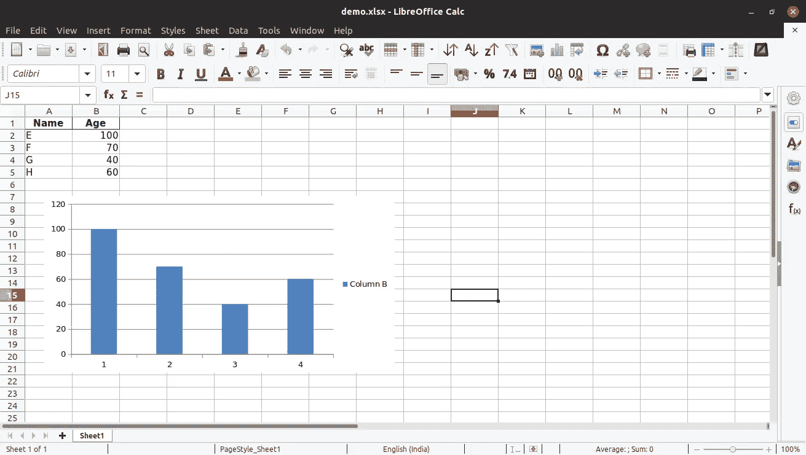

# 将 Python 熊猫与 Excel 工作表结合使用

> 原文：<https://betterprogramming.pub/using-python-pandas-with-excel-d5082102ca27>

## 使用 Python 库执行基本的 Excel 操作


在这篇文章中，我将演示如何在 Excel 中使用 Pandas 库。我们将使用基本的 excel 表格操作，如创建新表格、添加批量数据、追加数据、读取数据、格式化数据和添加图表。

# 装置

执行以下命令来安装 Pandas、xlsxwriter、xlrd 和 openpyxl 库。

```
pip install pandaspip install xlsxwriterpip install xlrdpip install openpyxl
```

# 创建 Excel 表格

```
importpandas aspdwriter = pd.ExcelWriter('demo.xlsx', engine='xlsxwriter')writer.close()
```

这段代码将用名为`Sheet1`的默认工作表创建一个新的`demo.xlsx`文件。



带有工作表 Sheet1 的空 demo.xlsx

# 向 Excel 表中添加批量数据

```
import pandas as pd

# dataframe Name and Age columns
df = pd.DataFrame({'Name': ['A', 'B', 'C', 'D'],
                   'Age': [10, 0, 30, 50]})

# Create a Pandas Excel writer using XlsxWriter as the engine.
writer = pd.ExcelWriter('demo.xlsx', engine='xlsxwriter')

# Convert the dataframe to an XlsxWriter Excel object.
df.to_excel(writer, sheet_name='Sheet1', index=False)

# Close the Pandas Excel writer and output the Excel file.
writer.close()
```

这段代码将添加两列，`Name`和`Age`，并向`demo.xlsx`的`Sheet1`发送数据。



向 excel 表中添加批量数据

# 从 Excel 表中读取数据

```
**import** pandas **as** pdreader = pd.read_excel(r'demo.xlsx')print(reader)
```

这段代码将打印 excel 表格中的所有数据。读者变量是一种熊猫的数据框。

```
Name  Age
0    A   10
1    B    0
2    C   30
3    D   50
```

# 在 Excel 表的末尾追加数据

这段代码将在 excel 的末尾追加数据。



附加在 excel 末尾的数据

# 向输出添加条件格式

我们可以使用 xlsxwriter 库格式化单元格:

上面的代码将为年龄列单元格添加不同的颜色。



条件格式化数据

# 向输出添加图表

上面的代码将从 Panda 的数据框向 Excel 表添加图表。



来自熊猫数据框架的图表

感谢您阅读这篇文章。如果你喜欢，点击👏给它打分，满分为 50 分 **，并与您的朋友分享。这对我意义重大。**

你想看看我的其他文章吗？

[](https://medium.com/aubergine-solutions/working-with-excel-sheets-in-python-using-openpyxl-4f9fd32de87f) [## 使用 openpyxl 在 Python 中处理 Excel 表格

### 在本教程中，我们将通过 openpyxl 演示如何在 python 中使用 Excel 表格。

medium.com](https://medium.com/aubergine-solutions/working-with-excel-sheets-in-python-using-openpyxl-4f9fd32de87f) [](https://medium.com/aubergine-solutions/partial-string-search-in-apache-solr-4b9200e8e6bb) [## Apache Solr 中的部分字符串搜索

### 在本教程中，我们将看到如何为部分字符串搜索配置 Apache Solr 的演示。

medium.com](https://medium.com/aubergine-solutions/partial-string-search-in-apache-solr-4b9200e8e6bb) [](https://medium.com/aubergine-solutions/django-jenkins-integration-for-django-project-3fe3251cd6f4) [## django 项目的 django-jenkins 一体化

### 在本教程中，我们将看到如何为 django 项目集成 django-jenkins 的演示。

medium.com](https://medium.com/aubergine-solutions/django-jenkins-integration-for-django-project-3fe3251cd6f4)