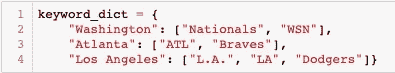
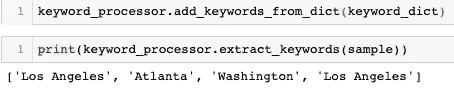
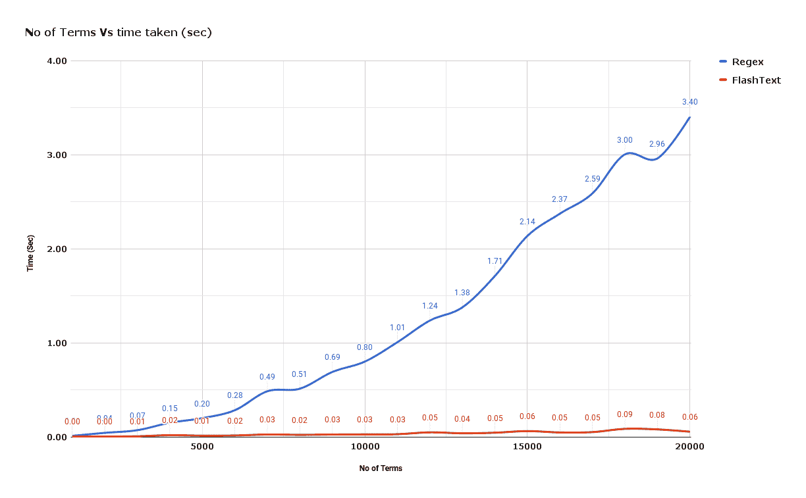

# 使用 Python 的 FlashText 库在文本数据中查找关键字

> 原文：<https://betterprogramming.pub/using-pythons-flashtext-library-to-find-keywords-in-text-data-f6cdf9c018ee>

## 快速查找单词和短语的方法

通常，在清理文本数据时，您需要在文本正文中找到某些单词或短语。您可以通过多种方式做到这一点，其中最流行的方式是使用 RegEx。但是，如果我告诉你有一个 Python 库可以更快地完成这项工作，并且更容易使用，那会怎么样呢？嗯，有，它叫做 **FlashText** 。

在这篇简短的文章中，我将向您展示从文本中提取关键字的最简单的方法。让我们开始吧。

# 装置

使用简单的 pip 命令`pip install flashtext` 轻松安装 FlashText 并导入笔记本:

# 例示

接下来，创建 KeywordProcessor 类的实例，如下所示:

# 文本

对于这个例子，我将使用这个简短的文本片段(来自 [ESPN](https://www.espn.com/mlb/story/_/id/27547095/mlb-weekend-watch-braves-nats-tougher-playoffs) )来查找其中的一些关键字。

> “现在最有可能击败道奇队的两支国家联盟球队似乎是勇士队和国民队，他们在周四开始了四场系列赛。勇士队和国民队谁会是洛杉矶季后赛更强的对手？”

# 查找关键字

比方说，我希望看到每个城市的团队出现的一组不同的单词，并将它们与他们的关键字相关联。我可以创建一个像下面这样的字典，将不同的单词与它们各自的城市联系起来。

接下来，使用函数`.add_keywords_from_dict( )` 添加关键字字典，然后提取样本文本中出现的关键字。

如您所见，两个独立的术语分别指洛杉矶，一个术语分别指亚特兰大和华盛顿。如果你问我的话，这很容易。

为了展示 FlashText 的运行速度，看一下它与 RegEx 的比较。

图来自[https://github.com/vi3k6i5/flashtext](https://github.com/vi3k6i5/flashtext)

如果你想看到 FlashText 库的更多用例，请访问 [GitHub。](https://github.com/vi3k6i5/flashtext)

感谢您的阅读；我希望你学到了新的东西！

干杯。