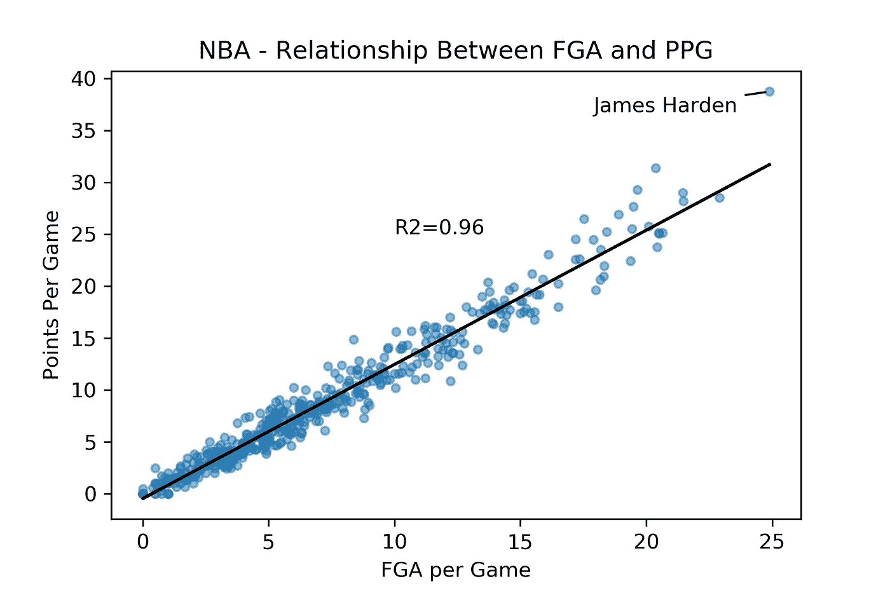

# 如何使用 Python 和 NBA API 创建一个简单的回归模型

> 原文：<https://betterprogramming.pub/using-pythons-nba-api-to-create-a-simple-regression-model-ac9a3b36bc8>

## 探索 NBA 数据的初级 Python 项目


照片由[埃德加·恰帕罗](https://unsplash.com/@echaparro?utm_source=medium&utm_medium=referral)在 [Unsplash](https://unsplash.com?utm_source=medium&utm_medium=referral) 拍摄。

在过去的十年里，统计数据的使用从根本上改变了 NBA。球队正在使用几十种先进的衡量标准来衡量他们的球员表现如何，并预测未来大学前景如何。统计数据也有助于教练理念的转变。例如，中距离跳投已经消失，取而代之的是三分球。探索这些篮球统计数据确实很有趣，但是对于一个初学 Python 的程序员来说却是个挑战。

对于这个项目，我们将使用 NBA 赛季统计数据来建立一个基本的线性回归模型。我们的`x`变量将是投篮次数(FGA ),而`y`变量将是每个球员每场比赛的平均得分(PPG)。我们将使用赛季平均值，而不是每场比赛都有一行。这样，每一行代表一个球员的赛季平均水平。

在这个项目中，我们将通过关注如何使用 nba_api 包进行 API 调用以及如何使用 Scikit-learn 创建线性回归来保持事情的简单。我们的最终产品将是一个可视化和模型，它将帮助我们理解尝试投篮和得分之间的关系。幸运的是，这是一个相当线性的关系。将来，我们可以通过包含更多变量、优化模型参数或选择一个更有趣的`y`变量来扩展模型。

# 链接到 GitHub

我们已经创建了一个 GitHub 项目，你可以在这里找到。

该项目包含一个笔记本，您可以跟随它以及一个空 Python 文件，您可以使用该文件作为模板来完成项目。我们建议遵循这里的教程，自己输入代码，而不是复制粘贴。

# 先决条件

你一定很乐意下载一些软件包。

## 包装

*   熊猫
*   [NumPy](https://numpy.org/)
*   Sklearn
*   要求
*   [nba_api](https://pypi.org/project/nba-api/)
*   [matplotlib](https://matplotlib.org/)

# 使用 nba_api 加载数据

我们将使用 nba_api 库来获取当前 nba 赛季的数据。这个库对任何从事篮球项目的人都很有帮助。它通过处理幕后的繁重工作，简化了从 NBA 官网获取数据的过程。你应该可以从 NBA 收集的[大量数据集中找到你需要的任何篮球数据。我们将使用它来获取当年的赛季得分数据。](https://github.com/swar/nba_api/tree/master/docs/nba_api/stats/endpoints)

第一步是导入我们所有的包。

我们所有的包都准备好了，我们必须请求 nba_api 来下载我们的数据集。我们想要关于季节总数的信息，所以我们使用`LeagueLeaders()`函数。如果您想请求另一个数据集，只需浏览[端点文件夹](https://github.com/swar/nba_api/tree/master/nba_api/stats/endpoints)，直到找到您需要的数据。然后，您可以使用与下面相同的结构通过用适当的条目替换`LeagueLeaders()`来发出请求。

一旦我们的数据被导入，使用 Panda 的`.head()`函数读取数据集的前五行会很有帮助。这确保了数据集正确加载，一切都按计划进行。

```
*# take a sneak peak at the first 5 rows*
df.head()
```

# 建立一个简单的回归模型

通过几行代码，我们现在有了 NBA 所有 466 名球员的赛季总数。现在我们可以用 sklearn 建立一个线性回归模型。我们的数据中有很多很好的信息，但我们只需要两个变量:投篮命中率(FGA)和总得分。因此，我们将隔离这些数据，并从那里开始构建。

## **功能模型**

在上面的几行代码中，我们创建、训练了一个线性回归模型，并进行了预测。如果我们想要一个更健壮的模型，我们通常会在数据选择和模型创建过程中多采取一些步骤。首先，在训练之前，我们通常会尝试可视化我们的数据，清理它，并做一些功能工程。特征工程是一个用我们已有的数据创造新变量的时髦词。这样，我们知道我们正在使用`x`变量的质量选择来预测我们的`y`变量。

第二，我们通常希望在一组未用于训练模型的测试数据上测试模型的准确性。我们这样做是为了确保我们的模型不会过度拟合。过度拟合模型擅长对训练数据进行预测，但对新数据的预测不那么准确。这没什么用，因为我们不需要对已经有的数据进行预测。

解决方法是交叉验证。通常，为了交叉验证，我们将原始数据分成两个不同的集合。首先，我们的训练数据将包含原始数据的 85%的随机样本。测试集将包含剩余的 15%。我们使用训练数据进行训练，然后通过对测试数据的准确性进行评分来测试真实世界的性能。很简单。

## 可视化我们的结果

可视化您的模型总是一个好的做法，这样您就可以看到它是如何执行的。使用实际`y`值的散点图和预测`y`值的直线可以很容易地显示线性回归。我们将使用 Matplotlib——最流行的可视化软件包——但是也有一些替代方案。

为了可读性，我们将逐行创建我们的图表。每一行代码都会给我们的图表增加一个新的特性。这包括像我们的散布点或我们的标签。

您可能需要根据您完成本项目的赛季中球员的得分数字来更改文本的位置。

# 结论

不出所料，如果一个篮球运动员在比赛中投篮次数多，他们往往得分就多。这是一个显而易见的想法，我们的图表帮助我们形象化:



*   我们可以直观的看到联盟大部分球员场均出手 7 次甚至更少。
*   每场比赛出手次数多(17 次以上)的球员开始比模型预测的表现更好。

我们可以这样想:让真正擅长得分的球员多出手。这些运动员比一般人更有效率。因此，我们的线性模型并不擅长预测他们的得分。

## 恭喜你！

利用你从这个项目中学到的东西，你应该能够开始探索 NBA.com 其他有趣的数据集。一个好的第一步是扩展这个模型。尝试包含更多的`x`变量，看看这如何改变预测或拟合线。