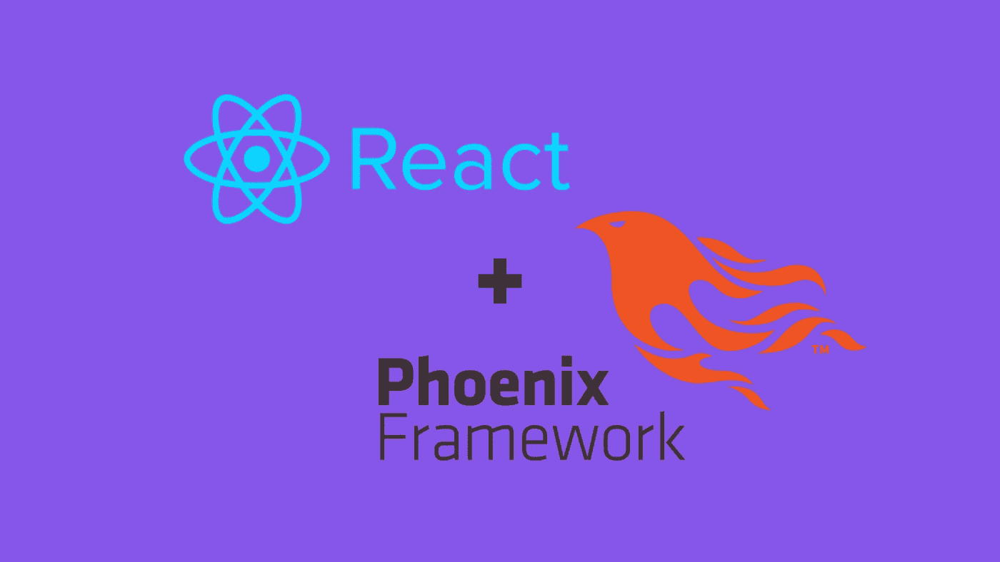
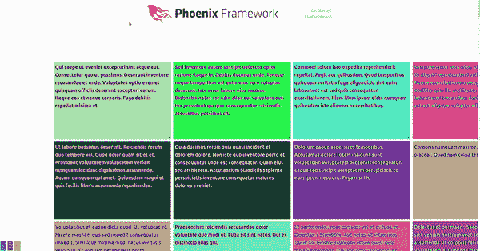
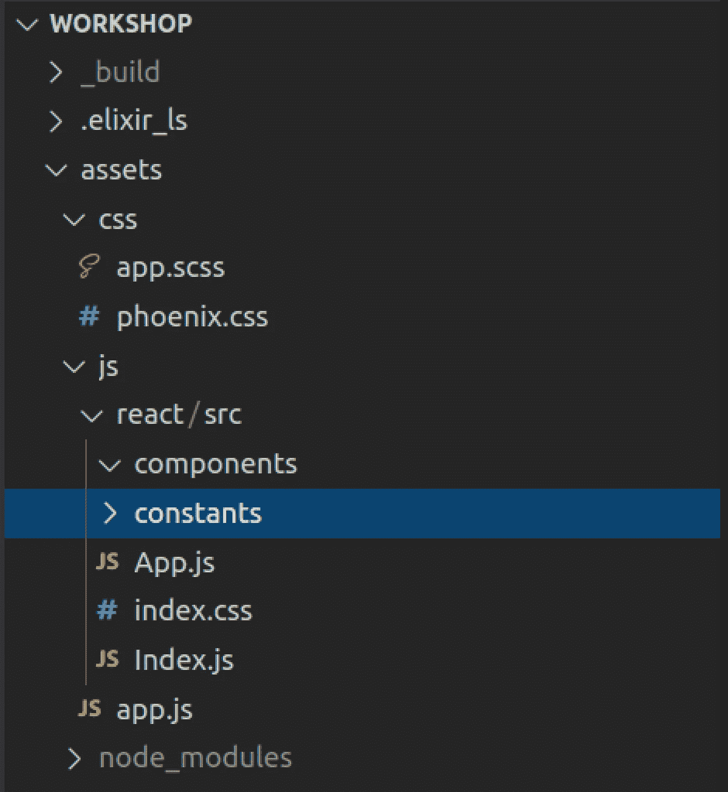

# 将 React 17 与 Phoenix 1.5 一起使用

> 原文：<https://betterprogramming.pub/using-react-17-with-phoenix-1-5-1b445526c739>

## 向 Phoenix 应用程序添加 React 组件的增量方法



图片来源:作者

我最近开始使用 Elixir 和 React 实现一个高度交互式的、基于 web 的生产力工具。下面是我如何在需要的地方向 Phoenix 视图添加 React 组件。你可以在这里找到[的源代码](https://github.com/donrestarone/integrate-react-with-phoenix)。



这是我整理出来的概念证明。它并不复杂——只是一个很酷的小 React 项目的所有成分。

## 目标

我不想完全致力于客户端呈现的视图，因为当你独自工作时会变得单调乏味，而且这不是搜索引擎优化的最佳选择。我想在应用程序的大部分地方使用服务器端渲染，除了需要高用户交互性的区域。

对我来说，理想的方法是简单地将 React 组件与服务器呈现的 HTML 打包在一起。

如果您想以视频形式跟进:

在这个视频中，我遵循了本文中概述的相同步骤

# Phoenix 后端配置

我首先导航到`/assets`目录，安装必要的前端依赖项和`yarn`。

```
cd assets
yarn add @babel/preset-react react react-dom remount
```

如果您想继续做下去，构建和我一样的东西，您也可以添加这些额外的 JavaScript 依赖项:

```
yarn add @babel/preset-react react react-dom remount react-zoom-pan-pinch react-grid-layout faker
```

在`router.ex`中，我添加了一个路径和控制器动作，它将为带有 React 组件的页面提供服务。在第 19 行，Phoenix 将把到达根路径的请求路由到`HomeController`的索引方法。

lib/workshop_web/router.ex

接下来，我为控制器安装了最简单的管道。你可以在第 8 行看到传递道具的策略，Phoenix 可以传递任意地图，并使用`Jason`将其编码为 JSON 字符串。

lib/workshop _ web/controllers/home _ controller . ex

接下来是必不可少的视图功能。我总是忘记为新的控制器实现这些，直到 Phoenix 抛出一个错误来提醒我。

lib/workshop _ web/views/home _ view . ex

在`lib/workshop_web/templates/layout/app.html.eex`创建了一个空白的 Elixir HTML 文档后，我已经做好了向 JavaScript 领域前进的准备。

# 凤凰前端配置

我删除了 Phoenix 附带的默认`assets/.babelrc`文件，创建了一个名为`assets/babel.config.js`的新的 Babel 配置，并添加了以下代码:

assets/babel.config.js

这将允许凤凰处理 JSX 标记。接下来我配置了 webpack，这样我就可以使用 CSS 导入并享受类似于`create-react-app`的工作流程。

assets/webpack.config.js

现在，Phoenix 将能够处理 JSX、CSS 导入和其他相关的一切。是时候创建一些文件夹来存放 React 应用程序了。

我在`assets/js`下创建了一个子文件夹，命名为`react`，并创建了以下子文件夹以保持有序。



图片来源:作者

JavaScript 执行的入口点将发生在`index.js`:

assets/js/react/src/Index.js

在这里，我只是简单地导入`remount`和我需要的任何组件，然后将每个组件映射到定制的 HTML 元素名称。可以在视图中引用这些元素名称，以便在需要的地方呈现 React 组件。

为了让 Phoenix 知道 HTML-to-React 组件映射，我通过简单地在`assets/js/app.js`中添加下面一行来将入口点导入主应用程序:

```
import "./react/src/Index.js"
```

随着终点线在望，我继续复制我之前在`create-react-app`中的原型。

assets/js/react/src/App.js

动态生成虚拟数据的功能:

有了这些，我所要做的就是在我之前创建的 Elixir HTML 模板中安装 React 组件。在`lib/workshop_web/templates/home/index.html.eex`中，我为此插入了一个小程序:

```
<x-application props-json='<%= @props %>' ></x-application>
```

`x-application`映射到组件`<App/>`并且`props-json`属性将用于将 JSON 数据从 Phoenix 控制器传递到`<App/>`。

就位后，我转动钥匙，强大的凤凰反应引擎轰鸣着启动了。

# 但是等等，有一个问题！

在测试期间，我注意到在除了 Firefox 之外的任何其他浏览器上，`react-zoom-pan-pinch`都在呈现一个不可见的 DOM。问题出在 CSS 中，解决方法很简单——但是它证明了 CSS 导入也适用于这种设置:

assets/js/react/src/index.css

就是这样！如果你像我一样，你现在可以享受在 Phoenix 中构建和使用 React 组件，直到你学会 LiveView。

[沙西克](https://www.linkedin.com/in/shashike-jayatunge/)是一名来自多伦多的软件工程师，也是 [Restarone Inc](https://www.restarone.com) 的创始人。当他不开发软件时，他就在 Medium 和 YouTube 上创作内容，帮助人们过渡到技术领域。