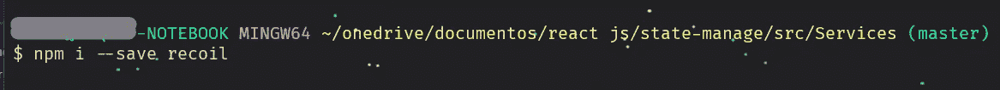
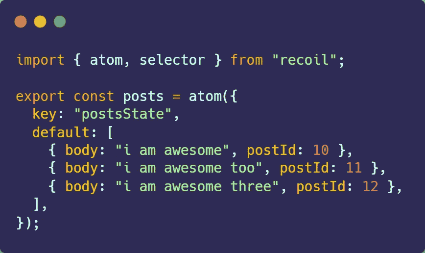
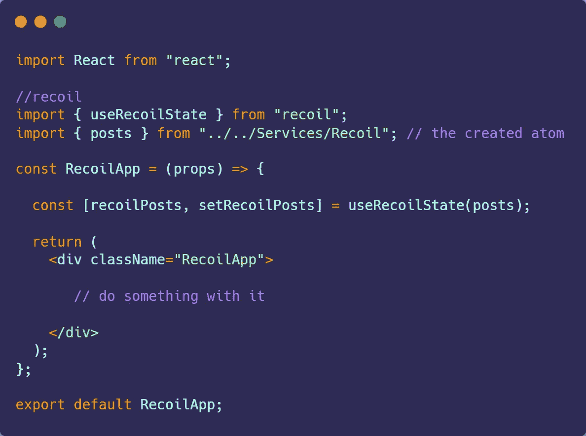

# 使用反冲:一个新的反应状态管理库

> 原文：<https://betterprogramming.pub/using-recoil-js-2af19add4e31>

## 安装反冲，今天就开始使用它

[文东姚](https://unsplash.com/@atlasyao?utm_source=medium&utm_medium=referral)在 [Unsplash](https://unsplash.com?utm_source=medium&utm_medium=referral) 上拍照。

最近，脸书的团队为 React 宣布了一个新的状态管理库，看起来感觉很有前途。

[反冲](https://recoiljs.org/)是一个非常强大的工具，用于管理复杂的状态，并防止道具在组件之间混淆传递。

你可能想知道，“Redux 会被弃用或完全取代吗？**’**嗯，答案是“不！”即使反冲是由脸书本身提供动力，Redux 仍然被大多数人使用，并有一个相当强大的社区。

即使您已经知道并掌握了 Redux，拥有其他选项也是扩展 React 知识的一个好方法。

说够了。让我们从一个非常简单的反冲例子开始。

您希望从在 React 项目上安装反冲开始:

如果你使用纱线，“纱线增加反冲。”

现在，你想创建你的第一个反冲状态，有两种方法可以实现:创建一个原子或者一个选择器。我们现在将使用原子。如果你想了解更多，请查看官方文档。

# 到底什么是 A **汤姆**？

它是一个州或者仅仅是一个州。就像化学元素是由许多被称为原子的微小部分组成一样，你的状态也可以由许多原子组成。

记得导入反冲的内容。

让我们看看上面的原子/状态:

*   `atom`方法接收一个应该有两个属性的对象:一个键(每个原子必须有一个惟一的键)和一个默认值。该默认值与`useState`钩子默认值完全一样。
*   我们还导出该状态，因为我们在一个单独的文件中，而不是在一个组件文件中。

# 如何使用原子作为一种状态

反冲带有一些反应钩，专门用于它。原子有两个主要的用途:

*   `useRecoilState(myAtom)`:这个跟`useState`一模一样。它返回一个带有`Atom`值(当前状态)的数组和一个改变该值的 setter 函数(`myRecoilState`，`setMyRecoilState`)。
*   这是一个只读钩子，意味着你不会收到 setter 函数——只有值。

记得导入`<RecoilRoot>` 并用它包装你的 app 才能使用反冲。

数组析构用于捕获反冲钩子的内容(index.js 中使用了<recoilroot>)。</recoilroot>

# **当我改变/更新反冲状态时会怎样？**

就像当你用`useState`钩子更新某个状态时，所有依赖于该状态的组件都将被更新，当你在反冲状态中改变某些东西时，每个读取/访问该状态的组件都将经历一次重新渲染并被更新。

# 结论

这是一个非常简单的反冲及其工作原理的介绍。感谢您的阅读和快乐编码！