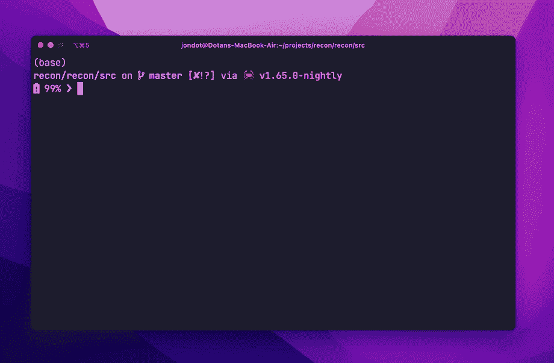

# 如何进行管道取证，DFIR，或者只是用 Recon 快速找到文件

> 原文：<https://betterprogramming.pub/using-recon-for-pipeline-forensics-dfir-or-just-finding-files-3a220a71efe6>

## 开源工具的快速介绍


作者图片

Recon 是一个内置于 Rust 的开源工具🦀，具有查找文件的出色性能和人体工程学设计。

您可能想要:

*   在管道中运行一些验证或检查——例如，在构建 Javascript 时不生成二进制文件，
*   或者，您可能希望在特定主机上运行数字取证任务，以查找特定的恶意软件。
*   或者，您可能想要一把瑞士军刀来使用 SQL 查找文件。



作者图片

查看这里的 Github 回购。

# 关键特征

*   **使用 SQL 查询文件** —使用 SQL 查询的全部功能查找文件
*   **使用摘要查找内容** —使用 SHA256/512、md5、crc32 查找副本，使用其他匹配器查找重要匹配，以定位主机上的工件
*   **使用 YARA 查找恶意软件或二进制文件** —使用 YARA 规则高效匹配二进制文件
*   **微调您的搜索运行时间** —您可以只选择您需要的处理，以便快速覆盖更多文件
*   **构建你自己的脚本**——用`--xargs`将`recon`结果传输到你自己的脚本
*   **导出** —使用`--csv`或`--json`，或将`recon.db`上传到自己的服务器进行分析

# 正在侦察

Recon 是免费和开源的。对于 macOS:

```
$ brew tap rusty-ferris-club/tap && brew install recon
```

否则，从[释放](https://github.com/rusty-ferris-club/recon/releases)中抓取一个释放并运行`recon --help`:

```
$ recon --help
SQL over files with security processing and tests

Usage: recon [OPTIONS]

Options:
  -c, --config <CONFIG_FILE>  Point to a configuration
  -r, --root <ROOT>           Target folder to scan
  -q, --query <SQL>           Query with SQL
  -f, --file <DB_FILE>        Use a specific DB file (file or :memory: for in memory) [default: recon.db]
  -d, --delete                Clear data: delete existing cache database before running
  -u, --update                Always walk files and update DB before query. Leave off to run query on existing recon.db.
  -a, --all                   Walk all files (dont consider .gitignore)
      --no-progress           Don't display progress bars
  -m, --inmem                 Don't cache index to disk, run in-memory only
      --xargs                 Output as xargs formatted list
      --json                  Output as JSON
      --csv                   Output as CSV
      --no-style              Output as a table with no styles
      --fail-some             Exit code failure if *some* files are found
      --fail-none             Exit code failure if *no* files are found
      --verbose               Show logs
  -h, --help                  Print help information
  -V, --version               Print version information
```

# 更好的“发现”

你还记得`find`的所有论点吗？我也没有。Recon 通过让您使用 SQL 简化了文件查找:

```
$ recon -q "select path,mode,uid from files where ext='rs'"
┌────────────────────────────┬────────────┬─────┐
│ path                       │ mode       │ uid │
├────────────────────────────┼────────────┼─────┤
│ ./xtask/src/main.rs        │ -rw-rw-r-- │ 501 │
├────────────────────────────┼────────────┼─────┤
│ ./recon/tests/cli_tests.rs │ -rw-r--r-- │ 501 │
├────────────────────────────┼────────────┼─────┤
│ ./recon/src/os.rs          │ -rw-r--r-- │ 501 │
├────────────────────────────┼────────────┼─────┤
│ ./recon/src/out.rs         │ -rw-r--r-- │ 501 │
├────────────────────────────┼────────────┼─────┤
│ ./recon/src/bin/recon.rs   │ -rw-r--r-- │ 501 │
├────────────────────────────┼────────────┼─────┤
│ ./recon/src/config.rs      │ -rw-r--r-- │ 501 │
├────────────────────────────┼────────────┼─────┤
│ ./recon/src/lib.rs         │ -rw-r--r-- │ 501 │
├────────────────────────────┼────────────┼─────┤
│ ./recon/src/data.rs        │ -rw-r--r-- │ 501 │
├────────────────────────────┼────────────┼─────┤
│ ./recon/src/processing.rs  │ -rw-r--r-- │ 501 │
├────────────────────────────┼────────────┼─────┤
│ ./recon/src/workflow.rs    │ -rw-r--r-- │ 501 │
├────────────────────────────┼────────────┼─────┤
│ ./recon/src/matching.rs    │ -rw-r--r-- │ 501 │
└────────────────────────────┴────────────┴─────┘
11 of 233 files in 5.565875ms
```

用通常的`xargs`组合对结果做些什么怎么样？

```
$ recon -q "select path from files where ext='rs'" --xargs | xargs echo
./xtask/src/main.rs ./recon/tests/cli_tests.rs ./recon/src/os.rs ./recon/src/out.rs ./recon/src/bin/recon.rs ./recon/src/config.rs ./recon/src/lib.rs ./recon/src/data.rs ./recon/src/processing.rs ./recon/src/workflow.rs ./recon/src/matching.rs
```

# 强大的取证工具

对于试图定位易受攻击的二进制文件或恶意软件以及手头的任何其他 DFIR 任务的安全专家来说，Recon 也很有用。

您可以**配置处理器和匹配器**，以防您需要一些计算密集型数据用于查询或匹配，例如:

*   摘要或校验和(md5、SHAxxx、crc32)
*   路径，内容匹配
*   YARA 规则
*   更多信息，请参见[https://github . com/rusty-ferris-club/recon/tree/master/examples](https://github.com/rusty-ferris-club/recon/tree/master/examples)

**让我们添加二进制检测。**创建一个名为`config.yaml`的配置文件:

```
source:
  computed_fields:
    is_binary: true
```

> *你知道吗？检测文件是否为二进制文件的常用方法是从中读取一块数据(通常为 1k 字节)并在其中搜索任何非文本字节。很大程度上:没有内置的操作系统元数据“标志”来指示文件是否是二进制文件。*

我们可以使用`-m`来避免将任何缓存保存到磁盘。

```
$ recon -m -c config.yaml -q 'select path,is_binary,mode from files limit 6'
┌───────────────┬───────────┬────────────┐
│ path          │ is_binary │ mode       │
├───────────────┼───────────┼────────────┤
│ ./os.rs       │ 0         │ -rw-r--r-- │
├───────────────┼───────────┼────────────┤
│ ./out.rs      │ 0         │ -rw-r--r-- │
├───────────────┼───────────┼────────────┤
│ ./bin/main.rs │ 0         │ -rw-r--r-- │
├───────────────┼───────────┼────────────┤
│ ./config.rs   │ 0         │ -rw-r--r-- │
├───────────────┼───────────┼────────────┤
│ ./lib.rs      │ 0         │ -rw-r--r-- │
├───────────────┼───────────┼────────────┤
│ ./recon.db    │ 1         │ -rw-r--r-- │
└───────────────┴───────────┴────────────┘
6 files in 145.81675ms
```

# 探索更多

我们有充分配置的例子来探索，并开始从([打开一个公关](https://github.com/rusty-ferris-club/recon/pulls)添加您自己的！):

[all-processors.yaml](https://github.com/rusty-ferris-club/recon/blob/master/examples/all-processors.yaml) —默认情况下打开所有处理器

[custom-walking.yaml](https://github.com/rusty-ferris-club/recon/blob/master/examples/custom-walking.yaml) —仅计算部分已遍历目录树的字段

[file-classes.yaml](https://github.com/rusty-ferris-club/recon/blob/master/examples/file-classes.yaml) —配置并分类您自己的文件类

[find-log4shell.yaml](https://github.com/rusty-ferris-club/recon/blob/master/examples/find-log4shell.yaml) —使用已知摘要查找 log4shell 漏洞的示例

[使用-yara.yaml](https://github.com/rusty-ferris-club/recon/blob/master/examples/using-yara.yaml) —使用简单的 yara 规则集进行匹配

有用例吗？想做点贡献吗？[随意开一个 PR](https://github.com/rusty-ferris-club/recon)