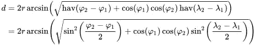

# 如何将 Redis 用于地理空间数据

> 原文：<https://betterprogramming.pub/using-redis-for-geospatial-data-b81a9a472699>

## 了解如何使用 Redis 及其地理空间索引和命令进行复杂的地理计算


众所周知，处理地理空间数据非常困难，因为纬度和经度是浮点数，应该非常精确。

此外，看起来纬度和经度可以用网格来表示，但事实上它们不能，原因很简单，因为地球不是平的，数学很难。

例如，为了根据纬度和经度确定球体上两点之间大圆的距离，使用哈弗辛公式，如下所示:



另一个与纬度和经度相关的常见任务是找到地球表面半径上的点的数量。

也就是说，给定一个大球(地球),你试图在这个球的半径上寻找点。但事实上，地球并不是一个完美的球体，它仍然是一个椭球体。正如您可能猜到的那样，这种运算的数学计算变得非常复杂。

在本文中，我们将研究 Redis 如何帮助我们在处理地理空间数据时最小化计算。

Redis 代表远程字典服务器，是一个快速、开源的键值数据存储。由于速度快，Redis 是缓存、会话管理、游戏、分析、地理空间数据等的流行选择。

# 让我们回到地理空间数据。什么是 geohash？

Geohash 是一种将坐标表示为字符串的系统。Geohashing 使用 Base32 编码将纬度和经度转换为字符串。

比如`Palace Square in St. Petersburg`的`geohash`会是这样的:`udtscze2chgq`。可变的`geohash`长度代表可变的位置精度。换句话说，geohash 越短，它表示的坐标就越不精确。因此，较短的`geohash`将代表相同的地理位置，但精确度较低。你可以尝试在[http://geohash.org](http://geohash.org)用 geohash 编码坐标。

# Redis 如何存储地理空间数据？

地理空间数据存储在 Redis 中实现，使用排序列表(`ZSET`)作为底层数据结构，但是具有位置数据的动态编码和解码以及新的 API。

这意味着，使用内置命令:`GEOADD`、`GEODIST`、**、**、`GEORADIUS`和`GEORADIUSBYMEMBER (GEOSEARCH)`，只需很少的几行代码和最少的工作，就可以将特定位置的索引、搜索和排序抛入 Redis。

Geo Set 是在 Redis 中使用地理空间数据的基础，它是一种旨在管理地理空间索引的数据结构。每个地理集合由一个或多个元素组成，每个元素由一个唯一的标识符和一对坐标(经度和纬度)组成。

# 用于处理地理空间数据的命令

要在 Redis 存储中添加一个新列表(或将一个新元素添加到现有列表中)，使用`GEOADD`命令。为了清楚起见，我将给出 Redis 中的命令示例，以及使用 Redis 的 Ruby 客户端中的命令示例:

```
# Redis example:
GEOADD "buses" -74.00020246342898 40.717855101298305 "Bus A"# Ruby example:
RedisClient.geoadd("buses", -74.00020246342898, 40.717855101298305, "Bus A")
```

这些命令将总线“总线 A”的位置坐标添加到名为“总线”的地理集合中。如果 Redis 中尚未存储具有此名称的地理集合，将会创建它。只有在列表中不存在具有相同名称(“总线 A”)的条目时，新条目才会被添加到索引中。也就是说，总线 A 是唯一的标识符。

还可以通过一个`GEOADD`调用一次添加多个记录，这有助于减少网络和数据库负载。记录 id 必须是唯一的:

```
# Redis example:
GEOADD "buses" -74.00020246342898 40.717855101298305 "Bus A" -73.99472237472686 40.725856700515855 "Bus B"# Ruby example:
RedisClient.geoadd("buses", -74.00020246342898, 40.717855101298305, "Bus A", -73.99472237472686, 40.725856700515855, "Bus B")
```

相同的命令用于更新记录的索引。如果使用 Geo 集合中已经存在的条目调用`GEOADD`, Redis 简单地更新这些条目的数据，只要总线 A 开始移动，它的位置就可以被更新:

```
# Redis example:
GEOADD "buses" -76.99265963484487 38.87275545298483 "Bus A"# Ruby example:
RedisClient.geoadd("buses", -76.99265963484487, 38.87275545298483, "Bus A")
```

除了添加和更新之外，当然还可以从索引中删除条目。`ZREM`命令用于从 Redis 中的 Geo 集合中删除一个条目。`ZREM`获取要删除的记录的索引名和要删除的记录的 id:

```
# Redis example:
ZREM buses "Bus A" "Bus B"# Ruby example:
RedisClient.zrem("buses", "Bis A", "Bus B")
```

地理索引可以完全删除，因为它存储为 Redis 关键字，所以可以使用`DEL`命令:

```
# Redis example:
DEL buses# Ruby example:
RedisClient.del("buses")
```

然而，对大列表使用`DEL`可能是个坏主意，因为它可能会长时间阻塞 Redis。因此，最好总是使用`UNLINK`而不是`DEL`，即“非阻塞”删除:

```
# Redis example:
UNLINK buses# Ruby example:
RedisClient.unlink("buses")
```

请记住，Redis 有一个索引过期的机制，如果您没有为索引指定一个过期日期，那么它将永远不会过期，并将吃掉内存。

为了防止这种情况发生，您需要使用`EXPIRE`命令，传递索引的名称和过期的秒数:

```
# Redis example:
EXPIRE buses 1000# Ruby example:
RedisClient.expire("buses", 1000)
```

Redis 使用了一种半延迟过期机制，这意味着索引直到不被读取时才过期，如果在读取操作过程中发现过期时间已过，则不返回结果，并从存储中删除对象本身。也就是说，在我们请求地理集合之前，它将无限期地存储在内存中。

然而，Redis 有第二层到期时间——它是主动的和随机的。它是一个随机读取不同密钥的垃圾收集器，当密钥被读取时，检查过期的标准机制就会发生。

不幸的是，Redis 不能直接使索引中的记录过期。这种功能必须独立开发。

# 通过地理空间数据进行阅读和搜索怎么样？

从索引中读取条目有几种方法。您可以使用`ZRANGE`和`ZSCAN`命令开始。这些命令迭代索引中的所有条目。例如，要返回索引中的所有条目:

```
# Redis example:
ZRANGE buses 0 -1# Ruby example:
RedisClient.zrange("buses", 0, -1)
```

对于地理空间数据，有两个命令可以从索引中获取条目的位置。第一个— `GEOPOS`命令返回索引中条目的坐标:

```
# Redis example:
GEOPOS buses "Bus A"# Ruby example:
RedisClient.geopos("buses", "Bus A")
```

第二个命令— `GEOHASH`返回在`geohash`中编码的条目的坐标:

```
# Redis example:
GEOHASH buses "Bus A"# Ruby example:
RedisClient.geohash("buses", "Bus A")
```

要获得索引中两个条目之间的距离，可以使用`GEODIST` 命令:

```
# Redis example:
GEODIST buses "Bus A" "Bus B"# Ruby example:
RedisClient.geodist("buses", "Bus A", "Bus B", "km")
```

默认情况下，该命令的结果将以米为单位返回。您可以指定所需的测量单位，绕过命令的第四个参数，例如 km 表示千米，m 表示米，mi 表示英里，ft 表示英尺。

为了搜索索引，还使用了`GEORADIUS`和`GEORADIUSBYMEMBER`(对于低于 6.2 的 Redis 版本)或`GEOSEARCH`(对于早于 6.2 的版本)。

`GEORADIUS`和`GEORADIUSBYMEMBER`接受参数`WITHDIST`(显示结果+距指定点/记录的距离)和`WITHCOORD`(显示结果+记录坐标)，以及`ASC`或`DESC`排序选项(按距该点的距离排序):

```
# Redis example:GEORADIUS buses -73 40 200 km WITHDIST
# returns:
  1) 1) "Bus A"
     2) "190.4424"
  2) 1) "Bus B"
     2) "56.4413"GEORADIUS buses -73 40 200 km WITHCOORD
# returns:
  1) 1) "Bus A"
     2) 1) "-74.00020246342898"
        2) "40.717855101298305"
  2) 1) "Bus B"
     2) 1) "-73.99472237472686
        2) "40.725856700515855"GEORADIUS buses -73 40 200 km WITHDIST WITHCOORD
# returns:
  1) 1) "Bus A"
     2) "190.4424"
     3) 1) "-74.00020246342898"
        2) "40.717855101298305"
  2) 1) "Bus B"
     2) "56.4413"
     3) 1) "-73.99472237472686
        2) "40.725856700515855"# Redis example:GEORADIUSBYMEMBER buses "Bus A" 100 km
# returns:
  1) "Bus B"# Ruby example:RedisClient.georadiusbymember("buses", "Bus A", 100, "km")
```

Redis 新版本的`GEOSEARCH`命令有类似的语法，做同样的事情。命令语法如下所示:

```
# Redis examples:GEOSEARCH buses FROMMEMBER "Bus A" BYRADIUS 100 km ASC WITHCOORD WITHDIST WITHHASH
# returns all entries in 100km radius from Bus A with coordinates,
# distances and geohashesGEOSEARCH buses FROMLONLAT -74.00020246342898 40.717855101298305" BYRADIUS 200 mi DESC COUNT 2
# returns maximum 2 entries sorted from the farest to the closest
# within 200 miles from the center # with given coordinates
```

# 结论

在 Redis 中使用地理空间数据实现定位应用的简单性不仅使处理大量地理空间数据变得容易，还允许您实现一些复杂的数据处理。

例如，查询半径范围内的条目可以帮助您搜索附近的兴趣点，方法是仅向用户提供最接近的选项。如果您的应用程序以任何方式使用地理空间数据，请考虑将复杂的计算转移到 Redis，这可能会提高应用程序的效率。

*最初发表于*【https://aleksulanov.com】