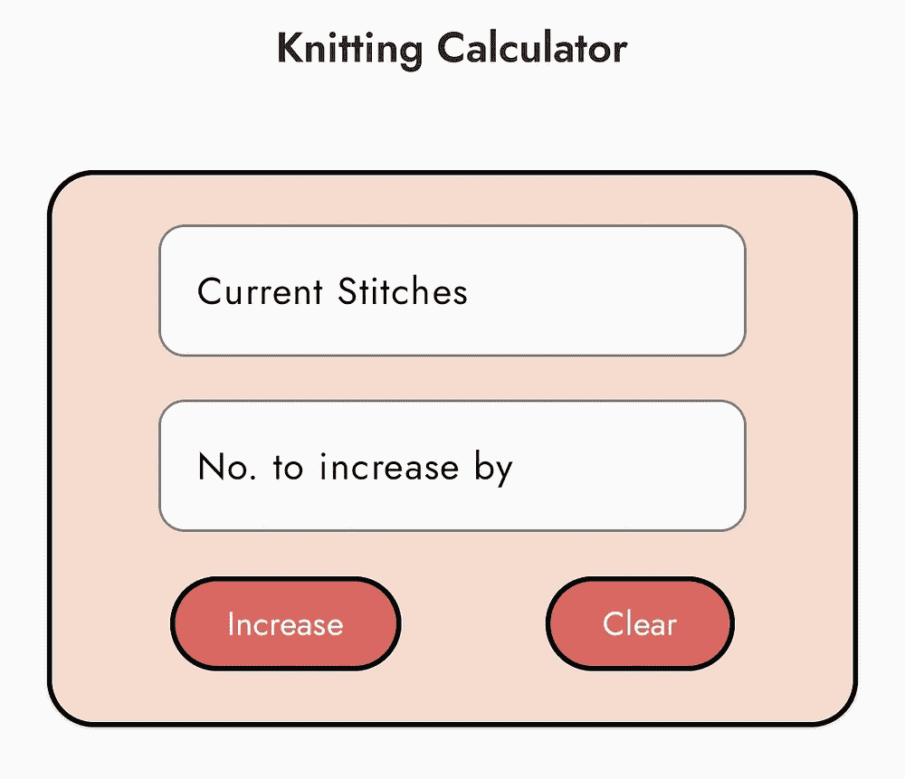

# 使用反射修补当前合成 API 中的缺口

> 原文：<https://betterprogramming.pub/using-reflection-to-patch-gaps-in-current-compose-apis-4c5aabc363b3>

## 修正了一个小问题


谢尔盖·库图佐夫在 [Unsplash](https://unsplash.com?utm_source=medium&utm_medium=referral) 拍摄的照片

最近，我决定用 Jetpack Compose 重新设计一个旧的 Android 应用程序。新的合成系统是对以前的视图系统的重大改进，但它仍然是相当新的，有一些缺失的功能。我遇到的一个这样的缺口是在`androidx.compose.material`库中的`OutlinedTextField` composable 中，它没有提供修改轮廓默认宽度的方法。当然，这没什么大不了的，但它不符合我的应用程序的整体主题，所以我决定使用反射来解决这个小问题。我已经记录了我的方法和最终的函数，我在应用程序启动时调用它来进行修改。

有许多支持和反对使用反射的论点，我在这里不打算深入讨论，但是像我在这里描述的这种琐碎的使用并不危险，也没有任何显著的运行时性能成本。当然，如果有一种替代的方式来实现同样的行为，我会选择那种方式，但在这种情况下没有，因为`OutlinedTextField`是图书馆的一部分。

# 反射基础

我们将在 JVM 平台的上下文中讨论反射，但是在 Android 上使用 Kotlin 和 Java 来执行。

简单地说，反射允许我们在运行时自省我们的程序，并修改属性、字段、方法和其他语言结构。这不仅包括`public`属性，还包括标记为`internal`或`private`的字段。

尽管 Kotlin 有自己的额外功能来处理反射，但我们将使用标准的 Java 反射函数来代替这一特殊的更改，因为在编写本文时 Kotlin 特定的反射仍然相当有限，我们想要进行的更改实际上是不可能的。当然，这不是问题，因为 Kotlin 可以完美地与 Java 互操作。

# 做出改变

所以我们要修改文本字段轮廓的宽度。首先要做的是找到这个宽度实际设置的位置。如果我们遵循`OutlinedTextField`的定义，我们很快就会遇到`androidx.compose.material.TextFieldImplKt.class`，它包含了`TextFieldImpl`的 JVM 字节码。

当然，如果你正在 Android Studio 中查看这个，并且你已经正确地设置了一切，你应该能够直接看到源代码。我们可以快速浏览一下代码，我们看到`IndicatorUnfocusedWidth`和`IndicatorFocusedWidth`是在文件底部定义的私有变量。

```
private val IndicatorUnfocusedWidth = 1.**dp** private val IndicatorFocusedWidth = 2.**dp**
```

我希望非聚焦的宽度和聚焦的宽度一样，这样我就能得到一致的线宽。在我的例子中，2.dp 是完美的，所以我将通过设置非聚焦宽度为聚焦宽度来稍微简化一下。

如果您想将这些值设置为您想要的值，请记住这些变量实际上是浮点型的，试图直接设置 dp 值是行不通的。这可以通过直接查看字节码来确认。如果我们看看为`TextFieldImplKt`生产的 Smali，我们会看到这两行字:

```
.field private static final IndicatorFocusedWidth:F 
.field private static final IndicatorUnfocusedWidth:F
```

显示它们被编译成 Float 类型的私有静态字段(这是最后的`F`)。

我们现在可以从获取对我们正在修改的类的引用开始。正如我们在上面看到的，这是`TextFieldImplKt`:

```
val textFieldImpl = Class.forName("androidx.compose.material.TextFieldImplKt")
```

现在，我们需要得到田地。我们可以通过使用`getDeclaredField()`方法来做到这一点:

```
val indicatorUnfocusedWidth = textFieldImpl.getDeclaredField("IndicatorUnfocusedWidth")
val indicatorFocusedWidth = textFieldImpl.getDeclaredField("IndicatorFocusedWidth")
```

虽然我们现在有了想要修改的字段，但是我们现在还不能设置它们。这是因为标准修饰符仍然存在，我们在上面看到这些字段被标记为`private`。此时尝试读取或写入我们的字段将导致一个`IllegalAccessException`。我们需要首先使这些字段可访问:

```
indicatorUnfocusedWidth.**isAccessible** = true
indicatorFocusedWidth.**isAccessible** = true
```

现在我们终于可以随心所欲地设置它们了。要将非聚焦宽度设置为聚焦宽度，我们只需:

```
indicatorUnfocusedWidth.set(null, indicatorFocusedWidth.get(null))
```

因为这两个字段都是静态的，所以没有关联的对象，这意味着我们可以将`null`传递给这两个参数。如果您正在修改的字段是一个类成员，那么您将需要传入应该更改该属性的对象。

如果你想直接设置一个 dp 值，你可以这样使用`.value`:

```
indicatorUnfocusedWidth.set(null, 3.dp.value)
```

带有一些基本异常处理的完整功能:

当你的应用程序启动时，你可以在某个地方调用它一次，在执行过程中，这个改变将是永久的。这是一个相当安全的使用反射的方法，因为失败的唯一后果是你想要的改变将是一个正常的轮廓宽度。此外，该函数只被调用一次，因此与反射相关的典型性能开销变得无关紧要。

结果很微妙，但在我看来确实有明显的不同。



更改 TextInput 轮廓大小之前和之后

# 摘要

本文展示了如何使用反射来微妙地修改 Android 应用程序中的 UI，但是这里展示的技术可以用于许多其他更复杂的修改。也就是说，我不会对太复杂的东西使用反射，因为这会影响性能。

如果修改失败，将它用于不会有任何实际效果的微妙的事情，并且您最多只需要调用几次。最后，总是将你的更改封装在一个`try/catch`块中，以确保你不会使你的应用崩溃。

# 编辑(2022 年 7 月 7 日):

本文使用的示例`OutlinedTextField`，自从本文撰写以来，已经改变了它描绘轮廓的方式。上述方法仍然有效，但边界厚度现在在`TextFieldDefault.kt`中定义为`UnfocusedBorderThickness`。它现在也是`TextFieldDefault.BorderBox`中的一个实际选项，所以不使用反射应该更容易使用。

最初，我也没有提到需要对你的 Proguard 规则进行修改以使其生效。如果你使用 Proguard/R8 混淆你的应用程序，大多数，如果不是所有的类将失去他们的名字。如果你使用反射，这不是你想要的，因为你必须在运行时通过名字找到你想要修改的类。因此，您必须为所有通过名称引用的类添加如下规则:

```
-keepclasseswithmembernames class androidx.compose.material.TextFieldImplKt {
     public **<methods>**;
}
```

我不是 Proguard 的专家，所以可能有更好的规则，但这在过去对我有效。