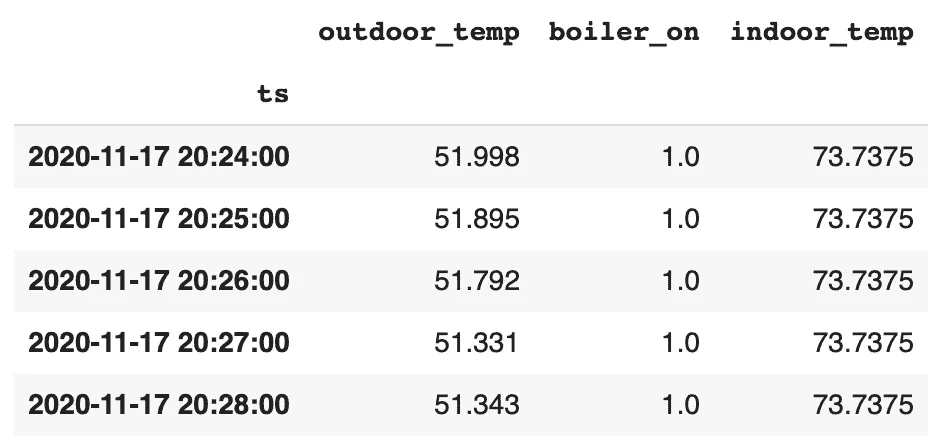
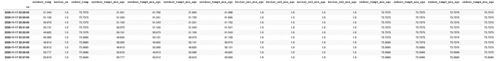
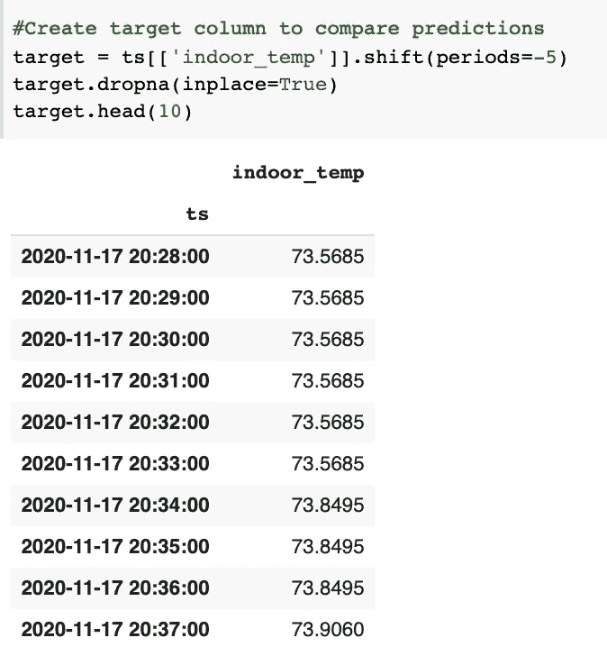
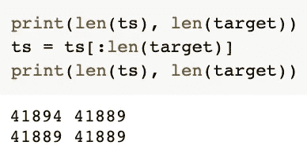

# 如何对时间序列使用回归建模

> 原文：<https://betterprogramming.pub/using-regression-with-time-series-5a0a6a8ba7de>

## 我在预测多元时间序列数据时遇到的障碍以及如何克服它们


[乔丹·欧宝](https://unsplash.com/@opeleye?utm_source=unsplash&utm_medium=referral&utm_content=creditCopyText)在 [Unsplash](https://unsplash.com/s/photos/progression?utm_source=unsplash&utm_medium=referral&utm_content=creditCopyText) 上的照片

您是否遇到过包含多元列的时间序列，在这种时间序列中，您的列不在相同的大小范围内，甚至不在相同的数据类型中，从而导致无法应用 ARIMA、萨里文或自动 ARIMA 模型？

我最近遇到了一个类似的问题，我需要用建筑物的室内温度、室外温度和二元锅炉状态信息的分钟快照来预测建筑物的室内温度。



用于建模的时间序列

我尝试的第一件事是仅使用室内温度，用 ARIMA 预测未来的室内温度。我的模型预测未来几分钟的温度值是一样的。我还将我的数据分成室内温度的五分钟快照，用于预测。这也不是很有希望。从探索性的数据分析中，我确认了室内温度、室外温度和二元锅炉状态信息之间存在关系。我不能只忽略这两列，继续只用室内温度建模。

从上面我得到的结果来看，我决定从头开始。我想使用室内温度、室外温度和二元锅炉状态信息来预测建筑物的室内温度。对此的一个解决方案是使用 [sktime](https://github.com/alan-turing-institute/sktime) ，一个用于时间序列预测、分类和回归的 scikit-learn 库。当时我还没有学会使用 sktime，所以我决定使用我的数据科学家工具包中的任何东西。

下面我分享我在想出一个工作模型之前所经历的所有步骤。在建模过程之前，我清理了我的数据，检查了平稳性，应用了 Dickey-Fuller 测试，并确认我的数据对于建模来说是平稳的，没有季节性或趋势。

我决定给我之前陈述的目标设定一些界限。下面你可以看到我更新后的目标:

使用室内温度、室外温度和二元锅炉状态信息的五分钟快照，预测未来五分钟内建筑物的室内温度。

# 1.创建预测变量

我决定用我的三篇专栏文章作为我的预测。为了创建五分钟的预测值，我使用了 [pandas](https://pandas.pydata.org/) ' `.[shift](https://pandas.pydata.org/pandas-docs/stable/reference/api/pandas.DataFrame.shift.html)`方法。

使用上面的代码片段，我创建了一个包含 15 列的数据集。这将创建包含前四分钟数据和当前一分钟数据的列，总共有五分钟的数据。



预言者

# 2.创建目标变量

我的目标变量是接下来五分钟的室内温度。为了创建这个，我使用了`.shift`方法将数据移动五分钟，周期= -5。



目标

# 3.列车测试分离

由于移位周期的数量，预测数据和目标数据有可能长度不同。检查数据集的长度总是一个好主意。如果长度不同，请检查开始和结束日期。



检查数据集的长度

## 通过训练测试分割方法

Scikit-learn 的`train_test_split`函数将随机分割数据。在我的例子中，我创建了一个包含五分钟预测值的数据框架。因为这些是我唯一的预测，所以我不关心索引顺序。

```
X = ts.copy()y = target.copy() X_train, X_test, y_train, y_test = train_test_split(X, y,  test_size=.25, random_state=123)
```

## 通过切片。iloc

如果你用`.iloc`使用切片，这将按顺序分割你的数据集。这将确定前 75%的数据作为您的训练集，后 25%作为您的测试数据。

```
train_size = 0.75split_idx = round(len(ts)* train_size)# Split predictorsX_train = ts.iloc[:split_idx]
X_test = ts.iloc[split_idx:]# Split targety_train = target.iloc[:split_idx]
y_test = target.iloc[split_idx:]
```

# **4。建模**

我创建了我的基本模型(我选择了`LassoLarsCV`回归模型)并且应用了不同的回归模型，主要是集合方法。每当我用新的回归模型得到更好的结果时，我就改变我的最佳模型假设。

关于详细的回归建模，你可以参考我的文章[回归建模的逐步指南](https://medium.com/better-programming/step-by-step-regression-modeling-7940bdce070e)。从这篇文章中可以期待什么:

*   数据预处理(一键编码、数据标准化、列转换、递归特征消除)
*   实例化回归算法
*   创建`GridSearchCV`
*   应用管道
*   拟合模型
*   通过 R2 评分和均方误差进行模型检查
*   绘制特征重要性(对于树和集合方法)
*   模型调整的想法

在尝试了许多方法后，我选择了具有最佳 R2 分数和 MSE 的模型，并对该模型进行了调优。

# 5.模型调整

模型调优是最重要的步骤之一，在这一步中，您可以发挥作为数据科学家的直觉。如果您的基本模型和网格搜索结果不令人满意，您需要尝试不同的方法。我开始问不同的问题，尝试不同的模型，通过改变一个参数，一个超参数，一种数据预处理方法，每次都改变预测因子或目标，在每一步都采用模型。

下面你可以看到我在模型调整过程中问自己的一些问题。

## 如果我将目标变量从室内温度改为随着时间推移室内温度的*变化*，会发生什么？

这是一个关键的问题。通过这种方式，我能够消除不提供任何温度变化的行，并使用具有关于温度变化的洞察力的行。所以我重新开始了我的建模，并以此作为我的新基地。

## 如果我应用不同滞后的差分会发生什么？

在创建预测因子之前，对我的室内和室外数据进行差分，改进了我的模型。在尝试了不同的延迟之后，我发现对于相同的数据集来说,`periods=1`是最好的选择。我采用了滞后 1 的差分来继续模型调整。

## 我的标准化方法对我的数据来说是最好的吗？

我使用了`StandardScaler`进行归一化，并尝试了`MinMaxScaler`，这提高了我的 R2 分数和 MSE 值。

## 如果我不使用五分钟的数据作为预测值，而是使用十分钟的数据，会发生什么？

用十分钟的数据创建预测器并不能改善模型。事实上，我的测试分数降低了，MSE 值增加了。所以我重新使用五分钟的数据作为预测。

## 我的模型更擅长预测近期还是远期？

我一直在预测未来的五分钟。我尝试使用 1 分钟和 10 分钟预测，结果更好。所以我适应了，预测十分钟后的未来。

最终，我采用了这个作为我的工作模式。

在我看来，最重要的一步是探索性的数据分析。在开始建模之前，我花了大量的时间进行探索性的数据分析，并非常熟悉手头的数据集。这给了我开始开发机器学习阶段所需的所有见解。

作为一名数据科学家，每当我面临挑战时，我都学会采用新的方法，问更多的问题，用新的视角看待数据。我研究问题的新解决方案，学习新方法的机制。即使我最终没有使用它，我也可以将一项新技能放入我的数据科学家工具箱中。

例如，在我需要使用多元时间序列建模之前，我并不知道 sktime。我了解了这个库，研究了所有的方法，并在艾伦图灵研究所 GitHub repo 上用给定的数据集进行了第一手尝试。当要将它应用到我自己的数据集时，由于数据文件类型的原因，我无法做到。后来，我了解了转换程序。csv 文件到。ts /。飞机救援消防，然后能够利用 sktime。虽然当时我无法利用这一技能，但它给了我一个想法，即使用以前的数据为我的回归模型创建预测器。