# 使用方案和。xcconfig 文件来组织 iOS 中的构建交付

> 原文：<https://betterprogramming.pub/using-schemes-and-xcconfig-files-to-organize-builds-delivery-in-ios-633ba7992703>

## 如何为我们的项目定义不同的配置


Pawel Czerwinski 在 [Unsplash](https://unsplash.com?utm_source=medium&utm_medium=referral) 上的照片

很多时候，我们需要组织我们的移动交付。这意味着，我们用来在 App Store 中发布应用程序的版本，或者我们每天用来在本地构建应用程序的版本，或者在我们公司内部分发的版本是不一样的。

在这里，我们将看到一种更好地组织我们的应用交付的方法，并开始在日常工作中有意义的内部配置中组织它。

# 关于构建方案

来自[苹果文件](https://developer.apple.com/documentation/xcode/customizing-the-build-schemes-for-a-project):

> 当您构建、运行、测试、分析或归档项目的一部分时，Xcode 会使用选定的构建方案来确定要做的事情。构建方案包含要构建的目标列表，以及影响所选操作的任何配置和环境详细信息。例如，当您构建并运行一个应用程序时，该方案会告诉 Xcode 将哪些启动参数传递给该应用程序。Xcode 为大多数目标提供了默认方案，您可以自定这些方案或根据需要创建新的方案。

构建方案基本上是一个配置，它将一个目标和我们可能需要的任何配置联系起来。这包括环境变量、配置文件或任何可以使构建可定制的东西。

例如，我们可以有以下三种方案:

*   一个生产方案，我们的用户可以在应用商店下载
*   阶段计划，或内部测试计划。也可以叫做贝塔
*   工程师在本地使用的开发方案

这种构建配置方面的关注点分离可以帮助我们定制应用程序的体验。例如，通过这类方案，我们可以:

*   更改应用程序图标
*   为我们的内部 API 使用不同的基本 URL
*   在各自的环境中配置第三方 SDK
*   添加可以帮助 QA 或 Devs 团队的内部开发工具
*   避免向第三方发送信息，例如，如果我们在本地编译应用程序，我们就不需要向 Firebase 发送崩溃信息。这将增加不真实的数据到我们的碰撞仪表板。


试用版配置的 Chrome 图标示例

# 计划与目标

在我们的建筑体系结构中还有一个重要的组成部分，那就是目标。目标基本上是我们正在构建的应用程序，我们旨在构建的产品。也就是说，需要编译并最终创建二进制文件的所有源代码。**目标使用一个方案来构建产品。**我们可以将差异总结如下:

> **目标指定了要构建的产品**，并包含了从项目或工作空间中的一组文件构建产品的指令。
> 
> Xcode 方案定义了要构建的目标集合、构建时要使用的配置以及要执行的测试集合。

因为我们可以使用目标来区分配置，这不是它们的目的。我们最终会使构建系统和开发人员使用项目的体验变得更加复杂。目标构建产品，方案包含如何构建产品的配置。

# Xcode 配置文件

使用方案的一个关键核心是使用 Xcode 配置文件。这些是扩展名为`.xcconfig`的。

基本上，我们可以为我们想要的构建配置定义定制值，我们可以在以后使用它来构建我们的目标。一个例子:

我们可以创建许多`.xcconfig`文件，并在其中相互引用，以避免在配置之间重复公共值。下一节将更好地解释这个概念。

# 示例项目

对于我们的示例项目，我们有以下内容:

*   1 目标名为`schemes-test`
*   名为`STDevelopment`和`STProduction`的两个方案
*   3 个`.xcconfig`档:`Common.xcconfig`、`Development.xcconfig`和`Production.xcconfig`

因为当我们有一个新项目时，目标已经创建，我们将继续创建方案。我们将点击项目名称旁边顶部菜单中的“管理方案…”选项:

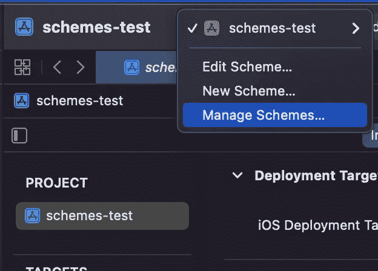

然后，在 Schemes 列表视图中，我们点击+按钮来创建一个新的方案

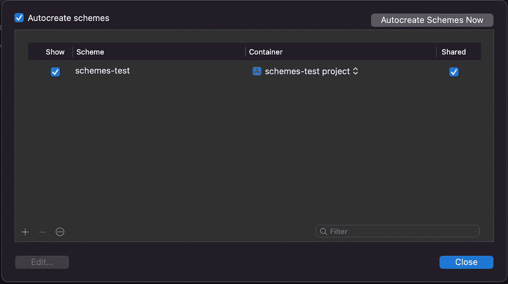

我们将创建一个名为`STDevelopment`的新方案:

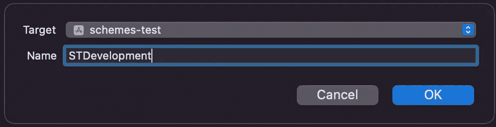

同样适用于`STProduction`

此时，我们的列表中应该有以下方案:

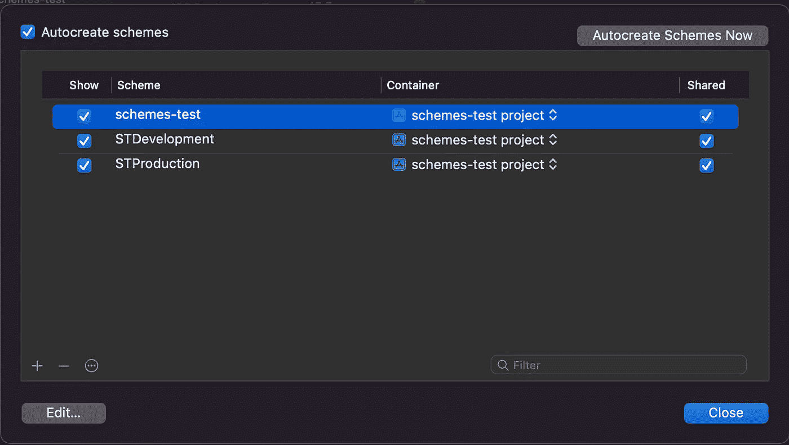

删除自动生成的`schemes-test`方案是安全的，因为我们不会使用它。

现在，我们将继续创建`.xcconfig`文件。我们需要在项目根目录下创建一个`BuildConfigurations`文件夹。

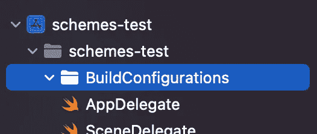

然后，我们将创建一个类型为`Configuration Settings File`的新文件

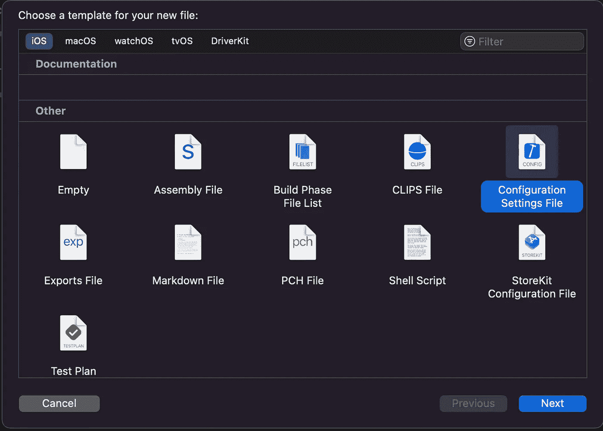

我们将这个文件称为`Common`。然后我们对新文件`Development`和`Production`做同样的步骤。此时，我们的项目中应该有这些文件:

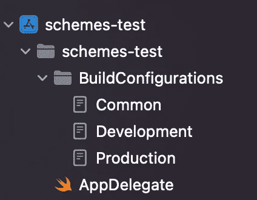

在`Common`文件中，我们将输入以下代码

在`Development`我们将输入以下内容:

下一行是`Production`:

我们在`.xcconfig`文件中定义了以下值:

*   `PRODUCT_BUNDLE_IDENTIFIER`:我们方案的包标识符
*   `MARKETING_VERSION`:构建的版本号
*   `CURRENT_PROJECT_VERSION`:内部版本号
*   `BUNDLE_DISPLAY_NAME`:应用在屏幕上可见的名称

可以想象，使用`#include`关键字我们可以包含文件。在我们的例子中，`MARKETING_VERSION`和`CURRENT_PROJECT_VERSION`的值应该在配置之间保持相同。但是`PRODUCT_BUNDLE_IDENTIFIER`的值是不同的，因为我们希望两种环境有不同的应用。同样适用于`BUNDLE_DISPLAY_NAME`，它是应用程序的可见名称

现在下一步是将这些文件与配置相关联。为此，我们转到项目设置:

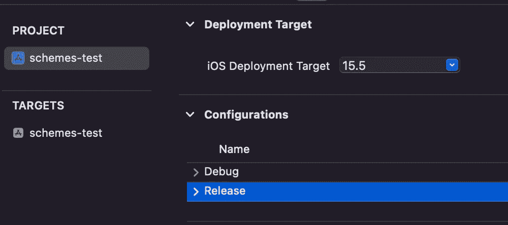

这里我们将用`Development`和`Production`替换`Debug`和`Release`名称，只是为了匹配我们的文件名。我们还将相应的 xcconfig 文件添加到每个配置中:

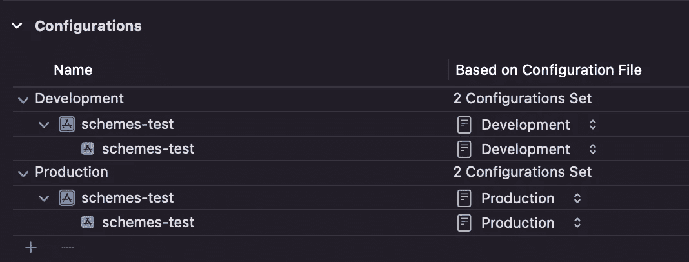

为了能够使用这些值，我们需要转到我们的`Info.plist`文件，在这里我们将添加以下属性，以及每个匹配的变量:

*   `Bundle identifier`同`PRODUCT_BUNDLE_IDENTIFIER`
*   `Bundle version string (short)`同`MARKETING_VERSION`
*   `Bundle version`同`CURRENT_PROJECT_VERSION`
*   `Bundle display name`同`BUNDLE_DISPLAY_NAME`

所以，我们将以这样的话来结束:

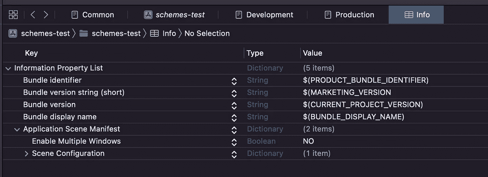

如果我们点击我们的目标设置，并在各自的字段中为每个变量设置`$(…)`，同样可以做到这一点:

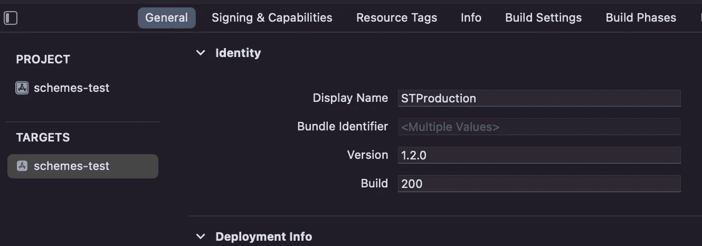

最后一步，我们需要将每个方案与每个配置关联起来，因此我们点击顶部栏上的编辑方案:

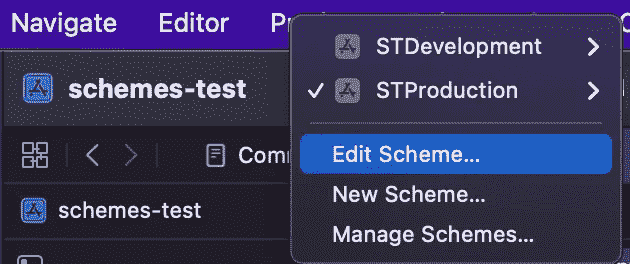

我们将把每个方案与相关配置联系起来:

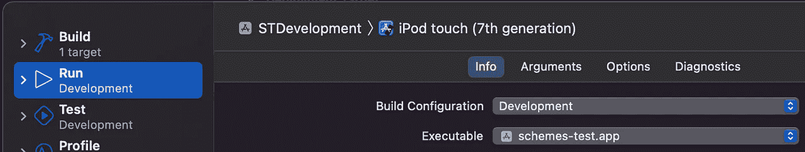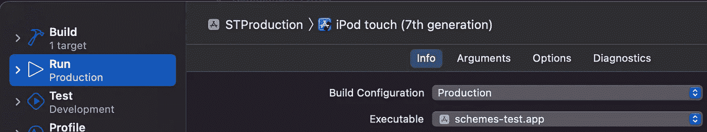

就是这样！如果我们在模拟器中运行我们的方案，我们会看到我们有两个不同的应用程序:

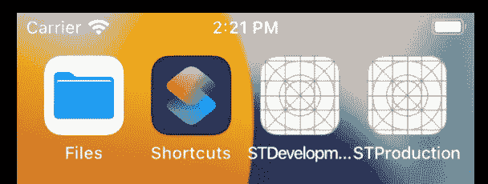

# 代码中的检查方案

如果需要，我们可以在二进制文件中包含关于该方案的代码。对于这种特殊情况，我们可以对`Development.xcconfig`使用以下内容:

```
SWIFT_ACTIVE_COMPILATION_CONDITIONS = DEBUG
```

另一个是给`Production.xcconfig`的:

```
SWIFT_ACTIVE_COMPILATION_CONDITIONS = RELEASE
```

因此，在我们的代码中，我们可以有以下内容:

这对于显示隐藏菜单或开发人员/QA 实用程序来帮助调试非常有用。

# 匹配应用程序和扩展之间的版本和内部版本号

对测试目标进行相同的编号更改是很重要的，因此主目标和测试目标都有相同的版本号和内部版本号。应用程序扩展也是如此。我们需要在主目标和应用扩展之间保持相同的版本和内部版本号，否则当我们将内部版本上传到 App Store Connect 时，Apple 会警告我们。该消息将类似于下一条消息(也将通过电子邮件接收)

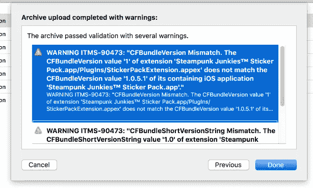

# 关于添加令牌或 API 密钥

我们可以在`.xcconfig`文件中添加 API 密钥/令牌，这样我们就可以在`plist`文件中定义它们并像这样访问它们:

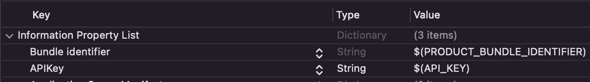

```
let bundleId = Bundle.main.infoDictionary?["APIKey"] as? String
```

然而，这不是一个安全的解决方案。我们应该致力于以另一种方式获取如此敏感的数据，因为在我们的 git 存储库中提交它们是不安全的。如果我们使用 CI 来构建和分发我们的应用程序，许多 CI 提供者可以选择设置秘密(例如[Bitrise](https://devcenter.bitrise.io/en/builds/secrets.html))，然后将这些秘密注入到项目中，使用类似 [cocoapods-keys](https://github.com/orta/cocoapods-keys) 的解决方案。我将在下一篇文章中讨论如何做到这一点。

# 结论

我们看到了如何为我们的项目定义不同的配置。以这样一种方式组织真的很有用，我们可以将一个构建用于本地开发，而将另一个构建用于生产。这种能力将使我们能够添加适当的测试工具，更好地定义第三方环境，或者只是以更有效的方式组织我们的代码。

你可以在这里看完整源码[。](https://github.com/fedejordan/schemes-test)

感谢阅读！

# 来源

*   [https://developer . apple . com/documentation/xcode/customizing-the-build-schemes-for-a-project](https://developer.apple.com/documentation/xcode/customizing-the-build-schemes-for-a-project)
*   [https://tech . olx . com/xcode-targets-arent-schemes-a 087 AC 4 bbe3a](https://tech.olx.com/xcode-targets-arent-schemes-a087ac4bbe3a)
*   [https://www . donny wals . com/configuring-projects-with-xc config/](https://www.donnywals.com/configuring-projects-with-xcconfig/)