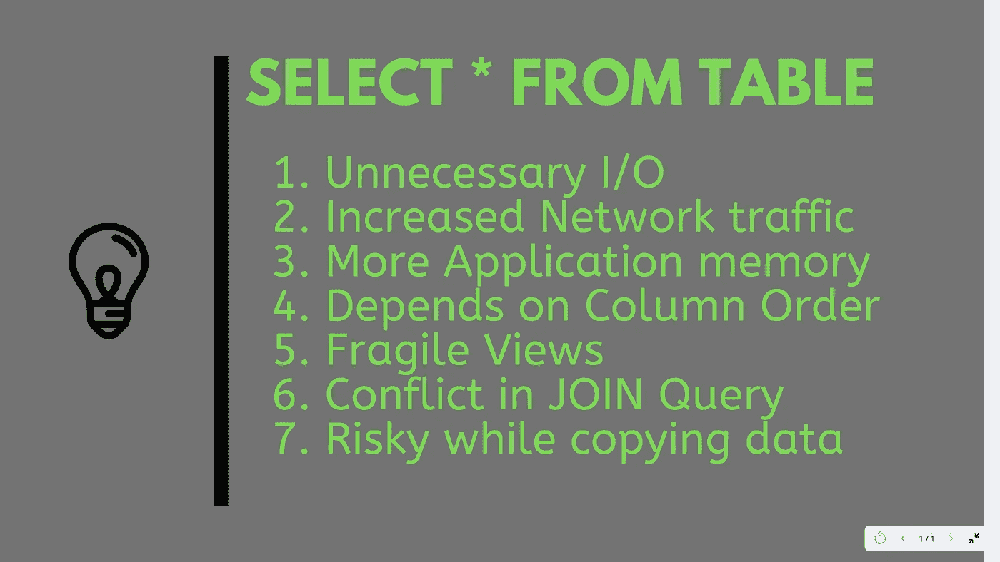

# 在 SQL 查询中使用 SELECT *是一种不好的做法

> 原文：<https://betterprogramming.pub/using-select-in-an-sql-query-is-a-bad-practice-a8f6beeca1da>

## 具体说明你的选择

作者照片。

我在网上看过很多文章，人们认为在 SQL 查询中使用是一种不好的做法，你应该总是避免它，但是他们从来不愿意解释为什么。

他们中的一些人会说你应该在你的 [SQL 查询中使用一个显式的列列表，](https://javarevisited.blogspot.com/2017/02/top-6-sql-query-interview-questions-and-answers.html)这是一个很好的建议，也是我教给初级程序员的 [SQL 最佳实践](/mysql-best-practices-b103260f8b45)之一。但是，很多都没有解释背后的原因。

除非你解释为什么不应该在查询中使用`SELECT *`,否则很难说服 SQL 开发人员——他们中的许多人已经开始通过在 [Oracle](http://www.java67.com/2018/02/5-free-oracle-and-microsoft-sql-server-online-courses.html) 数据库中使用来自 EMP 的`SELECT *`来学习 SQL 。

在本文中，我将尝试通过给出一些实际的原因来弥补这个差距，为什么在一个 [SQL 查询](https://www.java67.com/2013/04/10-frequently-asked-sql-query-interview-questions-answers-database.html)中使用`SELECT *`不是一个好主意。

# 1.不必要的 IO

通过使用`SELECT *`，您可以返回不必要的数据，这些数据将被忽略。但是获取这些数据并不是没有成本的。这会导致数据库端出现一些浪费的 IO 周期，因为您将从页面中读取所有数据。也许你可以从[索引页](https://javarevisited.blogspot.com/2022/12/12-database-sql-index-interview.html)中读取数据。这也可能使您的查询变得有点慢。

# 2.网络流量增加

`SELECT *`向客户端返回比所需更多的数据，这反过来会使用更多的网络带宽。网络带宽的增加也意味着数据需要更长的时间到达客户端应用程序，这可能是 SSMS 或你的 Java 应用服务器。

# 3.更多应用程序内存

由于数据的增加，您的应用程序可能需要更多的内存来保存不必要的数据，这些数据不会被使用，而是来自于 [Microsoft SQL server](https://medium.com/javarevisited/5-best-courses-to-learn-microsoft-sql-server-in-depth-e9f11b73c14a) 或您正在连接的任何其他数据库。

# 4.对结果集列顺序的依赖性

当您在应用程序中使用`SELECT *`查询并且对列的顺序有任何依赖时(这是不应该的),如果您添加新列或更改列的顺序,[结果集](http://javarevisited.blogspot.sg/2016/10/how-to-check-if-resultset-is-empty-in-Java-JDBC.html)的顺序将会改变。

# 5.向表中添加新列时破坏视图

当您在视图中使用`SELECT *`时，如果添加了一个新列，而从表中删除了旧列，就会产生微妙的错误。为什么？因为您的视图不会中断，但会开始返回不正确的结果。

为了避免这种情况，你应该始终使用`WITHSCHEMABINDING it`和视图。这也将阻止您在视图中使用`SELECT *`。

# 6.连接查询中的冲突

当您在`[JOIN](https://javarevisited.blogspot.com/2020/04/combine-two-tables-using-left-join-in-SQL.html)` [查询](https://javarevisited.blogspot.com/2020/04/combine-two-tables-using-left-join-in-SQL.html)中使用`SELECT *`时，当多个表具有相同名称的列(例如，状态、活动、名称等)时，您会引入复杂性。).对于一个简单的查询，这可能没问题。但是，当您尝试按这些列之一进行排序，或者在 CTE 或派生表中使用查询时，您将需要进行一些调整。

# 7.将数据从一个表复制到另一个表

当您在`INSERT .. SELECT`语句中使用`SELECT *`时，这是将数据从一个表复制到另一个表的常用方法，如果两个表之间的列顺序不同，您可能会将不正确的数据复制到不正确的列中。

一些程序员认为在你的`[EXISTS](https://javarevisited.blogspot.com/2016/01/sql-exists-example-customers-who-never-ordered.html)`代码中使用`SELECT *` vs. `SELECT 1`会更快，因为查询解析器必须做额外的工作来验证静态值。

很久以前这可能是真的，但是现在解析器已经变得足够聪明，知道`SELECT`列表在`EXISTS`子句中是完全不相关的。

# 结论

这就是为什么您不应该再在 SQL 查询中使用`SELECT *`的原因。在`SELECT`查询中使用显式列列表总是比使用`*`通配符要好。它不仅提高了性能，还使您的代码更加清晰。

它还帮助您创建可维护的代码，当您向表中添加新列时，这些代码不会中断——特别是当您有引用原始表的视图时。