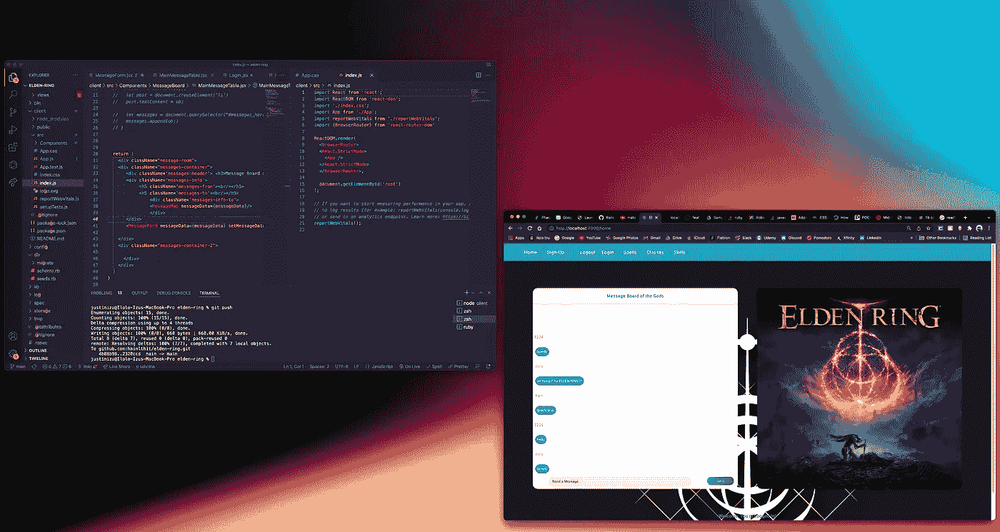

# 在 Ruby on Rails API 中使用序列化程序

> 原文：<https://betterprogramming.pub/using-serializer-with-your-ruby-on-rails-api-e76795f4b3ad>

## 定制您的 JSON


在过去的三周里，我一直在直接使用 Ruby on Rails 学习创建全栈应用程序的过程。今天我要写关于主动模型序列化器(AMS)的文章。

Serializers 本质上提供了一种简单的方法来定制控制器呈现 JSON 的方式。

使用 AMS 要做的第一件事就是把宝石加到`gemfile`里。

```
# Gemfile
#...
gem 'active_model_serializers'
```

之后，运行 bundle install。该过程的下一步是添加活动模型序列化程序。在终端中，运行…

```
rails g serializer {serializer-name}
```

将打开并创建另一个序列化程序。

在这之后，导航到 app 文件夹下的 serializer 文件夹将引导我们准确地到达我们需要的位置。

现在假设我们创建了一个名为`UserSerializer`的序列化器。

这可以在我们的用户控制器上使用，以获取特定的数据，而不是必须在以后组织它，我们现在就可以这样做。

```
class UserSerializer < ActiveModel::Serializerattributes :id, :username, :password_digest, :is_admin
belongs_to :profile
has_many :commentsend
```

它看起来会像这样。这里的属性本质上是我们想要包含的 JSON 的一部分。

现在，Rails 实际上足够聪明，能够认识到运行用户序列化程序和用户控制器将一起工作，所以没有必要将它们联系起来。多牛逼啊！？但是，当我们想要定制自己的序列化程序时，会发生什么呢？

让我来回答你这个问题。我们只需再次运行那个`rails g serializer {custom-serializer-name}`，收集我们的属性，然后*然后*将序列化程序的名称添加到我们的控制器中，如下所示:

```
# app/controllers/movies_controller.rbdef summary
  movie = Movie.find(params[:id])
  render json: movie, serializer: MovieSummarySerializer
end
```

当我们试图组织数据时，这个小而简单的功能可以成为游戏规则的改变者。就在你认为这再有趣不过的时候，等着听关于嵌套序列化器的所有内容吧。

正如我的新兵训练营告诉我的那样，

> …我们了解到`ActiveModel::Serializer` gem 使我们能够定制我们想要的 JSON 呈现方式，而不会牺牲 Rails 的“约定优于配置”和关注点分离原则。

我真诚地希望你喜欢这篇技术博客，它详细介绍了我在 Ruby on Rails 中的更多努力。

在我的下一篇博文中，我将详细介绍我的下一个项目，一个基于新 Elden Ring 的视频游戏 wiki。敬请期待，下次见！这里有一个简单的问题:

